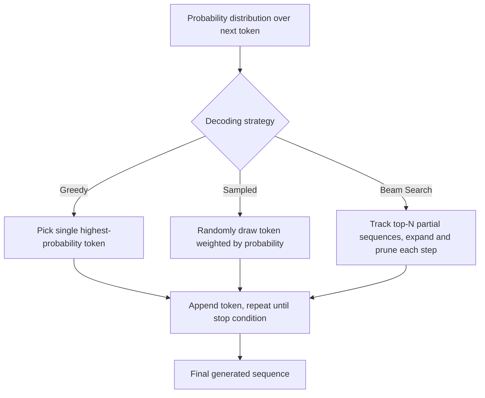

# Greedy vs Sampled Decoding

## 1. Introduction

**Decoding** is the general term for the strategy used to turn a model's predicted probabilities into an actual sequence of output tokens. **Greedy decoding** always picks the single most likely next token at every step. **Sampled decoding** instead draws a token somewhat randomly, weighted by probability (optionally shaped by temperature, top-k, and top-p, as covered in the previous topic).

This topic builds directly on temperature and sampling — it's the higher-level framing of "deterministic vs. probabilistic" generation strategy, plus a few additional decoding approaches worth knowing (beam search, and combinations of the above).

## 2. Why This Topic Exists

Developers constantly have to choose (explicitly or by accepting defaults) how a model's output should be generated. Whether an application feels consistent and predictable, or varied and exploratory, largely comes down to this choice. It also explains a subtlety people often miss: greedy decoding, despite always picking the "best" token at each step, does not guarantee the best *overall* sentence — a limitation that motivates alternatives like beam search.

## 3. Core Concept

### Beginner

- **Greedy decoding:** at every step, just take the single highest-probability next token. Simple, fast, fully repeatable — the same prompt always gives the exact same answer.
- **Sampled decoding:** at every step, randomly draw a token according to the probability distribution (possibly reshaped by temperature/top-k/top-p). The same prompt can give different answers on different runs.

### Intermediate

| Aspect | Greedy Decoding | Sampled Decoding |
|---|---|---|
| Token choice | Always the single most probable token | Randomly drawn, weighted by probability |
| Determinism | Fully deterministic (same input → same output) | Non-deterministic (same input → can vary) |
| Output character | Safe, sometimes repetitive/bland | Varied, more natural, sometimes riskier |
| Best for | Code, structured data, math, factual lookups, testing/reproducibility | Creative writing, brainstorming, conversational variety |
| Failure mode | Can get stuck in repetitive loops ("the the the...") on some inputs | Can occasionally pick a poor token and derail the rest of the sentence |

Greedy decoding is a special case of sampled decoding at temperature = 0 (or top-k = 1) — there's a direct, continuous relationship between the two, not a hard binary split.

### Advanced

A subtlety often missed: **greedy decoding is locally optimal, not globally optimal.** Picking the single best token at each individual step does not guarantee the best possible full sentence, because an early "good" choice can lead to a worse overall continuation than a slightly less likely early choice would have. This is a known limitation, and it motivates **beam search** — a decoding strategy that tracks several candidate partial sequences ("beams") simultaneously at each step, rather than committing greedily to one path, and ultimately picks whichever complete beam scores highest overall.

Beam search trades more computation for potentially better overall sequences, and is common in tasks like machine translation where output correctness matters more than diversity. It's less commonly used in modern open-ended chat assistants, where sampled decoding (temperature/top-p) is generally preferred for natural-sounding, varied conversational output. Many production systems also combine ideas: e.g. mostly-greedy behavior with a small amount of controlled randomness, or sampling with a very tight top-p to bound risk while retaining some variety.

## 4. Deep Explanation

Every decoding strategy operates on the same underlying probability distribution the model produces at each step — they differ only in *how a token is selected from that distribution*, not in how the distribution itself is computed.

- **Greedy:** `next_token = argmax(probabilities)` — deterministic, single path, no lookahead.
- **Sampled:** `next_token = weighted_random_draw(probabilities)` — stochastic, single path, no lookahead, but exploring different possible sentences across runs.
- **Beam search:** maintain the top-N partial sequences by cumulative probability at every step, expand each by one token, prune back down to the top-N again, and repeat — implicitly exploring multiple paths at once, at higher computational cost.

None of these strategies change the model's underlying "knowledge" or accuracy — they only change *how a specific sentence gets assembled* from the same predicted probabilities. This is why decoding strategy is a separate lever from model choice, training, or fine-tuning.

## 5. Step-by-Step Flow (comparing both)

1. The model produces a probability distribution over the vocabulary for the next token.
2. **Greedy path:** the single highest-probability token is selected immediately; move to the next position.
3. **Sampled path:** the distribution is optionally reshaped (temperature/top-k/top-p), then a token is randomly drawn according to the (reshaped) weights; move to the next position.
4. Either path repeats token-by-token until a stop condition (end token or length limit).
5. (Beam search variant): instead of one path, several candidate partial sequences are tracked in parallel, each scored by cumulative probability, with low-scoring branches pruned at every step.
6. Generation ends when a stop condition is reached on the winning path(s); the chosen sequence is returned as the final output.

## 6. Architecture Explanation

## 7. Visual Analogy

Greedy decoding is like a hiker who, at every fork in a trail, always takes the path that looks steepest-uphill-toward-the-summit right now — fast and simple, but sometimes leads to a dead end that a slightly less obvious early path would have avoided. Sampled decoding is like a hiker who occasionally takes a less obvious fork on purpose, exploring the mountain more broadly, occasionally finding a better summit route, occasionally getting lost. Beam search is like sending out several scouting parties down different forks simultaneously, checking in periodically, and keeping only the parties making the most overall progress.

## 8. Real Industry Example

- Machine translation systems (e.g. early neural translation engines from Google) historically relied heavily on beam search, because a translation needs to be both fluent and faithful to the source, and greedy decoding's local mistakes could compound into a poor full translation.
- Modern chat assistants (ChatGPT, Claude) primarily use sampled decoding (temperature/top-p) by default in conversational settings, because natural, varied phrasing matters and full determinism isn't the goal — while offering low-temperature or deterministic-leaning settings for API users who need consistency (e.g. automated pipelines, testing).
- Code-generation tools frequently default to low temperature or near-greedy decoding, since a working, syntactically valid answer is preferred over a "creative" but broken one.

## 9. Common Misconceptions

- **"Greedy decoding always gives the best possible answer."** It only guarantees the best token at each individual step, not the best overall sentence — a known limitation motivating beam search.
- **"Sampled decoding is random noise with no structure."** It's weighted random selection based on the model's actual learned probabilities, not uniform randomness — likely tokens are still far more likely to be chosen.
- **"Beam search is always better than greedy or sampling."** It's more computationally expensive and, for open-ended conversational tasks, can actually produce blander, more generic output than sampling — it shines more in tasks like translation with a clearer notion of a single "correct" output.
- **"Decoding strategy affects factual accuracy."** It affects consistency and phrasing variety, not the model's underlying factual knowledge.

## 10. Best Practices

- Use greedy (or near-zero temperature) decoding when reproducibility and consistency matter: automated testing, structured outputs, code generation.
- Use sampled decoding with moderate temperature/top-p for natural conversational variety and creative tasks.
- Reserve beam search for tasks with a well-defined "best" output and where extra compute cost is acceptable, like translation or summarization pipelines.
- Don't rely on decoding strategy to fix factual errors — that requires better grounding (retrieval, verified sources), not a different token-selection method.

## 11. Summary

Greedy and sampled decoding are two ends of a spectrum for turning a model's predicted probabilities into an actual output sequence: greedy always takes the top choice (deterministic, sometimes locally-blind), while sampled decoding draws randomly according to probability (naturally varied, occasionally riskier). Beam search offers a middle ground, tracking multiple candidate sequences to avoid greedy's short-sightedness, at higher computational cost. None of these strategies change what the model "knows" — they only change how a specific output sentence gets assembled from the same underlying predictions.

## 12. Key Takeaways

- Decoding strategy determines how a token is chosen from the model's predicted probabilities.
- Greedy decoding always picks the top token — fast, deterministic, but not globally optimal.
- Sampled decoding draws randomly, weighted by probability — varied, natural, but less predictable.
- Greedy decoding is mathematically a special case of sampling at temperature 0 / top-k 1.
- Beam search tracks multiple candidate sequences at once to avoid greedy's short-sighted mistakes, at extra compute cost.
- Decoding strategy affects style and consistency, not the model's underlying factual accuracy.
