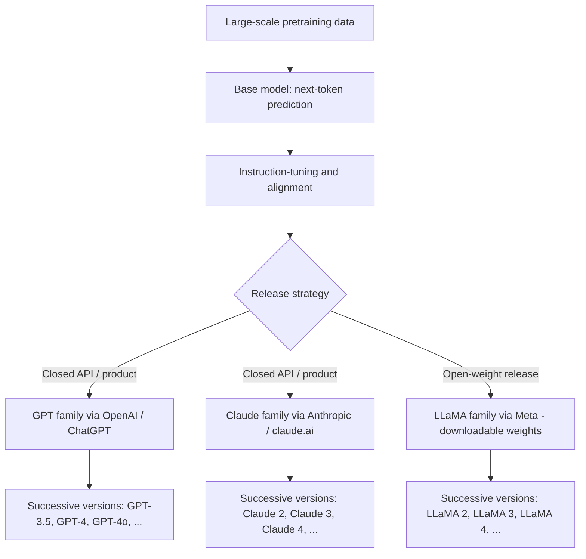

# Model Families (GPT, Claude, LLaMA)

## 1. Introduction

A **model family** is a line of language models developed by a particular organization, sharing a lineage of architecture choices, training philosophy, and branding, even as individual versions improve over time. The three most commonly referenced families today are **GPT** (OpenAI), **Claude** (Anthropic), and **LLaMA** (Meta) — but they differ meaningfully in how they're built, released, and intended to be used.

Understanding model families helps you make sense of AI news, pick the right tool for a task, and recognize that "the AI" is not one single thing — it's a competitive, fast-moving landscape of related-but-distinct systems.

## 2. Why This Topic Exists

New model names and version numbers appear constantly (GPT-4, GPT-4o, Claude 3, Claude 4, LLaMA 3, LLaMA 4...), and it's easy to lose track of what's actually different between them. Knowing the major families, their general design priorities, and their release approach (closed API vs. open-weight) gives you a durable mental map that survives individual version churn.

## 3. Core Concept

### Beginner

Think of model families like car manufacturers: Toyota, Ford, and Honda all make cars that get you from A to B, but each has its own engineering philosophy, price point, and reputation. Similarly:

- **GPT** (OpenAI) — the family behind ChatGPT; widely known, broad general-purpose use, accessed mainly via API/product, not typically run on your own hardware.
- **Claude** (Anthropic) — known for strong emphasis on safety, reliability, and careful reasoning; accessed via API/product (claude.ai), also not typically self-hosted.
- **LLaMA** (Meta) — released with publicly available model weights, meaning developers and researchers can download and run it themselves, fine-tune it, or build their own products directly on top of it.

### Intermediate

| Family | Developer | Access model | Notable trait |
|---|---|---|---|
| **GPT** | OpenAI | Closed API / ChatGPT product | Broad consumer/developer ecosystem, plugin and tool integrations, multimodal capabilities |
| **Claude** | Anthropic | Closed API / Claude.ai product | Strong emphasis on safety research (Constitutional AI), long context windows, careful/structured reasoning |
| **LLaMA** | Meta | Open-weight releases | Downloadable model weights, enabling self-hosting, fine-tuning, and research without per-token API cost |

"Open-weight" means the trained model's parameters are published for anyone to download and run — it does not necessarily mean the training data or full training code is public, and licensing terms still vary (some LLaMA versions have usage restrictions for very large companies, for example).

Beyond these three, the landscape includes other notable families: **Gemini** (Google), **Mistral** (Mistral AI, notable for efficient open-weight models), and various fine-tuned/derivative models built on top of open-weight bases like LLaMA.

### Advanced

Model families differ along several real technical and strategic axes:

- **Training data and scale** — exact datasets are usually undisclosed, but scale (number of tokens, compute budget) and data curation approach differ significantly and drive capability differences.
- **Alignment approach** — OpenAI and Anthropic both use human-feedback-based alignment (RLHF and variants), but Anthropic is particularly known for **Constitutional AI**, where the model is trained partly by having it critique and revise its own outputs against a written set of principles, reducing (though not eliminating) reliance on large volumes of human-labeled feedback.
- **Release strategy** — closed-API families (GPT, Claude, Gemini) let the provider control safety guardrails, versioning, and monetization tightly, but require trusting a third party with your data and pricing. Open-weight families (LLaMA, Mistral) let anyone self-host, audit, or fine-tune the model, trading centralized control for flexibility, at the cost of needing your own infrastructure and safety tuning.
- **Versioning cadence** — all major families now iterate rapidly (multiple releases per year), often branching into a range of sizes (e.g. a small/fast variant and a large/flagship variant) rather than a single monolithic release, so that developers can trade off cost, speed, and capability per use case.

## 4. Deep Explanation

Despite branding and marketing differences, essentially all modern major model families share the same fundamental Transformer-based, next-token-prediction architecture described in **Language Models**. What differs is everything *around* that shared core: training data selection and cleaning, model scale, fine-tuning objectives, alignment technique, safety filtering, context window engineering, and the tooling/product layered on top (search integration, code execution, file uploads, etc.).

This is why comparing model families is less like comparing fundamentally different technologies, and more like comparing highly-tuned variations on the same underlying idea — similar to how different car manufacturers all build on the same basic combustion or electric drivetrain concepts, but differentiate through engineering execution, tuning, and target use case.

## 5. Step-by-Step Flow (how a "model family" comes to exist)

1. An organization (OpenAI, Anthropic, Meta, etc.) assembles a large training dataset and compute infrastructure.
2. A base model is pre-trained on next-token prediction across that massive dataset.
3. The base model is fine-tuned and aligned (instruction-tuning, RLHF, Constitutional AI, or similar) to behave as a helpful, safe assistant.
4. The organization releases the result — either as a closed API/product (GPT, Claude) or as downloadable open weights (LLaMA).
5. Over time, the organization releases successive versions (e.g. GPT-3.5 → GPT-4 → GPT-4o), often branching into multiple sizes/variants for different cost/performance needs.
6. Each version inherits the family's branding and general design philosophy while improving on specific weaknesses of prior versions.

## 6. Architecture Explanation

## 7. Visual Analogy

Think of model families like operating systems. iOS, Android, and Linux all let you run apps and browse the web, but they differ in who controls them, how open the source is, and how you access them: iOS is tightly controlled and closed (like GPT/Claude's closed APIs), while Linux is open-source and can be freely downloaded, modified, and self-hosted (like LLaMA's open weights). Each has genuine strengths depending on what you need — control and customization, or a polished, managed experience.

## 8. Real Industry Example

- Startups building customer-facing products often default to closed-API families (GPT or Claude) early on, for ease of integration and not having to manage GPU infrastructure — then may migrate specific workloads to a self-hosted open-weight model (like LLaMA or Mistral) later for cost control or data-privacy reasons at scale.
- Academic researchers frequently rely on open-weight families (LLaMA, Mistral) specifically because they can inspect, fine-tune, and experiment with the actual model weights — something impossible with closed API-only models like GPT or Claude.
- Enterprises with strict data residency or compliance requirements sometimes prefer self-hosting an open-weight model on their own infrastructure over sending sensitive data to a third-party API, even if the closed model would otherwise perform slightly better.

## 9. Common Misconceptions

- **"They're all basically the same thing under a different name."** They share the same core architecture family (Transformers, next-token prediction) but differ meaningfully in training data, alignment approach, safety behavior, and access model.
- **"Open-weight means fully open-source, no restrictions."** Open-weight typically means the trained parameters are downloadable, but licensing terms, training data, and training code may still be restricted or undisclosed.
- **"Bigger name/more famous means objectively better model."** Performance varies by task — a smaller or lesser-known model can outperform a famous flagship on specific benchmarks or use cases.
- **"You must pick one family and stick with it forever."** Many real-world systems mix models — e.g. using a cheap model for simple tasks and a different provider's flagship model for complex ones (model routing).

## 10. Best Practices

- Evaluate models by task fit (coding, summarization, safety-sensitivity, cost) rather than by brand reputation alone.
- If data privacy or self-hosting matters, prioritize open-weight families (LLaMA, Mistral); if managed convenience and cutting-edge closed capability matter more, closed APIs (GPT, Claude) are usually simpler to integrate.
- Keep track of version-specific capabilities (e.g. context window size, multimodal support) rather than assuming all models in a family behave identically — capability can shift significantly between versions.
- Stay aware that pricing, safety behavior, and capabilities change frequently as each family iterates — re-verify assumptions periodically rather than relying on stale comparisons.

## 11. Summary

Model families are the lines of language models produced by different organizations — GPT (OpenAI), Claude (Anthropic), and LLaMA (Meta) being three of the most prominent. All share the same fundamental Transformer-based, next-token-prediction core, but differ in training data, alignment technique, safety philosophy, and — critically — access model: closed API/product (GPT, Claude) versus open-weight, self-hostable release (LLaMA). Choosing between them is a practical engineering decision based on task fit, cost, data-privacy needs, and how much control versus convenience a project requires.

## 12. Key Takeaways

- A model family is a line of models from one organization sharing architecture lineage and branding across versions.
- GPT (OpenAI) and Claude (Anthropic) are closed, API/product-accessed families; LLaMA (Meta) is released with open, downloadable weights.
- All major families share the same underlying Transformer, next-token-prediction architecture — differences come from data, alignment, and tooling.
- Open-weight models enable self-hosting and fine-tuning; closed models offer managed convenience and tightly controlled safety behavior.
- No single family is universally "best" — task fit, cost, and data-privacy needs should drive the choice.
- Real-world systems often mix multiple families/models via routing rather than committing to just one.
