# Decoder vs Encoder Models

## 1. Introduction

The Transformer architecture (the neural network design behind essentially all modern language models) comes in three structural flavors: **encoder-only**, **decoder-only**, and **encoder-decoder**. Each flavor is built for a different kind of task — understanding existing text, generating new text, or transforming one piece of text into another.

Modern chat assistants like ChatGPT and Claude are **decoder-only** models. Understanding why clarifies a lot about how they generate text one token at a time, and why certain other model types (like BERT) are built completely differently for a different purpose.

## 2. Why This Topic Exists

Not every AI language task is "generate the next word forever." Some tasks are about *understanding* text (is this review positive or negative? what's the named entities in this sentence?), and some are about *transforming* text (translate this sentence, summarize this document). Different Transformer structures are optimized for these different jobs, and knowing the distinction explains why, for example, BERT can't "chat" with you the way ChatGPT does, even though both are Transformers.

## 3. Core Concept

### Beginner

- **Encoder-only models** (e.g. BERT) read and deeply understand a piece of text all at once — good for classification, search relevance, and understanding tasks. They don't generate new text word by word.
- **Decoder-only models** (e.g. GPT, Claude, LLaMA) generate text one token at a time, only ever looking backward at what's already been written — good for open-ended conversation and generation.
- **Encoder-decoder models** (e.g. the original Transformer, T5) first read/understand an entire input (encoder), then generate a new output based on that understanding (decoder) — good for translation and summarization.

### Intermediate

The key structural difference is what each token is allowed to "see" via self-attention:

| Type | Attention direction | Example models | Best suited for |
|---|---|---|---|
| **Encoder-only** | Bidirectional — every token sees every other token, both before and after it | BERT, RoBERTa | Classification, sentiment analysis, search/embedding, named entity recognition |
| **Decoder-only** | Causal/unidirectional — every token only sees tokens before it (never future tokens) | GPT, Claude, LLaMA | Open-ended text generation, chat, reasoning, code generation |
| **Encoder-decoder** | Encoder is bidirectional over input; decoder is causal over output, also attending back to the encoder's output | T5, the original 2017 Transformer, BART | Translation, summarization, structured input→output transformation tasks |

Decoder-only models dominate today's general-purpose AI assistants because their training objective (predict the next token, causally) directly matches how they're used in production (generate a response, one token at a time, without knowing the future).

### Advanced

The attention restriction in decoder-only models is enforced via a **causal mask** — during training and inference, each token's attention computation is mathematically prevented from attending to any token that comes after it in the sequence. This isn't just a stylistic choice — it's what makes autoregressive generation ("predict token N+1 from tokens 1...N") mathematically consistent: if a token could see future tokens during training, the model would essentially be "cheating" by looking at the answer it's supposed to predict.

Encoder-only models like BERT are trained differently — often with a **masked language modeling** objective, where random tokens in the input are hidden ("masked") and the model must predict them using context from *both* directions simultaneously. This bidirectional context makes encoder-only models excellent at deeply understanding a fixed piece of text, but structurally unsuited for open-ended generation, since they were never trained to produce a coherent sequence one new token at a time.

Encoder-decoder models combine both: the encoder builds a rich bidirectional representation of the input, and the decoder — causal, like a decoder-only model — generates the output while also attending to the encoder's representation at every step (via "cross-attention"). This structure fits tasks with a clear "transform input A into output B" shape, like translating English to French.

Interestingly, most cutting-edge large language models today (GPT-4, Claude, LLaMA) have converged on the decoder-only design even for tasks that used to favor encoder-decoder setups (like summarization or translation) — decoder-only models simply treat those as "generate the appropriate continuation" given an instruction and input, and at sufficient scale, this unified approach has proven highly competitive.

## 4. Deep Explanation

The defining engineering choice is the attention mask:

- **Encoder-only:** no mask restriction — full bidirectional attention. Great for building a rich understanding of fixed text, since every word gets context from the entire surrounding passage. Bad for generation, since there's no natural mechanism for "what comes next" — the whole input is processed at once, not built up token by token.
- **Decoder-only:** causal mask — each position can only attend to itself and earlier positions. This exactly matches autoregressive generation: at inference time, later tokens genuinely don't exist yet, so training must reflect that same restriction to avoid a mismatch between training and real use.
- **Encoder-decoder:** two separate stacks — a bidirectional encoder processing the full input, and a causal decoder generating the output, additionally attending back into the encoder's representations via cross-attention layers.

Because chat assistants need to generate open-ended, variable-length responses to any prompt (not transform a fixed input into a fixed-shape output), the decoder-only design is the natural fit — and has become the dominant architecture for general-purpose LLMs as a result.

## 5. Step-by-Step Flow (decoder-only generation, causal masking)

1. Input tokens (the prompt) are fed into the model.
2. Self-attention is computed for each token, but a causal mask blocks attention to any future token — token 5 can see tokens 1-5, never token 6 onward.
3. The model predicts a probability distribution for the next token based only on what's come before.
4. A token is selected (via greedy or sampled decoding) and appended to the sequence.
5. The model reprocesses the (now longer) sequence, again respecting the causal mask, to predict the following token.
6. This repeats until a stop condition is reached, producing the full generated response.

## 6. Architecture Explanation

```mermaid
flowchart TD
    subgraph Encoder-Only ["Encoder-Only (e.g. BERT)"]
        A1[Full input text] --> A2[Bidirectional self-attention: every token sees all tokens]
        A2 --> A3[Rich contextual understanding output]
        A3 --> A4[Used for classification, search, NER - not generation]
    end

    subgraph Decoder-Only ["Decoder-Only (e.g. GPT, Claude, LLaMA)"]
        B1[Prompt tokens] --> B2[Causal self-attention: each token sees only prior tokens]
        B2 --> B3[Predict next token]
        B3 --> B4[Append token, repeat]
        B4 --> B2
    end

    subgraph Encoder-Decoder ["Encoder-Decoder (e.g. T5)"]
        C1[Input text] --> C2[Bidirectional Encoder]
        C2 --> C3[Encoded representation]
        C3 --> C4[Causal Decoder with cross-attention to encoder]
        C4 --> C5[Generated output, e.g. translation]
    end
```

## 7. Visual Analogy

An **encoder-only** model is like a reader who gets the entire essay at once and can re-read any part in any order to fully understand it before answering a question about it — perfect for comprehension, not for writing.

A **decoder-only** model is like a storyteller improvising out loud, one word at a time, who can only remember what they've already said, never able to "peek ahead" at their own future sentence — because there is no future sentence yet, it's being invented as they go.

An **encoder-decoder** model is like a translator: they first read and fully understand the entire source sentence (encoder, bidirectional), then produce the translated sentence one word at a time, occasionally glancing back at the original for reference (decoder, causal, with cross-attention).

## 8. Real Industry Example

- **BERT** (Google) powers search relevance ranking and text classification tasks at large scale — for years it improved Google Search's understanding of query intent, but it was never used to "chat" or generate open-ended text, because that's not what its architecture and training objective were built for.
- **GPT, Claude, and LLaMA** are all decoder-only, which is exactly why they can hold open-ended conversations, write essays, and generate code — their entire training objective is "predict the next token," which is precisely the skill needed for generation.
- **T5** (Google) and earlier neural machine translation systems used encoder-decoder architectures specifically because translation has a clear "read entire source, then produce entire target" shape — though many newer systems now handle translation using large decoder-only models instructed to "translate the following text," folding the task into the same general-purpose generation paradigm.

## 9. Common Misconceptions

- **"All Transformers are the same architecture."** They share the same core attention mechanism, but differ significantly in attention direction (bidirectional vs. causal) and overall structure (one stack vs. two).
- **"BERT could power ChatGPT if you just asked it to chat."** No — BERT's bidirectional, masked-language-modeling training objective doesn't teach it to generate open-ended coherent text one token at a time; it's structurally and behaviorally suited to understanding tasks, not generation.
- **"Encoder-decoder models are obsolete."** They remain useful for tasks with a clear, fixed input→output transformation shape, though many modern systems now fold such tasks into large decoder-only models via instructions instead.
- **"Decoder-only models can't understand text well, only generate it."** Decoder-only models build strong contextual understanding of the input as a side effect of learning to predict continuations — understanding and generation aren't as separable as the names suggest.

## 10. Best Practices

- Use encoder-only models for pure understanding/classification tasks at scale (sentiment analysis, search ranking, tagging) where you don't need generated text — they're often smaller and cheaper for these jobs.
- Use decoder-only models for open-ended generation, conversation, reasoning, and code — this covers the vast majority of modern general-purpose AI assistant use cases.
- Consider encoder-decoder models (or decoder-only models prompted for the task) for well-defined transformation tasks like translation or summarization, choosing based on available infrastructure and performance needs.
- Don't assume architecture type from branding alone — verify whether a specific model is encoder-only, decoder-only, or encoder-decoder before assuming what it can do.

## 11. Summary

Transformer models come in three structural types distinguished by their attention pattern: encoder-only models (like BERT) use full bidirectional attention for deep text understanding but don't generate open-ended text; decoder-only models (like GPT, Claude, and LLaMA) use causal, backward-only attention, making them naturally suited to autoregressive generation and dominant in today's chat assistants; encoder-decoder models (like T5) combine both, reading an entire input bidirectionally before generating an output causally, suited to structured transformation tasks like translation. The type of masking used in self-attention is the core engineering distinction driving what each architecture is good at.

## 12. Key Takeaways

- Encoder-only models (BERT) use bidirectional attention — great for understanding/classification, not generation.
- Decoder-only models (GPT, Claude, LLaMA) use causal attention — great for open-ended text generation and chat.
- Encoder-decoder models (T5) combine a bidirectional encoder with a causal decoder — great for input-to-output transformation tasks like translation.
- The causal mask (blocking attention to future tokens) is what makes autoregressive, one-token-at-a-time generation mathematically consistent.
- Nearly all modern general-purpose chat assistants use the decoder-only architecture.
- Architecture type, not branding, determines what a model is structurally suited to do.
