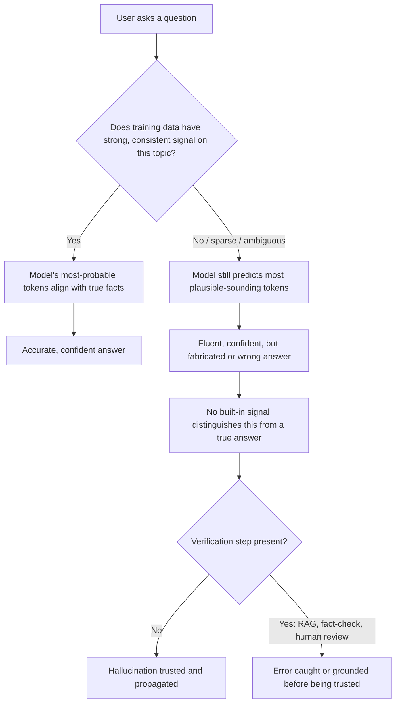

# Hallucination

## 1. Introduction

**Hallucination** is when a language model produces text that sounds fluent, confident, and plausible — but is factually wrong, fabricated, or unsupported by any real source. It might invent a citation that doesn't exist, misstate a historical date, confidently describe a nonexistent API function, or fabricate a statistic that sounds precise but is made up.

This is arguably the single most important limitation to understand about language models, and it follows directly from everything covered earlier this week: a model is a next-token predictor (see **Language Models**), not a fact-checker or database. It gives wrong answers confidently because it isn't looking facts up — it's guessing the most statistically likely next words.

## 2. Why This Topic Exists

If you don't understand hallucination, you risk trusting AI output the way you'd trust a search result or a textbook — and that trust can lead to real harm: fabricated legal citations submitted in court filings, invented API methods that don't compile, made-up statistics repeated as fact. Understanding *why* hallucination happens (not just that it happens) is what allows you to design workflows, prompts, and verification habits that catch it.

## 3. Core Concept

### Beginner

A language model's job is to produce text that *sounds* like a good answer, based on patterns learned from training data. Sounding right and being right are different things to the model — it has no internal "truth checker" separate from its language patterns. When it doesn't actually know something, it doesn't say "I don't know" by default the way a careful human expert would — it often just generates the most plausible-sounding continuation anyway, confidently, because that's what its training taught it to do most of the time.

### Intermediate

Hallucination has several distinct root causes, not just one:

- **Statistical guessing, not lookup.** The model predicts likely-sounding text; when the true fact is rare or absent in training data, "plausible" and "true" diverge, and the model fills the gap with something that fits the pattern of an answer without being one.
- **Training data gaps or noise.** If the training data underrepresents a topic, contains errors, or is simply silent on it, the model has no reliable pattern to draw from — but it's rarely trained to reliably recognize and admit that gap.
- **Confident tone is a learned behavior.** Because most training text (articles, textbooks, documentation) is written in a confident, assertive voice, the model learns to *write* confidently regardless of whether the underlying content is accurate — confidence in tone doesn't correlate with confidence in truth.
- **Compounding errors in long generation.** In a long response built one token at a time, an early small inaccuracy can snowball — later tokens are generated to be consistent with what was already written, even if that earlier part was wrong.
- **Out-of-context or ambiguous prompts.** Vague or underspecified questions give the model more "room" to fill gaps with invented specifics rather than asking for clarification.

### Advanced

Hallucination is an active, unsolved research area, and worth understanding at a deeper level:

- **It's not simply "bugs" to be patched.** Hallucination is a structural consequence of how generative language models work — a model trained purely to predict plausible next tokens has no built-in mechanism that separates "this matches a real fact" from "this matches the shape of a real fact." Reducing it requires additional systems, not just better guessing.
- **Retrieval-Augmented Generation (RAG)** mitigates hallucination by fetching real, verified documents and inserting them into the context window before generation, so the model can ground its answer in provided text rather than purely relying on parametric (trained-in) memory. This significantly reduces — but does not eliminate — hallucination, since the model can still misread, misquote, or fabricate details even from real, provided sources.
- **Calibration** refers to how well a model's stated confidence matches its actual accuracy. Well-calibrated models are more likely to hedge or express uncertainty when they're actually less likely to be correct; poorly calibrated models sound equally confident whether right or wrong — this is a major factor in why hallucination feels so deceptive.
- **Fine-tuning and alignment techniques (RLHF, and specific "honesty" training)** can reduce hallucination rates and improve a model's willingness to say "I'm not sure" — but no current production model eliminates hallucination entirely, and these techniques can sometimes trade off against helpfulness (an overly cautious model that constantly refuses to answer is also a poor user experience).
- **Some hallucination is domain-specific and predictable.** Models tend to hallucinate more on: very recent events (after training cutoff), extremely niche/obscure topics, precise numbers/statistics/citations, and multi-step factual chains where one wrong link corrupts everything downstream.

## 4. Deep Explanation

At a mechanical level, nothing "goes wrong" during a hallucination — the model is doing exactly what it was built and trained to do: predicting the next most probable token given everything so far. The problem is that "most probable given learned patterns" is not the same computation as "verified true given evidence." These two would only ever perfectly coincide if training data contained the correct answer to every possible question, stated clearly and free of contradiction — which is never fully the case for any real-world training corpus.

When asked something the model has strong, consistent, well-represented patterns for (e.g. "what's the capital of France?"), the statistically likely answer and the true answer are the same, and the model looks flawless. When asked something rare, ambiguous, recent, or contradicted across sources in training data, the model still produces its best statistical guess — fluently, in the same confident voice — because it has no separate "confidence meter" wired directly into its token-generation process by default.

## 5. Step-by-Step Flow (how a hallucination typically happens)

1. A user asks a question the model has sparse, ambiguous, or absent reliable training signal for (e.g. a very specific, obscure fact, or a request for a citation).
2. The model still must produce *some* next-token prediction — there's no built-in "abstain" pathway unless explicitly trained in and triggered.
3. The model generates text that matches the *style* and *shape* of a correct, confident answer (e.g. a plausible-looking citation format, a specific-sounding number).
4. Because the response is fluent and confidently phrased, it reads as credible to the user, with no visible signal distinguishing it from a verified fact.
5. Without independent verification, the fabricated content can be trusted and propagated — repeated in documents, code, or further conversations.

## 6. Architecture Explanation

## 7. Visual Analogy

Imagine a brilliant improv actor who has memorized an enormous number of facts, styles, and speech patterns from a lifetime of reading — but who has made a personal rule never to break character, never to say "I don't actually know this." Ask them a question they genuinely know well, and they'll nail it convincingly. Ask them something obscure or unknowable, and they'll still stay in character, inventing a plausible-sounding answer on the spot, with the exact same confident tone as when they actually knew the answer. From the outside, without fact-checking, you cannot tell the difference just from how they sound.

## 8. Real Industry Example

- In 2023, lawyers in a U.S. federal court case were sanctioned after submitting a legal brief containing citations to court cases that ChatGPT had entirely fabricated — the citations looked realistic in format and style but referred to cases that never existed.
- AI coding assistants sometimes hallucinate plausible-looking but nonexistent library functions or API parameters, which fail only when a developer actually tries to run the generated code — a well-known category of issue sometimes called "package/API hallucination."
- Many production AI products now pair language models with **RAG (Retrieval-Augmented Generation)** — for example, a customer-support bot that first retrieves the actual current product documentation and includes it in the prompt, rather than relying purely on the model's trained-in memory of how the product used to work — specifically to reduce this class of error.

## 9. Common Misconceptions

- **"Hallucination means the model is broken or buggy."** It's an inherent consequence of how generative language models work, not a defect that a patch can simply remove — though it can be substantially mitigated.
- **"Bigger, newer models don't hallucinate."** Newer, larger models generally hallucinate less often on many benchmarks, but the behavior hasn't been eliminated in any current production model, and can still appear, especially on niche topics or precise details.
- **"If the answer sounds confident and detailed, it's probably accurate."** Confidence of tone and accuracy of content are unrelated in language models — this is precisely why hallucination is dangerous.
- **"Asking the model 'are you sure?' reliably reveals hallucinations."** It can sometimes prompt useful self-correction, but the model can also confidently double down on a wrong answer, or hedge on a correct one — it's not a dependable detection method by itself.

## 10. Best Practices

- Independently verify facts, statistics, citations, and code before relying on or publishing them, especially for high-stakes use (legal, medical, financial, academic).
- Use Retrieval-Augmented Generation (RAG) or provide source documents directly in the prompt for tasks requiring factual grounding, rather than relying purely on the model's trained-in memory.
- Ask the model to cite its reasoning or sources, and treat unverifiable specifics (exact numbers, quotes, citations) with extra scrutiny.
- Prefer lower temperature and well-specified, unambiguous prompts for factual tasks, since vague prompts give more room for invented specifics.
- Build human review into any workflow where hallucinated output could cause real harm.

## 11. Summary

Hallucination is when a language model generates fluent, confident-sounding text that is factually wrong or entirely fabricated — a direct consequence of the model being a next-token predictor rather than a fact-checking or lookup system. It happens because "statistically plausible" and "factually true" usually align but can diverge, especially for rare, recent, ambiguous, or highly specific information, and because models are trained to write in a consistently confident tone regardless of underlying accuracy. Mitigations exist — retrieval-augmented generation, better alignment/calibration, careful prompting, and independent verification — but no current model eliminates hallucination entirely, making critical thinking and fact-checking an essential skill for anyone using these tools.

## 12. Key Takeaways

- Hallucination is confident, fluent, but false or fabricated output from a language model.
- It happens because the model predicts statistically plausible text, not verified facts — sounding right and being right are different things to it.
- Confident tone does not correlate with factual accuracy in model output.
- Models hallucinate more on rare, recent, ambiguous, or highly specific/detailed information (exact numbers, citations, niche facts).
- Retrieval-Augmented Generation (RAG) and independent verification significantly reduce, but don't eliminate, hallucination risk.
- Always independently verify high-stakes facts, citations, statistics, and code before trusting or publishing AI-generated content.
