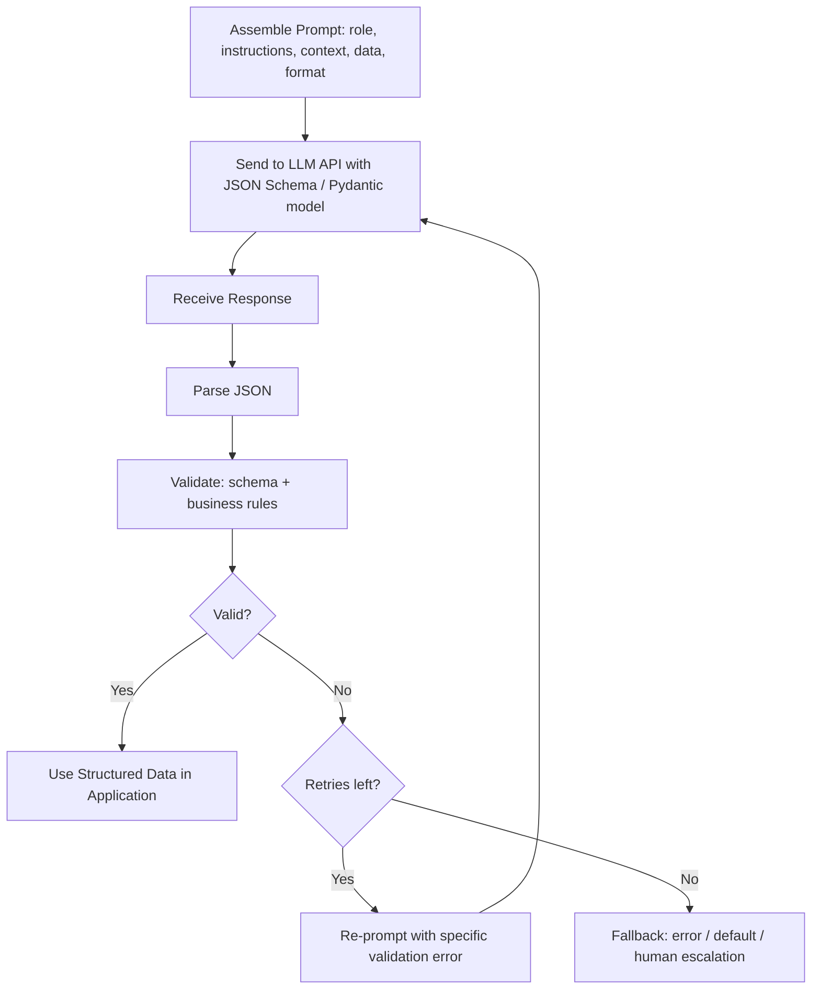
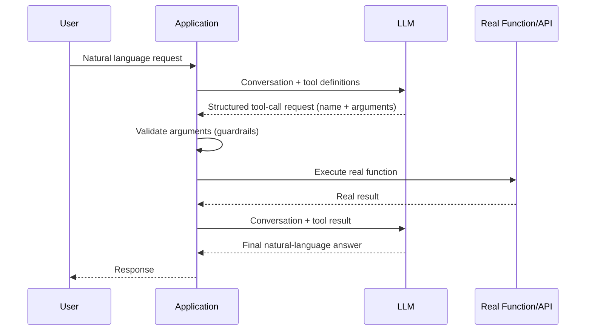
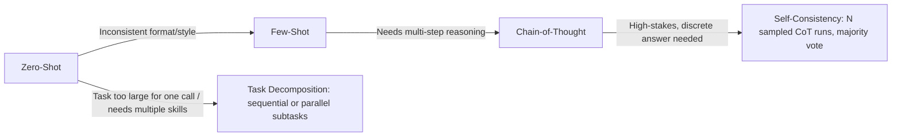
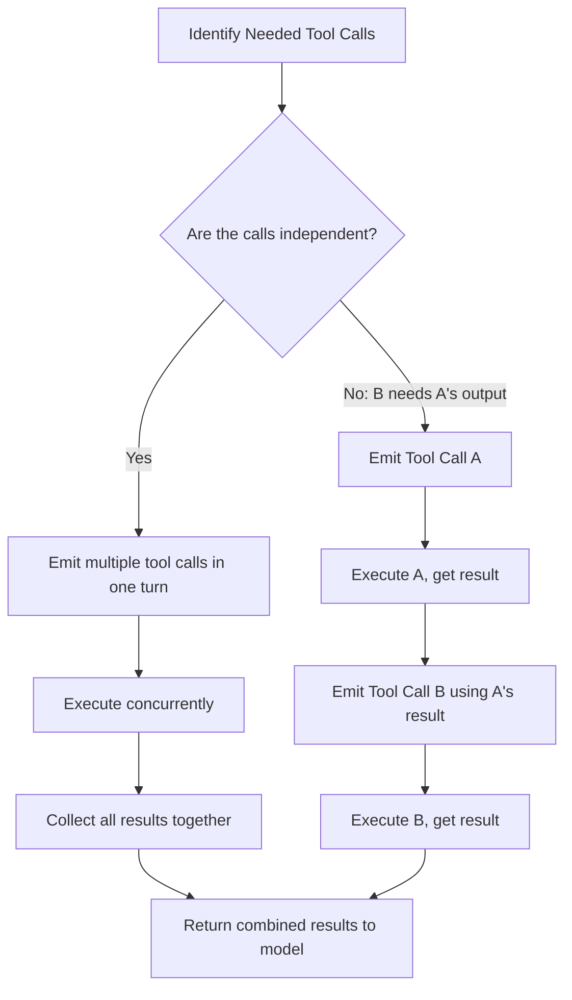
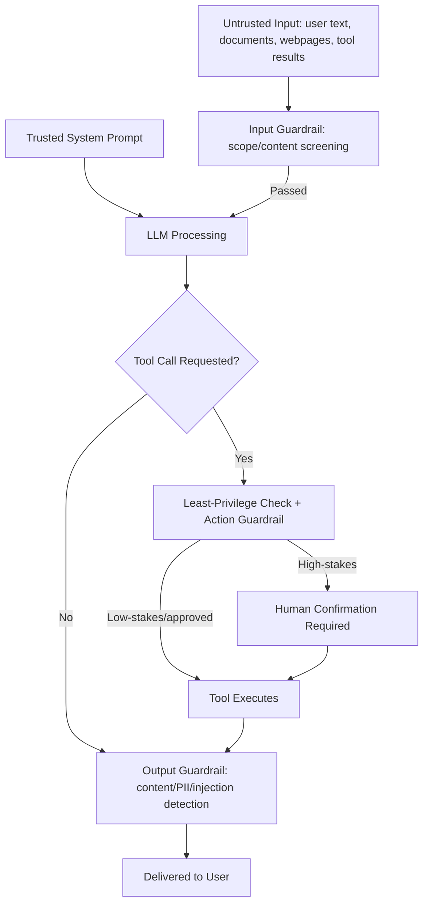

# Diagrams & Workflows

Visual reference diagrams tying together the Week 2 topics into end-to-end workflows.

## 1. Prompt → Structured Output → Validation → Retry Loop

The core reliability loop underlying almost every LLM-powered feature: never trust the first response blindly, always validate, and retry with specific feedback before falling back.

*Caption: The backbone workflow of Topics 1, 6, 7, 8, and 9 — a well-anatomized prompt requests structured data, which is parsed and validated at multiple layers, with targeted retries before any fallback.*

## 2. Tool-Calling Request/Response Cycle

The model never executes code — it requests; the application executes and reports back.

*Caption: The single-cycle version of tool calling (Topic 10) — repeating this cycle multiple times in sequence is what forms an agent loop (Week 7).*

## 3. Prompting Technique Escalation Path

How to escalate prompting techniques as task difficulty increases, from cheapest to most expensive.

*Caption: Start with the cheapest technique (zero-shot) and escalate only when evidence shows it's needed — each step right adds cost/latency in exchange for reliability (Topics 2–5).*

## 4. Parallel vs Sequential Tool Calls

Dependency structure determines whether tool calls can be parallelized.

*Caption: Parallel tool calls (Topic 11) only apply when subtasks are genuinely independent — dependent calls must stay sequential to avoid silently wrong results.*

## 5. Layered Defense: Guardrails and Prompt Injection

How guardrail layers and injection defenses stack together around the model.

*Caption: No single layer (Topics 12–13) is assumed sufficient on its own — defense in depth means an injected or hijacked model still cannot bypass code-level authorization on real actions.*
