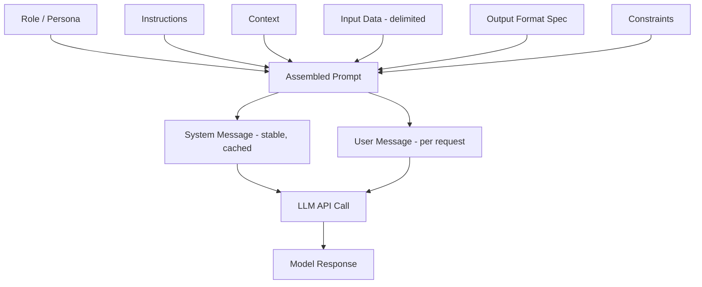

# Prompt Anatomy

## 1. Introduction

A prompt is the only input channel you have into a language model. There's no settings panel, no configuration file the model reads on the side — everything you want it to know, do, avoid, and sound like has to be expressed as text inside the prompt itself. "Prompt anatomy" is the practice of breaking that text into deliberate, named parts — role, instructions, context, examples, constraints, output format — instead of writing one long, unstructured paragraph and hoping for the best.

This is the first "real code" topic of the course because every application you build from here on starts with assembling a prompt out of these parts, usually by string-templating them together before sending the request to the model's API.

## 2. Why This Topic Exists

Two people can ask an AI model for "a summary of this article" and get wildly different quality results, not because one model is smarter, but because one prompt gave the model almost no structure and the other clearly separated what role to play, what the task is, what the input text is, and what shape the answer should take. Unstructured prompts produce inconsistent, hard-to-parse, occasionally off-topic answers. Structured prompts produce consistent, predictable, machine-usable answers — which is the entire point once you start writing programs that call an LLM instead of a human reading the reply.

Understanding prompt anatomy also matters because every advanced technique later this week (few-shot, chain-of-thought, structured output, tool calling) is really just "add another named section to the prompt." If you don't understand the base anatomy, those techniques look like unrelated tricks instead of natural extensions of the same skill.

## 3. Core Concept

### Beginner

Think of a prompt as a small form with labeled fields, even though it's really just plain text. The common fields are:

- **Role / persona** — who the model should act as ("You are a customer support assistant for an airline").
- **Instructions** — the actual task ("Summarize the ticket below in two sentences").
- **Context** — background information the model needs ("The customer has a Gold-tier membership").
- **Input data** — the actual content to operate on (the email, the document, the question).
- **Examples** — sample input/output pairs showing the desired style (covered fully in the next topic).
- **Output format** — how the answer must be shaped ("Respond with exactly two sentences, no greeting").
- **Constraints** — hard rules ("Never mention internal ticket IDs to the customer").

You don't always need every field, but naming them explicitly, even when writing plain text, makes prompts far more reliable.

### Intermediate

Most production prompts are built from two parts sent separately to the API: a **system prompt** (or "system message") and a **user prompt**. The system prompt sets persistent behavior — role, tone, rules, output format — and stays constant across a whole conversation or across every request in an application. The user prompt carries the specific request and the input data for *this* call.

Splitting these apart matters for three reasons:
1. **Reusability** — the system prompt is written once and reused across thousands of requests; only the user prompt changes per call.
2. **Precedence** — models are trained to weight system-level instructions more heavily than user text, which is part of why system prompts are also the first line of defense against prompt injection (see Topic 13).
3. **Caching** — many APIs let you cache a static system prompt so you're not re-processing (and re-paying for) the same instructions on every call.

Within the user prompt, ordering matters too. Putting instructions *before* a long block of input text (rather than after) tends to help the model apply the instructions consistently, because it "reads" the instructions before it has to process the noisy data. For long documents, repeating the key instruction again *after* the data ("Remember: answer using only the text above") also measurably improves adherence.

### Advanced

At the token level, a prompt is just a sequence fed into the same next-token-prediction machinery you learned about in Week 1 — there's no special "instruction mode" baked into the architecture. What makes system prompts more authoritative is training: instruction-tuned and RLHF-aligned models are explicitly trained on data where system-level text is treated as higher-priority, so the model learns a soft hierarchy of trust (system > developer/tool output > user > untrusted retrieved content). That hierarchy is a learned behavior, not a hard architectural guarantee — which is precisely why prompt injection (Topic 13) remains possible.

Advanced prompt anatomy also treats the prompt as a piece of software: version it, test it against a fixed eval set before changing it in production, and treat every section as a variable that can be independently swapped (e.g., A/B testing two different "constraints" blocks while keeping everything else fixed). Delimiters (```, XML-like tags such as `<context>...</context>`, or Markdown headers) are used deliberately to give the model unambiguous boundaries between instructions and data — this reduces the model's confusion about "is this text an instruction or content to process," which is both a reliability technique and a security technique.

## 4. Deep Explanation

A well-anatomized prompt reduces ambiguity at every layer the model has to resolve. Consider an unstructured prompt: *"hey can you look at this customer email and tell me what they want and also maybe draft a reply, keep it professional but friendly, oh and it's for a premium customer so be extra nice, here's the email: ..."* The model has to simultaneously infer the role, guess the exact output format, and locate where the actual data starts — all from a single run-on sentence. Every one of those inference steps is a place where two different runs (or two different models) can diverge.

Now compare a structured version:

```
SYSTEM:
You are a support-reply assistant for a premium airline customer.
Always be professional, warm, and concise. Never invent policy details you were not given.

USER:
TASK: Identify the customer's request, then draft a reply.
OUTPUT FORMAT:
Request: <one sentence>
Draft Reply: <2-4 sentences>

CUSTOMER EMAIL:
"""
<email text here>
"""
```

Every field the model needs to fill in has a named slot with an explicit boundary (the triple-quote fence around the email is a delimiter). This is why prompt anatomy is foundational: it's the mechanism by which you convert "please be smart about this" into a specification a probabilistic system can follow consistently.

Anatomy also directly affects **token cost and latency** (Week 1 concepts resurface here): a bloated system prompt with redundant instructions costs money on every single call, so professional prompt engineering treats brevity and clarity as equally important, not brevity vs. quality as a trade-off — a clearer prompt is usually also a shorter one.

## 5. Step-by-Step Flow

1. **Define the role** — decide who/what the model is acting as for this task.
2. **Write the instruction** — state the task in one clear imperative sentence.
3. **Attach context** — add only the background facts the model actually needs (extra irrelevant context adds noise and cost).
4. **Insert the input data** — wrap it in clear delimiters so it can't be confused with instructions.
5. **Specify the output format** — describe (or show) exactly the shape the response must take.
6. **Add constraints** — list hard "never do X" / "always do Y" rules explicitly, near the end where they're less likely to be diluted by earlier text.
7. **Assemble** — combine role + instructions + constraints into a system prompt (stable across calls) and instructions-specific-to-this-request + data into a user prompt (changes per call).
8. **Send and evaluate** — run it, check whether output matches the intended shape/behavior, and iterate on the weakest section.

## 6. Architecture Explanation



## 7. Visual Analogy

A prompt is like a work order you hand to a new contractor who has never met you and can't ask follow-up questions. If you scribble "fix the thing, you know what I mean" on a napkin, you'll get inconsistent results depending on their mood and assumptions. If instead you hand them a form with clearly labeled sections — job description, site context, materials to use, required finish, things to avoid — they can do the job the same way every single time, even if a different contractor picks up the form tomorrow. Prompt anatomy is that form design.

## 8. Real Industry Example

Customer-support copilots (used by companies like Intercom, Zendesk, and many SaaS help-desks) rely almost entirely on prompt anatomy discipline. A typical production system prompt for such a tool encodes: the brand voice, a strict list of topics the bot must escalate to a human instead of answering, the exact JSON or Markdown shape the reply must take so it can be inserted into the support UI, and delimiters separating "the customer's message" from "internal instructions," specifically to reduce the chance that a customer's message can override the bot's behavior (an early, practical defense against prompt injection). Engineering teams version these system prompts in source control and run regression evals before every change, treating them exactly like application code.

## 9. Common Misconceptions

- **"A longer prompt is always a better prompt."** Irrelevant context adds noise, increases cost and latency, and can dilute the model's attention on what actually matters.
- **"The model reads the whole prompt equally."** Position matters — the very beginning and very end of a prompt tend to get the strongest adherence; critical instructions buried in the middle of a long context are more likely to be under-weighted.
- **"System prompts are unbreakable."** They raise the bar significantly but are not a hard security boundary — see Prompt Injection (Topic 13).
- **"Anatomy is just formatting."** It's not cosmetic — the same content reorganized into clear sections measurably changes output quality and consistency, because it reduces the model's inference burden.

## 10. Best Practices

- Always separate stable instructions (system) from per-request data (user).
- Use explicit delimiters (triple quotes, XML-like tags, Markdown fences) around any untrusted or variable input.
- State the output format explicitly — don't make the model guess how you want the answer shaped.
- Keep constraints short, explicit, and placed prominently (start or end), not buried in a paragraph.
- Version and test prompts like code: keep a changelog, run them against a fixed set of example inputs before shipping changes.
- Prefer the shortest prompt that reliably produces the correct behavior — cut anything the model doesn't need.

## 11. Summary

Prompt anatomy is the discipline of decomposing a prompt into named, purposeful sections — role, instructions, context, input data, output format, and constraints — rather than writing one unstructured block of text. Splitting a stable system prompt from a per-call user prompt improves reliability, reusability, and cost. This structure is the foundation every other prompting and structured-output technique in this week builds on top of.

## 12. Key Takeaways

- A prompt has functional parts (role, instructions, context, data, format, constraints) even when it's just plain text.
- System prompts carry stable behavior; user prompts carry per-request content — split them.
- Explicit delimiters reduce ambiguity between "instruction" and "data," which improves both reliability and security.
- Position and clarity matter as much as content — clear, well-ordered, and concise beats long and vague.
- Treat prompts as versioned, tested artifacts, not one-off strings.
