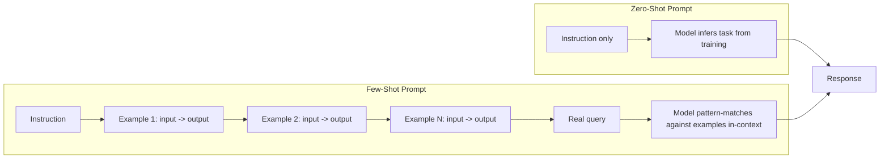

# Zero-Shot vs Few-Shot

## 1. Introduction

"Zero-shot" and "few-shot" describe how many worked examples you give a model inside the prompt before asking it to perform the actual task. Zero-shot means you give it none — just the instruction. Few-shot means you show it a handful of example input/output pairs first, so the model can infer the pattern you want by example rather than by description alone. This is one of the cheapest, most reliable levers you have for improving output consistency, and it requires no fine-tuning, no extra tools — just a longer, better-designed prompt.

## 2. Why This Topic Exists

Telling a model "format your answer as a short, upbeat product description" is a description of a style. Showing it three actual short, upbeat product descriptions is a demonstration of that style. Demonstrations are almost always easier for a model to match precisely than descriptions are, because "upbeat" is subjective and the model has to guess your exact bar — while an example pins down tone, length, structure, and edge-case handling all at once, with no ambiguity. Few-shot prompting exists because it converts a fuzzy stylistic request into a concrete pattern-matching task, which is exactly the kind of task a next-token predictor is best at.

## 3. Core Concept

### Beginner

- **Zero-shot**: "Classify this review as positive or negative: 'The battery died in two hours.'" — no examples, just the instruction.
- **One-shot**: the same prompt, but with exactly one example first.
- **Few-shot**: the same prompt, with several (typically 2–10) examples first, e.g.:

```
Review: "Fast shipping, great quality!" -> Positive
Review: "Broke after one day, terrible." -> Negative
Review: "The battery died in two hours." -> ?
```

The model completes the pattern it has just been shown rather than reasoning from scratch about what "positive" means.

### Intermediate

Few-shot examples do more than convey style — they implicitly communicate the exact output schema, edge-case behavior, and vocabulary you want. If you want a classifier to output exactly `POSITIVE`, `NEGATIVE`, or `NEUTRAL` in uppercase, showing three labeled examples in that exact casing is far more reliable than writing "please use uppercase labels," because the model is directly copying a demonstrated format rather than interpreting an instruction about format.

Choosing examples well matters more than choosing many examples:
- **Diversity** — cover different cases (short/long input, easy/ambiguous cases, different categories) so the model doesn't overfit to one narrow pattern.
- **Order** — models can be somewhat sensitive to the order of examples; putting a harder or more representative example last (closest to the actual query) sometimes has more influence.
- **Correctness** — every example must be genuinely correct; a single wrong example can teach the model the wrong pattern.
- **Balance** — for classification tasks, an unbalanced example set (9 positive examples, 1 negative) can bias the model toward the majority label.

### Advanced

Few-shot prompting is a form of **in-context learning**: the model is not updating its weights (no training happens), it is using the attention mechanism to treat the examples in the context window as a temporary, ad-hoc "training set" it pattern-matches against for this one call only. This is why few-shot examples must be re-sent on every single API call — nothing is retained between requests.

There's a real trade-off against cost and context budget: every example consumes tokens (Week 1's **Cost Per Token**) on every request, and the marginal benefit of each additional example diminishes quickly — research and practice both show that gains often plateau after 3–8 well-chosen examples, and past a certain point more examples mainly add cost and latency without meaningfully improving accuracy. When a task needs consistent behavior across thousands of examples and the per-call cost of few-shot examples becomes significant, that's usually the signal to consider fine-tuning instead, which bakes the pattern into the model's weights so it no longer needs to be re-taught in every prompt.

## 4. Deep Explanation

Zero-shot prompting relies entirely on the model's pre-trained and instruction-tuned knowledge to correctly interpret a task description. It works remarkably well for common, well-represented tasks (general Q&A, summarization, translation) because the model has seen enormous amounts of similar instruction-following data during training. It tends to underperform on tasks that are narrow, unusual, or where "correct" depends on domain-specific conventions the model wasn't necessarily trained to prioritize — for example, a company's internal ticket-priority taxonomy, or a very specific citation format.

Few-shot prompting compensates for exactly that gap: instead of hoping the model's general training aligns with your specific convention, you demonstrate the convention directly. The trade-off is prompt length (and therefore cost and latency) versus reliability. A useful mental model: zero-shot asks the model to generalize from its training distribution; few-shot narrows that generalization to a distribution you define on the spot, using only a handful of points.

There is also a middle layer worth knowing: **instruction + rationale-free examples** vs **instruction + examples that include short explanations**. The latter blends into Chain-of-Thought territory (next topic) — showing not just the answer but a brief reasoning trace before it, which further improves accuracy on tasks that require multi-step reasoning rather than simple pattern completion.

## 5. Step-by-Step Flow

1. **Start zero-shot.** Always test the plain instruction first — many tasks don't need examples at all, and skipping straight to few-shot wastes tokens.
2. **Identify failure patterns.** If zero-shot output is inconsistent, wrong format, or misses domain conventions, that's the signal to add examples.
3. **Select representative examples.** Pick 2–8 examples that cover the range of cases you expect (including tricky edge cases).
4. **Format examples exactly like the desired output.** Use the same delimiters/labels you want the model to reproduce.
5. **Place examples before the real query**, using a consistent template across all of them.
6. **Test again.** Compare output consistency across multiple runs and multiple inputs.
7. **Prune examples that don't help.** If removing an example doesn't hurt accuracy, remove it to save tokens.
8. **Reconsider fine-tuning** if the few-shot block has grown large and is used on every request at scale.

## 6. Architecture Explanation



## 7. Visual Analogy

Zero-shot is like handing a new employee a written policy manual and asking them to handle a customer call — they'll do a reasonable job if the manual is clear and the situation is common. Few-shot is like sitting them down first and playing three recordings of "here's how a great call sounds, here's a mediocre one, here's what to avoid" before they take their first call. The recordings communicate tone, pacing, and edge-case handling far faster and more precisely than the policy manual alone ever could.

## 8. Real Industry Example

Customer-review classification pipelines (e-commerce platforms, app-store review triage) commonly use few-shot prompts rather than a fine-tuned classifier for their first version, because it's far cheaper to iterate: adding a new edge case is "add one more example to the prompt" instead of "retrain a model." Similarly, structured data-extraction tools (invoice parsing, resume parsing) frequently ship a handful of few-shot examples covering the trickiest real documents seen in production — pulled directly from past failures — specifically to lock in correct handling of the edge cases that zero-shot got wrong.

## 9. Common Misconceptions

- **"Few-shot is always better than zero-shot."** For common, well-understood tasks, zero-shot is often just as accurate and much cheaper — always test zero-shot first.
- **"More examples always help."** Benefit plateaus quickly; beyond a handful of well-chosen examples, extra examples mostly add cost, not accuracy.
- **"Few-shot examples are remembered by the model."** They are not — nothing persists between API calls; every call re-sends the full example set from scratch.
- **"Any examples will do."** Wrong, inconsistent, or unbalanced examples actively teach the model bad patterns — quality and diversity matter far more than quantity.

## 10. Best Practices

- Always benchmark zero-shot before adding examples — don't pay the token cost unless it's earned.
- Keep 2–8 high-quality, diverse, verified-correct examples rather than a long, redundant list.
- Match the example format exactly to your desired output format (same labels, casing, structure).
- Include at least one tricky/edge-case example, not only easy, obvious ones.
- Revisit fine-tuning once your few-shot block becomes large and is reused across high call volumes.

## 11. Summary

Zero-shot prompting asks the model to perform a task from an instruction alone, leaning on its pre-trained general knowledge. Few-shot prompting adds worked examples directly in the prompt, turning a fuzzy style or format request into a concrete demonstration the model can pattern-match against through in-context learning. Few-shot generally improves consistency and format adherence at the cost of extra tokens per request, and its benefits plateau after a handful of well-chosen, diverse, correct examples.

## 12. Key Takeaways

- Zero-shot = instruction only; few-shot = instruction plus worked examples.
- Few-shot works via in-context learning — no weights are updated, and nothing is remembered between calls.
- Example quality and diversity matter more than example count; 2–8 good examples usually suffice.
- Every example costs tokens on every call — always test zero-shot first to avoid unnecessary cost.
- High-volume, high-consistency needs eventually point toward fine-tuning instead of ever-growing few-shot prompts.
