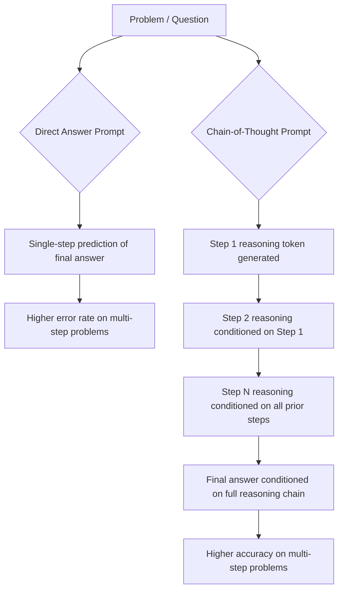

# Chain-of-Thought

## 1. Introduction

Chain-of-thought (CoT) prompting is the technique of asking a model to work through a problem in explicit, visible steps before giving its final answer, instead of jumping straight to a conclusion. Because a language model generates one token at a time based on everything generated so far, forcing it to "show its work" changes what earlier tokens exist for later tokens to condition on — the reasoning steps become part of the input to the final answer, which measurably improves accuracy on problems that require multiple logical or arithmetic steps.

## 2. Why This Topic Exists

Ask a model "what's 17% of 240, minus half of 36?" with a direct-answer instruction, and it may blurt out a wrong number, because it's trying to produce the final digits immediately without any intermediate computation appearing in the token stream. Ask the same model to "work through this step by step" and it will typically compute 17% of 240, then half of 36, then subtract — and land on the correct answer far more often. Chain-of-thought exists because multi-step reasoning tasks (math, logic puzzles, multi-clause instructions, debugging) benefit enormously from making the intermediate steps explicit tokens, rather than expecting the correct answer to emerge from a single leap.

## 3. Core Concept

### Beginner

The simplest version of CoT is adding a phrase like "Let's think step by step" or "Show your reasoning before giving the final answer" to your prompt. This alone, with no examples, is called **zero-shot CoT** and was one of the earliest documented tricks in prompt engineering — it can turn a wrong answer into a right one on arithmetic and logic problems just by asking the model to narrate its steps.

### Intermediate

CoT can be combined with few-shot prompting: instead of just showing input→output pairs, you show input→**reasoning**→output triples. This is called **few-shot CoT**, and it's typically more reliable than zero-shot CoT because it demonstrates *the specific style and depth* of reasoning you want, not just that reasoning should happen.

```
Q: A store has 3 boxes of 12 pens each. It sells 9 pens. How many are left?
A: There are 3 x 12 = 36 pens total. After selling 9, 36 - 9 = 27 pens remain.
   The answer is 27.

Q: A bus has 4 rows of 6 seats. 15 seats are occupied. How many are free?
A:
```

The model, having seen the demonstrated reasoning pattern, will typically continue with its own step-by-step working before the final number.

An important practical detail: for CoT to actually help, the final answer must depend on the reasoning that came before it in the generated sequence — which is naturally true since generation is left-to-right. This is also why extracting just "the final answer" from a CoT response (e.g., for programmatic use) usually requires a clear closing marker like "The answer is: X" so your code can reliably parse out the final value.

### Advanced

CoT effectiveness is closely tied to model scale and training: it was originally observed to be an "emergent" capability — small models sometimes get *worse* with CoT prompting (spurious or rambling reasoning that leads them astray), while sufficiently large, instruction-tuned models get substantially better. Modern "reasoning" models (which internally generate long chains of reasoning tokens, sometimes hidden from the user, before answering) essentially bake CoT into the model's default behavior rather than requiring it to be explicitly prompted.

CoT is not free: reasoning tokens are generated (and billed) just like any other output tokens, so a CoT response can cost several times more than a direct-answer response and takes measurably longer to generate, since the model must produce all the intermediate tokens sequentially before it reaches the answer. This cost/accuracy trade-off is why production systems reserve CoT for tasks that actually need multi-step reasoning (math, planning, multi-constraint logic) and skip it for simple lookups or classifications where it adds latency and cost with no accuracy benefit. It's also worth knowing that a model's stated chain of thought is not a guaranteed truthful account of its internal computation — it's a generated explanation that usually correlates with better answers but is not a verified audit log of "how the model really got there."

## 4. Deep Explanation

The mechanism behind CoT's effectiveness connects directly back to how a Transformer generates text (Week 1): every new token is predicted conditioned on *all* previous tokens, including any tokens the model itself just generated. When a model is forced to first write "Step 1: compute 17% of 240 = 40.8," that number, 40.8, now literally exists as tokens in the context window, and the *next* prediction (computing half of 36) is conditioned on a context that already contains a correct intermediate result. Skip the step, and the model has to implicitly do that same arithmetic "in its head" within a single forward pass, compressed into the probability distribution for one token — which is a much harder computational demand and more error-prone, especially for multi-digit arithmetic or multi-hop logic.

In effect, CoT trades extra generated tokens (cost, latency) for a decomposition of the problem into a sequence of easier sub-predictions, each conditioned on the previous, correct sub-result. This is the same intuition behind Task Decomposition (Topic 5) and Self-Consistency (Topic 4) — both build on the idea that giving the model room, and structure, to reason step-by-step beats demanding an instant final answer.

## 5. Step-by-Step Flow

1. **Identify a multi-step task** — arithmetic, logic, multi-constraint filtering, planning, debugging.
2. **Add a reasoning instruction** — e.g., "Think through this step by step before answering" (zero-shot CoT), or provide worked examples with visible reasoning (few-shot CoT).
3. **Let the model generate its reasoning** — do not truncate or suppress the intermediate steps.
4. **Require a clear final-answer marker** — e.g., "End with a line starting 'Final Answer:'" so your code can reliably parse the conclusion.
5. **Parse only the final answer** for downstream use, while optionally logging the full reasoning trace for debugging or auditing.
6. **Evaluate cost vs. benefit** — measure whether CoT actually improved accuracy on your specific task before paying its latency/cost tax in production.

## 6. Architecture Explanation



## 7. Visual Analogy

Imagine asking someone to solve a multi-step word problem entirely in their head and blurt out only the final number versus asking them to work it out on a whiteboard, writing each step down before moving to the next. The whiteboard version is slower and uses more "space," but each step is anchored by what's already written, so errors don't compound silently. Chain-of-thought is the model using its own generated text as that whiteboard.

## 8. Real Industry Example

Financial-services and legal-tech tools that ask an LLM to apply multi-clause rules (e.g., "does this transaction violate any of these five compliance conditions?") rely heavily on CoT: the prompt explicitly asks the model to check each condition one at a time and state whether it's satisfied before producing a final yes/no determination. This step-by-step structure is also what makes the output auditable — a human reviewer can read the reasoning trace and see exactly which clause triggered the final decision, rather than trusting an unexplained verdict. Coding assistants use the same pattern internally: asking the model to first outline its plan (which files to change, in what order) before writing code produces measurably more coherent multi-file changes than asking for the final code directly.

## 9. Common Misconceptions

- **"CoT always improves accuracy."** For simple, single-step tasks (e.g., "extract the email address from this text"), CoT adds cost and latency with no benefit, and can occasionally introduce unnecessary rambling.
- **"The reasoning shown is exactly how the model 'really' thinks."** The generated chain of thought is a plausible narrative correlated with the answer, not a verified trace of the model's actual internal computation.
- **"CoT is free."** Every reasoning token is a billed, generated output token — CoT responses are typically several times longer (and costlier) than direct answers.
- **"You must always show the reasoning to the end user."** In most production systems, the reasoning is generated to *improve the answer* but only the final parsed answer is surfaced to the user; the trace is often just logged for debugging.

## 10. Best Practices

- Reserve CoT for tasks that genuinely require multi-step reasoning; skip it for simple lookups and classifications.
- Use a clear, consistent final-answer delimiter so your code can reliably parse the conclusion out of the reasoning text.
- Prefer few-shot CoT (demonstrated reasoning style) over zero-shot CoT when you need a very specific reasoning depth or format.
- Log full reasoning traces during development and debugging even if you don't show them to end users — they're invaluable for diagnosing wrong answers.
- Measure accuracy with and without CoT on your actual task before committing to the extra cost in production.

## 11. Summary

Chain-of-thought prompting asks a model to generate intermediate reasoning steps before its final answer, which measurably improves accuracy on multi-step arithmetic, logic, and planning tasks by letting each step condition on a correct, explicit prior step rather than demanding the whole answer in one leap. It can be invoked with a simple instruction (zero-shot CoT) or demonstrated via worked examples (few-shot CoT), and it comes at a real cost in tokens and latency, making it a tool to apply deliberately rather than by default.

## 12. Key Takeaways

- CoT makes a model show intermediate reasoning steps as generated tokens before its final answer.
- It works because each new token is conditioned on all previous tokens, including the model's own prior reasoning.
- Zero-shot CoT uses a simple instruction ("think step by step"); few-shot CoT demonstrates the reasoning style with examples.
- CoT costs more tokens and latency — reserve it for genuinely multi-step tasks.
- The displayed reasoning is a plausible narrative, not a guaranteed accurate account of the model's internal computation.
