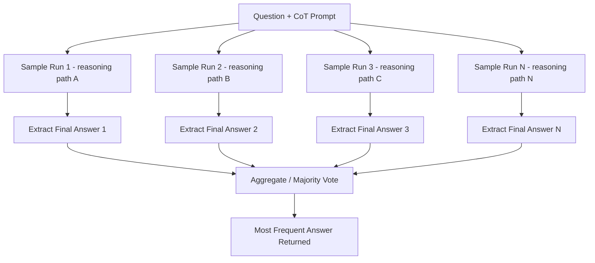

# Self-Consistency

## 1. Introduction

Self-consistency is a technique that improves on chain-of-thought by generating *several independent reasoning paths* for the same question — usually by sampling the model multiple times with a non-zero temperature — and then taking the answer that shows up most often among them, instead of trusting a single run. It treats one chain-of-thought response as one "vote," and lets a small crowd of votes from the same model cancel out the noise that any single sampled reasoning path might contain.

## 2. Why This Topic Exists

Chain-of-thought helps, but any single generated reasoning path can still go wrong — the model might make one arithmetic slip, misread one clause, or follow a plausible-looking but incorrect line of reasoning, and because generation is autoregressive, one early mistake tends to compound through the rest of that particular chain. Self-consistency exists because different sampled runs tend to make *different* mistakes rather than the same mistake every time, so if you generate several independent attempts and take the most common final answer, the errors that are specific to any one run get outvoted by the runs that got it right — assuming the model gets it right more often than any one specific wrong way.

## 3. Core Concept

### Beginner

Instead of asking a question once, ask it several times (e.g., 5 or 10 times) with chain-of-thought reasoning enabled and temperature turned up slightly so the runs aren't identical. Look at the final answers produced across all the runs, and pick whichever answer appeared most often — like taking a majority vote among several independent attempts at the same problem.

### Intermediate

The practical recipe:
1. Use a CoT prompt that asks for step-by-step reasoning ending in a clearly marked final answer.
2. Sample the model **N** times (commonly 5–20) at a moderate-to-high temperature (e.g., 0.7), so each run explores a somewhat different reasoning path rather than being deterministic.
3. Extract the final answer from each of the N reasoning traces (using a consistent parsing rule, e.g., "text after 'Final Answer:'").
4. Take the **mode** (most frequent value) among the N extracted answers as the final output.

This only works for tasks with a discrete, comparable final answer (a number, a label, a short fixed phrase) — it doesn't apply cleanly to open-ended generation tasks like "write a poem," where there's no meaningful notion of "the most common poem."

### Advanced

Self-consistency is a form of **ensembling at inference time**: rather than combining multiple different models, you combine multiple independent samples from the *same* model, exploiting the randomness introduced by temperature sampling (Week 1) to get a diverse set of reasoning attempts. It works best on tasks where (a) the correct reasoning path is more probable than any single specific incorrect path, and (b) errors across samples are not perfectly correlated — i.e., the model doesn't make the exact same mistake every single time.

The cost is linear in N: running self-consistency with N=10 costs roughly 10x a single CoT call in both tokens and latency (though calls can be parallelized to keep wall-clock latency lower, at the cost of parallel API usage/rate limits). Because of this, self-consistency is usually reserved for high-value, high-stakes single questions (a hard math problem, a critical classification decision) rather than applied by default to every request in a high-throughput system. It's also worth distinguishing self-consistency from simply "asking the model to double check its answer" in a single call — self-consistency's statistical benefit comes specifically from *independent* sampled attempts being aggregated externally, not from a single run second-guessing itself internally.

## 4. Deep Explanation

The core statistical intuition mirrors a simple probability argument: if a model's single-shot accuracy on a task is, say, 70%, and its errors are spread across many different wrong answers rather than concentrated on one consistent wrong answer, then across N independent samples the correct answer is likely to appear more often than any individual specific wrong answer — so a majority vote across samples can push effective accuracy noticeably higher than any single sample's accuracy. This breaks down if the model has a strong, consistent bias toward one specific wrong answer (a systematic misunderstanding), because in that case most or all samples will agree on the *same* wrong answer, and voting won't help — self-consistency corrects for random, sample-to-sample noise, not for a systematic error in the model's understanding of the task.

This is why self-consistency pairs naturally with chain-of-thought rather than direct-answer prompting: CoT gives each sample a genuinely different reasoning path to follow (since intermediate steps are sampled too), which is what creates the diversity that voting can exploit. Direct-answer sampling would just be resampling a single token position over and over, which is a much weaker source of diversity.

## 5. Step-by-Step Flow

1. **Write a CoT prompt** with a clear final-answer marker.
2. **Choose N** (e.g., 5–20) based on how much the accuracy gain is worth versus the added cost.
3. **Set a moderate-to-high temperature** so the N runs are meaningfully different from each other.
4. **Send N independent requests** (ideally in parallel to control latency).
5. **Parse the final answer** out of each of the N responses using a consistent extraction rule.
6. **Tally the answers** and select the most frequent one (the mode).
7. **Optionally surface the vote distribution** (e.g., "7 out of 10 runs agreed") as a confidence signal for downstream logic or human review.

## 6. Architecture Explanation

## 7. Visual Analogy

Self-consistency is like asking five different students to independently solve the same tricky math problem on their own, without seeing each other's work, and then taking whichever final answer the majority of them arrived at. Any one student might make an arithmetic slip along their particular path, but it's far less likely that a majority of five independent students make the exact same slip — so the majority answer is a more trustworthy signal than any single student's answer alone.

## 8. Real Industry Example

Self-consistency shows up in high-stakes automated reasoning pipelines — for example, AI-assisted math tutoring systems and automated grading tools that need a reliable final numeric answer, or compliance-checking systems that need a reliable yes/no determination on a complex, multi-clause rule. Rather than trusting a single LLM call for a decision that feeds into a grade, an approval, or a flag, these systems sample the reasoning multiple times and only proceed automatically when there's strong agreement across samples — routing disagreement cases to a human reviewer, effectively using the vote spread itself as a built-in confidence/uncertainty signal.

## 9. Common Misconceptions

- **"Self-consistency fixes any wrong answer."** It only helps when errors are randomly distributed across samples; a systematic misunderstanding of the task will be reproduced (and "confirmed" by majority vote) across most or all samples.
- **"More samples is always worth it."** Gains diminish after a certain N, while cost grows linearly — there's a point of diminishing returns specific to each task.
- **"It works for any task."** It requires a discrete, comparable final answer; it doesn't meaningfully apply to open-ended creative generation.
- **"It's the same as asking the model to self-check once."** A single model re-reading its own answer in the same call is not the same statistical mechanism as aggregating truly independent sampled runs.

## 10. Best Practices

- Reserve self-consistency for high-stakes, discrete-answer questions where the extra cost is clearly justified.
- Use CoT (not direct-answer) prompts as the base for each sample, since reasoning diversity is what makes voting effective.
- Parallelize the N calls to control latency rather than running them sequentially.
- Surface the agreement level (e.g., vote share) as a confidence signal, and route low-agreement cases to human review.
- Don't apply it by default across a whole high-throughput pipeline — its linear cost scaling makes it a targeted tool, not a blanket policy.

## 11. Summary

Self-consistency improves on single-shot chain-of-thought by sampling multiple independent reasoning paths for the same question and taking the most frequent final answer as a majority vote. It exploits the fact that random errors tend to differ across independent samples while correct reasoning tends to converge on the same answer, effectively trading extra tokens and latency for higher reliability on discrete-answer, high-stakes tasks.

## 12. Key Takeaways

- Self-consistency = multiple independent CoT samples, aggregated by majority vote on the final answer.
- It requires temperature-based sampling diversity and a CoT-style prompt to produce genuinely different reasoning paths.
- It corrects random, sample-to-sample errors — not systematic misunderstandings the model consistently repeats.
- Cost scales linearly with the number of samples (N), so it's reserved for high-value or high-stakes questions.
- The agreement/vote distribution across samples can double as a built-in confidence signal.
