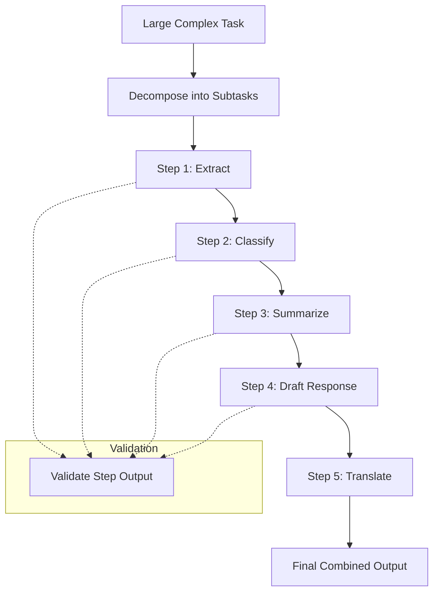

# Task Decomposition

## 1. Introduction

Task decomposition is the practice of breaking a large, complex request into a sequence of smaller, well-defined subtasks — each handled by its own focused prompt (or its own step in an LLM-powered pipeline) — instead of asking a model to solve the entire problem in a single call. Where chain-of-thought asks the model to reason step by step *within one response*, task decomposition often goes a level higher: splitting the problem into multiple separate prompts or even multiple separate calls, where the output of one step becomes the input to the next.

## 2. Why This Topic Exists

Language models are noticeably more reliable at narrow, well-specified tasks than at broad, multi-part ones bundled into a single instruction. Asking a model in one shot to "read this 40-page contract, summarize it, identify all risky clauses, draft a negotiation email, and translate it to Spanish" stacks five different skills into one pass, and a mistake early in that chain (a missed clause) silently propagates into every later part with no chance to catch it. Decomposing that same request into five separate steps — extract clauses, classify risk, summarize, draft, translate — lets you validate, inspect, and even swap out the model or prompt used at each stage independently, dramatically improving reliability and debuggability.

## 3. Core Concept

### Beginner

Instead of one giant prompt trying to do everything, write a short pipeline: Step 1's prompt produces an output, and that output becomes part of Step 2's input, and so on. For example: "Step 1 — extract the key facts from this email. Step 2 — using those facts, draft a reply." Each step is a small, focused prompt, and it's much easier to tell when a small step goes wrong than when a giant one does.

### Intermediate

Decomposition strategies generally fall into two shapes:

- **Sequential (pipeline) decomposition** — steps run one after another, each depending on the previous step's output (e.g., extract → classify → summarize → draft).
- **Parallel (fan-out/fan-in) decomposition** — independent subtasks run at the same time and their results are merged (e.g., summarizing each of five document sections in parallel, then combining the five summaries into one).

Decomposition also interacts directly with the **context window** (Week 1): a task that would require an enormous single prompt (e.g., "analyze this entire 300-page report") often literally cannot fit in one call, but breaking it into per-section subtasks turns an impossible single request into a series of requests that each comfortably fit. This is one of the most common practical reasons to decompose, independent of accuracy concerns.

Each subtask should have: a narrow, single responsibility; a clearly defined input; and a clearly defined output format — ideally structured (see Topic 6) so it can be reliably passed to the next step without a human re-reading and re-typing it.

### Advanced

Well-designed decomposition treats the overall task as a small directed graph of subtasks rather than a single black box, which unlocks several engineering benefits that a single mega-prompt cannot offer: you can **cache** the output of steps that don't need to be redone, you can **swap models** per step (using a cheaper/faster model for simple extraction and a stronger model only for the hard reasoning step), you can **retry** just the one step that failed instead of the whole pipeline, and you can **unit test** each step against fixed example inputs the same way you'd test a function in ordinary software.

Decomposition is also the conceptual bridge to agentic systems (Week 7): an "agent loop" is essentially task decomposition performed dynamically by the model itself at run time (deciding what the next subtask should be) rather than decomposition designed up front by the engineer. Understanding manual, engineer-designed decomposition first makes that later, more autonomous version much easier to reason about — it's the same underlying idea, with the planning step handed over to the model.

## 4. Deep Explanation

The reliability gain from decomposition comes from the same root cause as chain-of-thought's benefit: smaller, well-defined tasks reduce the amount of implicit inference the model has to perform correctly in a single pass. A single enormous prompt asks the model to implicitly juggle instruction-following, information extraction, reasoning, and formatting all at once, with no opportunity for the pipeline's *engineer* to inspect or correct an intermediate result. Decomposition externalizes those intermediate results as real, inspectable data between steps — which means bugs become visible and localized ("step 2's classification is wrong") instead of buried inside one opaque response.

There is a real cost trade-off, though: more steps means more separate API calls, each with its own latency and token overhead (and often some redundant context repeated across calls, since each step usually needs some shared background information). Good decomposition design balances "small enough to be reliable" against "not so fragmented that the pipeline becomes slow and expensive." A common practical heuristic: decompose along natural skill or data boundaries (extraction vs. reasoning vs. formatting; per-document-section vs. whole-document), not arbitrarily.

## 5. Step-by-Step Flow

1. **Describe the full task in plain language**, then identify the distinct skills or stages it actually requires (extract, classify, reason, generate, format, translate, etc.).
2. **Draw the dependency shape** — which steps must run in order (sequential) and which are independent of each other (parallelizable).
3. **Define each step's input and output contract** precisely, ideally as structured data (see Structured Output, Topic 6).
4. **Write a small, focused prompt per step**, following prompt anatomy (Topic 1).
5. **Wire steps together** in code: run each step, validate its output, and pass the validated result into the next step's input.
6. **Add per-step error handling** — if step 2 fails validation, retry step 2 alone rather than restarting the entire pipeline.
7. **Evaluate end-to-end** — test the full pipeline's final output quality, not just each step in isolation, since errors can still combine across steps.

## 6. Architecture Explanation

## 7. Visual Analogy

Task decomposition is like building a house through a sequence of specialized crews — foundation, framing, electrical, plumbing, finishing — instead of asking one generalist to do everything alone from a single instruction sheet. Each crew has a narrow job, a clear handoff to the next crew, and an inspector can check each stage before the next one begins. If the wiring is wrong, you fix the wiring — you don't tear down the whole house and start over.

## 8. Real Industry Example

Document-processing pipelines at insurance and legal-tech companies commonly decompose "review this claim/contract" into discrete stages: OCR/text extraction, clause or field extraction (structured output), risk or eligibility classification, and finally a human-readable summary generation — often using a cheaper, faster model for extraction and a stronger model only for the classification/reasoning stage, because that's where the harder judgment calls live. Coding assistants apply the same idea when handling a large feature request: they typically decompose it into "understand the codebase," "form a plan," "make changes file by file," and "verify the result," rather than attempting to generate an entire multi-file change in one undifferentiated pass.

## 9. Common Misconceptions

- **"Decomposition always improves quality."** Over-fragmenting a genuinely simple task adds latency, cost, and integration complexity for no benefit — decompose because there's a real reliability or context-window reason to.
- **"Every step needs a different model."** Often the same model is used for every step; model-switching per step is an optimization, not a requirement of decomposition.
- **"Decomposition removes the need for validation."** Each step can still fail or return malformed output — decomposition makes failures easier to *localize*, not impossible.
- **"It's the same as chain-of-thought."** CoT decomposes reasoning *within one response*; task decomposition typically decomposes into multiple separate calls/prompts with real, inspectable intermediate data between them.

## 10. Best Practices

- Decompose along natural skill or data boundaries, not arbitrarily.
- Give each subtask a single, narrow responsibility and a clearly defined input/output contract.
- Validate (ideally with a schema) the output of each step before passing it to the next.
- Parallelize independent subtasks (fan-out/fan-in) to control latency.
- Retry only the failing step, not the entire pipeline, when something goes wrong.
- Test each step against fixed example inputs, and also test the full pipeline end to end.

## 11. Summary

Task decomposition breaks a large, multi-skill request into a sequence (or graph) of smaller, focused subtasks, each with its own clear input and output, wired together in code rather than solved in one giant prompt. It improves reliability by localizing errors, enables per-step optimization (model choice, caching, retries), and is often required simply to fit large tasks inside the context window. It's the manual, engineer-designed precursor to the dynamic, self-directed decomposition that agentic systems perform at run time.

## 12. Key Takeaways

- Decomposition splits one large task into smaller, well-defined subtasks connected by real, inspectable intermediate data.
- Sequential decomposition handles dependent steps; parallel (fan-out/fan-in) decomposition handles independent ones.
- Smaller steps are more reliable, easier to validate, and easier to retry individually than one giant prompt.
- Decomposition can also be a practical necessity for fitting large tasks inside a limited context window.
- It's the conceptual foundation for agent loops, where the model itself performs decomposition dynamically.
