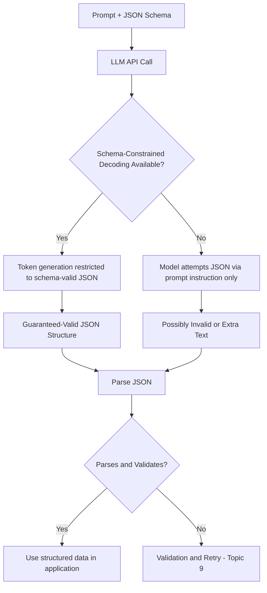

# Structured Output & JSON Schema

## 1. Introduction

Structured output is the practice of getting a language model to respond in a fixed, machine-readable format — almost always JSON — instead of free-flowing prose. A JSON Schema is the formal contract that describes exactly what that JSON must look like: which fields exist, what type each one is, which are required, and what values are allowed. Together, they turn "the model said something reasonable-sounding" into "the model produced data your program can parse, validate, and use directly," which is the difference between a chatbot demo and a real application.

## 2. Why This Topic Exists

If you ask a model "extract the customer's name, order number, and issue from this email" and let it answer in plain prose, you'll get answers shaped differently every time — sometimes a sentence, sometimes a bulleted list, sometimes with extra commentary before or after. Your program can't reliably parse free text like that without writing fragile, ad hoc string-matching code that breaks the moment the model phrases something slightly differently. Structured output exists to close that gap: by explicitly telling the model the exact JSON shape you need (and, on modern APIs, by constraining generation so it *cannot* produce anything else), you get a response your code can load with a standard JSON parser and use immediately — no guesswork, no brittle regexes.

## 3. Core Concept

### Beginner

Instead of asking "tell me about this product" and getting a paragraph, you ask for a specific structure:

```json
{
  "name": "string",
  "price": "number",
  "in_stock": "boolean"
}
```

and the model responds with actual JSON matching that shape:

```json
{ "name": "Wireless Mouse", "price": 19.99, "in_stock": true }
```

Your program can now do `data["price"]` directly instead of trying to find a price hidden somewhere in a sentence.

### Intermediate

A **JSON Schema** is a standardized, more rigorous way to describe that shape — it specifies types, which fields are required, allowed value ranges, enumerations, and nested structures:

```json
{
  "type": "object",
  "properties": {
    "name": { "type": "string" },
    "price": { "type": "number", "minimum": 0 },
    "in_stock": { "type": "boolean" },
    "category": { "type": "string", "enum": ["electronics", "home", "clothing"] }
  },
  "required": ["name", "price", "in_stock"]
}
```

Most modern LLM APIs support passing a JSON Schema directly as part of the request (often called "structured outputs," "response format," or "constrained decoding"). When available, this is far more reliable than simply *asking* the model to produce JSON in the prompt, because the API constrains the token-generation process itself so the output is *guaranteed* to satisfy the schema — the model literally cannot generate a token that would violate the required structure. When that constrained-decoding feature isn't available, the fallback is prompting-based: showing the schema (or an example) in the prompt and asking for JSON output, which is not guaranteed and needs the validation/retry pattern (Topic 9) as a safety net.

### Advanced

There are two distinct mechanisms worth separating clearly:
1. **Prompt-based JSON requests** — you describe the desired JSON in the prompt (possibly with an example). The model tries to comply, but nothing prevents it from adding a stray sentence before the JSON, using the wrong field name, or emitting invalid JSON syntax. This requires parsing defensively and validating afterward.
2. **Constrained/guided decoding (schema-enforced structured outputs)** — the API itself restricts, at each generation step, which tokens are even eligible to be produced, based on the schema's grammar (e.g., after `{"name":`, only a valid JSON string-opening token is allowed). This makes schema-valid output a structural guarantee rather than a hope, though it does **not** guarantee the *values* inside are factually correct or semantically sensible — a syntactically perfect JSON object can still contain a hallucinated price or a wrong customer name. Schema validity and content correctness are two entirely different guarantees.

Schema design itself is an engineering skill: overly permissive schemas (everything optional, everything a generic string) don't constrain the model enough to get consistent data; overly rigid schemas (very deep nesting, many required fields, strict enums that don't cover real-world edge cases) can cause the model to either fail validation often or, when using prompting-only JSON, invent values just to satisfy a required field it doesn't actually have information for. Good schemas mark fields `nullable`/optional when the model may legitimately not have that information, rather than forcing a guess.

## 4. Deep Explanation

Structured output matters because it's the hand-off point between the probabilistic, free-text world of the language model and the deterministic, typed world of ordinary software. Every layer of a real application downstream of the model — a database write, a UI render, a conditional branch in business logic — expects specific fields, specific types, specific formats. Free text forces a fragile, error-prone translation layer (regex, string search, hoping the model used the same phrasing every time). A schema-constrained JSON response removes that translation layer entirely: the model's output *is* already in the exact shape the rest of the program expects.

This is also why structured output is the natural on-ramp to tool/function calling (Topic 10): a tool call is, structurally, just a specific case of structured output — the model produces a JSON object describing which function to call and with what arguments, following a schema you defined for that tool. Everything you learn about designing good JSON Schemas here transfers directly to designing good tool-call argument schemas later this week.

## 5. Step-by-Step Flow

1. **Define what data you actually need** from the model's response (fields, types, which are required vs. optional).
2. **Write a JSON Schema** describing that shape precisely, including types, required fields, and enums/ranges where applicable.
3. **Check whether your model/API supports schema-constrained structured outputs.** If yes, pass the schema directly via the API's structured-output/response-format parameter.
4. **If not natively supported, embed the schema (or a clear example) in the prompt** and explicitly instruct "respond with only valid JSON matching this schema, no extra text."
5. **Parse the response** with a standard JSON parser.
6. **Validate the parsed data** against the schema (types, required fields, ranges) — even schema-constrained outputs should be validated against your application's actual business logic (Topic 9).
7. **Use the validated data** directly in your program — database writes, conditionals, UI rendering, or as input to the next pipeline step (Topic 5).

## 6. Architecture Explanation



## 7. Visual Analogy

Asking for free text is like asking someone to describe a package's contents in a rambling voicemail — you can usually figure out what's inside, but every voicemail is phrased differently and a program can't reliably extract facts from it. Structured output with a JSON Schema is like handing them a printed customs declaration form with labeled boxes for weight, contents, and value: no matter who fills it out, the data lands in the same predictable boxes, and a scanner (your program) can read it directly without needing to understand natural language at all.

## 8. Real Industry Example

Virtually every production LLM feature that feeds a database, a UI, or another system relies on structured output: e-commerce product-description generators emit structured fields (title, bullet points, specs) rather than a single blob of text; support-ticket triage systems have the model emit `{ "category": ..., "priority": ..., "summary": ... }` so the ticketing system can route and prioritize automatically; resume-parsing and invoice-extraction tools define detailed JSON Schemas for names, dates, line items, and totals so the extracted data can flow directly into downstream accounting or HR systems without manual re-entry. Major LLM providers now ship dedicated "structured outputs" / "guided JSON" API features specifically because this pattern is so central to real applications.

## 9. Common Misconceptions

- **"Just asking for JSON in the prompt is the same as schema-constrained output."** Prompting alone is a request the model tries to honor; schema-constrained decoding is an enforced structural guarantee — they have very different reliability profiles.
- **"Valid JSON means correct data."** A schema only guarantees shape and type, never factual accuracy — a perfectly valid JSON object can still contain a hallucinated value.
- **"Schemas should make every field required."** Forcing required fields the model has no real information for often causes it to invent plausible-looking but fabricated values; mark genuinely optional/unknown fields as nullable instead.
- **"You can skip validation once you use structured outputs."** You still need application-level validation (ranges, cross-field consistency, business rules) on top of schema-level shape checking.

## 10. Best Practices

- Prefer native schema-constrained structured outputs over prompt-only JSON requests whenever your API/model supports it.
- Keep schemas as simple and shallow as the task allows — only require fields the model can reliably know.
- Use enums for closed sets of categories rather than free-text strings when the value space is known and small.
- Always parse and validate the response programmatically, even with schema-constrained decoding.
- Design schemas to be reused as the contract for tool/function-calling arguments later in the pipeline.

## 11. Summary

Structured output uses a JSON Schema to define the exact shape of data you need from a language model, converting unpredictable free text into a fixed, machine-parseable format. Where supported, schema-constrained decoding structurally guarantees the output matches the shape; where it isn't, prompting plus post-hoc validation is required. Either way, structured output is the essential hand-off point between a model's probabilistic text generation and the deterministic, typed world of the rest of your application — and the same schema-design skills carry directly into tool/function calling.

## 12. Key Takeaways

- Structured output turns free text into fixed, parseable data — usually JSON — defined by a JSON Schema.
- Schema-constrained decoding structurally guarantees valid shape; prompt-only JSON requests do not.
- Valid shape is not the same guarantee as correct content — hallucination can still occur inside valid JSON.
- Mark unknown/optional fields as nullable rather than forcing the model to fabricate required values.
- Structured output is the foundation both for reliable data pipelines and for tool/function calling.
