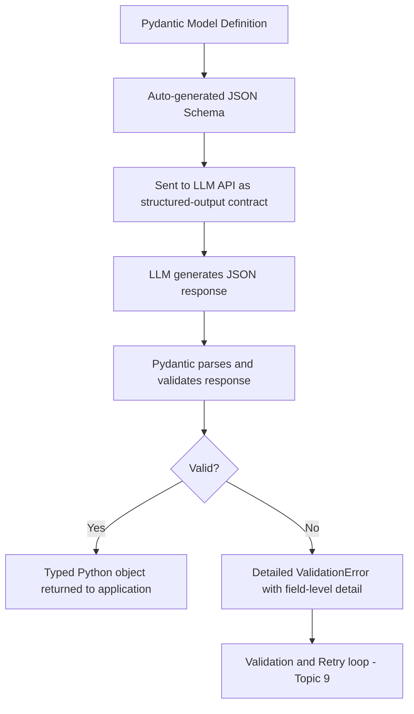

# Pydantic

## 1. Introduction

Pydantic is a Python library for defining data shapes as ordinary Python classes and automatically validating and parsing data against them. Instead of hand-writing a raw JSON Schema and separately writing validation code to check a model's response against it, you define a **Pydantic model** — a Python class with typed fields — and Pydantic generates the schema and performs the validation for you, raising a clear, structured error the moment something doesn't match. It has become the de facto standard for handling structured LLM output in Python applications.

## 2. Why This Topic Exists

Working with raw JSON Schema dictionaries and manually checking types, required fields, and value ranges is tedious and error-prone — you end up rewriting the same validation logic (is this a string? is this number within range? is this field present?) over and over by hand. Pydantic exists to remove that busywork: you describe your data once, as a typed class, and get schema generation, parsing, validation, and clear error messages for free. In the LLM-application context specifically, Pydantic gives you a single source of truth that (a) can be turned into the JSON Schema you send to the model, and (b) is used to validate and parse the model's response back into a real, typed Python object your application code can use with autocomplete and type-checking support.

## 3. Core Concept

### Beginner

A Pydantic model looks like a plain Python class, but each field is annotated with a type:

```python
from pydantic import BaseModel

class Product(BaseModel):
    name: str
    price: float
    in_stock: bool
```

Given a dictionary of data (for example, parsed from a model's JSON response), Pydantic will build a `Product` object and check that `name` really is a string, `price` really is a number, and so on — raising a clear error immediately if something doesn't match, rather than letting bad data silently flow deeper into your program.

### Intermediate

Pydantic supports far more than basic types: optional fields, default values, nested models, lists, enums, and custom validation rules:

```python
from pydantic import BaseModel, Field
from typing import Optional, Literal

class Address(BaseModel):
    city: str
    zip_code: str

class Customer(BaseModel):
    name: str
    email: str
    age: Optional[int] = Field(default=None, ge=0, le=120)
    tier: Literal["free", "pro", "enterprise"]
    address: Address
```

Here, `age` is optional and constrained to a sensible numeric range if present, `tier` is restricted to one of three exact values (equivalent to a JSON Schema enum), and `address` is itself a nested, separately-validated model. Every Pydantic model can also produce its own JSON Schema automatically (`Customer.model_json_schema()`), which is exactly the schema you'd hand to an LLM API's structured-output feature — meaning you define the shape once and reuse it both to constrain the model's generation and to validate/parse its response.

### Advanced

Beyond field types and constraints, Pydantic supports custom validators (functions that run extra checks a plain type annotation can't express, like "the end date must be after the start date," or "this string must match a specific format") and computed/derived fields. In LLM pipelines, this is where business-logic validation (Topic 9) is layered directly onto the same model used for shape validation — instead of validating shape first and business rules separately, you often express both in one Pydantic model, so a single `.model_validate(data)` call catches "wrong type," "missing field," and "violates our business rule" all at once, with one consistent error-reporting mechanism.

Because Pydantic models are just typed Python classes, they also integrate with static type checkers and IDEs — once a model's response is parsed into a `Customer` object, your editor knows `customer.address.city` is a string, and a type checker will catch a typo like `customer.adress` before you even run the code. This is a substantial developer-experience upgrade over working with raw, untyped dictionaries pulled out of a JSON response.

## 4. Deep Explanation

Pydantic sits at exactly the seam described in the Structured Output topic: the model produces a JSON string; that string must become real, typed data your application trusts. Pydantic implements that seam as a single operation: parse the JSON, check every field against its declared type and constraints, and either return a fully validated, typed object or raise a detailed exception describing precisely which field failed and why (e.g., "field 'price': value is not a valid float"). That detailed, structured error is what makes automated retry loops (Topic 9) possible — instead of a program crashing on a vague parsing error, it can catch a specific Pydantic `ValidationError`, read exactly which fields were wrong, and construct a targeted follow-up prompt telling the model precisely what to fix.

Pydantic models also serve double duty as documentation: a well-named, well-typed model like `Customer` with clear field names and constraints tells any engineer reading the code exactly what data the LLM pipeline expects to produce — no separate schema file to keep in sync, since the class definition *is* the schema.

## 5. Step-by-Step Flow

1. **Define a Pydantic model** describing the exact data you want back from the LLM (fields, types, constraints, nested structures).
2. **Generate a JSON Schema from the model** (most Pydantic-integrated LLM libraries do this automatically) and pass it to the model's structured-output API, or embed it in the prompt.
3. **Receive the model's raw JSON response.**
4. **Parse and validate** the response using the Pydantic model (e.g., `Customer.model_validate_json(response_text)`).
5. **On success**, use the resulting typed object directly in your application code.
6. **On failure**, catch the `ValidationError`, inspect which fields failed, and feed that information into a retry step (Topic 9).

## 6. Architecture Explanation



## 7. Visual Analogy

A Pydantic model is like a strict customs inspection form with a checklist built in: every box has a defined type of answer expected (a number here, a date there, one of three checkboxes over there), and the inspector (Pydantic) doesn't just check that boxes are filled in — it checks each answer actually fits its box, and if the weight box has "banana" written in it, the form is rejected on the spot with a note explaining exactly which box is wrong, rather than being accepted and causing confusion three steps later down the line.

## 8. Real Industry Example

Pydantic is used extensively across the Python AI-engineering ecosystem: FastAPI (a widely used Python web framework) uses Pydantic models to validate every incoming API request and outgoing response; LLM orchestration frameworks like LangChain and LlamaIndex use Pydantic models to define structured extraction schemas and tool argument schemas; and the Instructor library (Topic 8) is built entirely around using Pydantic models as the contract for LLM structured outputs, including driving automatic validation-and-retry. Any Python team building a production LLM feature that needs reliable structured data is almost certainly using Pydantic somewhere in that pipeline.

## 9. Common Misconceptions

- **"Pydantic is only for web APIs."** It's a general-purpose data validation and parsing library — its use in LLM pipelines for structured output validation is now one of its most common applications.
- **"Type annotations alone are enough validation."** Type hints in plain Python are not enforced at runtime; Pydantic is what actually checks and enforces them when real data arrives.
- **"A Pydantic model is the same as a plain Python dataclass."** Dataclasses don't validate types or values at runtime by default; Pydantic's core purpose is exactly that runtime validation, plus JSON Schema generation.
- **"Schema validation guarantees the data is factually correct."** As with any structured-output approach, Pydantic guarantees shape and type constraints, not real-world truthfulness of the values.

## 10. Best Practices

- Define one clear Pydantic model per distinct structured output your pipeline needs — treat it as the single source of truth for that data shape.
- Use `Optional`/nullable fields and sensible defaults for anything the model might not always know, rather than forcing every field to be required.
- Add custom validators for business rules that a plain type can't express (date ordering, cross-field consistency).
- Reuse the same model to generate the schema sent to the LLM and to validate the LLM's response, so the two never drift out of sync.
- Catch `ValidationError` explicitly and use its field-level detail to drive automated retries rather than treating any failure as a generic crash.

## 11. Summary

Pydantic lets you define the exact shape of the data you want from an LLM as a typed Python class, then use that same class to both generate a JSON Schema for the model and to parse and validate the model's actual response into a real, typed object. It replaces manual, error-prone validation code with a single declarative model, produces detailed field-level errors that power automated retry logic, and has become the standard contract layer between LLM output and Python application code.

## 12. Key Takeaways

- Pydantic models are typed Python classes that double as schema definitions and runtime validators.
- One model can both generate the JSON Schema sent to the LLM and validate/parse its response.
- Validation failures produce detailed, field-level errors — the foundation for automated retry loops.
- Type annotations alone don't validate anything at runtime; Pydantic is what enforces them.
- Pydantic is the standard structured-output contract layer across the Python LLM tooling ecosystem (FastAPI, LangChain, Instructor, and more).
