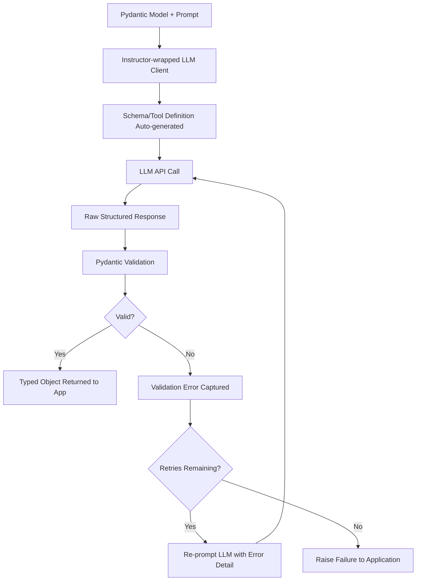

# Instructor Library

## 1. Introduction

Instructor is a Python library that wraps LLM API calls so that you can ask for a response directly as a Pydantic model, rather than as raw text or raw JSON you have to parse and validate yourself. You pass it the Pydantic model you want back; Instructor handles turning that model into the right schema/tool definition for the underlying API, sending the request, parsing the response, validating it, and — critically — automatically retrying with the model if validation fails, feeding the validation error back into a follow-up request so the model can correct itself.

## 2. Why This Topic Exists

Structured output (Topic 6) and Pydantic (Topic 7) give you the pieces — a schema and a validator — but wiring them together correctly, across different LLM providers' slightly different APIs, and adding a robust retry loop on top, is a repetitive engineering task that nearly every LLM application ends up rebuilding from scratch. Instructor exists to standardize and package that pattern: "give me back data shaped like this Pydantic model, and if the first attempt doesn't validate, automatically retry with the model told exactly what went wrong" — so application developers write a Pydantic model and a prompt, and get validated, typed data back, without hand-rolling the parse-validate-retry plumbing every time.

## 3. Core Concept

### Beginner

Without Instructor, using a Pydantic model with an LLM typically means: build a JSON Schema from the model, send it to the API, get back a JSON string, try to parse it, try to validate it, and write your own retry code if it fails. With Instructor, this collapses to roughly:

```python
import instructor
from pydantic import BaseModel

class Order(BaseModel):
    order_id: str
    total: float

client = instructor.from_provider("openai/gpt-4o")
order = client.chat.completions.create(
    response_model=Order,
    messages=[{"role": "user", "content": "Order #A123, total $45.20"}],
)
# `order` is already a validated Order instance, not raw text
```

The `response_model=Order` argument is the key idea: you're telling the library the shape you want, and it hands you back a real, validated object.

### Intermediate

Instructor's retry behavior is its most valuable feature. When the model's response fails Pydantic validation (wrong type, missing required field, a custom validator rejecting a value), Instructor doesn't just raise an error and stop — it can automatically construct a new request that includes the original response, the specific validation error message, and an instruction to correct it, then re-send that to the model. This loop can repeat for a configurable number of attempts (`max_retries`), and because the error message is specific ("field 'total' must be a positive number, got -45.20"), the model usually has enough information to fix its own mistake on the next attempt — far more effective than blindly re-asking the same question.

Instructor also supports streaming partial structured objects, extracting multiple objects from one response (e.g., a list of extracted line items), and works across multiple LLM providers (OpenAI, Anthropic, and others) through one consistent interface, so switching providers doesn't require rewriting your structured-output logic.

### Advanced

Under the hood, Instructor typically leverages the underlying provider's native tool/function-calling or structured-output feature (Topics 6 and 10) rather than relying purely on prompt-based JSON requests — it generates a schema-shaped tool definition from your Pydantic model and asks the model to "call" it, then intercepts that structured tool-call payload and validates it directly against the same Pydantic model. This means Instructor is best understood as a convenience and standardization layer over the schema-constrained mechanisms already provided by modern LLM APIs, plus a validation-and-retry orchestration loop on top — not a fundamentally new capability of the model itself.

Because retries cost additional tokens and latency (each retry is a full extra round trip to the model, including the context of the previous failed attempt), production systems using Instructor typically cap `max_retries` at a small number (2–3) and log or alert when retries are exhausted, treating a persistent validation failure as a signal that the prompt, schema, or task itself needs redesigning — not something to retry indefinitely.

## 4. Deep Explanation

Instructor formalizes the "define-request-validate-retry" cycle that nearly every serious LLM application needs, into a single reusable abstraction. Its value isn't a new capability so much as removing an enormous amount of repetitive glue code: manually building tool/schema definitions from your data classes, manually parsing tool-call arguments back out of API responses, manually catching validation errors, and manually re-prompting with the specific error — each provider's API has its own slightly different shape for all of this, and Instructor normalizes it behind one interface built around Pydantic, which most Python developers already use for exactly this kind of data contract.

This connects directly back to Validation and Retry (Topic 9) as a general pattern: Instructor is essentially a ready-made, battle-tested implementation of that pattern, specialized for structured LLM output, so most teams reach for it rather than reimplementing the same retry loop by hand for every project.

## 5. Step-by-Step Flow

1. **Define a Pydantic model** for the exact data you want extracted or generated.
2. **Wrap your LLM client** with Instructor's patch/`from_provider` helper.
3. **Call the chat/completion method** with `response_model` set to your Pydantic model, plus your prompt/messages.
4. **Instructor builds the schema** from your model and sends the request using the provider's structured-output or tool-calling mechanism.
5. **Instructor parses and validates** the returned data against your Pydantic model.
6. **If validation fails**, Instructor automatically retries, feeding the specific validation error back to the model, up to a configured retry limit.
7. **On success**, your code receives a fully validated, typed Pydantic object ready to use.
8. **On exhausted retries**, handle the failure explicitly (log, alert, fall back to a default, or escalate) rather than silently ignoring it.

## 6. Architecture Explanation



## 7. Visual Analogy

Using raw JSON Schema and Pydantic separately is like manually filling out a customs form, personally checking every box against the rules, and if something's wrong, personally writing a note back to the sender explaining exactly what to fix, then waiting for a corrected form. Instructor is like having an assistant who does all of that automatically: hands the sender the form, checks it the moment it comes back, and if there's an error, immediately writes the correction request and resubmits — you only get involved once a fully correct form arrives, or after a few failed attempts.

## 8. Real Industry Example

Instructor has become a common choice for teams building data-extraction features on top of LLMs — pulling structured fields out of resumes, invoices, support tickets, or emails — precisely because it removes the need to hand-write retry logic for the (fairly common) cases where a model's first attempt has a wrong type or a missing field. It's also frequently used as the structured-output layer underneath custom tool-calling agents, since defining a tool's arguments as a Pydantic model and getting a validated instance back is exactly the same problem as defining any other structured extraction task.

## 9. Common Misconceptions

- **"Instructor is a different kind of AI model."** It's a client-side library/wrapper around existing LLM APIs — it adds no new model capability, only structure, validation, and retry orchestration.
- **"Instructor eliminates the need to design a good schema."** A poorly designed Pydantic model (ambiguous fields, unrealistic required fields) will still cause frequent validation failures and wasted retries — good schema design still matters.
- **"Retries are unlimited and free."** Retries consume additional tokens, cost, and latency; production use always caps retries and handles the exhausted-retry case explicitly.
- **"It only works with OpenAI."** Instructor is designed to work across multiple LLM providers through one consistent interface.

## 10. Best Practices

- Design your Pydantic models thoughtfully (Topic 7's best practices) — Instructor amplifies good schema design, it doesn't replace it.
- Set a small, sensible `max_retries` (commonly 2–3) and always handle the exhausted-retry case explicitly.
- Log validation failures during development to spot systematic schema or prompt issues, not just isolated one-off mistakes.
- Prefer Instructor (or an equivalent validated-structured-output library) over hand-rolled parse/validate/retry code for anything beyond a quick prototype.
- Keep the underlying prompt clear and well-scoped even though Instructor handles the schema plumbing — garbage instructions still produce garbage extractions.

## 11. Summary

Instructor is a library that lets you request LLM output directly as a validated Pydantic model, handling schema generation, response parsing, validation, and automatic error-driven retries behind one consistent interface across multiple providers. It packages the validation-and-retry pattern that most production LLM applications need into a reusable tool, so developers can focus on defining good data models and prompts rather than rebuilding the same structured-output plumbing from scratch every time.

## 12. Key Takeaways

- Instructor lets you request LLM responses directly as validated Pydantic model instances via `response_model`.
- It automatically retries failed validations by feeding the specific error back to the model.
- It builds on providers' native structured-output/tool-calling mechanisms rather than inventing a new model capability.
- Retries are not free or unlimited — cap them and handle exhaustion explicitly.
- It standardizes the parse-validate-retry pattern across multiple LLM providers behind one interface.
