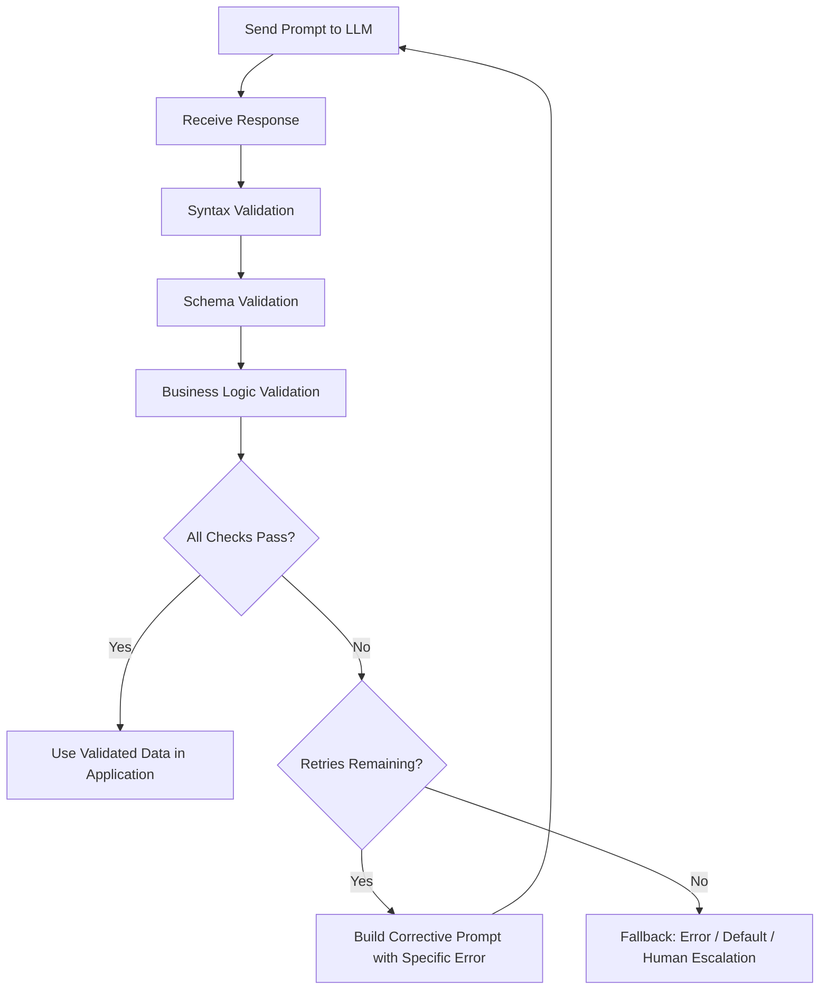

# Validation and Retry

## 1. Introduction

Validation-and-retry is the general pattern of checking a model's output against explicit rules — schema shape, value ranges, business logic, factual constraints your code can check — and, when it fails, automatically asking the model to correct itself, with specific feedback about what was wrong, before giving up or falling back to something safe. It's the safety net that makes structured output (Topic 6), Pydantic (Topic 7), and Instructor (Topic 8) actually trustworthy in production, rather than merely "usually right."

## 2. Why This Topic Exists

No structured-output mechanism, however good, guarantees a perfect result every time: schema-constrained decoding guarantees shape but not correctness; the model can still leave a field empty, return an out-of-range number, contradict itself across fields, or occasionally violate the schema on providers/models without strict enforcement. If your application simply trusts the first response blindly, invalid or nonsensical data flows straight into your database, your UI, or a real-world action — silently corrupting downstream systems. Validation-and-retry exists because catching problems immediately, close to the source, and giving the model a targeted chance to fix them is far cheaper and safer than discovering the problem later, or shipping bad data.

## 3. Core Concept

### Beginner

The pattern has three steps: (1) get a response from the model, (2) check it against rules you define, (3) if it fails, tell the model specifically what was wrong and ask it to try again — repeating a limited number of times before giving up. This is the same instinct as a teacher handing back an assignment with "question 3 is wrong, please redo just that part," rather than silently accepting whatever was submitted, or throwing out the entire assignment over one small mistake.

### Intermediate

Validation happens at multiple layers, each catching different kinds of problems:
- **Syntax validation** — is this even valid JSON? Can it be parsed at all?
- **Schema validation** — do the types match, are required fields present, do values respect declared constraints (ranges, enums)? This is what Pydantic (Topic 7) automates.
- **Business-logic validation** — do the values make sense together in your domain, even if each one is individually well-typed? (e.g., "end_date must be after start_date," "discount_percent plus tax_percent must not exceed 100," "the referenced order_id must actually exist in our system.")
- **Grounding/factual validation** — for tasks like summarization or extraction from a source document, does the claimed value actually appear in (or follow from) the source text, rather than being invented?

A retry loop typically works like this: run the request, validate, and if it fails, construct a new prompt that includes the original (invalid) response, the specific error ("field 'total' must be positive, got -12.50"), and an instruction to fix just that problem — then send it again, up to a small maximum number of attempts (commonly 2–3). Specific, targeted error feedback dramatically outperforms simply re-asking the original question again, because the model can see exactly what needs to change rather than guessing at what went wrong.

### Advanced

Retry design has to account for failure modes beyond a single bad field: **partial success** (some fields are valid, some aren't — decide whether to retry the whole object or only regenerate the failing fields), **persistent failure** (the model keeps making the same mistake across all retry attempts, which usually signals an ambiguous schema, an impossible request, or a genuine task the model can't do reliably — not something more retries will fix), and **silent schema satisfaction with wrong content** (the response is perfectly valid JSON and passes every check, but the underlying value is still hallucinated or wrong — schema and business-rule validation cannot catch a fabricated fact that happens to be plausible and well-typed).

A mature retry strategy sets a hard cap on attempts, uses **exponential backoff** for transient infrastructure failures (rate limits, timeouts) as distinct from validation failures (which should retry immediately with corrective feedback, not wait), and has an explicit, well-defined **fallback path** for when retries are exhausted — returning a clear error to the caller, falling back to a safe default, or routing to a human — rather than looping forever or silently passing through invalid data. Observability matters too: logging every validation failure (not just final successes) is often the single best signal for noticing that a prompt or schema needs to be redesigned, since a spike in a specific validation error is a direct, actionable engineering signal.

## 4. Deep Explanation

Validation-and-retry exists at the boundary between a probabilistic system (the model) and the deterministic guarantees real software needs. No matter how well-designed a prompt or schema is, a language model remains a system that produces its most probable output, not a system that is contractually bound to be correct. Treating every response as "probably fine" without a check is an availability and correctness risk; treating every response as "must be perfect on the first try or the whole request fails" is brittle and throws away easily recoverable mistakes. Validation-and-retry is the middle path: assume the first attempt might be wrong, check cheaply and immediately, and use the model's own ability to self-correct when given specific, structured feedback — which models are generally quite good at, since "here's exactly what's wrong, fix it" is a much easier task than the original open-ended generation.

This pattern is also what makes structured-output pipelines composable and safe to chain (Topic 5's task decomposition): each step in a pipeline can validate its own output before handing it to the next step, so an early, small error gets caught and corrected right where it happened instead of silently corrupting every downstream stage.

## 5. Step-by-Step Flow

1. **Define validation rules** at every relevant layer: syntax, schema/type, business logic, and (where feasible) grounding against a source.
2. **Send the request** to the model and receive its response.
3. **Run validation** against all defined rules.
4. **If valid**, use the response immediately.
5. **If invalid**, construct a targeted follow-up prompt containing the specific validation error(s) and the original response, asking the model to correct only what's wrong.
6. **Re-send and re-validate**, repeating up to a small maximum retry count.
7. **If retries are exhausted**, trigger an explicit fallback: return an error, use a safe default, or escalate to a human — never silently pass through unvalidated data.
8. **Log every failure**, successful or not, to catch systemic prompt/schema issues over time.

## 6. Architecture Explanation

## 7. Visual Analogy

Validation-and-retry is like a manager reviewing a draft report: instead of either publishing every draft unread or rejecting the whole report outright over one wrong figure, the manager circles the specific error ("this total doesn't match the line items") and hands it back for a targeted fix. After a couple of rounds of this focused back-and-forth, if the same mistake keeps recurring, the manager stops asking for more redrafts and instead escalates — recognizing that more attempts at the same instructions won't solve a deeper problem.

## 8. Real Industry Example

Data-extraction products (invoice processing, resume parsing, form digitization) rely heavily on validation-and-retry: extracted totals are checked against the sum of line items, dates are checked for plausible ranges, and referenced IDs are checked against real records in the customer's system — with a small number of automatic correction attempts before a document is flagged for manual review. Coding agents apply the same pattern at the level of generated code: after generating a change, they run tests or a linter (the "validation" step), and if it fails, feed the specific error message back to the model for a targeted fix, repeating a bounded number of times before surfacing the failure to a human.

## 9. Common Misconceptions

- **"Passing schema validation means the data is correct."** Schema validation only checks shape and type — it cannot catch a plausible-looking hallucinated value.
- **"More retries is always safer."** Persistent failures across multiple retries usually signal a design problem (ambiguous schema, impossible task) that more attempts won't fix — and retries have real cost and latency.
- **"Retry the whole pipeline on any failure."** Where possible, retry only the specific failing step or field, not the entire multi-step process, to save cost and reduce compounding risk.
- **"Validation is only needed for user-facing output."** Internal pipeline steps that feed other automated systems need just as much validation as anything shown to a human — arguably more, since there's no human catching the error downstream.

## 10. Best Practices

- Validate at every layer: syntax, schema/type, business logic, and grounding where feasible.
- Give the model specific, targeted error feedback on retry rather than just repeating the original request.
- Cap retries at a small number (2–3) and always define an explicit fallback for exhausted retries.
- Distinguish transient infrastructure failures (retry with backoff) from validation failures (retry with corrective feedback).
- Log every validation failure, not just final outcomes, to catch systemic prompt or schema issues early.

## 11. Summary

Validation-and-retry is the safety-net pattern that makes LLM-generated structured output trustworthy in production: check the model's response against syntax, schema, and business-logic rules, and when it fails, give the model specific corrective feedback and a bounded number of chances to fix it before falling back to a safe, explicit alternative. It acknowledges that a language model's output is probabilistic, not contractually guaranteed, and builds a deliberate, observable correction loop around that reality instead of either blindly trusting or brittly rejecting every response.

## 12. Key Takeaways

- Validation happens at multiple layers: syntax, schema/type, business logic, and grounding/factual checks.
- Retry with specific, targeted error feedback is far more effective than blindly re-asking the same question.
- Retries must be bounded, with an explicit fallback path (error, default, human escalation) when exhausted.
- Schema-valid output is not the same guarantee as factually correct output — both matter, and neither replaces the other.
- Logging every validation failure is a key engineering signal for spotting systemic prompt or schema problems.
