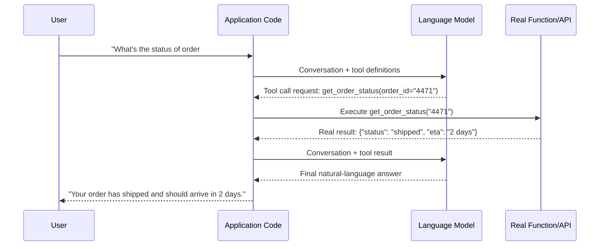

# Tool / Function Calling

## 1. Introduction

Tool calling (also called function calling) is the mechanism that lets a language model request that your program run a specific function — look up an order, query a database, call a weather API, do a precise calculation — and then use that function's result to continue answering. The critical thing to understand is that the model never executes any code itself: it only ever outputs structured data saying "please call this function with these arguments." Your application reads that request, actually runs the function, and sends the result back to the model as more context. The model asks; your code does the work.

## 2. Why This Topic Exists

Language models are pure text predictors — they have no live access to today's date, a customer's real order history, a company's internal database, or a calculator's guaranteed arithmetic. Left alone, a model asked "what's the status of order #4471?" can only guess or hallucinate a plausible-sounding answer, because it has no channel to real, current data. Tool calling exists to close that gap without retraining or fundamentally changing the model: you describe a small set of functions the model is allowed to request, the model decides *when* one is needed and *what arguments* to pass, and your code supplies the real, verified answer back into the conversation — turning a model that can only pattern-match on training data into a system that can act on live, accurate, external information.

## 3. Core Concept

### Beginner

Imagine giving the model a menu of available "tools" it can ask you to use, each with a name, a description, and a list of parameters — for example, a `get_order_status(order_id: string)` tool. When the model determines it needs order information to answer, instead of writing a normal text reply, it outputs something like `{"tool": "get_order_status", "arguments": {"order_id": "4471"}}`. Your program sees this, actually looks up order 4471 in the real database, and sends the real result back to the model, which then uses that real data to write its final answer to the user.

### Intermediate

The full round trip has four parts:
1. **Tool definition** — you describe each available tool to the model as a schema (name, description, parameter types) — structurally identical to the JSON Schemas from Topic 6, since tool arguments are just another structured-output contract.
2. **Tool call request** — given a user message, the model decides (based on the tool descriptions) whether a tool is needed, and if so, emits a structured tool-call object naming the tool and its arguments, instead of a plain-text answer.
3. **Tool execution** — your application code, not the model, parses that request and actually runs the corresponding real function (an API call, a database query, a calculation).
4. **Tool result injection** — your code sends the function's real return value back to the model as a new message in the conversation, and the model generates its final natural-language response using that real data.

Multiple tools can be defined at once (e.g., `get_order_status`, `get_shipping_estimate`, `issue_refund`), and the model chooses which one(s) to call — and with what arguments — based purely on the conversation and the tool descriptions you wrote. Writing a clear, precise tool description (what it does, when to use it, what each parameter means) is just as important as writing a good prompt, because the model's decision of *whether and how* to call a tool depends entirely on how well that tool is described.

### Advanced

Tool calling is implemented via the same schema-constrained mechanisms as structured output: the tool's parameter schema is passed to the API, and the model's output for a tool call is generation constrained to match that schema, guaranteeing syntactically valid arguments (though, as always, not guaranteeing the arguments are the *right* choice for the situation). Some tool-call decisions are trivially correct (a clearly named lookup tool for a clearly relevant question); others require the model to reason about ambiguous situations — whether a tool is needed at all, which of several similar tools fits best, or how to fill a required parameter the user didn't explicitly state, which is where prompt quality, tool description quality, and sometimes chain-of-thought (asking the model to reason about which tool to use before committing to a call) all interact.

Tool calling is also the exact mechanism underlying "agents" (Week 7): an agent loop is simply a program that repeats "let the model decide on a tool call, execute it, feed back the result" multiple times in sequence, allowing the model to chain several real actions together (look up the order, then check the shipping carrier's API, then decide whether to issue a refund) to accomplish a larger goal — rather than a single request/response/tool-call/response cycle. Understanding the single-call version thoroughly here is what makes the multi-step agent loop later straightforward rather than mysterious. Security matters too: because tool calls can trigger real, sometimes irreversible actions (issuing a refund, sending an email, deleting a record), the trust boundary around which tools a model can call, with what permissions, and whether any need human confirmation before executing, is a first-class design decision — not an afterthought (see Guardrails, Topic 12, and Prompt Injection, Topic 13).

## 4. Deep Explanation

The core insight is a strict separation of responsibilities: the model is responsible for *deciding* what action would help and *what arguments* that action needs, based entirely on patterns learned during training about tool-use behavior; your application code is responsible for *actually performing* that action against real systems and *guaranteeing* its correctness and safety. The model never gets direct access to your database, your filesystem, or any live API — it only ever produces text (structured as a tool-call request), and everything that actually touches the real world happens in code you wrote and control. This means tool calling doesn't grant the model any new capability by itself — it grants your *application* a structured, reliable way to let the model tell it what to do next, while your code retains full control over what's actually allowed to happen.

This is why a tool definition is best understood as a contract, much like the JSON Schemas and Pydantic models from earlier topics: a clear name, an unambiguous description of purpose and constraints, and precisely typed parameters directly determine how reliably the model selects and fills in the tool correctly. A vaguely named or poorly described tool (`do_thing(x)`) will be used inconsistently or incorrectly no matter how good the underlying model is, in exactly the same way a vague prompt produces inconsistent answers.

## 5. Step-by-Step Flow

1. **Identify real actions the model should be able to trigger** (a lookup, a calculation, an external API call) that it cannot do from text alone.
2. **Define each tool as a schema**: a clear name, a precise natural-language description of what it does and when to use it, and typed parameters.
3. **Send the tool definitions along with the conversation** to the model's API.
4. **The model decides** whether a tool call is needed and, if so, emits a structured tool-call request (tool name + arguments) instead of a plain-text reply.
5. **Your application parses the tool-call request**, validates the arguments, and executes the real corresponding function.
6. **Your application sends the function's real result** back to the model as a new message in the conversation.
7. **The model generates its final response** to the user, now grounded in the real data returned by the tool.
8. **Repeat** if the model requests another tool call before it has enough information to answer (this repeated loop is the basis of agentic systems, Week 7).

## 6. Architecture Explanation

## 7. Visual Analogy

Tool calling is like a doctor who can order lab tests but never draws the blood or runs the equipment themselves. The doctor (the model) decides *which* test is needed and writes an order for it (the tool call); a technician (your application code) actually performs the test using real equipment and hands back a real, verified result (the tool result); only then does the doctor interpret that result and explain it to the patient (the final response). The doctor's judgment about *which* test to order is valuable, but the actual physical measurement always comes from real equipment operated by someone else.

## 8. Real Industry Example

Customer-support AI assistants at companies like airlines, banks, and e-commerce platforms use tool calling to connect a conversational model to real backend systems: a `check_order_status`, `get_account_balance`, or `check_flight_availability` tool lets the assistant answer with real, live data instead of guessing. Coding assistants (including tools like Claude Code itself) use the same mechanism to read files, run shell commands, and search code — the model requests an action via a structured tool call, and the surrounding application executes it and reports back the real result, with the application layer enforcing exactly which actions are permitted and under what safety constraints.

## 9. Common Misconceptions

- **"The model runs the code itself."** It never does — it only emits a structured request; your application is solely responsible for execution.
- **"Tool calling makes the model smarter at everything."** It only helps for tasks that genuinely require external, real, or precise information/action — it doesn't improve the model's general reasoning.
- **"Any tool description will work equally well."** Vague or ambiguous tool names/descriptions lead to inconsistent or incorrect tool selection, just as vague prompts lead to inconsistent answers.
- **"Tool calls are automatically safe to execute."** Your application must independently validate arguments and enforce permissions before executing any tool, especially for actions with real-world side effects (see Guardrails, Topic 12).

## 10. Best Practices

- Write clear, specific tool names and descriptions — describe exactly what the tool does and when it should (and shouldn't) be used.
- Keep each tool narrowly scoped to one clear responsibility, rather than one giant multipurpose tool.
- Validate tool-call arguments in your application before executing anything, exactly as you would validate any structured output.
- Require explicit confirmation (human-in-the-loop) for tools with irreversible or high-stakes side effects (refunds, deletions, financial transactions).
- Log every tool call and its result for debugging, auditing, and detecting misuse or repeated failures.

## 11. Summary

Tool/function calling lets a language model request a real action from your application by emitting a structured description of which function to call and with what arguments — the model decides, but your code always performs the actual execution and controls what's permitted. This closes the gap between a model's static, text-only training data and the need for live data or real-world actions, and is the foundational mechanism behind agentic systems, which simply repeat this request-execute-respond cycle multiple times to accomplish larger, multi-step goals.

## 12. Key Takeaways

- The model only ever requests a tool call as structured data — it never executes code itself.
- A tool definition is a contract (name, description, typed parameters), just like a JSON Schema — clarity directly drives correct tool selection.
- Your application must validate and execute tool calls, enforcing whatever permissions and safety checks are appropriate.
- Tool calling closes the gap between a model's frozen training knowledge and the need for live data or real actions.
- Repeating the tool-call cycle multiple times in sequence is the foundation of agent loops (Week 7).
