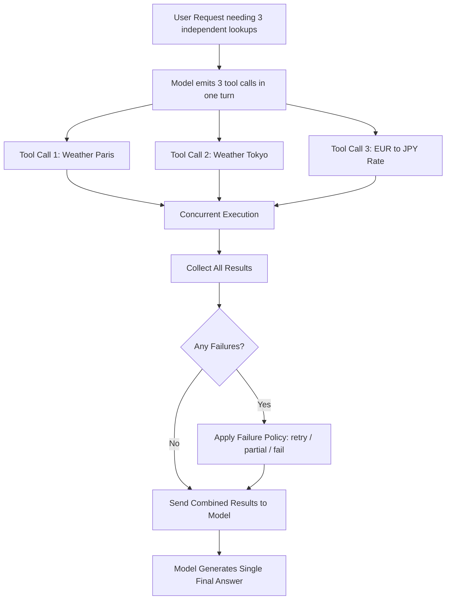

# Parallel Tool Calls

## 1. Introduction

Parallel tool calling is the ability for a model to request *multiple independent tool calls in a single turn*, instead of requesting one tool, waiting for its result, then deciding on the next one. When a user asks "what's the weather in Paris and Tokyo, and what's the exchange rate for EUR to JPY?", a model capable of parallel tool calls can emit all three independent tool-call requests at once — your application executes them concurrently, and all three results are fed back together — rather than the model and application ping-ponging through three separate, sequential round trips.

## 2. Why This Topic Exists

Sequential tool calling forces every independent lookup to wait its turn, even when there's no actual dependency between them — checking the weather in Paris has nothing to do with checking the weather in Tokyo, yet a purely sequential loop would still do them one after another, tripling the round-trip latency for no real reason. Parallel tool calls exist to remove that artificial serialization: when the model recognizes that several needed pieces of information are independent of each other, it can request them all in one turn, letting your application fan them out concurrently and cutting total wait time roughly to the length of the *slowest* single call, instead of the *sum* of all of them.

## 3. Core Concept

### Beginner

Instead of the model asking for one tool, getting the answer, then asking for the next tool, and so on, parallel tool calling lets it say, in one turn, "please run these three tool calls," listing all of them together. Your program runs all three (for example, using concurrent requests rather than one after another), collects all three results, and sends all of them back to the model together so it can write one final answer using all the information at once.

### Intermediate

Whether parallel tool calls are even useful for a given request depends entirely on **dependency structure**: if tool call B needs the result of tool call A as one of its inputs (e.g., "look up the customer's account, then use their account ID to fetch their orders"), those two calls are sequential by necessity and cannot be parallelized — the model won't (and shouldn't) request them together. Parallel tool calls only apply to genuinely **independent** subtasks, which makes this the tool-calling counterpart to the parallel branch of task decomposition (Topic 5)'s fan-out/fan-in pattern: identical reasoning, applied to real actions instead of just reasoning steps.

On the application side, supporting parallel tool calls means your code must be able to execute multiple functions concurrently (e.g., using async/await or a thread/task pool), handle partial failures gracefully (what happens if 2 of 3 parallel calls succeed but one errors?), and correctly match each result back to its corresponding tool-call request before sending all results back to the model in one combined follow-up message.

### Advanced

Not every model or API version supports requesting multiple tool calls in a single turn — this is a specific capability that has to be checked for and enabled, and even when supported, the model still has to correctly recognize *when* several needed calls are independent versus dependent, which is itself a non-trivial judgment the model can get wrong (incorrectly parallelizing calls that actually had a hidden dependency, or failing to parallelize calls that were genuinely independent). Well-written, precise tool descriptions (Topic 10) reduce this kind of misjudgment, the same way clear prompts reduce ambiguity elsewhere.

Operationally, parallel tool calls introduce failure-handling complexity that sequential calling doesn't have: a partial failure (one of several concurrent calls errors or times out) needs an explicit policy — retry just the failed call, proceed with partial results and flag the gap to the model, or fail the whole turn — and rate limits on external APIs being fanned out to concurrently need to be respected (e.g., throttling concurrency, not blindly firing all requests at once if the downstream system can't handle the burst). Idempotency also matters more here than in the sequential case: if a parallel batch partially fails and is retried, calls that already succeeded and had side effects (e.g., an action that isn't just a read) must not be blindly re-executed.

## 4. Deep Explanation

The performance case for parallel tool calls is straightforward queuing-theory logic: sequential execution of N independent calls, each taking roughly T time, costs roughly N×T total latency; concurrent execution of the same N independent calls costs roughly max(T) — the time of the single slowest call — plus some small overhead for coordination. For a user-facing chat assistant needing three or four independent lookups to answer one question, this is the difference between a multi-second wait and a near-instant one.

The correctness case is subtler: parallelism is only valid when calls are truly independent. If the model (or a naive implementation) parallelizes calls that actually have a hidden ordering dependency — for example, calling `charge_customer` and `apply_discount_code` concurrently when the discount must be validated and applied *before* the charge is calculated — the result can be silently wrong in a way that's much harder to notice than an outright error, because each individual call may succeed on its own while the combined outcome is incorrect. This is why dependency analysis (deciding what *can* run in parallel versus what *must* run in sequence) is a design responsibility that sits partly with how you describe your tools and partly with how your application code validates and orders execution, not something to hand over uncritically to the model's judgment alone for high-stakes actions.

## 5. Step-by-Step Flow

1. **Identify a request that needs multiple pieces of independent information or independent actions.**
2. **The model evaluates dependencies** between the possible tool calls needed to answer.
3. **For independent calls, the model emits multiple tool-call requests in one turn** rather than one at a time.
4. **Your application receives the batch of tool-call requests** and validates each one's arguments.
5. **Your application executes the independent calls concurrently** (e.g., async/parallel execution), respecting any rate limits on downstream systems.
6. **Your application collects all results**, handling any partial failures according to a defined policy (retry, partial-result flagging, or full failure).
7. **All results are sent back to the model together** in one follow-up message.
8. **The model generates a single final response** synthesizing all the returned information.

## 6. Architecture Explanation

## 7. Visual Analogy

Sequential tool calling is like a single waiter taking one table's drink order, walking it to the bar, waiting for it, delivering it, and only then moving to the next table. Parallel tool calling is like that same waiter dropping off three separate drink orders at the bar at once and having three drinks being made concurrently, then collecting all three when they're ready — as long as none of the drinks depend on ingredients from one of the others being finished first. If one drink genuinely required another to be made first (a cocktail that uses a simple syrup another drink is producing as a byproduct), that dependency would force at least part of the process back into sequence.

## 8. Real Industry Example

Travel-booking and trip-planning assistants commonly need several independent lookups to answer one query — flight prices, hotel availability, weather forecasts, currency conversion — and use parallel tool calls specifically to keep response latency low despite needing multiple external API calls. Coding agents use the same pattern when a task requires reading several unrelated files or running several independent checks (e.g., running a linter and a test suite that don't depend on each other) — firing them concurrently rather than serially to reduce the total time a developer waits for a response.

## 9. Common Misconceptions

- **"Parallel tool calls are always faster and safe to use."** They're only valid, and only actually help, when the calls are genuinely independent — otherwise you risk silently incorrect results from a hidden ordering dependency.
- **"The model always gets the dependency analysis right."** Models can misjudge independence, especially for subtle domain-specific dependencies; well-scoped tool descriptions and application-level checks reduce but don't eliminate this risk.
- **"Partial failure is rare enough to ignore."** Any system fanning out to multiple external calls needs an explicit, tested policy for partial failure — it's a normal, expected case, not an edge case.
- **"Parallelism is just an application-side implementation detail."** It also requires the model itself to support emitting multiple tool calls per turn — a specific capability, not a given for every model/API version.

## 10. Best Practices

- Only rely on parallel tool calls for genuinely independent subtasks; keep dependent calls sequential.
- Design tool descriptions clearly enough that the model can reliably recognize independence versus dependency.
- Implement explicit partial-failure handling (retry, partial-result flagging, or full failure) rather than assuming all concurrent calls will succeed together.
- Respect rate limits and concurrency limits of downstream systems when fanning out real calls.
- Ensure any tool with real side effects is idempotent or otherwise safe to potentially retry after a partial batch failure.

## 11. Summary

Parallel tool calling lets a model request multiple independent tool calls in a single turn, allowing your application to execute them concurrently and cut total latency down to roughly the slowest single call instead of the sum of all of them. It only applies validly to genuinely independent subtasks — dependency misjudgment or careless partial-failure handling can turn a latency optimization into a source of silent correctness bugs, so it requires deliberate design on both the tool-description side and the application's concurrent-execution side.

## 12. Key Takeaways

- Parallel tool calls let a model request several independent actions in one turn instead of one at a time.
- The latency benefit comes from concurrent execution: roughly max(T) instead of sum(T) for N independent calls.
- Parallelism is only valid for genuinely independent subtasks — hidden dependencies can cause silently wrong results.
- Applications must handle partial failures explicitly and respect downstream rate limits when executing concurrently.
- Clear, well-scoped tool descriptions help the model correctly judge which calls are safe to parallelize.
