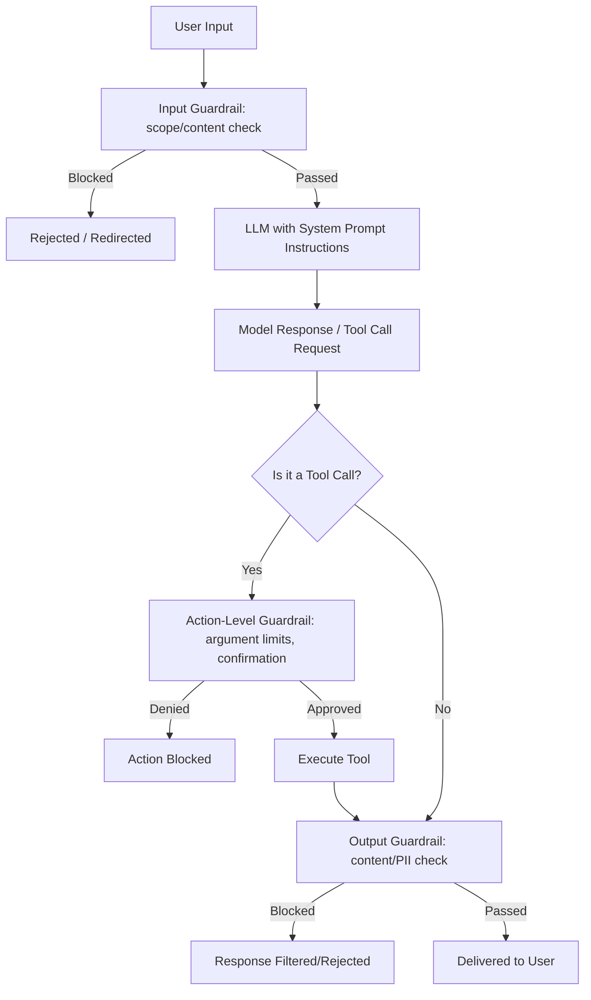

# Guardrails

## 1. Introduction

Guardrails are the layer of checks, constraints, and safeguards wrapped around an LLM-powered system to keep its behavior within acceptable bounds — refusing to discuss disallowed topics, catching unsafe or policy-violating content before it reaches a user, preventing a tool call with dangerous arguments from executing, and generally ensuring the system does what it's supposed to do and nothing else. They exist at multiple points: inside the prompt itself, as separate input/output checks in code, and as hard limits on what actions a system is allowed to take.

## 2. Why This Topic Exists

A language model's behavior is shaped by probability, not by hard rules — instructing it in a system prompt "never discuss competitor pricing" makes that behavior *likely*, not *guaranteed*. As soon as an LLM system is exposed to real users, real inputs, or real actions (tool calls with side effects), the gap between "usually behaves" and "always behaves within acceptable bounds" becomes a genuine business and safety risk: a customer-support bot that occasionally reveals internal data, an agent that occasionally issues an unauthorized refund, or an assistant that occasionally produces offensive content, are all failures that "the prompt said not to do that" doesn't actually prevent on its own. Guardrails exist to add deterministic, code-level enforcement around the probabilistic model, so the *system* as a whole has real guarantees the model alone cannot provide.

## 3. Core Concept

### Beginner

Think of guardrails as a set of independent checkpoints layered around the model: before a user's message even reaches the model (input guardrails — blocking obviously disallowed requests), and after the model responds but before that response reaches the user or triggers an action (output guardrails — catching unsafe content, PII leaks, or dangerous tool-call arguments). None of these checkpoints rely on the model "deciding" to be safe — they're separate code that inspects and, if necessary, blocks or modifies what passes through.

### Intermediate

Guardrails commonly cover:
- **Topic/scope boundaries** — keeping a system focused on its intended purpose (e.g., a banking assistant should refuse to answer unrelated medical questions), often enforced by a combination of system-prompt instructions and a classifier or rule-based check on the user's input.
- **Content safety** — blocking or filtering hate speech, harassment, self-harm content, or other disallowed categories, typically using a dedicated moderation model or classifier run separately from the main model.
- **PII and data leakage** — checking that outputs don't include sensitive personal data, internal system details, or secrets that shouldn't be exposed, often via pattern matching or a dedicated PII-detection pass.
- **Action-level guardrails for tool calling** — validating tool-call arguments against hard limits (e.g., a refund tool rejecting any amount above a threshold without human approval) and requiring explicit confirmation for high-stakes or irreversible actions, independent of what the model "decided."
- **Rate and cost limits** — preventing runaway loops (an agent calling tools excessively) or abuse (a user trying to generate excessive output) through hard caps enforced in code.

Guardrails can be implemented as: instructions in the system prompt (the weakest layer, since it's still probabilistic); a separate, smaller/faster classifier model that screens inputs or outputs; deterministic rule-based checks (regex, allow/deny lists, numeric thresholds); or a combination of all three, layered so that no single point of failure lets something unsafe through.

### Advanced

Effective guardrail design treats the model as an **untrusted component** from the system's perspective, even though it's the component doing most of the useful work — meaning every hard constraint (never exceed this refund amount, never expose this class of data, never call this tool without confirmation) must be enforced by code that the model's own output cannot override, not merely requested of the model through a prompt. This is the same principle behind least-privilege access control in traditional software security, applied to an LLM-powered system: the model should only ever be *able* to trigger actions within a permission boundary your code enforces, regardless of what it's told to do or how convincingly a user tries to talk it out of that boundary (see Prompt Injection, Topic 13, for how that boundary gets tested adversarially).

Layered guardrails also need to account for **latency and cost trade-offs** — running a separate moderation classifier on every input and output adds an extra model call's worth of latency and cost, so production systems often tier their checks (cheap rule-based checks first, more expensive classifier/model-based checks only when the cheap checks don't resolve the situation clearly) and log every guardrail trigger for ongoing tuning, since guardrails that are too strict (false positives blocking legitimate requests) create as real a product problem as guardrails that are too weak.

## 4. Deep Explanation

The reason guardrails must live in code rather than purely in the prompt comes back to a fact established across earlier topics: a system prompt shapes probability, it does not create a hard boundary the model is architecturally incapable of crossing. A sufficiently unusual, adversarial, or simply unlucky input can still produce an output that violates even a clearly stated instruction, because the model is still fundamentally predicting the next most probable token given everything in its context — including, potentially, cleverly crafted user text designed to shift that probability (again, this is the seed of prompt injection). Guardrails accept this reality and respond to it with defense in depth: multiple, independent, deterministic checkpoints such that even if one probabilistic instruction fails to hold, another, non-probabilistic layer catches the problem before real harm occurs — before a message reaches the user, or before a tool call actually executes against a real system.

This mirrors validation-and-retry (Topic 9) in spirit — never fully trust the model's raw output — but guardrails are broader in scope: validation-and-retry is mainly about *shape and business-logic correctness* of structured output, while guardrails are about *safety, policy compliance, and action authorization* across the whole system, including inputs, outputs, and tool-call side effects.

## 5. Step-by-Step Flow

1. **Define the system's acceptable boundaries** explicitly: topics it should and shouldn't discuss, content categories to block, data it must never reveal, actions that need extra authorization.
2. **Add input guardrails** — screen incoming user requests for obviously disallowed content or out-of-scope requests before they even reach the main model.
3. **Add prompt-level instructions** as a first, probabilistic layer of behavior shaping (necessary but not sufficient on its own).
4. **Add output guardrails** — screen the model's response for policy violations, unsafe content, or data leakage before it reaches the user.
5. **Add action-level guardrails on any tool calls** — validate arguments against hard limits and require explicit confirmation for high-stakes or irreversible actions, enforced in code the model cannot override.
6. **Log every guardrail trigger** (input blocked, output blocked, action denied) for auditing and iterative tuning.
7. **Tune thresholds over time** based on false positives (legitimate requests blocked) and false negatives (violations that slipped through) observed in production.

## 6. Architecture Explanation

## 7. Visual Analogy

Guardrails are like the multiple independent safety systems on an industrial machine: a written operating manual telling workers what not to do (the prompt) is useful, but a real factory doesn't rely on the manual alone — it adds physical guards that block a hand from entering a danger zone, sensors that stop the machine if something unexpected is detected, and a supervisor sign-off required before certain high-risk operations can proceed. Even if a worker forgets or misreads the manual, the physical and procedural guardrails still prevent the dangerous outcome.

## 8. Real Industry Example

Financial-services and healthcare chatbots operate under strict regulatory constraints, so production deployments layer multiple guardrails: input classifiers that detect and redirect out-of-scope or high-risk requests (e.g., anything resembling investment advice from a system not licensed to give it), output filters checking for leaked account numbers or medical specifics that shouldn't be stated directly, and hard-coded transaction limits on any tool call that can move money or modify records — with amounts above a threshold always routed to human approval regardless of what the model "decided" was appropriate. Consumer AI assistants similarly run dedicated moderation classifiers on both user input and model output as a standard, separate layer from the main conversational model.

## 9. Common Misconceptions

- **"A well-written system prompt is a sufficient guardrail."** It shapes behavior probabilistically but is not a hard boundary — real guardrails require deterministic, code-level enforcement as well.
- **"Guardrails are only about offensive content."** They also cover scope boundaries, data leakage, and — critically — authorization limits on real actions triggered via tool calling.
- **"More guardrails are always better."** Overly aggressive guardrails create false positives that block legitimate use and frustrate users — guardrail design is a genuine trade-off that needs tuning, not a one-directional "more is safer" dial.
- **"Guardrails only matter for consumer-facing chatbots."** Internal tools and agentic systems with real tool-call side effects need action-level guardrails just as much, arguably more, since there's often no human directly reviewing every output before it takes effect.

## 10. Best Practices

- Enforce hard limits and authorization boundaries in code, never rely on prompt instructions alone for anything safety-critical.
- Layer guardrails: cheap rule-based checks first, more expensive classifier-based checks where needed.
- Apply guardrails at every relevant boundary: input, model output, and any tool-call action with real side effects.
- Require explicit human confirmation for high-stakes or irreversible actions, independent of the model's own judgment.
- Log every guardrail trigger and continuously tune thresholds based on observed false positives and false negatives.

## 11. Summary

Guardrails are the layered, deterministic safeguards wrapped around a probabilistic language model to keep an LLM-powered system's behavior, content, and real-world actions within acceptable bounds. Because prompt instructions alone only shape probability rather than guarantee compliance, real guardrails live partly in code — input screening, output filtering, and hard, non-overridable limits on tool-call actions — providing defense in depth so that no single failure point can let an unsafe outcome through.

## 12. Key Takeaways

- Guardrails add deterministic, code-level enforcement around a model whose behavior is fundamentally probabilistic.
- They operate at multiple boundaries: input screening, output filtering, and action-level authorization for tool calls.
- Hard limits (spending caps, disallowed actions, confirmation requirements) must live in code the model cannot override.
- Layered, tiered checks (cheap rule-based first, expensive classifier-based when needed) balance safety against latency and cost.
- Guardrail tuning is an ongoing trade-off between blocking real violations and avoiding false positives that frustrate legitimate use.
