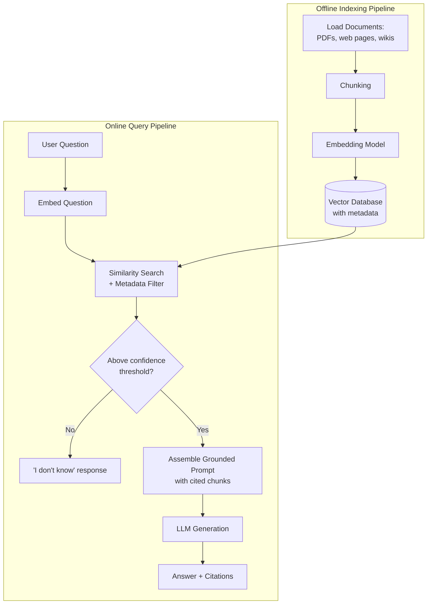
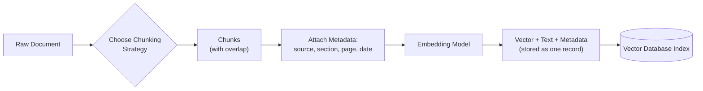
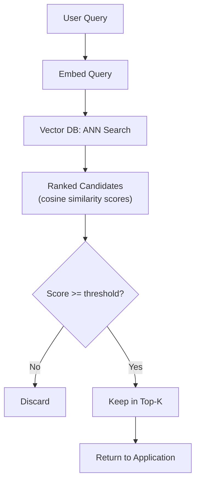
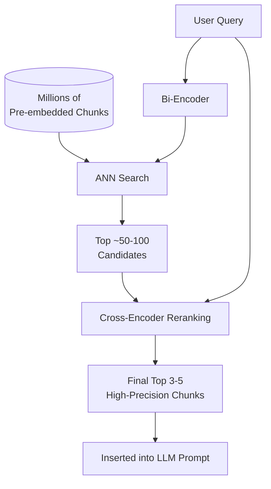
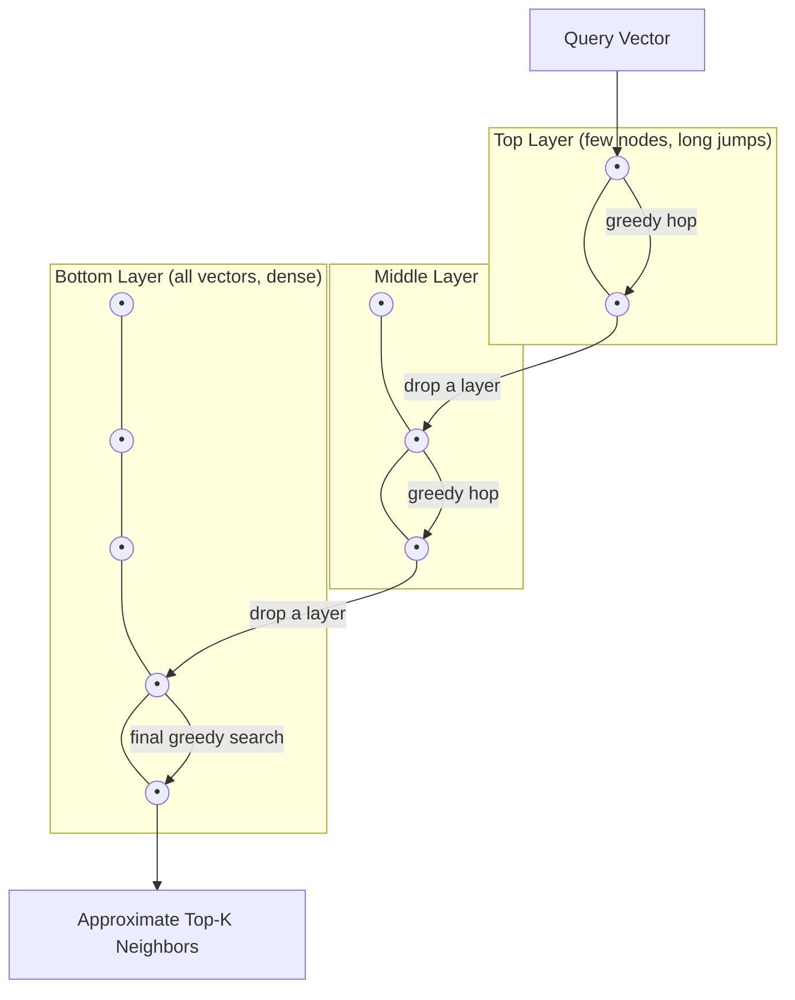

# Diagrams and Workflows

Five Mermaid diagrams covering the full Week 3 pipeline, from raw documents to a grounded,
cited answer.

## 1. Full End-to-End RAG Pipeline

*Caption: The complete flow from raw documents to a grounded answer, spanning the offline
indexing pipeline and the online query pipeline.*

## 2. Chunking and Embedding Flow

*Caption: How a raw document becomes a set of embedded, metadata-tagged, searchable vectors.*

## 3. Similarity Search Baseline (No Reranking)

*Caption: The simplest retrieval baseline — embed the query, search, apply a threshold, take
the top-k. Good starting point before adding reranking or hybrid search.*

## 4. Retrieve-Then-Rerank Pipeline (Bi-Encoder + Cross-Encoder)

*Caption: The production-grade retrieval pattern — a fast bi-encoder narrows millions of
documents to a shortlist, then a slower cross-encoder precisely reranks just that shortlist.*

## 5. HNSW Graph Traversal Sketch

*Caption: How HNSW's layered graph structure lets a query "hop" toward the nearest vectors
in roughly logarithmic time instead of scanning the entire dataset.*

