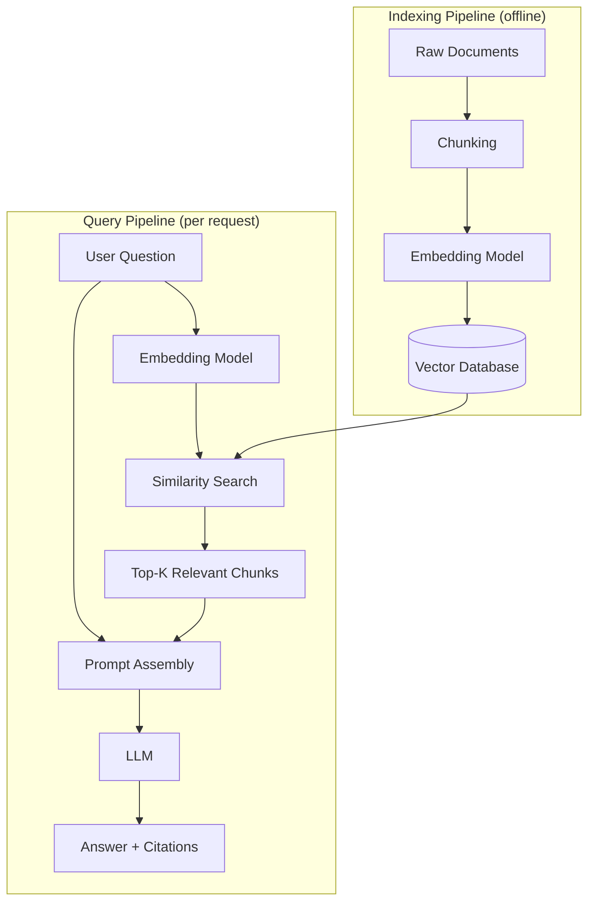

# Why RAG

## 1. Introduction

A large language model is trained once, on a huge snapshot of public text, and then frozen.
After that, it never automatically learns anything new. It doesn't know your company's
internal wiki, the PDF your legal team uploaded last week, or the support ticket a customer
filed an hour ago. Ask it about any of that and it will usually still answer — just not
correctly. **Retrieval-Augmented Generation (RAG)** is the standard fix: before the model
writes an answer, the system fetches the few documents (or document *chunks*) that are
actually relevant to the question and hands them to the model as extra context. The model
then answers from that context instead of from its frozen training memory.

## 2. Why This Topic Exists

Three hard facts about LLMs make RAG necessary:

- **Knowledge cutoff.** Training data has a cutoff date. Anything that happened after that —
  or anything private that was never public in the first place — simply isn't in the
  weights.
- **No access to private data.** Your company's contracts, internal runbooks, product specs,
  and customer data were never part of any public training set, and for good reason — you
  don't want them to be.
- **Hallucination under pressure to answer.** LLMs are trained to produce a plausible,
  fluent continuation. When they don't actually know something, they don't have a reliable
  built-in "I don't know" reflex — they generate the most statistically likely-sounding
  answer, which can be entirely fabricated but delivered with total confidence.

Retraining or fine-tuning the model every time a document changes is slow, expensive, and
still doesn't reliably teach a model new *facts* (fine-tuning is much better at teaching
style and format than at reliably storing and recalling specific facts). RAG sidesteps all
of this: instead of baking knowledge into the model's weights, you keep the knowledge in an
external, easily updatable store and *show* it to the model at answer time.

## 3. Core Concept

### Beginner

Think of RAG as an **open-book exam**. A model without RAG is a student answering from
memory alone — sometimes right, sometimes confidently wrong. A model with RAG is a student
who is handed the exact textbook pages relevant to the question before answering. The
student still has to read and reason, but now they're reasoning over real material instead
of guessing.

### Intermediate

RAG is a two-stage pipeline bolted onto a normal LLM call:

1. **Retrieval stage** — given the user's question, search a knowledge store (built ahead of
   time from your documents) and pull back the most relevant pieces of text.
2. **Generation stage** — insert those pieces into the prompt alongside the question, and ask
   the model to answer *using only that material*.

The two stages are loosely coupled: you can swap the retriever, the vector store, or the
underlying LLM independently, as long as the interface between them (a list of relevant text
chunks) stays the same.

### Advanced

RAG is one point on a spectrum of ways to give a model access to knowledge it wasn't trained
on, and it's usually the right default:

| Approach | Update speed | Cost | Traceability | Best for |
|---|---|---|---|---|
| RAG | Minutes (re-index a doc) | Low (embedding + storage) | High — shows source chunks | Frequently changing facts, need for citations |
| Fine-tuning | Hours–days (retrain) | High (compute + data curation) | Low — knowledge is baked into weights | Teaching style, tone, format, narrow behaviors |
| Long context window | Instant, no pipeline | High per-call (more tokens billed every request) | Medium | Small, static document sets that fit in-context |
| Hybrid (RAG + fine-tuning) | Mixed | Highest | High | Domain-specific style *and* fresh facts |

In production systems, RAG and fine-tuning are not competitors — they're often combined: the
model is fine-tuned to *behave* like a domain expert (tone, format, refusal style) while RAG
supplies the *facts* that keep it accurate as documents change.

## 4. Deep Explanation

A RAG system has two pipelines that run at very different times:

- **Indexing pipeline (offline, run ahead of time, re-run on updates):** load raw documents →
  split into chunks → embed each chunk into a vector → store vectors plus metadata in a
  vector database. This can run once a day, once an hour, or on every document upload — it
  does not happen while the user is waiting.
- **Query pipeline (online, runs per user question):** embed the user's question with the
  same embedding model → search the vector store for the most similar chunks → assemble a
  prompt containing the question plus the retrieved chunks → send to the LLM → return the
  answer (ideally with citations back to the source chunks).

Separating these two pipelines is what makes RAG practical: embedding and indexing a million
documents is expensive and slow, but it only has to happen once (or incrementally, as
documents change), while the query pipeline stays fast because it's just one embedding call
plus a similarity search.

It's important to be precise about what RAG actually fixes and what it doesn't. RAG
dramatically **reduces** hallucination on questions about the indexed documents, because the
model has real material to ground its answer in. It does **not** eliminate hallucination
entirely — the model can still misread the retrieved context, blend it with prior training
knowledge, or answer confidently when retrieval returned nothing useful. That's why grounded
prompting and citations (Topic 11) are treated as a required part of the pattern, not an
optional nice-to-have.

## 5. Step-by-Step Flow

1. Collect the source documents (PDFs, web pages, internal wiki exports, tickets, etc.).
2. Split each document into smaller chunks (Topics 5–6).
3. Convert each chunk into an embedding vector (Topic 2).
4. Store the vectors, the original chunk text, and metadata in a vector database (Topics 7–8).
5. When a user asks a question, embed the question with the same model used for the chunks.
6. Search the vector store for the `top_k` most similar chunks (Topic 9), optionally filtered
   by metadata (Topic 10).
7. Build a prompt that includes the question and the retrieved chunks, with instructions to
   answer only from that material.
8. Send the prompt to the LLM and get an answer.
9. Present the answer along with citations pointing back to the specific chunks/sources used
   (Topic 11).

## 6. Architecture Explanation

## 7. Visual Analogy

RAG is a **librarian-assisted research assistant**. You don't hand a research assistant an
entire library and ask them to memorize it before every question. Instead, when you ask a
question, a librarian first pulls the handful of books and pages most relevant to it, and
*then* the assistant reads those pages and writes the answer, citing the page numbers. The
assistant is smart (that's the LLM), but the librarian's job (retrieval) is what keeps the
assistant honest and current.

## 8. Real Industry Example

Enterprise "ask our handbook" and internal search tools are the canonical RAG use case:
companies like Notion, GitHub (Copilot Chat grounded on a repository), and countless internal
support-desk bots use RAG so that employee-facing or customer-facing assistants answer from
the company's actual policies, code, and documentation rather than the model's generic
training knowledge. Customer support platforms use the same pattern to let a chatbot answer
from a product's real help-center articles and past resolved tickets, dramatically reducing
both hallucinated answers and the need to retrain a model every time a policy changes.

## 9. Common Misconceptions

- **"RAG completely eliminates hallucination."** It reduces it a lot on in-domain questions,
  but the model can still misinterpret retrieved text or answer when retrieval failed.
- **"RAG and fine-tuning are alternatives — pick one."** They solve different problems
  (facts vs. behavior) and are frequently combined.
- **"More retrieved context is always better."** Stuffing in too many chunks dilutes the
  signal, increases cost and latency, and can push the actually-relevant chunk out of the
  model's effective attention.
- **"RAG requires a giant, complex system."** A minimal RAG pipeline is just a handful of
  documents, an embedding call, a simple vector search, and a prompt template — complexity
  scales with your data, not the pattern itself.
- **"If the answer is wrong, the LLM is broken."** In practice, most RAG failures are
  retrieval failures (wrong chunk, bad chunk boundary, wrong embedding model) — the
  generation step is usually doing exactly what it was told with the context it received.

## 10. Best Practices

- Treat retrieval quality and generation quality as two separate things to measure and debug.
- Always design for a clear "no relevant context found → say so" path instead of forcing the
  model to answer anyway.
- Keep the indexing pipeline idempotent and re-runnable, so documents can be safely
  re-processed when they change.
- Log which chunks were retrieved for every answer — it's the single most useful debugging
  artifact when an answer looks wrong.
- Start simple (fixed-size chunks, a small embedding model, cosine similarity) and only add
  complexity (reranking, hybrid search, semantic chunking) once you can measure that it's
  needed.

## 11. Summary

RAG exists because LLMs are frozen at training time and have no access to private or
recently changed information, and because retraining a model to teach it new facts is slow,
expensive, and unreliable. Instead, RAG keeps knowledge in an external store, retrieves the
small relevant slice of it for each question, and has the model answer from that evidence.
It's a two-pipeline system — an offline indexing pipeline and an online query pipeline — and
it meaningfully reduces (without fully eliminating) hallucination, which is why grounding and
citations are treated as core parts of the pattern rather than optional extras.

## 12. Key Takeaways

- RAG = Retrieval-Augmented Generation: retrieve relevant documents, then generate an answer
  from them.
- LLMs have a knowledge cutoff and no access to private data by default — RAG closes that
  gap without retraining.
- RAG has two pipelines: offline indexing (once per document) and online query (once per
  question).
- RAG reduces hallucination but does not eliminate it — grounding and citations are still
  required.
- RAG and fine-tuning solve different problems and are often used together, not as
  alternatives.
