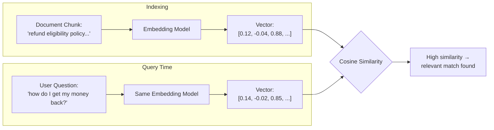

# Embeddings and Dense Retrieval

## 1. Introduction

Before a computer can "search by meaning" instead of just matching keywords, it needs a way
to turn text into something it can do math on. An **embedding** is exactly that: a fixed-length
list of numbers (a vector) that represents the meaning of a piece of text, such that texts
with similar meaning end up as vectors that are close together in space. **Dense retrieval**
is the technique of using these embeddings to find relevant documents by measuring vector
closeness, instead of matching exact words like a traditional search engine does.

## 2. Why This Topic Exists

Traditional keyword search (like the classic library card catalog, or basic SQL `LIKE`
queries) only finds documents that contain the *exact words* you searched for. If a user asks
"How do I get my money back?" but the policy document says "refund eligibility," a
keyword-only search finds nothing, even though the document answers the question perfectly.
Embeddings solve this because they capture *semantic* meaning: "money back" and "refund" end
up as nearby vectors even though they share no letters. This is the entire reason RAG systems
can retrieve genuinely relevant material even when the user's wording doesn't match the
source document's wording.

## 3. Core Concept

### Beginner

Imagine every sentence gets assigned a point on a map, where sentences with similar meaning
are placed near each other and unrelated sentences are placed far apart. An embedding model
is the thing that decides where each sentence goes on that map. Searching then just means:
plot the question on the same map, and see which document points are closest to it.

### Intermediate

An embedding model (usually a transformer, e.g. a sentence-transformer or an API like
OpenAI's `text-embedding-3-*`) takes in a piece of text and outputs a vector of fixed length
(common sizes: 384, 768, 1024, 1536, 3072 dimensions). The model is trained so that
semantically similar text pairs produce vectors with high **cosine similarity** (or high dot
product), and dissimilar pairs produce low similarity. Dense retrieval means: embed the
corpus once (offline), embed the query at search time, and rank documents by vector
similarity to the query.

### Advanced

Embedding models are typically trained with **contrastive learning**: the model is shown
pairs of texts that should be similar (a question and its correct answer passage, or two
paraphrases) and pairs that should be dissimilar (a question and an unrelated passage), and
its weights are adjusted so that similar pairs get pulled closer together in vector space and
dissimilar pairs get pushed apart (this objective is often called InfoNCE / contrastive
loss). This is different from sparse retrieval methods like **BM25/TF-IDF**, which represent
text as a sparse vector over the vocabulary (mostly zeros, with weights for the exact words
present) and score documents by exact term overlap weighted by term frequency and rarity.
Dense retrieval captures meaning and handles synonyms and paraphrasing; sparse retrieval
captures exact terms, rare identifiers (error codes, product SKUs, proper nouns), and is
cheap and highly interpretable. Many production systems run **hybrid search** — both dense
and sparse retrieval combined — because each covers the other's blind spots.

## 4. Deep Explanation

Under the hood, an embedding model is usually a transformer encoder whose final hidden
states are pooled (commonly via mean-pooling across tokens, or by using a special `[CLS]`
token's representation) into one fixed-size vector per input text. Two properties matter a
lot in practice:

- **Vector space geometry.** Because similarity is computed with cosine similarity or dot
  product, the model's usefulness depends entirely on it having correctly learned to place
  related meanings near each other. A model trained mostly on English news text may embed
  legal or medical jargon poorly, because it never saw enough of that vocabulary to build a
  useful geometry for it.
- **Symmetric vs. asymmetric embeddings.** Some models are tuned for symmetric tasks (query
  and document are similar-length and similar-style text, e.g. paraphrase search), while
  others are explicitly tuned for asymmetric tasks (a short question vs. a long passage),
  which is the typical RAG scenario. Many production embedding models (e.g. E5, BGE) require
  you to prefix text with a task instruction like `"query: "` or `"passage: "` at embedding
  time precisely because they were trained to treat queries and passages differently.

Dense retrieval's main weakness is that it can miss exact-match signals: a rare part number,
an exact legal clause number, or a specific username may not be distinguished well in a
semantic vector space, because the model was never trained to treat two different serial
numbers as "far apart" in meaning — to an embedding model they can look like variations of
the same generic pattern. This is exactly the gap that sparse/keyword retrieval fills, which
is why hybrid search remains common in production even after dense retrieval became the
default.

## 5. Step-by-Step Flow

1. Choose an embedding model appropriate for your domain and language(s).
2. Embed every chunk in your document corpus once, offline, and store the resulting vectors.
3. At query time, embed the user's question with the *same* model (embeddings from different
   models are not comparable to each other).
4. Compute similarity (cosine or dot product) between the query vector and every stored
   document vector — in practice done efficiently via a vector index (Topic 7), not brute
   force.
5. Rank documents by similarity score and return the top matches.

## 6. Architecture Explanation

## 7. Visual Analogy

Think of embeddings as **GPS coordinates for meaning**. Two cafes on opposite sides of town
that are both "cozy coffee shops with wifi" might be far apart on a road map but close
together on a "vibe map." Embeddings build that vibe map for text — physically different
words land at nearby coordinates when they mean similar things, which is exactly what lets
you search by "closeness of meaning" instead of "closeness of spelling."

## 8. Real Industry Example

Semantic search over support tickets is a textbook case: a customer types "app keeps
crashing when I upload a photo," and dense retrieval finds a resolved ticket titled "image
attachment causes force close," even though not one word overlaps. E-commerce product search
uses the same idea to match "warm winter jacket for hiking" against product descriptions that
say "insulated outdoor parka," and code-search tools (like GitHub's semantic code search)
embed both natural-language queries and code snippets into a shared space so "function that
sorts a list in place" can find `def bubble_sort(arr):` with no shared vocabulary at all.

## 9. Common Misconceptions

- **"Embeddings from different models can be compared directly."** They can't — each model
  defines its own vector space; comparing vectors from two different models produces
  meaningless similarity scores.
- **"A higher-dimensional embedding is always better."** Higher dimensions can capture more
  nuance but cost more to store and search, and beyond a point add little retrieval quality
  for a given model/training data.
- **"Dense retrieval understands the text like a human."** It captures statistical
  regularities in meaning learned from training data — it has no real-world grounding and can
  be fooled by unusual phrasing, negation, or domain-specific jargon it never saw.
- **"Embeddings replace the need for good chunking."** A perfect embedding of a badly-cut
  chunk (e.g., cut off mid-sentence) still produces a poor, unfocused vector.

## 10. Best Practices

- Always use the same embedding model for indexing and querying.
- Follow the model's documented usage pattern (e.g., required `query:`/`passage:` prefixes)
  — skipping this measurably hurts retrieval quality for models that expect it.
- Normalize vectors when the similarity metric assumes it (many vector DBs expect
  unit-normalized vectors for cosine similarity to be computed as a plain dot product).
- Evaluate retrieval quality directly and separately from generation quality (see Topic 9)
  rather than only judging the final LLM answer.
- Consider hybrid dense + sparse search whenever your data contains exact identifiers, codes,
  or rare proper nouns that must be matched precisely.

## 11. Summary

Embeddings turn text into vectors that place similar meanings near each other in space, and
dense retrieval uses that property to find relevant documents by measuring vector similarity
instead of matching literal keywords. This is what lets RAG systems find the right document
even when the user's question is phrased completely differently from the source text. Dense
retrieval's main blind spot is exact-match precision (codes, IDs, rare terms), which is why
many real systems pair it with traditional sparse/keyword search.

## 12. Key Takeaways

- An embedding is a fixed-length vector representing the meaning of text.
- Dense retrieval ranks documents by vector similarity (cosine/dot product) to a query
  vector.
- Embedding models are trained with contrastive learning to pull similar meanings together
  and push dissimilar ones apart.
- Always embed queries and documents with the same model, and follow its prefix/usage
  conventions.
- Dense retrieval misses exact-match cases that sparse retrieval catches — hybrid search
  combines both.
