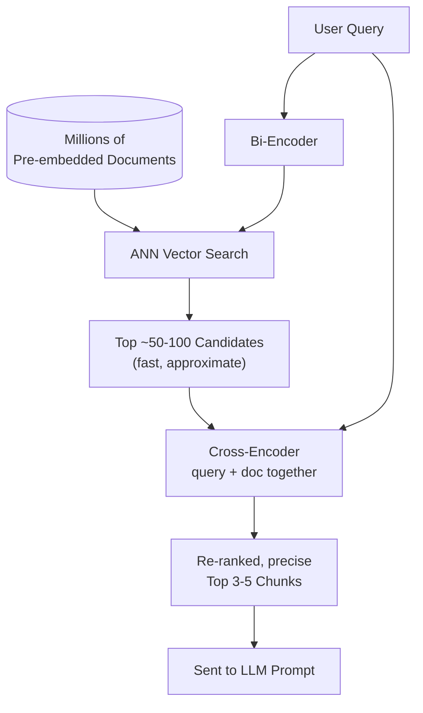

# Bi-Encoder vs Cross-Encoder

## 1. Introduction

Once you know embeddings can measure semantic similarity, a question follows immediately:
should the query and the document be embedded separately, or together? Both approaches
exist, and they trade off speed against accuracy. A **bi-encoder** embeds the query and each
document independently and compares the resulting vectors. A **cross-encoder** feeds the
query and a document *together* into one model and outputs a single relevance score. Almost
every serious RAG system uses both, at different stages.

## 2. Why This Topic Exists

A bi-encoder can pre-compute every document's vector offline, so at query time it only has to
embed the query once and do a fast vector comparison against millions of pre-computed
vectors — that's what makes large-scale retrieval fast. But because the query and document
never interact inside the model, a bi-encoder can miss subtle relevance signals that only
show up when the two texts are read *together* (e.g., the query negates something the
document states). A cross-encoder captures those interactions because the model sees both
texts at once and can attend from one to the other — but that means it has to be re-run on
every single query-document pair, which is far too slow to run against an entire corpus.
This topic exists because production RAG systems need both: bi-encoders to be fast, and
cross-encoders to be accurate — used in sequence.

## 3. Core Concept

### Beginner

A bi-encoder is like judging two people's compatibility by looking at their profile
photos separately and guessing. A cross-encoder is like actually putting the two people in a
room together and watching how they interact — much more accurate, but you obviously can't
do that for every possible pair of people in a dating app; you use the quick photo-guess to
narrow down candidates first.

### Intermediate

- **Bi-encoder:** `embed(query)` and `embed(document)` happen independently, through the same
  (or a paired) encoder, producing two vectors. Similarity is a cheap vector operation
  (cosine/dot product). Documents can be embedded once and reused for every future query.
- **Cross-encoder:** the query and document are concatenated (typically as
  `[CLS] query [SEP] document [SEP]`) and passed through a single transformer together, which
  outputs one relevance score. Nothing about this can be pre-computed per document, because
  the score depends on the specific query paired with it.

### Advanced

This is why the standard production pattern is a **two-stage retrieve-then-rerank
pipeline**: use a bi-encoder against a vector database to cheaply retrieve a broad candidate
set (e.g., top 50–100 chunks) from potentially millions of documents, then run a
cross-encoder over just that small candidate set to re-score and re-rank them, keeping only
the true top few (e.g., top 3–5) to actually put in the LLM's prompt. This gets both
properties: sub-second retrieval at scale (bi-encoder) and high-precision final ranking
(cross-encoder), without ever needing to run the cross-encoder against the entire corpus.

## 4. Deep Explanation

The computational asymmetry is the whole story. For a corpus of `N` documents and `Q`
queries:

- Bi-encoder cost: `N` document embeddings (computed once, offline) + `Q` query embeddings +
  a vector similarity search that's sub-linear in `N` thanks to an ANN index (Topic 7).
- Cross-encoder cost: if run against the whole corpus, `Q × N` full forward passes through a
  transformer — computationally infeasible at any real scale.

By restricting the cross-encoder to only the bi-encoder's shortlist (say, 50 candidates),
the cost becomes `Q × 50` forward passes, which is fast enough to run per-request. The
accuracy gain from the cross-encoder comes from **cross-attention**: because the transformer
processes the query and document tokens in the same forward pass, every query token can
attend directly to every document token (and vice versa) at every layer, letting the model
pick up on fine-grained interactions (negation, entity matching, logical fit) that two
independently-computed vectors can only approximate through their fixed-size summary.

Cross-encoders are typically trained as a classification or regression head on top of a
transformer, supervised with labeled (query, document, relevance) triples — often
distilled from human relevance judgments or from a larger teacher model.

## 5. Step-by-Step Flow

1. Embed the full corpus offline with a bi-encoder (this is the retrieval index).
2. At query time, embed the query with the bi-encoder and retrieve the top-N candidates via
   vector search (N is intentionally generous, e.g. 50–100).
3. Pass the query paired with each of the N candidates through a cross-encoder.
4. Sort candidates by the cross-encoder's relevance scores.
5. Keep only the final top-k (e.g., 3–5) to insert into the LLM's context window.

## 6. Architecture Explanation

## 7. Visual Analogy

A bi-encoder is a resume-keyword scanner that quickly shortlists 100 candidates out of
10,000 applicants by comparing summarized profiles. A cross-encoder is the hiring panel that
actually interviews each of those 100 shortlisted candidates one-on-one to pick the final 5 —
far more accurate per-candidate, but only feasible because the pool was narrowed first.

## 8. Real Industry Example

Search engines and recommendation systems at companies like Bing and large e-commerce
platforms commonly use exactly this retrieve-then-rerank pattern: a fast bi-encoder (or even
classic keyword search) narrows billions of items down to a few hundred, and a heavier
cross-encoder or learning-to-rank model does the final precision ranking of just those few
hundred. In RAG specifically, popular open-source cross-encoder rerankers (e.g., from the
`sentence-transformers` cross-encoder family, or Cohere's Rerank API) are dropped in right
after vector search as a standard quality-boosting step.

## 9. Common Misconceptions

- **"Cross-encoders are strictly better, so just use them everywhere."** They're more
  accurate per pair, but computationally impossible to run against a full corpus — they only
  work as a reranking step over a small candidate set.
- **"You must always use both."** For small corpora or low-stakes use cases, a bi-encoder
  alone is often good enough; reranking adds latency and cost that should be justified by a
  measurable accuracy gain.
- **"Reranking fixes bad retrieval."** If the bi-encoder's shortlist doesn't contain the
  right document at all, no amount of reranking can recover it — the cross-encoder can only
  reorder what's already in the candidate set.
- **"Bi-encoder and cross-encoder must be the same model architecture."** They're usually
  different models entirely, trained for different jobs (representation learning vs.
  pairwise relevance scoring).

## 10. Best Practices

- Default to a two-stage pipeline (bi-encoder retrieve → cross-encoder rerank) whenever
  retrieval quality matters and latency budget allows an extra model call.
- Retrieve a generously sized candidate set for reranking (too small defeats the purpose,
  too large adds unnecessary latency).
- Measure whether reranking actually improves your specific metrics before adding the
  complexity — it isn't free.
- Cache cross-encoder scores if the same (query, document) pairs recur often.

## 11. Summary

Bi-encoders and cross-encoders sit at opposite ends of a speed/accuracy trade-off: bi-encoders
embed query and document independently for fast, scalable similarity search, while
cross-encoders process query and document together for much higher accuracy at a much higher
per-pair cost. Production RAG systems typically use both in sequence — a bi-encoder to
cheaply shortlist candidates from a huge corpus, and a cross-encoder to precisely rerank that
small shortlist before it reaches the LLM.

## 12. Key Takeaways

- Bi-encoder: embed query and document separately, compare vectors — fast, scalable, used
  for first-stage retrieval.
- Cross-encoder: feed query and document together into one model — slow but accurate, used
  for reranking a small candidate set.
- The standard pattern is retrieve-then-rerank: bi-encoder narrows the field, cross-encoder
  picks the best few.
- Reranking can't fix a shortlist that's missing the right document in the first place.
- Only add reranking if you can measure that it improves results enough to justify the extra
  latency.
