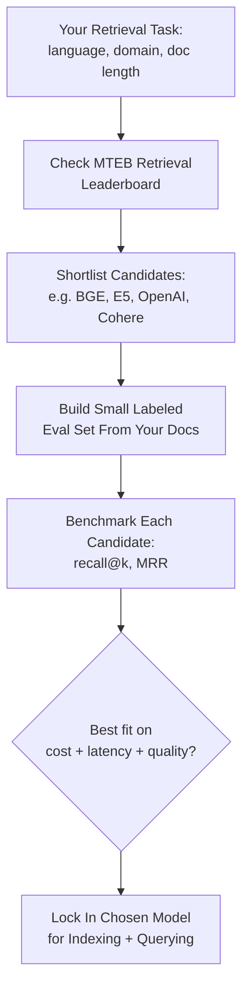

# Embedding Models (MTEB, BGE, E5)

## 1. Introduction

Not all embedding models are equal, and the choice of embedding model is one of the highest
-leverage decisions in a RAG system — a weak embedding model quietly caps your retrieval
quality no matter how good your chunking, vector database, or LLM are. This topic covers how
embedding models are benchmarked (**MTEB**), and two of the most influential open embedding
model families (**BGE** and **E5**), alongside proprietary options.

## 2. Why This Topic Exists

Early in the embedding boom, every research team measured "quality" on a different, narrow
task, making models impossible to compare fairly. The **Massive Text Embedding Benchmark
(MTEB)** was created to fix this: a single standardized benchmark suite spanning many task
types and languages, with a public leaderboard, so practitioners can compare models on
equal footing instead of trusting marketing claims. This topic also exists because choosing
an embedding model involves real trade-offs (cost, latency, dimensionality, domain fit,
licensing) that have nothing to do with raw benchmark score alone.

## 3. Core Concept

### Beginner

Think of embedding models as translators who convert sentences into "meaning coordinates."
Some translators are better than others, some are faster, some cost money per sentence
translated, and some are specialists in certain domains (legal, medical, code). MTEB is a
standardized "translator exam" that scores many translators on the same set of tasks so you
can compare them honestly.

### Intermediate

MTEB evaluates embedding models across task categories including retrieval, semantic textual
similarity (STS), classification, clustering, reranking, and summarization — across dozens of
datasets and multiple languages. A model's MTEB score is usually an average across these
tasks, but for RAG specifically, the **retrieval** sub-score matters far more than the
overall average, since that's the actual job the model will do.

### Advanced

Two influential open model families changed the embedding landscape:

- **E5 (Microsoft, "EmbEddings from bidirEctional Encoder rEpresentations")** — trained with
  a contrastive pretraining objective on large-scale weakly-supervised text pairs followed by
  supervised fine-tuning, and popularized the convention of prefixing inputs with
  `"query: "` or `"passage: "` so the same model can specialize its representation depending
  on the role of the text (asymmetric retrieval).
- **BGE (BAAI General Embedding, from the Beijing Academy of Artificial Intelligence)** —
  a family (`bge-small`, `bge-base`, `bge-large`, and later `bge-m3` for multilingual and
  multi-granularity retrieval) trained with large-scale contrastive learning plus
  instruction-tuning, which has consistently ranked near the top of MTEB's retrieval
  leaderboard among open models.

Both families are open-weight, meaning they can be self-hosted at zero per-call cost (aside
from your own compute), in contrast with proprietary API-based models like OpenAI's
`text-embedding-3-small`/`text-embedding-3-large` or Cohere's `embed-v3`, which charge per
token but require no infrastructure to run.

## 4. Deep Explanation

Choosing an embedding model in practice means weighing several axes at once, not just picking
the top MTEB score:

| Factor | Why it matters |
|---|---|
| **Retrieval MTEB score** | The single most relevant proxy for RAG quality — check the retrieval sub-score specifically, not the overall average. |
| **Dimensionality** | Higher dimensions (e.g. 1536, 3072) can capture more nuance but cost more to store and search; some models (e.g. OpenAI `text-embedding-3-*`, `bge-m3`) support "Matryoshka" truncation to a smaller dimension with limited quality loss. |
| **Max input length** | Determines how large a chunk you can embed in one call without truncation — matters directly for your chunking strategy (Topics 5–6). |
| **Language coverage** | Many top English-benchmark models perform poorly on non-English text; multilingual models (e.g. `bge-m3`, multilingual E5) trade some English-only performance for broad language coverage. |
| **Domain fit** | General-purpose models can underperform on legal, medical, or code text; domain-tuned or fine-tuned embedding models close this gap. |
| **Cost & latency** | API models bill per token and add network latency; self-hosted open models cost compute and ops effort but have no per-call fee. |
| **License** | Some open models restrict commercial use — always check before shipping. |

Instruction-tuned embedding models (a trend both E5 and BGE participate in) let you pass a
short natural-language instruction alongside the text being embedded (e.g., "Represent this
sentence for searching relevant passages"), which can noticeably improve retrieval accuracy
for a specific downstream task without retraining the model.

## 5. Step-by-Step Flow

1. Define your retrieval task's shape: language(s), domain, average document length, query
   style (short question vs. long document).
2. Check the MTEB leaderboard's **retrieval** category for candidate models matching that
   profile.
3. Shortlist 2–3 candidates spanning at least one proprietary API option and one open-weight
   option.
4. Build a small labeled evaluation set from your own documents (queries with known correct
   chunks).
5. Run each candidate model against your evaluation set and compare retrieval metrics
   (e.g., recall@k, MRR) rather than trusting the public leaderboard alone — domain fit can
   overturn the general ranking.
6. Factor in cost, latency, and hosting complexity before making the final choice.
7. Lock in the chosen model for both indexing and querying — switching models later requires
   re-embedding the entire corpus.

## 6. Architecture Explanation

## 7. Visual Analogy

Choosing an embedding model is like choosing a translator for an international law firm.
The most famous, highest-scoring general translator on a broad exam might still stumble over
legal jargon that a slightly-lower-scoring but law-specialized translator handles perfectly.
MTEB is the general exam that tells you who's broadly competent; your own evaluation set is
the specialized interview that tells you who's actually right for your specific case files.

## 8. Real Industry Example

Many production RAG systems start with a proprietary API model like OpenAI's
`text-embedding-3-small` for speed of setup, then migrate to a self-hosted open model such as
`bge-large-en` or a fine-tuned E5 variant once usage scales enough that per-call embedding
costs and data-residency requirements (keeping sensitive text off third-party APIs) make
self-hosting worthwhile. Multilingual products (e.g., global customer support tools) commonly
choose `bge-m3` specifically for its combined dense, sparse, and multi-vector retrieval
support across 100+ languages in a single model.

## 9. Common Misconceptions

- **"The #1 model on the MTEB overall leaderboard is always the best choice."** The overall
  average blends many unrelated tasks; for RAG, only the retrieval sub-score is directly
  relevant, and even that can be overturned by your own domain-specific evaluation.
- **"Bigger embedding dimension always means better quality."** Quality depends on training
  data and objective, not just vector size — a well-trained 768-dim model can beat a poorly
  -trained 3072-dim one.
- **"You can switch embedding models without re-indexing."** You can't — vectors from
  different models live in incompatible spaces, so switching models requires re-embedding
  the entire corpus.
- **"Proprietary API models are always better than open ones."** Open models like BGE and E5
  variants regularly rank at or near the top of MTEB's retrieval leaderboard, ahead of some
  proprietary options.

## 10. Best Practices

- Always check the retrieval-specific MTEB score, not just the overall leaderboard rank.
- Build a small domain evaluation set early — it's the single highest-value RAG investment
  outside of the main pipeline itself.
- Respect a model's required prefixes/instructions (`query:`/`passage:` for E5-style models)
  — skipping them measurably hurts results.
- Plan for the cost of re-indexing before switching embedding models in production.
- Re-evaluate your chosen model periodically — the embedding model landscape moves quickly,
  and today's best choice may be superseded within months.

## 11. Summary

MTEB gives the field a standardized way to compare embedding models across many tasks and
languages, but for RAG the retrieval sub-score — ideally validated against your own
domain-specific evaluation set — matters more than the overall leaderboard rank. BGE and E5
are two influential open-weight model families that popularized large-scale contrastive
training and query/passage-aware prefixes, and sit alongside proprietary options like OpenAI
and Cohere's embedding APIs. The right choice depends on retrieval quality, dimensionality,
language coverage, domain fit, cost, and licensing together — not any single number.

## 12. Key Takeaways

- MTEB (Massive Text Embedding Benchmark) standardizes embedding model comparison across
  retrieval, STS, classification, clustering, and more.
- For RAG, prioritize the retrieval sub-score and your own domain evaluation over the overall
  MTEB average.
- BGE and E5 are prominent open-weight embedding families; both benefit from
  instruction/prefix-aware usage.
- Embedding models cannot be swapped without re-embedding the entire corpus.
- Model choice is a multi-factor decision: quality, dimensionality, language, domain fit,
  cost, latency, and license all matter.
