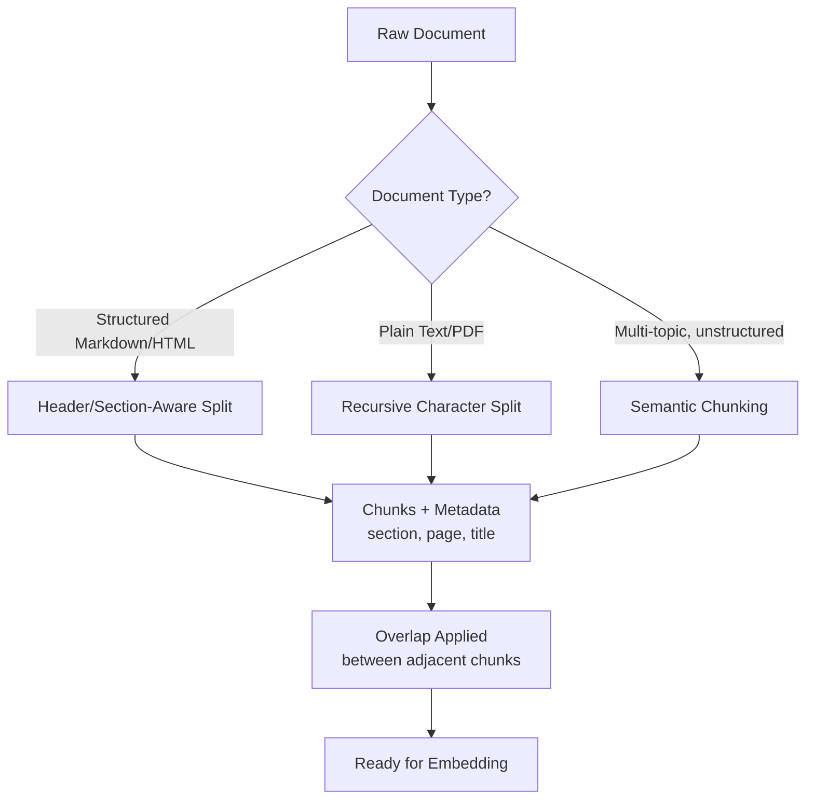

# Chunking Strategies

## 1. Introduction

You can't embed an entire 200-page PDF as a single vector and expect it to be useful for
retrieval — the resulting vector would be an average of everything the document talks about,
matching nothing precisely. **Chunking** is the process of splitting documents into smaller,
self-contained pieces before embedding them, so that each vector represents one focused idea
that can be retrieved precisely. How you chunk has a bigger effect on RAG quality than almost
any other single decision in the pipeline.

## 2. Why This Topic Exists

Embedding models produce one fixed-size vector per input, and that vector is a compressed
summary of everything in the input. If you embed a whole document, the vector blurs together
every topic the document covers, so a question about one specific detail buried in page 40
won't stand out in the vector at all. If you embed something too small (like a single word
or fragment), the vector may be technically precise but carry no usable context on its own
once retrieved. Chunking exists to find the right unit of text — big enough to carry a
complete thought, small enough to stay focused — for both embedding and for what actually
gets inserted into the LLM's prompt.

## 3. Core Concept

### Beginner

Think of chunking like cutting a cake before serving it. Serve the whole cake (the whole
document) and no one gets a clean, useful slice for their specific craving. Cut it into
crumbs (single sentences with no surrounding context) and each piece is too small to enjoy on
its own. Chunking is about cutting clean, reasonably sized slices — each one a complete,
useful serving.

### Intermediate

Common chunking strategies, roughly in order of how much document structure they respect:

- **Fixed-size chunking** — split every N characters or tokens, regardless of content
  boundaries. Simple and fast, but can cut mid-sentence or mid-idea.
- **Recursive character/token splitting** — try to split on paragraph breaks first, then
  sentence breaks, then words, only falling back to a hard cut if a piece is still too large.
  This is the most common general-purpose default (e.g., LangChain's
  `RecursiveCharacterTextSplitter`).
- **Sentence-based chunking** — split on sentence boundaries and group a target number of
  sentences per chunk, keeping each chunk grammatically complete.
- **Document-structure-aware chunking** — split along the document's own structure: markdown
  headers, HTML sections, slide boundaries, table rows — keeping each chunk aligned with a
  natural semantic unit the author already defined.
- **Semantic chunking** — embed sentences individually and group consecutive sentences into
  a chunk only while their embeddings stay similar, cutting a new chunk when the topic shifts
  meaningfully.
- **Sliding window chunking** — like fixed-size, but chunks overlap by a set amount so an
  idea that spans a boundary still appears whole in at least one chunk (see Topic 6).

### Advanced

The best strategy is rarely one-size-fits-all; production systems often chunk differently
per document type. A well-structured markdown knowledge base benefits enormously from
header-aware chunking (each section becomes a chunk, tagged with its heading path as
metadata), while a scanned PDF with unreliable structure often has to fall back to recursive
character splitting. Semantic chunking is the most content-aware option but is computationally
more expensive (it requires embedding at the sentence level just to decide where to cut) and
its benefit over simpler recursive splitting is workload-dependent — it's worth the added
complexity mainly when documents cover multiple unrelated topics with no structural markers
between them.

## 4. Deep Explanation

A subtle but important effect of chunking strategy is what happens to **context that spans
a boundary**. If a policy document reads "Refunds are available within 30 days. However, this
does not apply to final-sale items." and a fixed-size cut lands between those two sentences,
a chunk containing only the first sentence will embed and retrieve as if refunds are
unconditionally available — actively misleading, not just incomplete. This is why:

- Structure-aware and recursive splitting (which prefer to cut at paragraph/sentence
  boundaries) are safer defaults than pure fixed-size character cuts.
- Overlap (Topic 6) is a deliberate mitigation — by letting adjacent chunks share some text,
  an idea that spans a cut point still appears intact in at least one chunk.
- Metadata carried alongside each chunk (document title, section heading, page number) helps
  both retrieval and the reader make sense of a chunk even if it's slightly incomplete on its
  own.

Chunking decisions also affect the embedding model's job directly: an embedding model
performs best within its trained input length range — chunks far shorter than that range
under-use the model's capacity for context, and chunks that exceed the model's max length get
silently truncated, losing everything past the cutoff.

## 5. Step-by-Step Flow

1. Identify document types in your corpus (structured markdown, plain PDF, HTML, transcripts,
   tables) — they often warrant different strategies.
2. Choose a base strategy per document type (recursive splitting is a safe default when
   unsure).
3. Set a target chunk size appropriate to your embedding model and use case (Topic 6).
4. Decide whether to add overlap and how much.
5. Attach metadata to every chunk at creation time (source document, section title, page
   number, URL) — this cannot be reconstructed later without redoing the split.
6. Run a sample of chunks through a human read-through: does each chunk make sense in
   isolation? If not, adjust the strategy before scaling up.
7. Re-chunk and re-embed whenever the base document changes.

## 6. Architecture Explanation

## 7. Visual Analogy

Chunking is like editing a documentary down from raw footage into scenes. You don't publish
one unbroken 10-hour video (the whole document) and you don't publish single disconnected
frames (individual words). You cut it into coherent scenes, each with a clear beginning and
end, so a viewer searching for "the part where they talk about the budget" can jump straight
to the one scene that's actually about that.

## 8. Real Industry Example

Documentation search tools built on structured docs (like a company's internal Confluence or
a public docs site) commonly chunk by markdown/HTML heading, because the authors already
did the hard work of organizing content into logical sections — reusing that structure gives
near-perfect chunk boundaries for free. In contrast, legal and financial RAG systems working
with contracts and filings often invest specifically in clause- or section-number-aware
chunking, because a single misaligned cut across a numbered clause boundary can change the
retrieved meaning of an obligation entirely.

## 9. Common Misconceptions

- **"Chunking is a solved, one-line utility call."** The default splitter settings in most
  libraries are a reasonable starting point, not a guarantee of good chunk quality for your
  specific documents.
- **"Smaller chunks are always more precise."** Very small chunks can retrieve precisely but
  lack enough context for the LLM to actually answer from once retrieved.
- **"One chunking strategy fits an entire mixed corpus."** Different document types (slides,
  contracts, wikis, transcripts) often need different splitting logic.
- **"Semantic chunking is strictly superior."** It's more content-aware but more expensive to
  compute, and the quality gain over recursive splitting depends heavily on how disjointed
  your documents actually are.

## 10. Best Practices

- Prefer structure-aware or recursive splitting over naive fixed-size character cuts.
- Always attach source metadata (document, section, page) to chunks at chunking time.
- Read a sample of actual generated chunks before scaling up — this catches boundary
  problems that are invisible in code review.
- Match chunk size to your embedding model's effective input range and your LLM's context
  budget (Topic 6).
- Re-chunk and re-embed whenever source documents are edited — stale chunks are a silent
  cause of wrong answers.

## 11. Summary

Chunking splits documents into embeddable, retrievable units small enough to stay focused but
large enough to carry a complete idea. Strategies range from simple fixed-size splitting to
recursive, structure-aware, and semantic chunking, each trading off simplicity against how
well it respects the document's actual meaning boundaries. Getting chunking right — including
attaching metadata and handling boundary-spanning ideas — is one of the highest-leverage
levers for overall RAG quality.

## 12. Key Takeaways

- Chunking splits documents into focused, retrievable units before embedding.
- Strategies range from fixed-size to recursive, structure-aware, and semantic chunking.
- Cutting mid-idea can produce misleading chunks, not just incomplete ones.
- Attach metadata (source, section, page) to every chunk at creation time.
- Different document types in the same corpus often warrant different chunking strategies.
