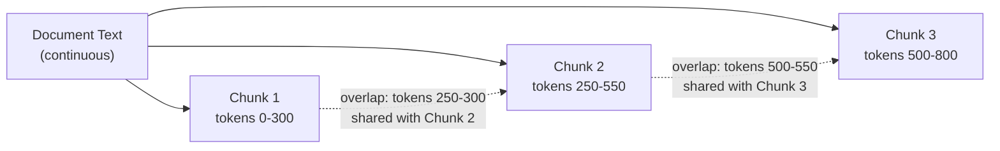

# Chunk Size and Overlap

## 1. Introduction

Deciding *how* to split documents (Topic 5) is only half the picture — you also have to
decide *how big* each chunk should be, measured in tokens, and how much adjacent chunks
should **overlap** with each other. These two numbers, chunk size and overlap, are simple to
set but have an outsized effect on retrieval quality, and getting them wrong is one of the
most common causes of a RAG system that "sort of works but keeps missing things."

## 2. Why This Topic Exists

Chunk size sits on a real trade-off with no universally correct answer:

- **Too small** (e.g., a single sentence): the embedding is precise but the chunk lacks
  enough surrounding context to be useful once retrieved — the LLM gets a fragment instead of
  an idea.
- **Too large** (e.g., several pages): the embedding blurs together multiple topics, so a
  question about one specific detail no longer stands out enough to rank the chunk highly,
  and even if retrieved, it wastes context-window budget on irrelevant surrounding text.

Overlap exists to soften the sharp edges of whatever chunk size you pick: without it, an idea
that happens to span a chunk boundary can be split so that neither chunk contains the whole
thought.

## 3. Core Concept

### Beginner

Imagine reading a book through a moving window that only shows one paragraph at a time. If
the window is too small, you see one sentence with no context. If it's too big, you see five
unrelated paragraphs mashed together and can't tell what the window is really "about."
Overlap is like sliding the window back a little each time you move it, so you never
completely lose the sentence that was cut off at the edge.

### Intermediate

Common rules of thumb (always validate against your own data and embedding model):

| Setting | Typical range | Notes |
|---|---|---|
| Chunk size | 200–500 tokens | Good default range for prose/knowledge-base content; short-form Q&A content can go smaller, dense technical/legal text often needs the higher end. |
| Overlap | 10–20% of chunk size | E.g., 50 tokens of overlap on a 300-token chunk. Enough to preserve boundary-spanning ideas without heavily duplicating the corpus. |
| Max chunk size | Bounded by embedding model's effective input length | Exceeding it causes silent truncation — the tail of the chunk is simply dropped from the embedding. |

### Advanced

The "right" chunk size actually depends on three things at once, not just document type:

1. **Embedding model behavior** — most embedding models were trained and evaluated on
   passages in a certain length range (often roughly paragraph-length); chunks far outside
   that range get embedded less accurately, even if the model's max input length technically
   allows them.
2. **LLM context budget** — every retrieved chunk competes for space in the final prompt
   alongside the system prompt, conversation history, and the question itself; larger chunks
   mean fewer chunks fit within a fixed context/cost budget.
3. **Granularity of the questions being asked** — fact-lookup questions ("what's the return
   window?") are served well by small, precise chunks; questions requiring more surrounding
   reasoning ("summarize the eligibility conditions") benefit from larger chunks that keep
   related conditions together.

Overlap has a real cost too: it duplicates content across the index, increasing storage and
(marginally) the chance of retrieving two overlapping chunks that both say almost the same
thing, wasting a slot in the LLM's context that could have gone to a different piece of
information.

## 4. Deep Explanation

Chunk size and overlap should be tuned empirically, not guessed once and left alone. A
practical way to think about it: pick a starting point from the rules-of-thumb table, run
your evaluation set (a set of test questions with known correct source chunks — see Topic 9)
against a few different size/overlap combinations, and measure retrieval recall directly.
It's common to find that a domain with short, list-like facts (an FAQ, a pricing table)
performs best with noticeably smaller chunks than a domain with long-form narrative
explanation (a policy handbook, a technical manual).

Token counting matters more than character counting: token count is what your embedding
model's input limit and your LLM's context window actually measure, and token-to-character
ratio varies by language and content type (code and non-English text often have different
tokens-per-character ratios than English prose). Always measure and set limits in tokens
using the actual tokenizer for the model in use, not a rough character-count approximation.

## 5. Step-by-Step Flow

1. Start from a reasonable default (e.g., 300 tokens, 15% overlap).
2. Count tokens using the tokenizer matching your embedding model, not raw character count.
3. Chunk a representative sample of your corpus and read several chunks manually — are they
   complete thoughts? Do the boundaries look reasonable?
4. Build or reuse a small evaluation set of questions with known correct chunks.
5. Test 2–3 alternative size/overlap combinations against that evaluation set.
6. Pick the combination with the best measured retrieval quality, not just what "feels right."
7. Re-validate whenever you change embedding models, since input-length sensitivity differs
   across models.

## 6. Architecture Explanation

## 7. Visual Analogy

Think of chunk size and overlap like camera shots in film editing. Chunk size is how wide
the shot is — too tight and you miss context, too wide and the subject gets lost in the
background clutter. Overlap is like slightly re-showing the last second of the previous shot
at the start of the next one, so the cut feels continuous instead of jarring and nothing
important happens entirely "between" two shots.

## 8. Real Industry Example

Documentation and support-bot RAG systems commonly converge on 300–500 token chunks with
roughly 50–100 tokens of overlap for prose-heavy help articles, while systems indexing
structured tabular or FAQ-style data (short question/answer pairs) often use much smaller
chunks — sometimes one Q&A pair per chunk with little or no overlap, since each pair is
already a complete, self-contained unit that doesn't benefit from boundary-blurring overlap.

## 9. Common Misconceptions

- **"There's one universally correct chunk size."** The right size depends on your embedding
  model, your LLM's context budget, and the kind of questions being asked.
- **"More overlap is always safer."** Overlap has a real storage and retrieval-diversity
  cost; excessive overlap can crowd the LLM's context with near-duplicate chunks.
- **"Character count and token count are basically the same thing."** They diverge
  meaningfully across languages and content types, and token count is what actually matters
  for model input limits.
- **"Once tuned, chunk size never needs revisiting."** Changing the embedding model or the
  LLM's context window should trigger re-evaluation of chunk size and overlap.

## 10. Best Practices

- Measure token counts with the real tokenizer for your embedding model and LLM, not
  characters or word count.
- Start with 200–500 tokens and 10–20% overlap, then tune against a real evaluation set.
- Match chunk granularity to the typical question style your users actually ask.
- Watch for silent truncation — never let chunk size exceed your embedding model's effective
  input limit.
- Re-tune chunk size whenever you change embedding models or significantly change document
  types in the corpus.

## 11. Summary

Chunk size and overlap control the trade-off between context (bigger chunks) and precision
(smaller chunks), and between preserving boundary-spanning ideas (more overlap) and
minimizing redundant storage and retrieval clutter (less overlap). Common starting points are
200–500 tokens with 10–20% overlap, but the right values should be validated empirically
against your own documents, embedding model, and typical user questions rather than assumed
from a rule of thumb alone.

## 12. Key Takeaways

- Chunk size trades off context (too big) against precision (too small).
- Overlap preserves ideas that span chunk boundaries, at the cost of some redundancy.
- Typical starting point: 200–500 tokens per chunk, 10–20% overlap.
- Always count tokens with the real tokenizer, not raw character count.
- Tune chunk size and overlap empirically against a real evaluation set, and re-tune when the
  embedding model or LLM changes.
