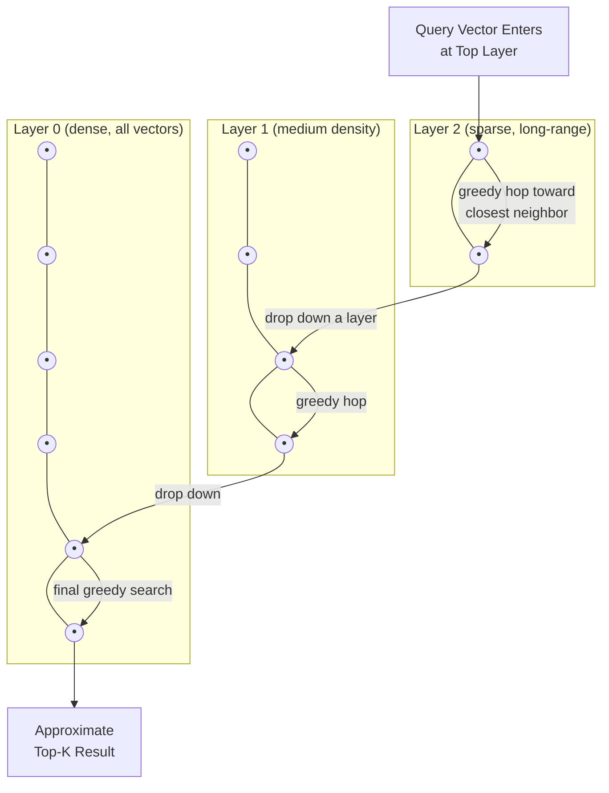

# Vector Databases and HNSW

## 1. Introduction

Once you have millions of chunk embeddings, finding the nearest ones to a query vector by
comparing it against every single stored vector (brute-force search) becomes too slow for
real-time use. A **vector database** is a system purpose-built to store large numbers of
vectors and search them for approximate nearest neighbors extremely fast. The most widely
used algorithm making this possible is **HNSW (Hierarchical Navigable Small World)**, a graph
-based approximate nearest neighbor (ANN) search structure.

## 2. Why This Topic Exists

Comparing a query vector against every document vector one by one (brute-force / exact
k-nearest-neighbor search) is `O(N)` per query — fine for a few thousand vectors, but far too
slow once a corpus reaches millions of chunks, especially under real-time user-facing
latency requirements. **Approximate Nearest Neighbor (ANN)** search algorithms trade a small,
usually negligible amount of accuracy for a massive speed improvement, turning search from
roughly linear time into something close to logarithmic time. Vector databases exist to
implement these ANN algorithms efficiently, alongside the practical database features
(persistence, filtering, updates, clustering) that a raw ANN library doesn't provide on its
own.

## 3. Core Concept

### Beginner

Imagine trying to find your friend in a crowd of a million people by checking every single
face one by one — technically works, but far too slow. Now imagine instead there's a system
of "ask the nearest well-connected person, who points you toward someone even closer,
who points you toward someone even closer still" — you find your friend in a handful of hops
instead of checking everyone. That's the intuition behind HNSW: a graph of shortcuts that
lets search "hop" toward the right answer instead of scanning everything.

### Intermediate

A vector database stores each chunk's embedding vector (plus its original text and metadata)
and builds an index structure over those vectors so similarity search doesn't require
scanning the full dataset. HNSW is the most common such index: it organizes vectors into a
multi-layer graph where each vector is a node, connected to a small number of its nearest
neighbors, with sparser, longer-range connections at higher layers for fast coarse
navigation and denser, shorter-range connections at lower layers for fine-grained precision.

### Advanced

HNSW builds on two older ideas: **skip lists** (a layered structure enabling
`O(log N)` search in sorted data) and **Navigable Small World (NSW) graphs** (graphs where
most nodes can reach any other node in a small number of hops, like the "six degrees of
separation" social-network property). HNSW combines them into layers: the top layer has very
few nodes with long-range connections for fast coarse traversal; each layer down has more
nodes and shorter connections; the bottom layer contains every vector, densely connected to
its true nearest neighbors. A search starts at the top layer, greedily moves to the neighbor
closest to the query at each step, and drops down a layer whenever no closer neighbor is
found at the current layer — repeating until it reaches the bottom layer and returns the best
candidates found.

Key HNSW tuning parameters:

| Parameter | Effect |
|---|---|
| `M` | Max number of connections per node per layer. Higher `M` = better recall, more memory, slower inserts. |
| `efConstruction` | Search breadth used while *building* the index. Higher = better graph quality, slower to build. |
| `efSearch` (a.k.a. `ef`) | Search breadth used at *query* time. Higher = better recall, slower queries. Tunable per query without rebuilding the index. |

Other ANN families exist and are used by different systems: **IVF (Inverted File Index)**
clusters vectors and searches only the nearest clusters; **Product Quantization (PQ)**
compresses vectors to save memory at some accuracy cost, often combined with IVF (as
`IVF-PQ`); **LSH (Locality-Sensitive Hashing)** hashes similar vectors into the same buckets.
HNSW has become the dominant default in most modern vector databases because it offers a very
strong recall/speed trade-off without requiring the corpus-specific training step that IVF
and PQ typically need.

## 4. Deep Explanation

Because HNSW is *approximate*, it does not guarantee finding the mathematically true nearest
neighbors — it guarantees finding neighbors that are very close to the true ones, with high
probability, controllable by the `ef`/`M` parameters. This trade-off is deliberate and almost
always worth it in RAG: missing the 6th-best chunk out of a 5-result `top_k` search rarely
changes the final answer, while waiting seconds for an exact brute-force scan across millions
of vectors would make the system unusable.

Practically, this means vector database performance tuning is really a recall-vs-latency
dial: raising `efSearch` recovers accuracy lost to approximation at the cost of query speed,
and raising `M`/`efConstruction` improves the underlying graph quality at the cost of index
size and build time. Most vector databases ship sensible defaults for these parameters, and
most RAG systems never need to touch them — but knowing they exist matters when retrieval
quality plateaus and the graph-search accuracy itself becomes a suspect.

## 5. Step-by-Step Flow

1. Embed and insert each chunk's vector into the vector database, which incrementally builds
   the HNSW graph (or a bulk-build in one pass, depending on the database).
2. At query time, embed the user's question into a query vector.
3. The database's HNSW index performs an approximate greedy graph traversal starting from the
   top layer, descending toward the bottom layer.
4. The traversal returns the approximate top-k nearest vectors, ranked by similarity.
5. The database returns the associated chunk text and metadata for those top-k vectors to the
   application.

## 6. Architecture Explanation

## 7. Visual Analogy

HNSW search is like flying between two small towns by first taking a long-haul flight to a
major international hub near your destination, then a regional flight to a smaller regional
airport, then finally a short local taxi ride to the exact address. Each stage narrows the
search using the right "granularity" of travel — you'd never take a taxi across an ocean, and
you don't need an international flight for the last two miles. HNSW's layers work the same
way: coarse long jumps first, increasingly fine-grained hops as you get close.

## 8. Real Industry Example

HNSW (or a close variant of it) is the default or a primary index option in essentially every
major vector database used in production RAG systems today, including Qdrant, Weaviate,
Milvus, and pgvector, as well as being available inside general-purpose search engines like
Elasticsearch/OpenSearch's vector search features. Its wide adoption is precisely because it
delivers strong recall at low latency without needing corpus-specific training passes,
making it a safe default across wildly different dataset sizes and shapes.

## 9. Common Misconceptions

- **"Vector databases guarantee finding the exact nearest neighbors."** HNSW and most other
  production ANN indexes are *approximate* by design — they trade a small accuracy loss for a
  huge speed gain.
- **"HNSW is the only ANN algorithm that matters."** IVF, PQ, and LSH remain relevant,
  especially for extremely large-scale or memory-constrained deployments where HNSW's
  in-memory graph overhead becomes costly.
- **"A vector database is just an ANN index."** Production vector databases add
  persistence, replication, metadata filtering, hybrid search, and update/delete support on
  top of the raw ANN algorithm — features a bare research-library ANN implementation doesn't
  provide.
- **"Bigger `efSearch`/`M` is always better."** Both improve recall but cost latency, memory,
  or build time — tune them against a measured need, not by maximizing blindly.

## 10. Best Practices

- Start with a vector database's default HNSW parameters; only tune `M`/`ef` after measuring
  an actual recall problem.
- Remember that ANN search is approximate — validate that "good enough" recall is actually
  good enough for your use case rather than assuming perfection.
- Consider memory footprint early: HNSW graphs are typically held in memory, and cost scales
  with vector count times dimensionality times `M`.
- Re-benchmark index parameters if you significantly change embedding dimensionality or
  corpus size — what worked at 100K vectors may need retuning at 100M.

## 11. Summary

Vector databases exist to make similarity search over huge collections of embeddings fast
enough for real-time use, and HNSW is the dominant algorithm behind that speed: a
multi-layer graph of vectors connected to their approximate nearest neighbors, searched by
greedily hopping from coarse, long-range connections at the top down to fine-grained,
precise connections at the bottom. It trades a small amount of guaranteed accuracy
(it's approximate, not exact) for search times that stay fast even as a corpus grows into the
millions of vectors.

## 12. Key Takeaways

- Brute-force nearest-neighbor search doesn't scale; ANN algorithms trade small accuracy loss
  for large speed gains.
- HNSW is a multi-layer graph: sparse long-range connections at the top, dense precise
  connections at the bottom.
- Key tuning knobs: `M` and `efConstruction` (index quality/build time), `efSearch`
  (query-time recall/speed).
- HNSW is approximate by design — it's the dominant default across most production vector
  databases.
- A vector database is more than an ANN index — it adds persistence, filtering, and updates
  on top.
