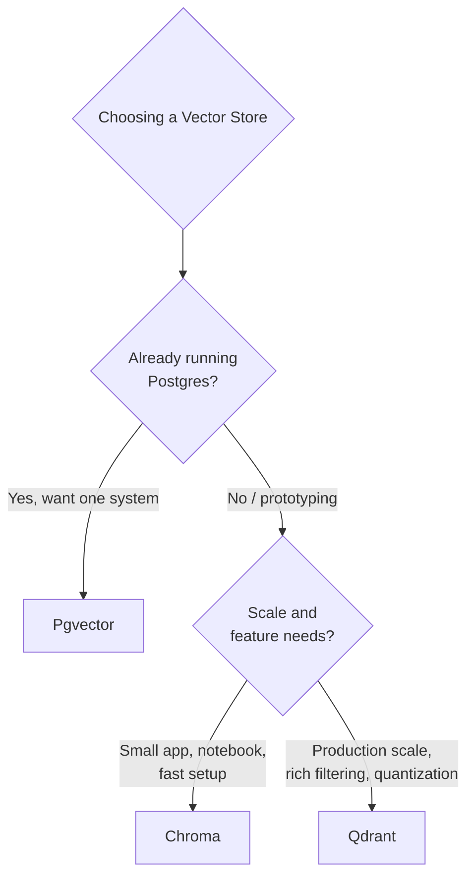

# Qdrant, Chroma, and Pgvector

## 1. Introduction

Knowing that you need a vector database with an HNSW-style index (Topic 7) still leaves an
important practical question: which one? **Qdrant**, **Chroma**, and **pgvector** are three
of the most widely used options in RAG systems today, and they represent three genuinely
different philosophies — a dedicated high-performance vector engine, a lightweight
embedded/prototyping store, and a Postgres extension that adds vector search to a database
you may already run.

## 2. Why This Topic Exists

Vector search doesn't happen in isolation — it happens alongside application concerns like
authentication, transactions, metadata filtering, horizontal scaling, and operational
tooling your team already knows. The "best" vector database is heavily dependent on context:
how much scale you need, whether you already run Postgres, whether you're prototyping or
shipping to production, and how much operational complexity your team can absorb. This topic
exists to make that trade-off concrete rather than abstract.

## 3. Core Concept

### Beginner

Think of these three options like choices for storing a large card collection. Chroma is
like a shoebox you keep on your desk — quick to set up, perfect while you're organizing your
first hundred cards. Qdrant is like a dedicated, professionally built card-filing cabinet
system — built specifically for this job at serious scale. Pgvector is like adding a card
-sorting drawer to a filing cabinet you already own and trust (your existing Postgres
database) instead of buying a whole new piece of furniture.

### Intermediate

| | Qdrant | Chroma | Pgvector |
|---|---|---|---|
| **What it is** | Dedicated vector database (written in Rust) | Lightweight, developer-friendly vector store | PostgreSQL extension adding vector types + indexes |
| **Deployment** | Standalone server or managed cloud; Docker-friendly | Embedded (in-process) or lightweight client-server | Runs inside an existing Postgres instance |
| **Index type** | HNSW (with quantization options) | HNSW (via underlying libraries) | HNSW or IVFFlat |
| **Metadata filtering** | Rich, first-class payload filtering combined with vector search | Supported, simpler filtering model | Full SQL — join, filter, and combine with any other column |
| **Scale** | Built for large-scale, high-throughput production workloads | Best for small-to-medium datasets and prototyping | Scales with your Postgres instance; good for small-to-mid scale, tightly coupled to relational data |
| **Best for** | Production RAG at scale, complex filtering, dedicated infra | Fast prototyping, notebooks, small apps, local development | Teams already using Postgres who want to avoid a new datastore |

### Advanced

The deeper trade-off is **operational surface area versus integration simplicity**. Qdrant
gives you a purpose-built engine with the richest vector-specific feature set (payload
indexing, quantization for memory savings, sharding, snapshots) but it's a new system to
deploy, monitor, and back up. Chroma minimizes setup friction — it can run embedded directly
inside your application process with no separate server — which makes it excellent for
prototyping and small deployments, but that same simplicity means less built-in support for
the operational demands of a large, multi-tenant production system. Pgvector's advantage is
architectural: if your application's other data already lives in Postgres, keeping vectors in
the same database means one backup strategy, one set of access controls, one connection
pool, and the ability to write a single SQL query that joins relational filters (e.g., "only
documents this user's team can see") directly with a vector similarity search — no need to
keep two systems' data in sync.

## 4. Deep Explanation

Some further distinctions that matter in real decisions:

- **Consistency and transactions.** Pgvector inherits Postgres's full ACID transaction
  guarantees — a vector insert can be part of the same transaction as any other write to your
  relational data. Purpose-built vector databases have their own, usually simpler,
  consistency models tuned for high write/read throughput rather than full relational
  transactions.
- **Filtering performance at scale.** Qdrant's payload filtering is designed from the ground
  up to combine efficiently with vector search (filtering doesn't have to happen as a slow
  post-processing step). Pgvector benefits from Postgres's mature query planner for combining
  filters with vector search, though very large-scale combined filter + ANN search can need
  careful indexing. Chroma's filtering is more limited in expressiveness than either.
- **Memory and cost at scale.** Qdrant offers built-in vector quantization (scalar/binary) to
  shrink memory footprint for very large collections — a meaningful cost lever once you're
  storing tens of millions of vectors.
- **Ecosystem maturity.** All three have active LangChain/LlamaIndex integrations; Chroma in
  particular became a default choice in many RAG tutorials specifically because of its
  near-zero setup cost.

## 5. Step-by-Step Flow (Decision Process)

1. Do you already run Postgres and want to minimize new infrastructure? → Consider pgvector
   first.
2. Are you prototyping, building a demo, or running a small/local app? → Consider Chroma
   first.
3. Do you need production-scale throughput, rich payload filtering, or quantization for
   memory efficiency? → Consider Qdrant first.
4. Benchmark your actual query patterns (typical `top_k`, filter complexity, corpus size)
   against your shortlist rather than deciding on reputation alone.
5. Confirm operational fit: who will run, monitor, and back up this system, and does that
   match your team's existing skills?

## 6. Architecture Explanation

## 7. Visual Analogy

Choosing between these three is like choosing where to store important physical documents.
Pgvector is a new drawer added to a filing cabinet you already own and trust. Chroma is a
portable file box you can set up in five minutes on your desk. Qdrant is a dedicated,
professionally designed archive room built specifically to store and retrieve huge volumes
of documents efficiently — worth the investment once you actually have that much to store.

## 8. Real Industry Example

Startups building an MVP "chat with your docs" feature commonly reach for Chroma first
because it requires no separate infrastructure and works well directly inside a Python
script or notebook. As the same product scales to production with real users and larger
document sets, teams often migrate to Qdrant for its throughput and filtering capabilities,
or to pgvector if the team already runs Postgres for its core application data and wants to
avoid operating a second database system — SaaS products with strict per-tenant data
isolation requirements are especially drawn to pgvector because row-level security and
relational joins compose naturally with the vector column.

## 9. Common Misconceptions

- **"Chroma isn't a 'real' production database."** It has grown production features (a
  client-server mode, persistence), but its sweet spot is still smaller-scale and prototyping
  use cases relative to Qdrant.
- **"Pgvector is slower or lower-quality because it's 'just an extension.'"** Pgvector uses
  the same HNSW algorithm under the hood and can perform very well at small-to-mid scale —
  the trade-off is more about ecosystem/operational fit than raw algorithmic capability.
- **"You must pick one vector database and never change."** Because retrieval sits behind a
  fairly generic interface (store vectors, search top-k, filter by metadata), migrating
  between these systems is a real but tractable project, not a total rewrite.
- **"More features always means the better choice."** The richest feature set (Qdrant) isn't
  automatically right if your actual need is a five-minute prototype (Chroma) or tight
  integration with existing relational data (pgvector).

## 10. Best Practices

- Match the tool to your current stage: prototype with Chroma, scale with Qdrant, integrate
  tightly with pgvector when Postgres is already core infrastructure.
- Benchmark with your actual data shape and query load before committing — vendor
  benchmarks rarely match your specific corpus size and filter complexity.
- Plan metadata/payload schema up front regardless of which store you choose — retrofitting
  filtering fields later is more painful than designing for them from day one.
- Don't over-engineer early: choosing Qdrant for a 500-document prototype adds operational
  overhead with no corresponding benefit yet.

## 11. Summary

Qdrant, Chroma, and pgvector all provide vector similarity search, typically backed by an
HNSW-style index, but differ sharply in deployment model and intended scale. Qdrant is a
dedicated, production-grade vector engine with rich filtering and quantization. Chroma is a
lightweight store optimized for fast setup and prototyping. Pgvector brings vector search
into an existing Postgres database, trading some vector-specific features for tight
integration with relational data and transactions. The right choice depends on your team's
existing stack, scale requirements, and operational appetite.

## 12. Key Takeaways

- Qdrant: dedicated, production-scale vector database with rich filtering and quantization.
- Chroma: lightweight, fast-to-set-up store, ideal for prototyping and small apps.
- Pgvector: adds vector search to an existing Postgres database, ideal for tight relational
  integration.
- All three commonly use HNSW-style indexing under the hood.
- Choose based on stage (prototype vs. production), scale, and existing infrastructure — not
  on reputation alone.
