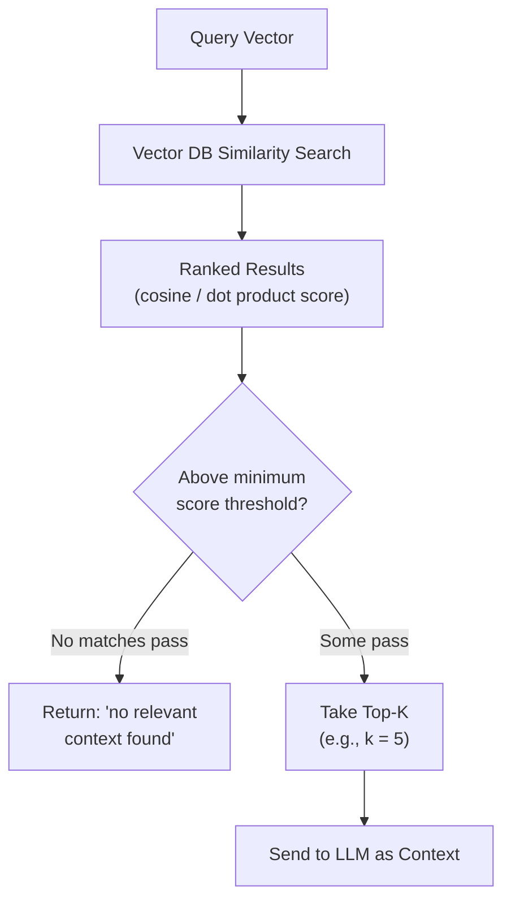

# Similarity Search and Top-K

## 1. Introduction

Once query and document vectors exist, "finding the relevant chunks" comes down to a
concrete, mathematical operation: measuring how similar two vectors are, and choosing how
many of the closest ones (`top_k`) to actually retrieve. The choice of similarity metric and
the value of `k` are small settings that quietly control a huge amount of RAG quality and
cost.

## 2. Why This Topic Exists

There is more than one valid mathematical way to measure "closeness" between two vectors, and
different embedding models are trained expecting a specific one. Getting this wrong (e.g.,
using Euclidean distance on a model trained and normalized for cosine similarity) can quietly
degrade retrieval quality without throwing any error. Similarly, `top_k` is a lever with
real trade-offs: too low and you risk missing the answer entirely; too high and you flood the
LLM's context with irrelevant material, increasing cost and sometimes actually reducing
answer quality.

## 3. Core Concept

### Beginner

Similarity search is asking "out of everything I have, which items are most alike to what
I'm looking for?" — like asking a friend to pick the 3 most similar-looking paint swatches to
the color on your wall. `Top-k` is just how many swatches you ask them to hand you: pick 1
and you might miss the true best match; ask for 50 and you're overwhelmed with mostly
irrelevant options.

### Intermediate

The three common similarity/distance metrics:

| Metric | What it measures | Range | Notes |
|---|---|---|---|
| **Cosine similarity** | Angle between two vectors, ignoring their magnitude | -1 to 1 (1 = identical direction) | Most common default for text embeddings; robust to vector length differences. |
| **Dot product** | Cosine similarity scaled by both vectors' magnitudes | Unbounded | Equivalent to cosine similarity if vectors are pre-normalized to unit length; some models are trained specifically to be compared this way. |
| **Euclidean distance (L2)** | Straight-line distance between two points | 0 to ∞ (0 = identical) | Common in general ML, less common for text embeddings; smaller = more similar (it's a distance, not a similarity). |

`Top_k` is simply the number of highest-scoring (or lowest-distance) chunks returned by the
search. A typical RAG system might set `k` between 3 and 10, depending on chunk size and how
much context the LLM's prompt budget can absorb.

### Advanced

Which metric to use is usually dictated by the embedding model, not chosen freely: most
modern sentence-transformer and API embedding models are trained and evaluated using cosine
similarity (often after L2-normalizing every vector to unit length), and many vector
databases implement cosine similarity internally *as* a dot product on pre-normalized
vectors, purely because a dot product is computationally cheaper than computing cosine
similarity from scratch on every comparison. Choosing `top_k` well interacts with two other
levers: **score thresholds** (discard results below a minimum similarity score, regardless of
`k`, so a search with no genuinely relevant matches doesn't force-return the "best of a bad
set") and **reranking** (Topic 3) — a common pattern is to retrieve a generous `top_k` (e.g.,
50) from the vector database, then rerank and truncate to a much smaller final set (e.g., 3–5)
before it reaches the LLM.

## 4. Deep Explanation

A subtle failure mode worth understanding: vector similarity search *always* returns
something, ranked by relative similarity, even if nothing in the corpus is actually relevant
to the query. If a user asks about a topic your documents never cover, a plain `top_k` search
without a score threshold will still confidently hand back its "closest" (but still
irrelevant) chunks — and a naive prompt will happily let the LLM generate an answer from
them, producing a fluent but ungrounded response. This is why production systems combine:

- **A minimum similarity threshold**, so a bad match is treated the same as no match.
- **Explicit "no good match" handling** in the prompt/application logic (feeding into
  grounded generation, Topic 11).
- Sometimes a **secondary check** (e.g., asking the LLM or a lightweight classifier whether
  the retrieved context actually answers the question) before committing to an answer.

Setting `k` too high has a cost beyond wasted tokens: retrieval-augmented generation quality
research has repeatedly found that stuffing a prompt with many chunks — including
lower-relevance ones — can dilute the model's attention and, in some cases, make it *more*
likely to produce an incorrect or unfocused answer than giving it fewer, more carefully
chosen chunks (a pattern often discussed as the model paying most attention to the beginning
and end of a long context, and less to content buried in the middle).

## 5. Step-by-Step Flow

1. Confirm which similarity metric your chosen embedding model expects (check its
   documentation — most modern text embedding models expect cosine similarity).
2. Normalize vectors if your vector database's distance function assumes normalized input.
3. Choose an initial `top_k` (commonly 3–10 for final LLM context; higher, e.g. 20–100, if
   feeding into a reranking step first).
4. Set a minimum similarity score threshold to filter out weak matches.
5. Run the similarity search and apply the threshold.
6. If reranking, pass the (larger) result set through a cross-encoder and truncate to the
   final smaller `k`.
7. If nothing survives the threshold, route to a "no relevant information found" response
   path instead of forcing an answer.

## 6. Architecture Explanation

## 7. Visual Analogy

Similarity search with `top_k` is like asking a librarian "give me the 5 books most related
to this topic." If you ask for only 1, you might miss a better book that was a close second.
If you ask for 100, you'll be handed a huge stack including books only vaguely related, and
you'll spend more time sifting than reading. And if the library genuinely has nothing on your
topic, a librarian who insists on handing you "the 5 closest anyway" is giving you a false
sense that an answer exists — better to have them say "we don't have anything on that."

## 8. Real Industry Example

Production search and recommendation systems routinely tune `top_k` and score thresholds as
a live, monitored parameter — e-commerce semantic search might retrieve `top_k=20` candidates
from a vector database and then apply business-logic filtering and reranking before showing
the final 5–10 results to a shopper. RAG-based customer support bots commonly set an explicit
minimum cosine similarity threshold (e.g., reject anything below roughly 0.7–0.75, tuned per
embedding model and domain) specifically so that off-topic questions trigger a clear
"I couldn't find anything about that in our documentation" response instead of a
hallucinated-sounding answer stitched from irrelevant chunks.

## 9. Common Misconceptions

- **"Similarity search always finds something genuinely relevant."** It always returns
  *something*, ranked by relative closeness — that's not the same as returning something
  actually relevant, which is why thresholds matter.
- **"A higher `top_k` can only help."** Beyond a point, more chunks add noise, cost, and can
  measurably reduce the LLM's answer focus and accuracy.
- **"Cosine similarity and dot product always give the same ranking."** They only produce
  identical rankings when vectors are normalized to unit length; on unnormalized vectors, dot
  product is also influenced by vector magnitude.
- **"Euclidean distance and cosine similarity always agree on what's 'closest.'** For
  normalized vectors they rank items similarly, but they aren't identical, and mixing metrics
  between indexing and querying can produce quietly wrong rankings.

## 10. Best Practices

- Use the similarity metric your embedding model was trained/evaluated with — check the
  model's documentation, don't assume.
- Normalize vectors consistently if using cosine similarity implemented as dot product.
- Set a minimum similarity threshold, not just a fixed `k`, to catch "nothing relevant found"
  cases.
- Tune `k` empirically against a real evaluation set rather than picking an arbitrary round
  number.
- When retrieving a larger candidate set for reranking, keep the final `k` sent to the LLM
  small and high-precision.

## 11. Summary

Similarity search ranks stored vectors by how close they are to a query vector, using a
metric (most commonly cosine similarity, sometimes dot product or Euclidean distance) that
should match what the embedding model expects. `Top_k` controls how many of the closest
results are returned, and needs to be tuned alongside a minimum score threshold so that
irrelevant queries produce an honest "nothing found" instead of a confidently wrong answer
built from the least-bad available chunks.

## 12. Key Takeaways

- Cosine similarity is the most common metric for text embeddings; dot product is often used
  as a cheaper equivalent on normalized vectors; Euclidean distance is less common for text.
- `Top_k` controls how many results are retrieved — too low risks missing the answer, too
  high adds noise and cost.
- Similarity search always returns a ranked list, even when nothing is truly relevant — use a
  score threshold to catch this.
- Retrieve a larger candidate set for reranking, then narrow to a small, high-precision final
  `k` before the LLM sees it.
- Match the similarity metric to what your embedding model was actually trained and
  normalized for.
