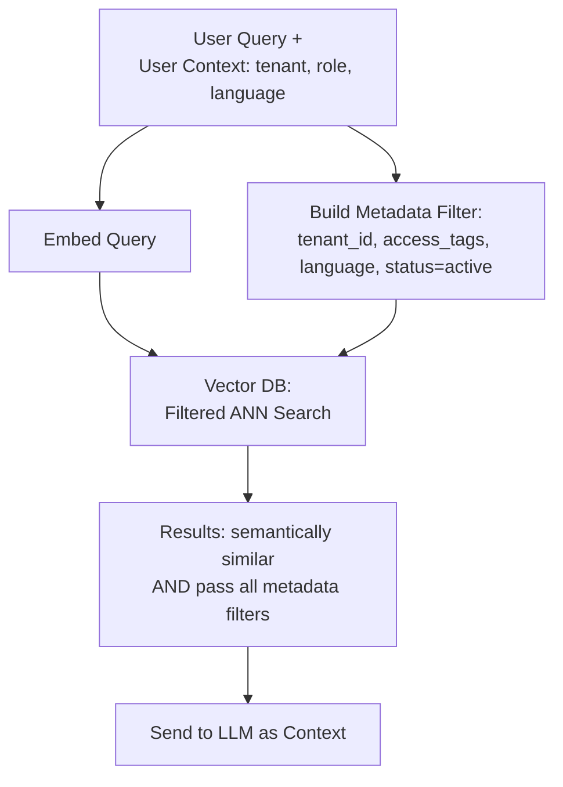

# Metadata Filtering

## 1. Introduction

Pure similarity search only knows about meaning — it has no concept of who's allowed to see a
document, how recent it is, or which department it belongs to. **Metadata filtering** adds
those real-world constraints back in, by attaching structured fields (source, date,
department, access level, language, document type) to every chunk and letting a query
combine "semantically similar to X" with "and also matches these exact filters."

## 2. Why This Topic Exists

Real-world RAG systems almost never operate over one undifferentiated pile of documents.
They need to answer questions like "search only documents this user has permission to see,"
"only return policies still in effect (not superseded ones)," or "only search the French
-language product docs for a French-speaking user." None of that can be expressed through
vector similarity alone — similarity search has no notion of permissions, dates, or exact
categorical fields. Metadata filtering exists to bring exact, structured constraints back
into what would otherwise be a purely fuzzy semantic search.

## 3. Core Concept

### Beginner

Think of metadata filtering like searching an online store: you might search for "waterproof
jacket" (the semantic part — meaning-based), but you also filter by size, color, and price
range (the metadata part — exact structured attributes). Vector search alone can find
"things similar to waterproof jacket"; metadata filtering makes sure you only see the ones in
your size that are currently in stock.

### Intermediate

Every chunk stored in the vector database carries a **payload** of metadata alongside its
vector — common fields include: source document name/ID, section or page number, creation or
last-updated date, document type, department/team owner, language, and access-control tags
(e.g., which user roles or groups may see this chunk). A query then specifies both a vector
(for semantic similarity) and a filter expression (for exact metadata matching), and the
database returns only chunks that satisfy both.

### Advanced

There are two architectural approaches to combining filtering with vector search:

- **Pre-filtering** — apply the metadata filter first to narrow the candidate set, then run
  vector similarity search only within that narrowed set. Guarantees correctness (you'll
  never get a result that fails the filter) but can be slower if the filter is very selective
  and the ANN index isn't filter-aware, since it may need to search a much smaller,
  differently-shaped subgraph.
- **Post-filtering** — run vector similarity search first across the whole index, then
  discard results that fail the metadata filter afterward. Simple to implement, but risks
  returning fewer than `k` results (or none) if the filter eliminates most of the top matches
  from the unfiltered search — it doesn't guarantee finding the true best matches *within*
  the filtered subset.

Modern vector databases (Qdrant is particularly known for this) implement **filter-aware ANN
search**, embedding the metadata filter directly into the graph traversal itself so the
search only explores nodes matching the filter from the start — combining the performance of
approximate search with the correctness of pre-filtering, without the naive slowdown of
filtering the whole index first.

## 4. Deep Explanation

Metadata filtering is what makes RAG viable for genuinely sensitive, multi-tenant, or
regulated use cases:

- **Access control / multi-tenancy** — a support bot serving many customer organizations must
  ensure Company A's documents never leak into an answer generated for Company B's user; this
  is implemented as a mandatory tenant-ID filter on every single query, not an optional
  refinement.
- **Freshness / document lifecycle** — policies get superseded, prices change, product specs
  get revised; a `status: active` or `effective_date` filter keeps outdated information from
  ever being retrieved, even if it remains in the index for audit/history purposes.
- **Language and locale** — filtering to the user's language before ranking by similarity
  avoids a semantically-close-but-wrong-language chunk from ever being retrieved.
- **Hybrid keyword + semantic + metadata search** — real production search often combines all
  three: a sparse keyword signal (for exact terms), dense vector similarity (for meaning),
  and metadata filters (for hard constraints), fused into one ranked result set.

A critical operational point: access-control filtering must be enforced at the retrieval
layer itself (as a mandatory query filter), never left to the LLM to "decide not to mention"
information it was never supposed to see in the first place — once sensitive content is in
the model's context, there's no reliable guarantee it won't leak into the answer.

## 5. Step-by-Step Flow

1. Design your metadata schema up front: what fields does every chunk need (source, date,
   owner, access tags, language, type)?
2. Attach these fields to every chunk at chunking/indexing time — they can't be reliably
   reconstructed later.
3. At query time, determine the required filters for the current user/context (e.g., their
   tenant ID, permitted access tags, preferred language).
4. Issue a combined query: vector similarity search *and* the metadata filter.
5. Enforce access-control filters as mandatory, not optional, at the database query layer —
   never as a post-hoc step applied only to the LLM's response.
6. Return the filtered, ranked results to the generation stage.

## 6. Architecture Explanation

## 7. Visual Analogy

Metadata filtering is like a hotel concierge who first checks your room key (access control:
which floors you're allowed on) and only then helps you find "a good quiet room with a view"
(semantic similarity) among the rooms you're actually permitted to book. Without the room
-key check first, a great semantic match on the wrong floor is still the wrong answer to give
you.

## 8. Real Industry Example

Enterprise RAG platforms serving multiple customer organizations (a common SaaS pattern)
enforce a mandatory tenant-ID metadata filter on every single retrieval query, so a support
agent's assistant for Company A can never retrieve Company B's internal documents, regardless
of how semantically similar the content might be. Legal and compliance-focused RAG systems
commonly filter by document status and effective date, ensuring a superseded contract clause
or an expired policy is never surfaced as if it were current — even though the outdated
version usually stays in the index for historical/audit search.

## 9. Common Misconceptions

- **"Semantic search alone is enough — the model will just ignore irrelevant results."**
  Once sensitive or wrong content is in the model's context, there's no reliable guarantee it
  won't influence or leak into the answer — filtering must happen before retrieval, not after.
- **"Post-filtering and pre-filtering are interchangeable."** Post-filtering can silently
  return fewer results than requested, or none, when the filter is highly selective — it does
  not guarantee the true best matches within the filtered subset.
- **"Access control can be handled in the prompt instead of the database query."** Prompt
  -level instructions ("don't mention Company B's data") are not a security boundary — the
  filter must be enforced at the retrieval/database layer.
- **"Metadata filtering is only useful for permissions."** It's equally valuable for
  freshness, language, document type, and any other structured constraint a pure similarity
  score can't express.

## 10. Best Practices

- Design the metadata schema before building the chunking pipeline — retrofitting metadata
  onto an already-indexed corpus means re-processing everything.
- Treat access-control filters as mandatory and enforced at the database query layer, never
  as an LLM-prompt-level suggestion.
- Prefer filter-aware ANN search (pre-filtering integrated into the index) over naive
  post-filtering when your vector database supports it.
- Index a `status`/`effective_date` field for any domain where documents get superseded or
  expire.
- Test filtered queries with realistic, highly selective filters (e.g., a rare tenant with
  very few documents) to catch "fewer than k results" edge cases early.

## 11. Summary

Metadata filtering combines exact, structured constraints (permissions, dates, language,
document type) with fuzzy semantic similarity search, making RAG viable for multi-tenant,
regulated, and time-sensitive use cases. It can be implemented as pre-filtering,
post-filtering, or (best) filter-aware ANN search, and access-control filters in particular
must always be enforced at the retrieval layer itself — never left to the LLM to selectively
ignore.

## 12. Key Takeaways

- Metadata filtering adds exact, structured constraints (access, date, language, type) on top
  of semantic similarity search.
- Pre-filtering guarantees correctness; naive post-filtering can silently under-return
  results; filter-aware ANN search gets both correctness and speed.
- Access-control filters must be enforced at the database query layer, not left to the LLM.
- Design your metadata schema before indexing — it's expensive to retrofit later.
- Freshness and language filtering are just as important as access control in many domains.
