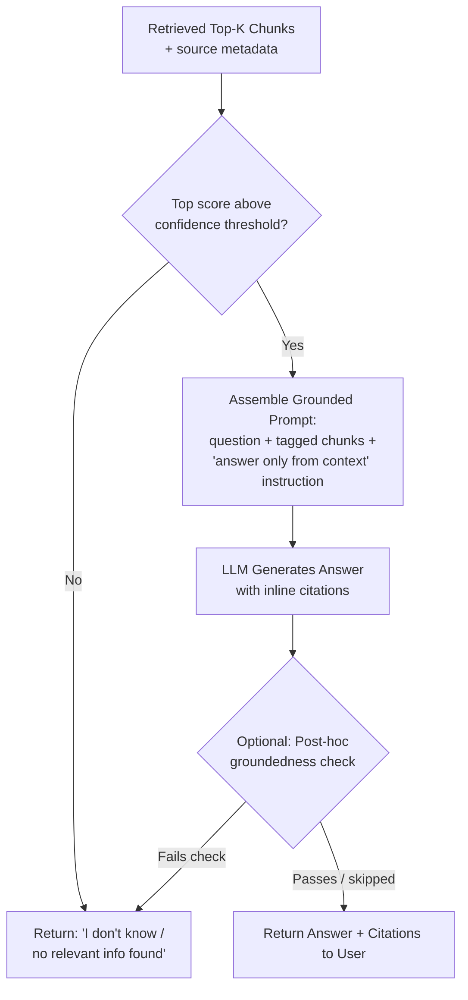

# Grounded Generation and Citations

## 1. Introduction

Retrieving the right chunks (Topics 2–10) solves only half of the RAG problem — the model
still has to actually *use* them correctly, admit when they don't answer the question, and
show its work. **Grounded generation** is the practice of prompting and constraining the
model so its answer is demonstrably built from the retrieved context rather than its own
memory, and **citations** are the mechanism that lets a reader verify exactly which source
supports each part of the answer.

## 2. Why This Topic Exists

Even with perfect retrieval, an LLM can still fail in two specific, dangerous ways: it can
blend the retrieved context with unrelated facts from its training data (producing an answer
that sounds grounded but partly isn't), or it can answer confidently even when the retrieved
context doesn't actually contain the answer. Both failures look identical to a user reading
the output — fluent, confident text — which is exactly why they're dangerous. Grounded
generation and citations exist to close this gap: they make "did the answer actually come
from the documents?" a checkable fact instead of a hopeful assumption.

## 3. Core Concept

### Beginner

Think of a grounded answer like a student writing an essay who must underline every claim and
write the page number of the textbook it came from. If they can't find a page to underline
for a claim, they're required to write "not found in the textbook" rather than make something
up. That discipline — cite everything, admit gaps — is the whole idea of grounded generation.

### Intermediate

A grounded generation prompt typically includes explicit instructions such as: "Answer only
using the information in the context below. If the context does not contain the answer, say
you don't know — do not use outside knowledge." The retrieved chunks are inserted into the
prompt, usually each tagged with a source identifier (e.g., `[Source 1]`, `[Doc: refund
-policy.pdf, p.3]`), and the model is instructed to reference those tags inline when making
claims, e.g., "Refunds are available within 30 days [Source 1]."

### Advanced

Grounding can be enforced at increasing levels of rigor:

1. **Prompt-level instruction only** — relies entirely on the model following instructions;
   cheapest, but the weakest guarantee (the model can still ignore the instruction, especially
   under ambiguous or partially-relevant context).
2. **Structured citation output** — force the model to return a structured object (e.g., via
   function calling / structured output from Week 2) containing the answer text plus an
   explicit list of source chunk IDs used, making citations machine-checkable rather than just
   embedded as free text the model might fabricate.
3. **Post-hoc verification** — after generation, run a separate check (a second LLM call, or
   a lighter classifier) that verifies each claim in the answer is actually supported by the
   cited chunk, flagging or blocking unsupported claims — sometimes called a
   "groundedness check" or "faithfulness check."
4. **Retrieval-confidence gating** — refuse to generate an answer at all (returning a fixed
   "I don't know" response) if the retrieval stage's top result falls below a similarity
   threshold (Topic 9), rather than letting the model attempt an answer from weak or
   irrelevant context.

Production systems combine several of these layers rather than relying on prompt wording
alone, because prompt instructions alone are a soft constraint that a sufficiently ambiguous
question or lightly-relevant context can still cause the model to violate.

## 4. Deep Explanation

There's an important interaction between grounding and chunk design decisions made earlier in
the pipeline: citations are only as useful as the metadata attached to each chunk (Topic 10).
If a chunk wasn't tagged with a document name, section, and location at chunking time, there
is no way to construct a meaningful citation for it at generation time — this is a strong
argument for treating metadata as mandatory chunk-time work rather than an optional add-on.

Prompting for "I don't know" reliably is itself a design challenge: a model instructed simply
to "say I don't know if you're not sure" often still guesses when the context is *partially*
relevant (contains related but not exactly matching information), because the instruction
doesn't clearly define the line between "close enough" and "not actually answering this."
Stronger prompts explicitly define what counts as sufficient support (e.g., "only answer if
the context explicitly states the fact being asked; if it only implies or partially relates
to the question, say you don't know") and are usually paired with the retrieval-confidence
gating layer described above as a second line of defense that doesn't depend on the model's
judgment at all.

## 5. Step-by-Step Flow

1. Retrieve the top-k relevant chunks (Topics 2–10), each carrying source metadata.
2. Check retrieval confidence — if the best match is below a similarity threshold, skip
   generation and return a direct "no relevant information found" response.
3. Assemble a prompt that includes: the user's question, each retrieved chunk tagged with a
   source identifier, and explicit instructions to answer only from the provided context and
   to say "I don't know" if the context doesn't contain the answer.
4. Instruct the model to cite the source identifier for every claim, ideally via structured
   output listing sources used.
5. (Optional, for high-stakes use cases) Run a post-hoc groundedness check verifying each
   claim in the answer against its cited source chunk.
6. Return the final answer to the user with visible citations (e.g., linked source names,
   footnotes, or inline tags) so the claim can be independently verified.

## 6. Architecture Explanation

## 7. Visual Analogy

Grounded generation with citations is like a journalist's fact-checking process, not just
the journalist's first draft. The reporter (the LLM) writes the article using only their
interview notes and source documents (retrieved chunks), attributes every quote and fact to
a specific source, and — critically — a fact-checker (the post-hoc verification step) later
confirms every cited claim actually traces back to what the source really said, flagging
anything that doesn't hold up before publication.

## 8. Real Industry Example

Enterprise "ask your documents" assistants and AI-powered search products (patterns used by
tools like Perplexity for web-grounded answers, and by many internal enterprise knowledge
-assistant products) display inline citation markers or footnotes next to generated claims,
letting users click through to the exact source passage. Legal and financial RAG tools go
further, often requiring a hard block on any answer that cannot be traced to a specific
clause or filing, precisely because an ungrounded but confident-sounding answer in those
domains carries real regulatory and liability risk.

## 9. Common Misconceptions

- **"Telling the model to cite sources is enough to guarantee accurate citations."** Models
  can still fabricate plausible-looking citations pointing to the wrong chunk, or cite
  correctly while still slightly misstating what the source said — this is why structured,
  checkable citations and post-hoc verification matter for high-stakes use.
- **"If retrieval worked, grounding is automatic."** The model can still ignore good retrieved
  context and answer from its own training knowledge instead, especially if the question
  sounds like something it "knows" generally.
- **"Saying 'I don't know' is a failure of the system."** In a well-designed RAG system, a
  clear "I don't know" when the documents genuinely don't cover the topic is a *success* —
  it's the alternative (a fabricated confident answer) that's the actual failure.
- **"Citations only matter for user trust."** They're also a debugging tool — when an answer
  is wrong, the citation tells you immediately whether it was a retrieval failure (wrong
  chunk cited) or a generation failure (right chunk cited, but misread).

## 10. Best Practices

- Always include an explicit "answer only from context, say you don't know otherwise"
  instruction — never assume the model will infer this on its own.
- Prefer structured citation output (explicit source IDs) over free-text citations the model
  could fabricate.
- Gate generation on retrieval confidence — don't let the model attempt an answer when the
  best retrieved match is weak.
- Add a post-hoc groundedness/faithfulness check for high-stakes domains (legal, medical,
  financial, compliance).
- Design chunk metadata (Topic 10) with citation display in mind from the start — a citation
  is only as good as the metadata behind it.

## 11. Summary

Grounded generation and citations are what turn a RAG pipeline's retrieval work into a
trustworthy, verifiable answer. Grounding means constraining the model to answer only from
retrieved context and to admit when that context doesn't contain the answer, enforced through
prompt instructions, structured output, retrieval-confidence gating, and optionally a
post-hoc verification step. Citations tie every claim back to a specific source chunk,
letting both users and engineers verify — and debug — exactly where an answer came from.

## 12. Key Takeaways

- Grounded generation constrains the model to answer only from retrieved context, and to say
  "I don't know" when that context is insufficient.
- Prompt instructions alone are a soft guarantee — structured citations and retrieval
  -confidence gating add real enforcement.
- Citations require metadata (source, section, page) attached to chunks at indexing time.
- A clear "I don't know" is a success case for RAG, not a failure to be prompted away.
- Citations double as a debugging tool: they reveal whether a wrong answer was a retrieval
  failure or a generation failure.
