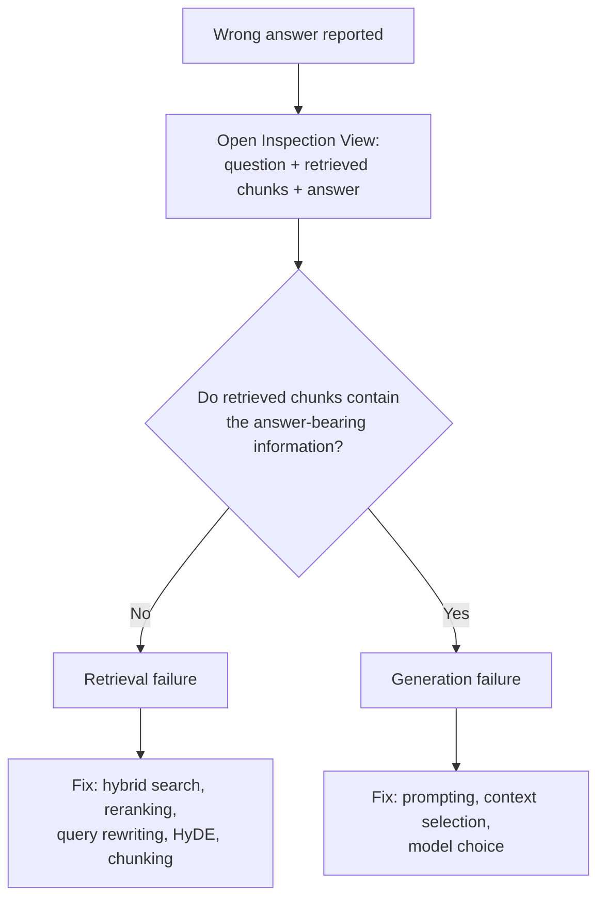
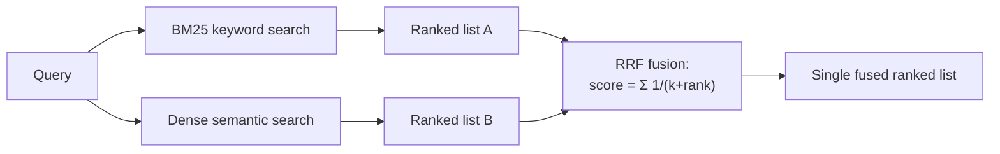
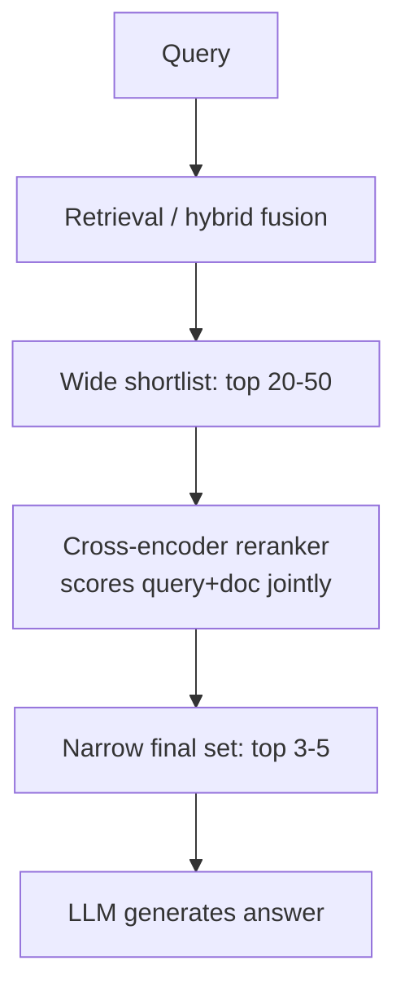
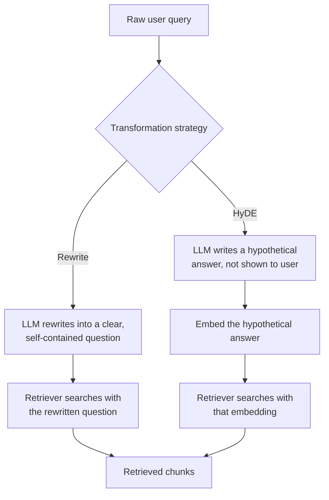
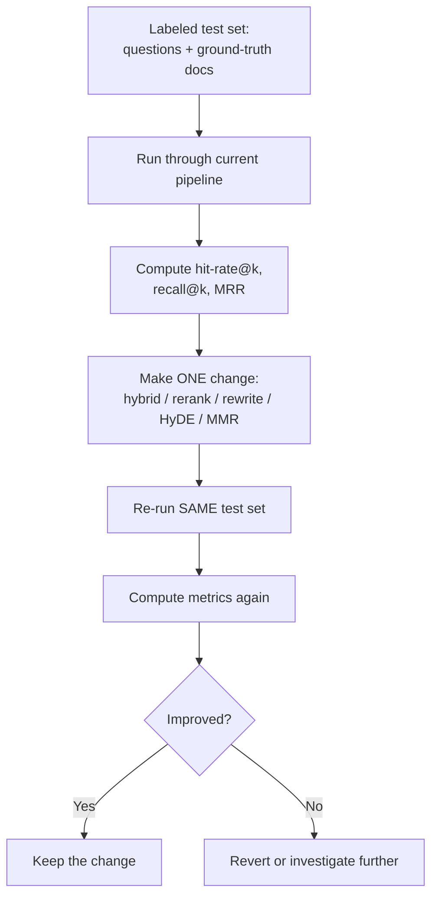

# Diagrams & Workflows — Week 4

Five Mermaid diagrams covering the core mechanisms of Week 4, each with a short caption.

## 1. Failure Separation Decision Tree

*Caption: The first diagnostic step for any wrong RAG answer — classify before you fix.*

## 2. Hybrid Search Fusion Flow

*Caption: Two independent retrieval signals, fused by rank position via Reciprocal Rank Fusion.*

## 3. Rerank-Then-Generate Pipeline

*Caption: A wide recall-oriented shortlist gets narrowed to a precise final set before it ever
reaches the LLM.*

## 4. Query Transformation Before Retrieval (Rewriting + HyDE)

*Caption: Two different ways to transform the query before it reaches the retriever — rewrite
into a better question, or generate a fake answer to search with instead.*

## 5. Measurement Loop (Prove Every Change)

*Caption: The loop that turns "I think this helped" into "I proved this helped," applied to
every technique this week.*

