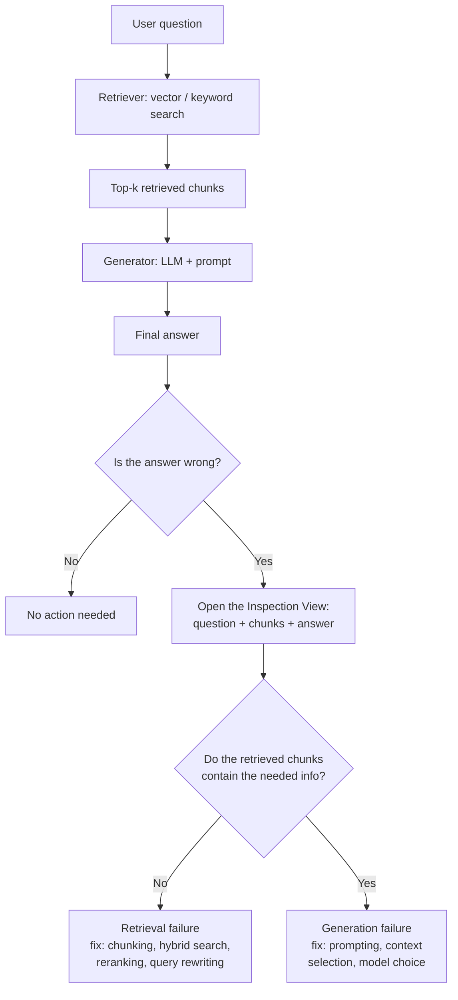

# Retrieval vs. Generation Failures

## 1. Introduction

When your RAG app gives a wrong answer, there are really only two places the failure could
have happened. Either the retriever handed the language model the wrong chunks of text, or the
retriever did its job perfectly and the language model still produced a bad answer from good
material. This topic is about learning to tell those two situations apart, quickly and
reliably, before you touch a single line of code to "fix" anything. Everything else this week —
hybrid search, reranking, query rewriting, metrics — only matters once you know which of the
two problems you actually have.

## 2. Why This Topic Exists

Teams that skip this step waste enormous amounts of time and money. A common (and expensive)
mistake looks like this: the app answers incorrectly, someone assumes "the model isn't smart
enough," and the team upgrades to a bigger, pricier model. The answers are still wrong. Why?
Because the retriever was feeding the model the wrong document the entire time — no model,
however capable, can answer a question correctly from the wrong source text. The fix was never
about the model. It was about retrieval. This topic exists to stop that waste before it starts:
by classifying every failure as retrieval or generation first, you always spend your debugging
effort on the part of the system that is actually broken.

## 3. Core Concept

### Beginner

A RAG pipeline has two stages chained together: **retrieve** (find relevant chunks of text from
your documents) and **generate** (have a language model write an answer using those chunks).
A "wrong answer" can come from either stage. If retrieval brought back the wrong chunks, the
model never had a chance — it was answering an unrelated question with unrelated material. If
retrieval brought back the right chunks, but the model ignored them, misread them, or made
something up anyway, that's a generation failure.

### Intermediate

To classify a failure you need one extra piece of information you don't get "for free" from a
normal chat UI: **what did the retriever actually return for this question?** Once you can see
the retrieved chunks next to the question and the final answer, classification becomes a simple
rule:

- Do any of the retrieved chunks actually contain the information needed to answer correctly?
  - **No** → retrieval failure. The right document either isn't in the index, isn't chunked in
    a retrievable way, or didn't score high enough to make the top-k.
  - **Yes** → generation failure. The model had what it needed and still got it wrong — through
    misreading, ignoring a chunk, over-summarizing, or hallucinating past the provided context.

### Advanced

In practice, failures often aren't purely binary. Common sub-patterns worth naming explicitly:

- **Partial retrieval**: the answer requires combining facts from two chunks, but only one was
  retrieved (a retrieval failure, specifically a recall failure).
- **Retrieved-but-buried**: the correct chunk was retrieved but ranked low (e.g., position 8 of
  10), and the model, working from a long context, effectively ignored it — this straddles both
  categories and is exactly the kind of case reranking is designed to fix.
- **Correct chunk, wrong answer due to context length**: the model had the right chunk, but it
  was cut off by a token limit or diluted by too many irrelevant chunks — a generation-adjacent
  failure that is really about how much and which context is passed to the model.
- **Ambiguous ground truth**: the question itself is ambiguous or the corpus contains
  contradictory information — neither stage failed; the input was ill-posed.

## 4. Deep Explanation

Think of a RAG system as a two-stage funnel. Stage one narrows millions of tokens of documents
down to a handful of chunks (say, top-5 or top-10). Stage two takes those chunks and the user's
question and produces natural language. Each stage has a completely different failure surface
and a completely different toolbox for fixing it.

Retrieval failures are fixed by improving *search*: better chunking, better embeddings, adding
keyword search for exact terms, reranking to fix ordering, query rewriting to fix a badly-phrased
question, or simply adding missing documents to the index. None of these touch the language
model at all.

Generation failures are fixed by improving how the model *uses* what it's given: better prompt
instructions ("only answer from the provided context," "cite the chunk you used"), a model that
follows instructions more faithfully, reducing the amount of irrelevant context so the signal
isn't drowned out, or restructuring the prompt so the most important chunk isn't lost in the
middle of a long context window (the well-documented "lost in the middle" effect).

Because the fixes are disjoint, misdiagnosis is costly in both directions: applying a
generation-side fix (bigger model, better prompt) to a retrieval-side problem changes nothing,
and applying a retrieval-side fix (reranking, hybrid search) to a generation-side problem also
changes nothing. The diagnostic step is not optional busywork — it is the highest-leverage five
minutes in the entire debugging process.

## 5. Step-by-Step Flow

1. Collect a set of real (or representative) failing questions — ideally from actual user
   traffic or a hand-written test set that mirrors it.
2. For each failing question, log three things together: the question, the exact chunks that
   were retrieved (with scores and source), and the final generated answer.
3. Read the retrieved chunks yourself and ask: "does the information needed to answer this
   correctly exist somewhere in these chunks?"
4. If no — label it a **retrieval failure** and note *why*: wrong document indexed, missing
   document, poor chunking, low ranking, or a bad query.
5. If yes — label it a **generation failure** and note *why*: ignored context, hallucination,
   misread instructions, or dilution from too many irrelevant chunks.
6. Tally the labels across your failing set. If retrieval failures dominate, your week's work
   (hybrid search, reranking, query rewriting) is exactly the right investment. If generation
   failures dominate, focus effort on prompting, context selection, and model choice instead.
7. Re-run the same failing set after any fix and re-label, so you can see the failure mix shift.

## 6. Architecture Explanation

## 7. Visual Analogy

Imagine asking a research assistant to answer a question using only documents you hand them.
If you hand them the wrong folder, they cannot write a correct memo no matter how brilliant they
are — that's a retrieval failure, and the fix is to hand them the right folder. If you hand them
exactly the right folder and they still write a wrong memo — because they skimmed page 1 and
ignored page 4, or misquoted a number — that's a generation failure, and the fix is to give them
better instructions or a more careful assistant, not a different folder.

## 8. Real Industry Example

Support-ticket RAG systems at SaaS companies are a textbook case. A common early-stage mistake:
the team notices the bot gives wrong troubleshooting steps and immediately swaps GPT-3.5 for
GPT-4, expecting the "smarter" model to reason better. Accuracy barely moves. When they finally
build a retrieval inspection log, they discover the actual problem: their knowledge base has
error codes like `ERR-4032` embedded in prose, and their dense/semantic-only retriever — tuned
for meaning, not exact tokens — routinely fails to surface the one article containing that exact
code, especially when the customer's question is phrased conversationally. Adding a keyword
search pass (Topic 3) alongside the semantic search fixed the majority of cases in a single
week, at a fraction of the cost of the model upgrade.

## 9. Common Misconceptions

- **"The answer is wrong, so the model is bad."** Often the model was never given a chance —
  check retrieval first, always.
- **"More retrieved chunks (top-20 instead of top-5) always helps."** More chunks can dilute the
  signal and trigger "lost in the middle" generation failures even when the right chunk is in
  there somewhere.
- **"If the retrieved chunks look topically related, retrieval succeeded."** Topical relevance
  is not the same as containing the specific fact needed to answer the question — always check
  for the actual answer-bearing content, not just topical overlap.
- **"This is a one-time diagnosis."** Failure mode mix shifts as your corpus, users, and query
  patterns change — re-diagnose periodically, not just once.

## 10. Best Practices

- Always log retrieved chunks (with scores) alongside every generated answer in a way you can
  inspect later — you cannot classify what you cannot see.
- Build the classification habit into your workflow before optimizing anything.
- Keep a running tally of retrieval-failure vs. generation-failure counts; let the tally, not
  intuition, decide where you invest next.
- Separate "the corpus doesn't have the answer at all" (a data problem) from "the corpus has it
  but retrieval didn't surface it" (a retrieval problem) — they need different fixes.
- Re-test the same labeled failure set after each change so you can see the mix move, not just
  a single aggregate accuracy number.

## 11. Summary

Every RAG failure is either a retrieval failure (wrong or missing chunks reached the model) or a
generation failure (the right chunks reached the model, but it still answered badly). These two
failure classes need entirely different fixes, and confusing them wastes time and money — most
visibly when teams "fix" a retrieval problem by upgrading the language model. The fastest way to
tell them apart is to inspect the question, the retrieved chunks, and the answer side by side,
which is exactly the tool built in the next topic.

## 12. Key Takeaways

- A wrong RAG answer comes from exactly one of two stages: retrieval or generation.
- Retrieval failure: the needed information never reached the model. Generation failure: it did,
  and the model still got it wrong.
- Diagnose before you fix — the two failure types require disjoint sets of fixes.
- A common costly mistake is upgrading the LLM to fix what is actually a retrieval problem.
- You cannot classify failures you cannot see — logging retrieved chunks is a prerequisite, not
  an optional nicety.
- Track the ratio of retrieval vs. generation failures over time to know where to invest effort.
