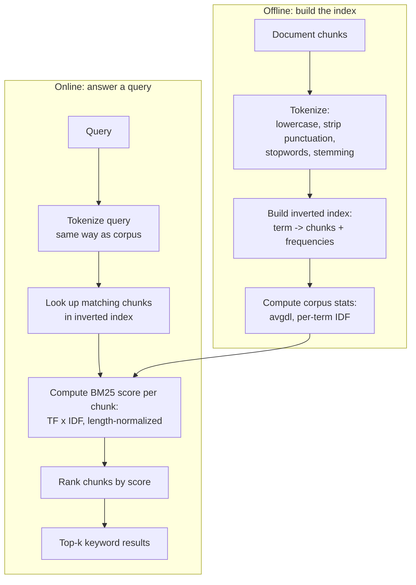

# Keyword Search: BM25

## 1. Introduction

Before embeddings existed, search engines already knew how to find relevant documents — using
exact word matching, ranked by a formula. BM25 ("Best Matching 25") is the most widely used of
these formulas, still powering large parts of web search, enterprise search, and — increasingly
— the "keyword" half of modern hybrid RAG retrieval. This topic explains what BM25 actually
computes, why it's still relevant in an embeddings-first world, and how it complements the
semantic search you built in Week 3.

## 2. Why This Topic Exists

Dense/semantic search is excellent at matching *meaning* — "how do I reset my password" will
retrieve a chunk titled "Account Recovery Steps" even though the words barely overlap. But
semantic search is comparatively bad at matching *exact tokens* it hasn't learned strong
associations for: error codes (`ERR-4032`), product SKUs, people's names, acronyms, version
numbers, legal clause numbers. These are exactly the tokens where an exact string match is not
just adequate but ideal — and BM25 is the standard, battle-tested way to do that matching with a
proper relevance ranking, rather than a crude "contains this word" filter. This topic exists to
give you a solid mental model of BM25 so that adding it as a second retrieval signal (Topic 5)
is a deliberate engineering choice, not a black box you copy-pasted.

## 3. Core Concept

### Beginner

BM25 scores how relevant a document is to a query based on the words they share, with two
common-sense adjustments: a word that's rare across your whole document collection (like
`ERR-4032`) counts for more than a word that's common everywhere (like "the" or "system"), and a
document that mentions the query words many times scores higher than one that mentions them
once — but with diminishing returns, so mentioning a word 20 times isn't 20x better than
mentioning it once.

### Intermediate

BM25 is built from three ideas combined into one formula:

- **Term frequency (TF)**: how often a query term appears in this specific document — more
  occurrences generally means more relevant, but with saturation (a term appearing 10 times
  isn't proportionally 10x more relevant than appearing once).
- **Inverse document frequency (IDF)**: how rare the term is across the entire corpus — terms
  that appear in almost every document (like "the," "system," "document") get down-weighted
  automatically because they carry little discriminating information; rare terms get up-weighted.
- **Document length normalization**: a long document naturally contains more words and could
  unfairly score higher just from length; BM25 normalizes against the average document length in
  the corpus so short, precise documents aren't penalized and long, padded documents aren't
  unfairly rewarded.

### Advanced

The BM25 formula for a document *D* and query terms *q₁...qₙ*:

```
score(D, Q) = Σ IDF(qᵢ) · [ f(qᵢ, D) · (k1 + 1) ] / [ f(qᵢ, D) + k1 · (1 - b + b · |D| / avgdl) ]
```

Where `f(qᵢ, D)` is how often term `qᵢ` appears in document `D`, `|D|` is the document's length,
`avgdl` is the average document length across the corpus, and `k1` (typically 1.2–2.0) and `b`
(typically ~0.75) are tunable hyperparameters controlling term-frequency saturation and how
strongly length normalization is applied, respectively. `IDF(qᵢ)` is typically computed as
`ln(1 + (N - n(qᵢ) + 0.5) / (n(qᵢ) + 0.5))`, where `N` is the total number of documents and
`n(qᵢ)` is how many documents contain the term. In practice you rarely hand-tune `k1`/`b` — most
search libraries (Elasticsearch, OpenSearch, `rank_bm25` in Python) ship sensible defaults — but
understanding what they control matters when BM25 behaves unexpectedly (e.g., very short chunks
scoring oddly high, which is a length-normalization effect).

## 4. Deep Explanation

BM25 belongs to a family called "sparse" retrieval methods, contrasted with the "dense"
embedding-based retrieval from Week 3. Sparse here refers to the representation: a document is
represented as a huge vector with one dimension per unique word in the vocabulary, and almost
all dimensions are zero for any given document (a document about databases has a zero in the
"astronomy" dimension). Dense embeddings compress meaning into a few hundred or thousand
dimensions where almost every dimension has some non-zero value.

This representational difference explains BM25's strengths and weaknesses directly. Because it
operates on literal tokens, BM25 has no notion of synonymy or paraphrase — "car" and
"automobile" are entirely unrelated to a BM25 index unless both words happen to appear. But for
the exact same reason, it has perfect recall on exact tokens: an error code, a part number, or a
rare technical term either is or isn't in the document, and BM25 will find it deterministically,
with no risk of the embedding model having never seen that token in a way that produced a useful
vector for it.

Practically, running BM25 requires an inverted index — a data structure mapping each unique term
to the list of documents (and positions) it occurs in — which is what libraries like
Elasticsearch, OpenSearch, Lucene, Typesense, and Postgres full-text search all build under the
hood. This is a very different infrastructure investment than a vector index (e.g., HNSW/FAISS),
which is one of the practical reasons hybrid search (Topic 5) usually means running two separate
systems and combining their outputs, rather than one system doing both.

## 5. Step-by-Step Flow

1. Build an inverted index over your document chunks: tokenize each chunk (lowercase, strip
   punctuation, optionally remove stopwords and apply stemming), and record which chunks each
   token appears in and how often.
2. Compute and cache the average document length (`avgdl`) and per-term document frequencies
   across the whole corpus — both are needed for every query, not recomputed per-query.
3. At query time, tokenize the incoming query the same way the corpus was tokenized.
4. For each query term, look up which chunks contain it (via the inverted index) and compute its
   contribution to the BM25 score for each of those chunks.
5. Sum the per-term contributions for each chunk to get its total BM25 score.
6. Sort chunks by score, descending, and return the top-k as the keyword-search result list.
7. Feed that ranked list into the fusion step (Topic 5) alongside your dense/semantic result
   list.

## 6. Architecture Explanation



## 7. Visual Analogy

BM25 is like a librarian using the index card catalog at the back of a book — not reading the
book for meaning, just checking "does the exact word 'photosynthesis' appear on these pages, and
how often, relative to how common that word is across the whole library?" It's fast, precise,
and completely literal: if you ask about "making energy from sunlight" but never say
"photosynthesis," the index card catalog won't help you — but if you know the exact term, it's
unbeatable.

## 8. Real Industry Example

Elasticsearch and OpenSearch — used by a large share of enterprise search deployments, from
e-commerce product search to internal knowledge bases — use BM25 as their default relevance
scoring algorithm (replacing the older TF-IDF-based scoring around Elasticsearch 5.0+). GitHub's
code search and Stack Overflow's search both rely on BM25-family ranking for exactly the reason
this topic covers: developers searching for an exact error message, function name, or exception
type need literal token matching, where semantic search alone would blur too many similar-looking
but functionally unrelated results together.

## 9. Common Misconceptions

- **"BM25 is obsolete now that we have embeddings."** It's a complementary signal, not a
  predecessor to be replaced — most production-grade retrieval systems in 2025-2026 run both.
- **"BM25 needs a machine-learning model."** It doesn't — it's a deterministic statistical
  formula over token counts, with no training step, no GPU, and no embedding model involved.
- **"BM25 understands word meaning to some degree."** It has zero notion of meaning or synonymy;
  its only signal is exact token overlap plus frequency statistics.
- **"Higher BM25 score always means more relevant."** It means more lexically similar under this
  particular formula — a short chunk that happens to repeat a rare word can score deceptively
  high without being the most useful chunk.

## 10. Best Practices

- Apply the same tokenization (case-folding, stemming, stopword removal) to both the corpus and
  the incoming query — mismatched tokenization silently breaks matching.
- Keep BM25 corpus statistics (avgdl, document frequencies) updated as you add or remove
  documents; stale statistics degrade scoring quality over time.
- Use BM25 as one input to hybrid search (Topic 5), not as your only retrieval method, unless
  your domain is dominated by exact-match queries (e.g., pure code search).
- Watch for short chunks scoring unexpectedly high due to length normalization; validate `b` and
  `k1` against your own corpus rather than assuming library defaults are ideal.
- Test BM25 explicitly on your known "exact code / rare term" queries — this is exactly the
  failure category it's meant to fix.

## 11. Summary

BM25 is a statistical, non-neural ranking formula that scores documents by exact term overlap,
weighted by how rare each term is (IDF) and normalized for document length. It has no concept of
meaning, but it has perfect recall on literal tokens — making it the ideal complement to
meaning-based dense retrieval, and the standard "keyword" half of modern hybrid search pipelines.

## 12. Key Takeaways

- BM25 ranks documents using term frequency, inverse document frequency, and length
  normalization — no embeddings or neural networks involved.
- It excels at exact-token queries (error codes, IDs, rare technical terms) where dense
  embeddings often underperform.
- It requires an inverted index, a different infrastructure than a vector index.
- BM25 and dense retrieval are complementary, not competing — hybrid search (Topic 5) combines
  their result lists.
- Consistent tokenization between corpus and query is essential for correct matching.
