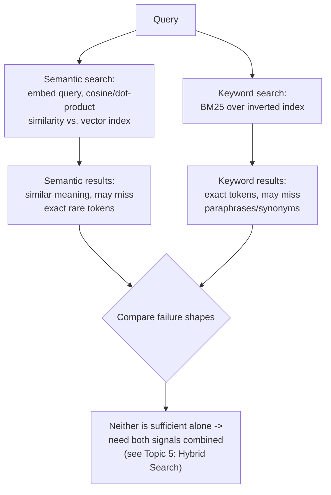

# Keyword vs. Semantic Search

## 1. Introduction

Now that you understand BM25 (keyword search) and already know dense embedding search from Week
3 (semantic search), this topic puts them side by side. The goal isn't to declare a winner — it's
to understand precisely which failure patterns each one produces, so you know exactly why hybrid
search (Topic 5) exists and what it's fixing.

## 2. Why This Topic Exists

Teams that only ever use one retrieval method eventually hit a wall of failures that look random
but actually cluster around a single cause: the method's blind spot. Semantic-only systems
mysteriously fail on exact codes and acronyms; keyword-only systems mysteriously fail on
paraphrased or conversational questions. This topic exists to make those blind spots explicit and
predictable, rather than something you discover one frustrating support ticket at a time.

## 3. Core Concept

### Beginner

Semantic search finds documents with similar *meaning* to your query, even if the words are
different ("how do I get my money back" matches a document about "refund policy"). Keyword
search finds documents that share *exact words* with your query, regardless of meaning
similarity. Neither is strictly better — they fail on different kinds of questions.

### Intermediate

| Dimension | Keyword Search (BM25) | Semantic Search (Dense Embeddings) |
|---|---|---|
| What it matches | Exact tokens / word forms | Meaning / conceptual similarity |
| Strength | Exact codes, IDs, acronyms, rare terms, names | Paraphrases, synonyms, conversational questions |
| Weakness | Synonyms, paraphrase, conversational phrasing | Rare tokens, exact codes, numbers, out-of-vocabulary terms |
| Index type | Inverted index | Vector index (e.g., HNSW) |
| Compute cost | Very cheap, no ML model needed | Requires an embedding model at index and query time |
| Explainability | Easy — you can see which words matched | Harder — similarity score doesn't show *why* |
| Fails silently on | "reset password" vs. "account recovery" (if truly zero shared words at all) | `ERR-4032`, SKU `A-9931-X`, rare proper nouns |
| Typical score behavior | Zero for queries sharing no terms at all with a document | Non-zero for almost anything (cosine similarity rarely hits exactly 0), so weak matches still "return something" |

### Advanced

The deeper distinction is about failure *shape*, not just failure *rate*. Keyword search fails
in a *sparse, sharp* way: if there's zero token overlap, the score is exactly zero — a hard,
visible miss. Semantic search fails in a *dense, soft* way: embedding similarity almost never
returns exactly zero, so an irrelevant document can still get a moderate similarity score and
sneak into the top-k, crowding out the truly relevant one — a much harder failure to notice
because "something" is always returned, and it often looks superficially plausible. This is why
semantic-only systems often fail *silently* (confidently wrong-feeling top results) while
keyword-only systems fail *loudly* (visibly zero results). Engineering for reliability means
designing around both failure shapes, which is precisely what hybrid search and reranking do.

## 4. Deep Explanation

Semantic search works by mapping text into a vector space where "distance" approximates
"difference in meaning," a mapping learned by training an embedding model on massive amounts of
text (often with a contrastive objective — pulling similar text pairs together, pushing
dissimilar pairs apart). This is powerful precisely because it generalizes: the model has seen
enough language to know "refund" and "money back" cluster near each other, without either word
appearing in the query verbatim. But that same generalization is the source of its weakness —
an embedding model's training data determines what it "knows" is similar, and rare, novel, or
highly domain-specific tokens (a newly introduced error code, an internal product name) may not
have a meaningfully learned representation, causing the model to place them somewhere
semantically arbitrary.

BM25, by contrast, has zero generalization — and that's its strength here. It doesn't need to
have "seen" `ERR-4032` during training; it just needs the token to appear in both the query and
the document, verbatim. There's no model to be out-of-distribution with respect to; it's a
counting exercise over the literal text you actually have.

This complementary pair — one method that generalizes past exact wording but can drift on rare
tokens, one method that's rigid on exact wording but has zero drift — is the entire reason hybrid
search exists. Neither replaces the other; each catches what the other structurally cannot.

## 5. Step-by-Step Flow

1. Take a sample of real user queries.
2. Run each through your semantic (dense) retriever and log the top-k results and scores.
3. Run each through your keyword (BM25) retriever and log the top-k results and scores.
4. For each query, compare: did semantic search find the right document but keyword search
   returned nothing (zero token overlap)? Did keyword search find it but semantic search ranked
   it low, crowded out by topically-similar-but-wrong documents?
5. Bucket queries into categories: "exact-term-heavy" (codes, IDs, names) and
   "conversational/paraphrase-heavy" (natural language questions).
6. Notice that the two buckets favor different retrieval methods — this is your empirical case
   for hybrid search, not just a theoretical one.

## 6. Architecture Explanation

## 7. Visual Analogy

Semantic search is like a friend who's read broadly and gets your gist even if you're vague —
but might blank on a specific serial number they've never encountered. Keyword search is like a
friend with a perfect memory for exact facts and numbers — but who takes you completely literally
and won't connect "car" with "automobile" unless you say the exact word they're expecting. You'd
want to ask both friends, then combine their answers.

## 8. Real Industry Example

E-commerce search is the clearest real-world illustration. A shopper searching "waterproof
jacket" benefits from semantic search connecting to listings titled "rain-resistant coat." The
same shopper searching an exact model number like "GTX-2200" needs keyword search, because a
semantic model has no reliable notion of what "GTX-2200" *means* — it's an arbitrary string. Most
major e-commerce search stacks (Amazon, Shopify's search infrastructure, and similar platforms)
run both signals together for exactly this reason, rather than betting the whole product search
experience on either one alone.

## 9. Common Misconceptions

- **"Semantic search is strictly an upgrade over keyword search."** It's a different tool with a
  different, non-overlapping failure mode — not a strict upgrade.
- **"If semantic search returns a high similarity score, the result is relevant."** Cosine
  similarity scores are relative, not absolute — a 0.75 score on one query and corpus may be a
  strong match, on another it may be the best of a bad set.
- **"Keyword search is old-fashioned and shouldn't be part of a modern AI stack."** It remains
  standard in production hybrid systems throughout the industry precisely because of what it
  catches that embeddings miss.
- **"We can just pick whichever performs better on our test set and use only that."** Aggregate
  performance can hide the fact that each method is winning on a *different subset* of queries —
  averaging masks exactly the complementary behavior that makes combining them valuable.

## 10. Best Practices

- Profile your own query traffic into "exact-term-heavy" vs. "conversational" buckets before
  deciding how much weight to give each retrieval method.
- Never assume one method's high aggregate score means it's covering the other method's cases —
  check per-query, not just per-average.
- Treat a BM25 score of exactly zero as a meaningful, explicit signal ("no lexical overlap at
  all"), distinct from a low-but-nonzero semantic similarity score.
- Use both methods' outputs as inputs to fusion/reranking (Topics 5-6) rather than trying to pick
  a single winner upfront.

## 11. Summary

Keyword search (BM25) and semantic search (dense embeddings) fail in structurally different,
complementary ways: keyword search misses paraphrase and synonymy but is perfectly reliable on
exact tokens; semantic search generalizes past exact wording but can drift or underperform on
rare tokens, codes, and out-of-vocabulary terms. Understanding this complementary failure
pattern — not picking a "winner" — is the conceptual foundation for hybrid search.

## 12. Key Takeaways

- Semantic search matches meaning; keyword search matches exact tokens — different tools, not a
  strict hierarchy.
- Semantic search fails softly (low but nonzero scores, hard to notice); keyword search fails
  sharply (exact zero, easy to notice).
- Rare tokens, codes, IDs, and acronyms are keyword search's strength and semantic search's
  common blind spot.
- Paraphrase and conversational phrasing are semantic search's strength and keyword search's
  common blind spot.
- Aggregate accuracy numbers can hide which method is winning on which query subset — check
  per-query behavior, not just averages.
