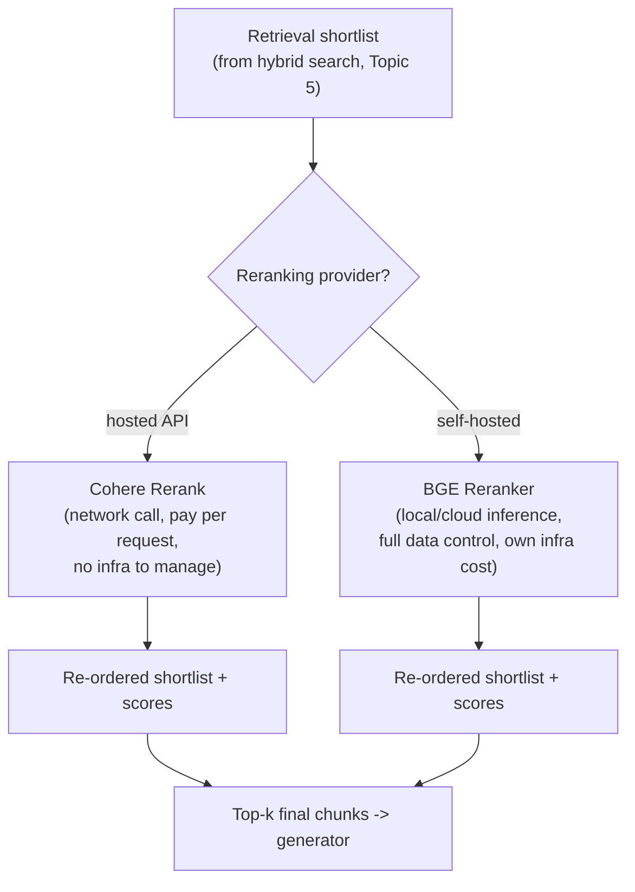

# Cohere Rerank & BGE Reranker

## 1. Introduction

Topic 6 explained what a cross-encoder reranker does conceptually. This topic covers the two most
common ways teams actually get one into production: calling a hosted reranking API (Cohere
Rerank being the best-known example), or running an open-weight reranker model yourself (the BGE
reranker family, from BAAI, being one of the most widely used). Neither choice is universally
"correct" — this topic is about understanding the trade-off so you can make a deliberate choice
for your own project.

## 2. Why This Topic Exists

Once you decide you want reranking, you immediately face a build-vs-buy decision, and it's easy
to pick one option out of familiarity rather than fit. This topic exists to lay out the real
trade-offs — cost per query, latency, data privacy, customization, and operational burden — so
that decision is made deliberately.

## 3. Core Concept

### Beginner

- **Cohere Rerank** is a hosted API: you send it a query and a list of candidate documents, it
  returns them re-ordered with relevance scores, and you pay per request/per document processed.
  No infrastructure to manage.
- **BGE reranker** (e.g., `bge-reranker-base`, `bge-reranker-large`, `bge-reranker-v2-m3`) is a
  family of open-weight cross-encoder models you download and run yourself, on your own hardware
  or cloud compute, for no per-request fee beyond your own infra cost.

### Intermediate

| Aspect | Cohere Rerank (hosted API) | BGE Reranker (open-weight, self-hosted) |
|---|---|---|
| Setup effort | Minimal — API call, no infra | Requires hosting: GPU/CPU inference, model serving |
| Cost model | Pay per request / per document scored | Pay for compute infrastructure, not per request |
| Data privacy | Query + documents leave your infrastructure | Data never leaves your own environment |
| Model updates | Provider improves the model over time, transparently | You choose when/whether to upgrade model versions |
| Multilingual support | Strong, built into the product (e.g., multilingual model variants) | `bge-reranker-v2-m3` supports multilingual; earlier variants are more English-centric |
| Customization | Limited to provided parameters | Full control — can fine-tune on your own labeled data |
| Latency | Network round trip to the provider | Local inference latency, depends on your hardware |
| Best fit | Fast prototyping, teams without ML infra, moderate query volume | High query volume, strict data residency/privacy needs, teams with ML ops capacity |

### Advanced

The decision is rarely purely technical — it's an operating-cost and risk trade-off that shifts
with scale and constraints:

- **At low-to-moderate query volume**, a hosted API's per-request cost is usually cheaper than
  standing up and maintaining dedicated GPU infrastructure for a self-hosted reranker, even
  though the open-weight model itself is "free."
- **At high query volume**, self-hosting can become materially cheaper per-query, but you take on
  the operational burden of serving, scaling, and monitoring the model yourself.
- **Data residency and privacy requirements** (healthcare, finance, government, or any contract
  with strict data-handling clauses) often make self-hosting a hard requirement regardless of
  cost, since a hosted API means sending your document text to a third party.
- **Latency-sensitive applications** need to benchmark both options directly — network round
  trips to a hosted API can dominate latency budgets in ways a co-located self-hosted model
  wouldn't, but a poorly-provisioned self-hosted deployment (e.g., CPU-only inference of a large
  model) can be slower still.
- A middle path some teams use: prototype with a hosted API to validate that reranking helps at
  all (cheaply, quickly, measured via Topic 11's metrics), then migrate to a self-hosted BGE
  model only once volume or privacy constraints justify the operational investment.

## 4. Deep Explanation

Both options are cross-encoders under the hood (Topic 6) — the difference is entirely about
*deployment*, not the underlying relevance-scoring approach. Cohere Rerank is a proprietary model
whose internals aren't published, but its interface is intentionally simple: submit a query and a
list of documents (often with a `top_n` parameter for how many reranked results to return), and
get back scores and a new ordering. It abstracts away model choice, hosting, and scaling entirely
— you trade transparency and control for convenience.

BGE rerankers are trained and released openly by BAAI (Beijing Academy of Artificial
Intelligence) as part of the broader BGE (BAAI General Embedding) family, which also includes
open-weight embedding models often used for the dense/semantic side of retrieval. Because
they're open weights, you can run them through standard inference stacks (Hugging Face
`transformers`, `sentence-transformers` cross-encoder support, optimized serving frameworks like
vLLM or TensorRT for lower latency at scale), and — if you have labeled relevance data — you can
even fine-tune them further on your own domain, something a hosted API generally doesn't allow.

Both approaches ultimately plug into the exact same architectural slot from Topic 6: they take a
query and a shortlist of retrieved candidates, and return a re-ordered list. Swapping between
them (or A/B testing one against the other) should be a matter of changing one component in your
pipeline, not restructuring the whole retrieval system — which is itself a good architectural
principle: keep the reranking step behind a clean interface so the choice of provider stays
swappable.

## 5. Step-by-Step Flow

1. Decide on your constraints first: expected query volume, data privacy requirements, latency
   budget, and available ML/infra capacity.
2. If prototyping or volume is low/uncertain, start with a hosted API (e.g., Cohere Rerank) —
   fastest path to validating whether reranking helps at all for your corpus.
3. Send your retrieval shortlist (from hybrid search, Topic 5) and the query to the reranker;
   receive back a re-ordered list with relevance scores.
4. Measure impact on hit-rate@k / MRR (Topic 11) versus no reranking, to confirm real benefit
   before committing further engineering effort.
5. If volume, cost, or privacy constraints justify it, evaluate self-hosting a BGE reranker model
   instead: benchmark latency and accuracy on your own hardware against the hosted baseline.
6. Keep the reranker behind a swappable interface in your pipeline so you can compare providers or
   migrate later without restructuring the rest of the RAG system.

## 6. Architecture Explanation

## 7. Visual Analogy

Choosing between Cohere Rerank and a self-hosted BGE reranker is like choosing between hiring a
consulting firm for a specific task versus building an in-house team to do it. The consulting
firm (hosted API) gets you started immediately with no hiring or equipment, billed per engagement
— great while you're not sure the task is even worth investing in long-term. The in-house team
(self-hosted model) costs more upfront to build and staff, but once running, handles high volume
more cheaply and keeps everything under your own roof — worth it once you know the task is
core to your operation and happens constantly.

## 8. Real Industry Example

Many RAG-as-a-product companies and internal enterprise search teams start prototypes with Cohere
Rerank specifically because it can be integrated in an afternoon and immediately shows whether
reranking measurably improves their hit-rate/MRR numbers — a fast way to justify further
investment. Teams operating at large query volume, or under strict compliance regimes (e.g.,
processing regulated healthcare or financial documents that cannot leave a private environment),
frequently migrate to self-hosted open-weight rerankers like the BGE family, run inside their own
VPC, once reranking has proven its value and the compliance or cost math favors self-hosting.

## 9. Common Misconceptions

- **"Open-weight models are always cheaper."** Only true past a certain query volume once
  infrastructure and engineering time to operate them is accounted for — at low volume, hosted
  APIs are often cheaper in total cost.
- **"Hosted rerankers are a black box you can't reason about."** You can still measure their
  effect empirically with hit-rate/MRR (Topic 11), even without seeing internals — measurement
  doesn't require transparency of the model itself.
- **"You have to pick one and commit forever."** Keeping the reranker behind a swappable interface
  makes this a reversible decision, not a permanent architectural commitment.
- **"Self-hosting means better accuracy."** Accuracy depends on the specific model and how well it
  fits your domain — self-hosting changes control and cost, not automatically accuracy.

## 10. Best Practices

- Prototype reranking's value with the lowest-effort option available before investing in
  self-hosted infrastructure.
- Keep the reranking step behind a clean interface/abstraction so switching providers is a small
  change, not a rewrite.
- Factor in data privacy/residency requirements early — they can eliminate the hosted-API option
  outright regardless of cost or convenience.
- Benchmark both latency and accuracy, not just accuracy, before choosing a production reranker —
  latency budgets matter for user-facing applications.
- Re-evaluate the choice as query volume grows — the right answer at prototype scale often isn't
  the right answer at production scale.

## 11. Summary

Cohere Rerank (hosted API) and BGE reranker (open-weight, self-hosted) are both cross-encoder
rerankers serving the same architectural role from Topic 6 — they differ in deployment model, not
underlying approach. The choice between them is a cost, latency, privacy, and operational trade-off
that should be made deliberately and revisited as scale and constraints change, not decided by
default familiarity with one option.

## 12. Key Takeaways

- Both Cohere Rerank and BGE reranker are cross-encoders — the difference is hosted-API vs.
  self-hosted deployment, not the core technique.
- Hosted APIs minimize setup effort and are often cheaper at low volume; self-hosting can be
  cheaper at high volume but adds operational burden.
- Data privacy/residency requirements can make self-hosting mandatory regardless of cost.
- Keep the reranker behind a swappable interface so the provider choice remains a reversible
  decision.
- Validate reranking's value cheaply with a hosted API before investing in self-hosted
  infrastructure, if volume/privacy constraints allow.
