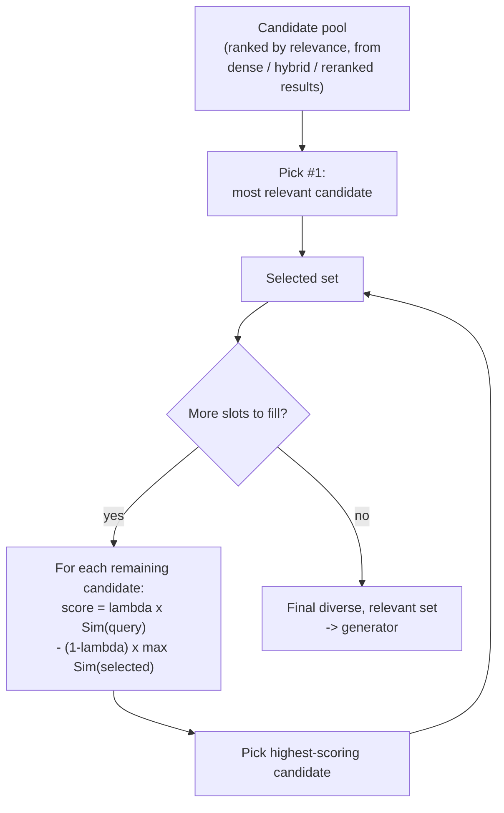

# MMR (Maximal Marginal Relevance)

## 1. Introduction

So far, every technique this week has been about finding and ranking the *most relevant* chunks.
MMR (Maximal Marginal Relevance) introduces a second, competing goal: *diversity*. It's a
re-ranking technique that deliberately avoids selecting several near-duplicate chunks, even if
they're all individually highly relevant, in favor of a set of chunks that together cover more
distinct ground. This topic explains when that trade-off is worth making and how the MMR formula
implements it.

## 2. Why This Topic Exists

Pure relevance ranking has a subtle failure mode: if your document collection has five paragraphs
that all say nearly the same thing, a similarity-based retriever will happily return all five as
your top-5 results — because they're all, individually, highly similar to the query. That's five
"slots" in your context window spent on redundant information, when a more diverse set of five
chunks might have covered five different facets of the answer instead. MMR exists to fix this by
explicitly penalizing redundancy between selected results, not just rewarding relevance to the
query.

## 3. Core Concept

### Beginner

MMR picks results one at a time, and each time it picks, it asks two questions: "how relevant is
this candidate to the query?" and "how similar is this candidate to results I've already picked?"
It prefers candidates that are relevant *and* different from what's already selected, rather than
just the single most relevant candidate regardless of overlap.

### Intermediate

The MMR formula, applied iteratively to build a result set:

```
MMR = argmax_{d ∈ candidates} [ λ · Sim(d, query) − (1 − λ) · max_{d' ∈ selected} Sim(d, d') ]
```

At each step, you pick the candidate `d` that maximizes: its similarity to the query, minus its
similarity to the most-similar item already in your selected set — weighted by `λ` (lambda),
a value between 0 and 1 that controls the relevance/diversity trade-off. `λ = 1` reduces to plain
relevance ranking (ignore diversity entirely). `λ = 0` reduces to picking maximally different
results with no regard for query relevance at all (rarely useful in practice). Most applications
use something in between, commonly around `λ = 0.5–0.7`, tuned empirically.

### Advanced

MMR is a *selection* algorithm, not a scoring-from-scratch algorithm — it operates on top of an
existing relevance ranking (from dense search, hybrid fusion, or even post-reranking) and
re-selects from that candidate pool one item at a time, recomputing the diversity penalty against
the *growing* selected set at each step. This makes it inherently sequential and somewhat more
expensive than a single sort, but the candidate pool is typically small (the same top-N shortlist
used for reranking), so the cost is manageable. It's worth being precise about what "similarity
between candidates" means here: it's typically computed the same way as query-document similarity
(e.g., cosine similarity between embeddings of the two chunks), which means MMR depends on having
good embeddings for your chunks regardless of which retrieval method originally found them.

## 4. Deep Explanation

MMR matters most when your document collection has genuine redundancy — multiple sources
covering the same fact, multiple versions of a similar policy, or a corpus assembled from
overlapping documents (e.g., several vendor manuals that repeat the same boilerplate safety
section). Without MMR, a pure top-k relevance selection can hand the generator five chunks that
are 90% duplicated content, effectively wasting most of the context window's information capacity
and — for RAG applications where the answer requires synthesizing multiple distinct facts —
directly causing generation failures, because the model was never shown the other facts it needed
even though they existed in the corpus.

It's important to be clear about what MMR is *not* solving: it is not a relevance-improvement
technique the way reranking is. Reranking (Topic 6) tries to make the top result more correct.
MMR trades away some pure top-1 relevance in exchange for a *set* that covers more ground —
appropriate specifically when your final answer needs to draw from multiple distinct chunks, or
when you're building something like a summarization or research-assistant feature rather than a
single-fact lookup. For a narrow factual question with one clearly correct answer chunk, MMR's
diversity penalty is unnecessary overhead at best and can actively hurt by displacing the single
best chunk in favor of a more "different" but less useful one.

## 5. Step-by-Step Flow

1. Run retrieval (dense, hybrid, or post-rerank) to get a candidate pool, ranked by relevance to
   the query.
2. Select the single most relevant candidate first and add it to the selected set.
3. For each remaining candidate, compute its similarity to the query and its maximum similarity
   to anything already in the selected set.
4. Compute each candidate's MMR score using the formula (weighted combination of those two
   similarities via `λ`).
5. Select the candidate with the highest MMR score; add it to the selected set.
6. Repeat steps 3-5 until you've selected the desired number of chunks (e.g., top-5).
7. Pass the MMR-selected set to the generator, instead of a plain top-k relevance selection.

## 6. Architecture Explanation



## 7. Visual Analogy

Imagine assembling a five-person expert panel to answer a broad question. If you only cared about
individual expertise, you might accidentally invite five nearly-identical specialists in the same
narrow subfield — each excellent, but collectively redundant. MMR is like a panel organizer who,
after inviting the single best expert, deliberately favors the next most qualified person who
*also* covers different ground from who's already invited — building a panel that's still
strong, but covers more of the topic overall.

## 8. Real Industry Example

MMR originated in document summarization and search-result diversification research
(Carbonell & Goldstein, 1998) and is now a standard option in production RAG frameworks —
LangChain's and LlamaIndex's retriever interfaces both expose an MMR search mode directly
alongside plain similarity search, and vector databases like Pinecone and Weaviate document MMR
as a built-in retrieval strategy. It's commonly reached for in research-assistant and
document-summarization RAG applications, where a good answer needs to synthesize several distinct
facts or perspectives rather than restate one fact five redundant ways — and deliberately
avoided in narrow factual-lookup RAG applications, where a single correct chunk is what matters
and diversity would only get in the way.

## 9. Common Misconceptions

- **"MMR always improves retrieval quality."** It trades relevance for diversity — for narrow
  factual questions with one right answer, this trade can hurt, not help.
- **"MMR is a form of reranking like a cross-encoder."** It's a different mechanism entirely —
  reranking improves per-item relevance judgment; MMR manages redundancy across a *set* of
  already-ranked items.
- **"Higher λ is always safer."** `λ` close to 1 approaches plain relevance ranking (losing MMR's
  diversity benefit entirely); the right value depends on how redundant your corpus is and
  whether your use case needs multi-fact coverage.
- **"MMR needs its own separate retrieval index."** It operates on top of whatever candidate pool
  your existing retrieval already produced — no separate index needed.

## 10. Best Practices

- Use MMR when your corpus has known redundancy (overlapping documents, repeated boilerplate) or
  when answers typically require synthesizing multiple distinct facts.
- Skip MMR (or set `λ` close to 1) for narrow factual lookup where a single correct chunk is what
  matters most.
- Tune `λ` empirically against your own labeled query set rather than assuming a default value
  transfers to your domain.
- Apply MMR to a reasonably-sized candidate pool (not the entire corpus) for computational
  efficiency — it's a selection step over a shortlist, like reranking.
- Measure the actual effect on downstream answer quality, not just diversity in the abstract — a
  more diverse chunk set is only valuable if the generator actually needs that diversity.

## 11. Summary

MMR (Maximal Marginal Relevance) re-selects a final result set from a candidate pool by balancing
query relevance against redundancy with already-selected results, controlled by a tunable λ
parameter. It's most valuable when your corpus has real redundancy or your use case requires
synthesizing multiple distinct facts, and least valuable (even counterproductive) for narrow,
single-fact factual lookup, where plain relevance ranking already selects the one chunk that
matters.

## 12. Key Takeaways

- MMR balances relevance to the query against similarity to already-selected results, via a
  tunable λ parameter.
- It's a set-selection technique, distinct from reranking (which improves per-item relevance
  judgment).
- MMR helps most with redundant corpora or multi-fact synthesis tasks; it can hurt narrow
  single-answer factual lookup by displacing the single best chunk.
- λ close to 1 approaches plain relevance ranking; λ close to 0 approaches pure diversity with no
  relevance consideration.
- Tune λ empirically against your own data rather than assuming a universal default.
