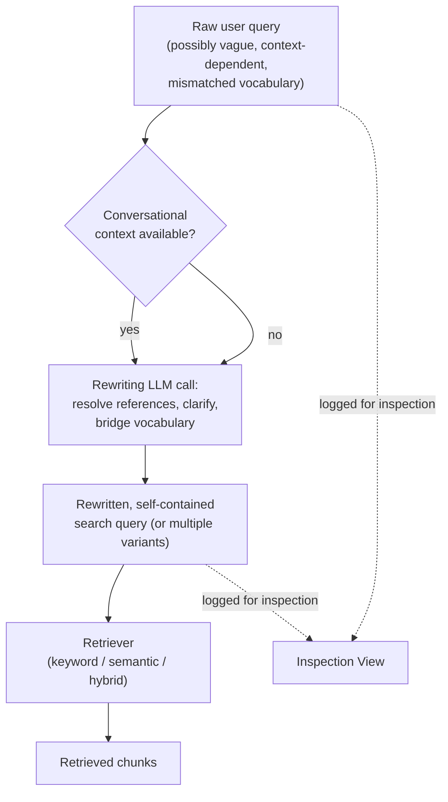

# Query Rewriting

## 1. Introduction

Not every retrieval failure is the retriever's fault — sometimes the query itself is the problem.
Real users type messy, ambiguous, context-dependent, or oddly-phrased questions ("what about the
refund thing from before, does it still apply"), and no retrieval method, however good, can
reliably match a vague query to precise document content. Query rewriting means using an LLM (or
simpler rules) to transform the raw user query into a better search query *before* it hits the
retriever. This topic covers why and how.

## 2. Why This Topic Exists

Retrieval systems — dense, keyword, or hybrid — are all optimized to match reasonably well-formed
queries against document content. A vague pronoun-laden follow-up question, a query missing key
context from earlier in a conversation, or a question phrased in a way that doesn't match how the
answer is phrased in the source documents, will underperform not because retrieval is broken, but
because the input to retrieval was poor. Query rewriting exists to close that gap, treating "the
query wasn't good" as its own diagnosable, fixable category — distinct from both retrieval
failures and generation failures from Topic 1, though it directly causes retrieval failures if
left unaddressed.

## 3. Core Concept

### Beginner

Query rewriting takes the user's raw question and produces a different, better question to
actually send to the retriever — one that's clearer, more specific, or better matched to how the
source documents are phrased. The user never sees the rewritten query; it's an internal step
between "user asks" and "system searches."

### Intermediate

Common query rewriting patterns:

- **Conversational context resolution**: turning "does it still apply?" (which only makes sense
  given prior conversation turns) into a self-contained query like "does the 30-day refund
  policy still apply after a product recall?"
- **Ambiguity clarification / decomposition**: splitting a compound question ("what's the refund
  policy and how do I contact support about it") into two separate, more targeted retrieval
  queries.
- **Vocabulary bridging**: rephrasing casual or domain-naive language ("my thing broke") into
  terms more likely to match document vocabulary ("hardware defect warranty claim process").
- **Multi-query expansion**: generating several rephrasings of the same question and retrieving
  for each, then merging/deduplicating the results — a way to hedge against any single phrasing
  missing the mark.

### Advanced

Query rewriting is typically implemented as a small, focused LLM call — often a cheaper/faster
model than your main generation model, since the task (rewrite this question) is much simpler
than answering it — placed as an explicit pipeline stage before retrieval. Design considerations
that matter in practice: the rewriting prompt should be given relevant conversation history (for
context resolution) but instructed to produce a *self-contained* query with no unresolved
pronouns or references; multi-query expansion trades latency and cost (multiple retrieval calls
instead of one) for improved recall, so it's typically reserved for cases where a single query has
historically underperformed; and rewriting introduces a new failure surface of its own — a bad
rewrite (one that drifts from the user's actual intent) can *cause* a retrieval failure that
wouldn't have happened with the original query, so rewritten queries should be logged in your
inspection view (Topic 2) just like everything else, and inspected specifically when a rewritten
pipeline underperforms an unrewritten baseline.

## 4. Deep Explanation

The core insight behind query rewriting is that the "query" and the "documents" don't have to be
phrased in the same register for retrieval to work, but retrieval works *better* the closer they
are, especially for exact-match-sensitive methods like BM25. A user's raw question reflects how
they think about their problem; the source documents reflect how the organization that wrote them
thinks about the same problem. Query rewriting is a deliberate bridge between those two framings,
performed once, cheaply, before the expensive parts of the pipeline (retrieval, reranking,
generation) run.

This is closely related to, but distinct from, HyDE (Topic 10): query rewriting keeps the output
in "question" form (a better question), while HyDE goes further and generates a hypothetical
*answer* to search with instead of any question at all. Both share the same underlying strategy —
transform the query before retrieval, using an LLM's ability to bridge phrasing gaps that
retrieval alone cannot.

Query rewriting also directly interacts with the failure taxonomy from Topic 1: if your inspection
view shows a case where the retrieved chunks simply don't relate to the (raw) query at all, before
concluding this is purely a "retrieval failure" requiring better search infrastructure, check
whether a rewritten version of that same query would have retrieved successfully with your
*existing* retriever. If yes, the fix is upstream of retrieval — the query itself was the problem
— and query rewriting, not hybrid search or reranking, is the right investment.

## 5. Step-by-Step Flow

1. Capture the user's raw query, plus any relevant conversation history if the app is
   conversational.
2. Send the raw query (and context) to a rewriting LLM call with a focused prompt: "rewrite this
   into a clear, self-contained, specific search query; resolve any pronouns or references using
   the conversation history provided."
3. Optionally generate multiple rewritten variants if you're using multi-query expansion.
4. Send the rewritten query (or queries) to your retriever (keyword, semantic, or hybrid) instead
   of the raw user query.
5. If using multi-query expansion, merge and deduplicate the resulting candidate lists (e.g., via
   RRF, same as Topic 5) before reranking or generation.
6. Log both the raw query and the rewritten query in your inspection view (Topic 2), so a later
   failure can be traced to either stage.
7. Measure retrieval metrics (Topic 11) with and without rewriting on the same query set, to
   confirm it's actually improving results rather than introducing drift.

## 6. Architecture Explanation

## 7. Visual Analogy

Query rewriting is like a skilled translator standing between a customer and a specialist. The
customer says "my thing keeps making a weird noise" — vague, informal, incomplete. The translator
doesn't just repeat that to the specialist; they ask a clarifying question or draw on context to
relay something precise: "the customer's washing machine makes a grinding noise during the spin
cycle." The specialist (retrieval) can now do their job far more effectively, not because they got
smarter, but because the question they received was already clearer.

## 8. Real Industry Example

Conversational enterprise search and customer-support RAG products (e.g., systems built on top of
frameworks like LangChain's `ConversationalRetrievalChain` and its successors, or custom pipelines
at companies running multi-turn support chatbots) very commonly include an explicit
"condense question" or "standalone question" rewriting step before retrieval — specifically
because raw follow-up questions in a conversation ("what about after 30 days?") are close to
meaningless to a retriever without being rewritten into something self-contained ("does the
refund policy apply after 30 days from purchase?"). Teams that skip this step routinely report
retrieval quality collapsing specifically on multi-turn conversations, even when single-turn
question quality looks fine.

## 9. Common Misconceptions

- **"Query rewriting is only useful for multi-turn conversations."** It also helps single-turn
  queries with vocabulary mismatches, ambiguity, or compound questions — conversational context
  resolution is just the most common use case, not the only one.
- **"A rewritten query is always better than the original."** A bad rewrite can drift from the
  user's actual intent and cause a retrieval failure that wouldn't have happened otherwise —
  rewriting needs its own quality checks, not blind trust.
- **"Rewriting requires a large, expensive model."** The rewriting task itself is usually simple
  enough for a small, fast, cheap model — you don't need your best (and priciest) LLM for this
  step.
- **"Multi-query expansion is always worth the extra cost."** It adds latency and retrieval calls;
  reserve it for query types that have measurably benefited from it, not as a blanket default.

## 10. Best Practices

- Give the rewriting step explicit instructions to produce a self-contained query with no
  unresolved references.
- Use a smaller/cheaper model for rewriting than for final answer generation — the task
  complexity doesn't warrant your most expensive model.
- Log both raw and rewritten queries in your inspection view so failures can be traced to the
  right stage.
- Measure retrieval metrics with and without rewriting on the same test set before assuming it
  helps.
- Reserve multi-query expansion for query patterns that have demonstrated benefit from it, given
  its added latency and cost.

## 11. Summary

Query rewriting inserts an LLM-powered (or rule-based) transformation step between the user's raw
question and the retriever, fixing retrieval failures that stem from vague, context-dependent, or
vocabulary-mismatched queries rather than from the retriever itself. It's especially important in
conversational RAG applications, where follow-up questions are often meaningless to a retriever
without being resolved into a self-contained form first.

## 12. Key Takeaways

- Query rewriting transforms the raw user query into a better search query before retrieval runs.
- Common patterns: conversational context resolution, ambiguity clarification/decomposition,
  vocabulary bridging, and multi-query expansion.
- A bad rewrite can introduce its own retrieval failures — log and inspect rewritten queries, not
  just raw ones.
- Rewriting is usually cheap (a small/fast LLM call) relative to the retrieval and generation
  stages it precedes.
- Query rewriting is closely related to, but distinct from, HyDE (Topic 10), which rewrites
  toward a hypothetical answer rather than a better question.
