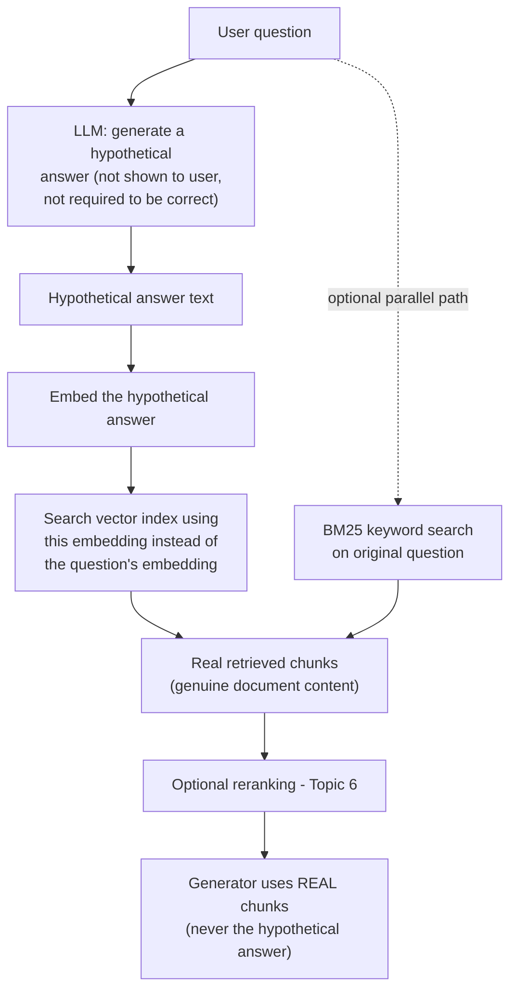

# HyDE (Hypothetical Document Embeddings)

## 1. Introduction

HyDE (Hypothetical Document Embeddings) is a counter-intuitive but well-validated retrieval
technique: instead of embedding the user's *question* and searching for similar documents, you
first ask an LLM to write a fake, plausible-sounding *answer* to the question — with no
retrieval involved yet — and then embed *that* fake answer and use it to search your document
collection. This topic explains why searching with a fabricated answer routinely outperforms
searching with the real question, and where the technique fits among everything else this week.

## 2. Why This Topic Exists

Dense/semantic search works by comparing the embedding of your query against the embeddings of
your documents. But questions and answers are often phrased very differently — a question is
interrogative, short, and abstract ("what's the maximum liability under the service agreement?");
the document text that actually answers it is declarative, specific, and long ("Provider's total
liability under this Agreement shall not exceed the fees paid in the preceding twelve months...").
Embedding models trained primarily to capture semantic similarity between similarly-structured
text can struggle to bridge that question-vs-answer asymmetry — a question's embedding may
actually be closer, in vector space, to *other questions* than to the *answer text* that would
satisfy it. HyDE exists to close that gap by generating something in "answer" form before
embedding, so the thing being searched with is structurally similar to what it's searching for.

## 3. Core Concept

### Beginner

HyDE works in two steps: first, ask an LLM to write a hypothetical answer to the user's question
— it doesn't need to be factually correct, since it's never shown to the user or used as the
final answer, only used for the search step. Second, embed that hypothetical answer (instead of
the original question) and use it to search your document collection for real, similar documents.

### Intermediate

The reasoning behind why this works: a well-written hypothetical answer, even if factually wrong
in its specifics, tends to be phrased the *way real answers are phrased* — using the vocabulary,
structure, and level of detail that actual source documents use. Embedding it and comparing
against real documents is therefore comparing "answer-shaped text" against "answer-shaped text,"
which tends to align much better in vector space than comparing "question-shaped text" against
"answer-shaped text." The hypothetical answer acts as a bridge: the LLM's general world knowledge
(even if imprecise about your specific corpus) is often enough to guess the right *shape and
vocabulary* of a correct answer, and that shape is what drives retrieval.

### Advanced

HyDE's effectiveness is not universal — it depends heavily on how well the LLM's general
knowledge overlaps with your domain and how divergent your document phrasing is from natural
question phrasing:

- **Where HyDE tends to help most**: broad-knowledge domains (general technical topics, common
  business concepts, well-known regulatory frameworks) where an LLM's pretraining gives it a
  reasonable guess at the right vocabulary and structure of an answer, even without your specific
  documents.
- **Where HyDE tends to help less, or can hurt**: highly specific, proprietary, or unusual domains
  where the LLM has no real basis for guessing plausible content (e.g., an internal company's
  unique product naming conventions, or genuinely novel technical specifics) — the hypothetical
  answer can drift into generic-sounding text that doesn't actually resemble your specific
  documents, actively misleading the search compared to just using the real question.
- **Cost and latency**: HyDE requires an extra LLM call before retrieval even starts, adding
  latency and cost to every single query — a real trade-off against its retrieval-quality benefit
  that should be measured, not assumed.
- **Combinability**: HyDE is not mutually exclusive with hybrid search, reranking, or query
  rewriting — you can generate a hypothetical answer, embed it for the semantic-search half of a
  hybrid pipeline, potentially still run BM25 against the original question's exact tokens (since
  HyDE's benefit is specifically about semantic/embedding-based search), and rerank the fused
  results as usual.

## 4. Deep Explanation

To make the asymmetry concrete: suppose a user asks "how do I get a refund?" A dense retriever
embeds this five-word question and compares it against document chunk embeddings. The actual
best-matching chunk might read: "Customers may request a reimbursement within 30 days of
purchase by submitting Form RF-1 through the account portal; reimbursements are processed within
5-7 business days." That chunk shares almost no surface vocabulary with the question ("refund" vs.
"reimbursement," "how do I get" vs. procedural instructions) and is far longer and more specific
in structure — the embedding model has to do real semantic work to bridge the gap.

With HyDE, the LLM is instead asked to write a plausible answer to "how do I get a refund?" — it
might generate something like: "To get a refund, you typically need to submit a refund request
form within a certain number of days of your purchase, after which the refund is processed within
a business week." This is not a *correct* answer for this specific company's policy — it's a
generic, plausible-sounding one — but notice it now shares far more structural and vocabulary
overlap with the real document chunk (procedural tone, mentions of forms, timeframes, processing)
than the original five-word question did. Embedding this hypothetical answer and searching with
it is now comparing structurally similar text to structurally similar text, which is exactly the
regime dense embedding models are best at.

This is why HyDE is sometimes described as using the LLM's generative knowledge to compensate for
the retriever's representational mismatch — it doesn't require the hypothetical answer to be
correct, only close enough in vocabulary and shape to real answers that the embedding comparison
becomes easier.

## 5. Step-by-Step Flow

1. Receive the user's query.
2. Send it to an LLM with a prompt like: "Write a plausible, detailed answer to this question,
   even if you're not sure it's correct. Do not say you don't know." (Never show this output to
   the user directly.)
3. Embed the resulting hypothetical answer text using your standard embedding model.
4. Use that embedding to search your vector index, instead of embedding the original question.
5. Retrieve the top-k real document chunks most similar to the hypothetical answer's embedding.
6. Optionally combine with BM25 keyword search on the original question (Topic 5) and/or rerank
   the results (Topic 6).
7. Pass the real retrieved chunks (never the hypothetical answer itself) to the generator for the
   actual final answer.
8. Measure retrieval metrics (Topic 11) with and without HyDE on your own query set to confirm
   it's actually helping for your specific domain before adopting it permanently.

## 6. Architecture Explanation

## 7. Visual Analogy

Imagine trying to find a matching puzzle piece by comparing the shape of an empty hole (the
question) against a pile of puzzle pieces (the documents) — an awkward comparison, since a hole
and a piece are different shapes to begin with. HyDE is like first sketching a rough guess of what
piece might fit that hole, based on general intuition, and then comparing *that sketch* (a
piece-shaped guess) against the real pieces in the pile. Even though the sketch isn't a real
piece, its shape is closer to what you're actually looking for than the shape of the hole was,
making the comparison easier.

## 8. Real Industry Example

HyDE was introduced in the paper "Precise Zero-Shot Dense Retrieval without Relevance Labels"
(Gao et al., 2022) and demonstrated strong zero-shot retrieval improvements across multiple
benchmark datasets, without any task-specific training or labeled relevance data — a particularly
attractive property for teams building retrieval for a new domain with no existing labeled query
set. It has since been adopted as an optional retrieval strategy in RAG frameworks including
LlamaIndex and LangChain, typically offered as a configurable retrieval mode teams can A/B test
against plain dense retrieval on their own corpus, exactly because its benefit is domain-dependent
rather than universal.

## 9. Common Misconceptions

- **"HyDE's hypothetical answer needs to be factually accurate."** It doesn't — its only job is to
  be structurally and vocabulary-similar to real answers; factual correctness is irrelevant since
  it's never shown to the user.
- **"HyDE replaces the need for real retrieval."** It's a query transformation technique that
  still ends with retrieving and using real document chunks — the hypothetical answer itself is
  discarded after the search step.
- **"HyDE always improves retrieval."** Its benefit depends on domain overlap with the LLM's
  general knowledge; on highly specific or proprietary domains it can underperform plain question
  embedding — measure before adopting.
- **"HyDE adds no cost."** It requires an additional LLM generation call before every retrieval,
  adding both latency and per-query cost that should be weighed against its measured benefit.

## 10. Best Practices

- Never show the hypothetical answer to the user — it exists purely to improve the search step
  and may contain fabricated specifics.
- A/B test HyDE against plain embedding-based retrieval on your own labeled query set (Topic 11)
  before adopting it — its benefit is domain-dependent, not guaranteed.
- Consider combining HyDE's semantic search with BM25 keyword search on the original question,
  since HyDE's benefit is specific to embedding-based matching and doesn't help exact-token
  matching.
- Use a fast, cheap model for hypothetical answer generation where possible, since it's an added
  latency cost on every query.
- Expect HyDE to help more in broad-knowledge domains and less (or not at all) in highly
  specific/proprietary domains — factor this into whether it's worth trying for your corpus.

## 11. Summary

HyDE improves dense retrieval by generating a hypothetical (not necessarily correct) answer to
the user's question with an LLM, embedding that hypothetical answer instead of the question, and
using it to search the document collection — because answer-shaped text tends to match
answer-shaped document content far better than question-shaped text does. Its benefit depends on
how well the LLM's general knowledge overlaps with your specific domain, and it adds an extra LLM
call's worth of latency and cost, so — like every technique this week — it should be measured, not
assumed.

## 12. Key Takeaways

- HyDE searches using the embedding of a fabricated hypothetical answer, not the user's actual
  question.
- The hypothetical answer's factual accuracy doesn't matter — only its resemblance in vocabulary
  and structure to real document content matters, and it's never shown to the user.
- HyDE works by closing the question-vs-answer phrasing gap that plain dense retrieval struggles
  with.
- Its effectiveness is domain-dependent — strongest in broad-knowledge domains, weaker in highly
  specific/proprietary ones.
- HyDE adds an extra LLM call (latency and cost) per query and should be validated with retrieval
  metrics before adoption, not assumed to help universally.
