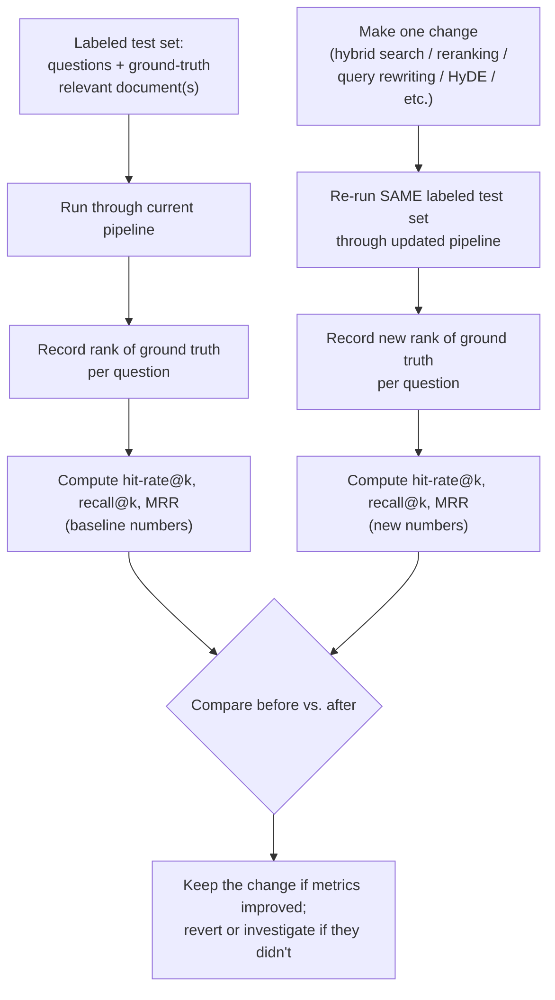

# Retrieval Metrics: Hit-Rate, Recall, MRR

## 1. Introduction

Every technique this week — hybrid search, reranking, query rewriting, HyDE, MMR — is a change
you could make to your retrieval pipeline. But "I made a change" is not the same as "I made an
improvement." This topic covers the three standard, easy-to-compute metrics that let you prove,
with a number, whether a change actually helped: hit-rate@k, recall@k, and Mean Reciprocal Rank
(MRR). This is the topic that turns everything else this week from "seems like it should help"
into "measured, and it helped."

## 2. Why This Topic Exists

Without metrics, evaluating a retrieval change means eyeballing a handful of example queries and
forming a gut impression — a process highly vulnerable to confirmation bias (you tend to notice
the examples that support the change you wanted to make) and to small sample sizes (five examples
looking better proves very little). These metrics exist to replace that gut impression with a
reproducible number, computed the same way, before and after a change, over the same set of test
queries — so "did hybrid search help?" gets answered with "hit-rate@3 went from 0.62 to 0.81,"
not "yeah, it feels better."

## 3. Core Concept

### Beginner

All three metrics need one thing you have to prepare in advance: a set of test questions where
you already know which document(s) contain the correct answer (called the "ground truth" or
"relevant document" for each question). You then run each question through your retriever and
check whether the ground-truth document actually showed up in the results, and if so, where.

- **Hit-rate@k**: out of all your test questions, what fraction had the correct document appear
  *anywhere* in the top k results? A simple yes/no per question, averaged.
- **Recall@k**: when a question has *multiple* correct documents, what fraction of *all* of them
  showed up in the top k results? (For questions with exactly one correct document, recall@k and
  hit-rate@k give the same answer for that question.)
- **MRR (Mean Reciprocal Rank)**: instead of just yes/no, MRR also cares about *where* in the
  ranking the first correct document appeared — a correct document at rank 1 scores much higher
  than one buried at rank 8, even though both would count as a "hit" under hit-rate@k.

### Intermediate

Formulas:

**Hit-rate@k** (also called Success@k):
```
Hit-Rate@k = (number of queries where at least one relevant doc is in the top k) / (total number of queries)
```

**Recall@k** (per query, then averaged):
```
Recall@k (for one query) = (number of relevant docs found in top k) / (total number of relevant docs for that query)
Recall@k (overall) = average of the per-query recall@k values across all queries
```

**MRR (Mean Reciprocal Rank)**:
```
Reciprocal Rank (for one query) = 1 / (rank position of the first relevant document found)
                                 = 0 if no relevant document was found at all
MRR = average of the reciprocal ranks across all queries
```

### Advanced

Choosing the right metric (and the right k) depends on what your pipeline actually does with the
retrieved results:

| Metric | What it captures | Best used when |
|---|---|---|
| Hit-rate@k | Binary: did retrieval succeed at all within the top k? | You pass a fixed top-k to the generator and only care whether the answer-bearing doc made the cut, not its exact position |
| Recall@k | Fraction of *all* relevant docs retrieved, for multi-document answers | Questions often require synthesizing facts from more than one chunk (e.g., MMR-relevant scenarios, Topic 8) |
| MRR | Position-sensitive: rewards the correct doc being *near the top*, not just present | You care about ranking quality specifically — e.g., evaluating a reranker (Topic 6), where the whole point is moving the best result higher |

Note the relationship between hit-rate and MRR specifically: hit-rate@k is blind to position
within the top k (rank 1 and rank k score identically — both just "hit"), while MRR rewards rank 1
far more than rank k. This is precisely why MRR is the preferred metric for evaluating *reranking*
specifically — a reranker's entire job is to move the right answer from, say, rank 8 to rank 1,
and hit-rate@10 would show *no change at all* for that improvement (both cases are "a hit within
top 10"), while MRR would show a clear, large improvement (1/8 = 0.125 jumping to 1/1 = 1.0).

## 4. Deep Explanation — Worked Numeric Example

Suppose you have a labeled test set of 5 questions, each with exactly one known-correct document
(ground truth). You run your retriever and get back the following ranked results (showing only
which rank position, if any, the correct document appeared at):

| Query | Correct doc's rank in results (top 5 shown) |
|---|---|
| Q1 | Rank 1 |
| Q2 | Rank 3 |
| Q3 | Not found in top 5 |
| Q4 | Rank 1 |
| Q5 | Rank 2 |

**Hit-rate@3** (did the correct doc appear in the top 3?):
- Q1: rank 1 ≤ 3 → hit
- Q2: rank 3 ≤ 3 → hit
- Q3: not found → miss
- Q4: rank 1 ≤ 3 → hit
- Q5: rank 2 ≤ 3 → hit
- Hit-rate@3 = 4 hits / 5 queries = **0.80**

**Recall@3** (single correct doc per query, so identical to hit-rate@3 here):
- Recall@3 = **0.80** (would differ from hit-rate only if some queries had multiple correct
  documents — e.g., a query with 2 correct docs where only 1 was retrieved in the top 3 would
  contribute 0.5 to the average instead of a full 1)

**MRR** (reciprocal rank of the first correct doc, using its actual rank, not capped at 3):
- Q1: rank 1 → 1/1 = 1.000
- Q2: rank 3 → 1/3 = 0.333
- Q3: not found → 0
- Q4: rank 1 → 1/1 = 1.000
- Q5: rank 2 → 1/2 = 0.500
- MRR = (1.000 + 0.333 + 0 + 1.000 + 0.500) / 5 = 2.833 / 5 = **0.567**

Now suppose you add reranking (Topic 6), and it successfully moves Q2's correct document from
rank 3 to rank 1, and Q3's correct document — previously not found in the top 5 at all — is now
found at rank 4 (still outside top 3, so hit-rate@3 doesn't change for Q3):

| Query | New rank after reranking |
|---|---|
| Q1 | Rank 1 |
| Q2 | Rank 1 (was rank 3) |
| Q3 | Rank 4 (was not found) |
| Q4 | Rank 1 |
| Q5 | Rank 2 |

- **New Hit-rate@3** = still 4/5 = **0.80** (Q3 still isn't in the top 3, no visible change at
  this k, even though reranking clearly improved things for Q2 and partially for Q3)
- **New MRR** = (1.000 + 1.000 + 1/4 + 1.000 + 0.500) / 5 = (1 + 1 + 0.25 + 1 + 0.5) / 5 =
  3.75 / 5 = **0.75**

This worked example demonstrates the exact point made above: hit-rate@3 was completely blind to
the real improvement in Q2's ranking (both "rank 3" and "rank 1" count as "hit" at k=3), while MRR
rose noticeably (0.567 → 0.75), correctly reflecting that the correct answer is now appearing much
higher on average. This is why you should track more than one metric, and why MRR specifically is
the metric of choice when evaluating reranking.

## 5. Step-by-Step Flow

1. Build a labeled test set: a list of realistic questions, each annotated with which document(s)
   actually contain the correct answer (ground truth) — ideally 30-100+ questions drawn from real
   usage or carefully hand-written to mirror it.
2. Run each question through your current retrieval pipeline and record the full ranked list of
   retrieved document IDs (not just the top-1).
3. For each question, find the rank position(s) of the ground-truth document(s) within that
   ranked list (or note "not found" if absent from the results entirely).
4. Compute hit-rate@k, recall@k, and MRR across the whole test set using the formulas above —
   pick k values that match what you actually pass to your generator (e.g., k=3 or k=5).
5. Record these numbers as your baseline.
6. Make one change (e.g., add hybrid search, or add reranking, or add query rewriting).
7. Re-run the exact same labeled test set through the updated pipeline and recompute the same
   metrics.
8. Compare before/after numbers directly — this is your proof the change helped, hurt, or made no
   measurable difference.
9. Repeat for each subsequent change, ideally isolating one change at a time so you know which
   specific change caused which specific metric movement.

## 6. Architecture Explanation



## 7. Visual Analogy

Think of these metrics like a sports team tracking stats instead of just "feeling" like they
played better. Hit-rate is like "did we score at all in this game" — a coarse yes/no. Recall is
like "of all the scoring opportunities available, how many did we convert." MRR is like tracking
not just whether you scored, but how early in the game your first goal came — rewarding a team
that scores in the first five minutes over one that barely squeaks out a goal in injury time, even
though both "scored a goal" under the coarser metric.

## 8. Real Industry Example

Search and recommendation teams at companies running large-scale information retrieval systems
(web search engines, e-commerce search, enterprise knowledge bases) maintain exactly this kind of
labeled evaluation set — often called a "golden set" or "eval set" — and run it automatically
against every proposed change to their retrieval pipeline before shipping, precisely so that a
change is only deployed if it demonstrably improves metrics like these on held-out labeled data,
rather than being shipped on the basis of a few promising-looking manual spot checks. RAG
evaluation frameworks (e.g., RAGAS, TruLens, LlamaIndex's evaluation modules) explicitly implement
hit-rate, recall, and MRR-style metrics as first-class, reusable evaluation functions for exactly
this reason.

## 9. Common Misconceptions

- **"Eyeballing a few examples is good enough before shipping a retrieval change."** Small,
  unlabeled, manually-picked samples are highly vulnerable to confirmation bias and simply don't
  generalize — a proper labeled test set and these metrics remove that risk.
- **"Hit-rate@k and recall@k are the same thing."** They're identical only when every query has
  exactly one correct document; recall@k specifically accounts for questions with multiple
  correct documents, which hit-rate@k does not.
- **"A higher k always makes hit-rate/recall look better, so use a large k."** Yes, but a large k
  only matters if your downstream pipeline actually uses that many results — always match k to
  how many chunks you actually pass to the generator, or the metric misrepresents real-world
  behavior.
- **"MRR and hit-rate always move together."** They can diverge, as shown in the worked example
  above — a reranking improvement can raise MRR substantially while leaving hit-rate@k completely
  unchanged at a given k.

## 10. Best Practices

- Build your labeled test set from real user questions (or realistic approximations) rather than
  synthetic, overly-easy examples that don't reflect actual query patterns.
- Keep the test set fixed across experiments so before/after comparisons are apples-to-apples —
  don't add or remove test questions mid-comparison.
- Track multiple metrics together (hit-rate@k, recall@k, MRR), since each captures a different
  aspect of retrieval quality and they can move independently, as the worked example shows.
- Change one thing at a time between metric runs so you know which specific change caused which
  specific metric movement.
- Re-validate your test set periodically as your corpus and user query patterns evolve — a test
  set built a year ago may no longer represent current usage.

## 11. Summary

Hit-rate@k, recall@k, and MRR turn "did this retrieval change help?" into a reproducible number
computed against a labeled test set, rather than a subjective impression from a handful of manual
spot checks. Hit-rate@k measures whether the correct document appeared anywhere in the top k;
recall@k extends this to questions with multiple correct documents; MRR additionally rewards the
correct document appearing near the very top of the ranking, making it the metric of choice for
evaluating techniques like reranking whose entire purpose is improving position, not just
presence.

## 12. Key Takeaways

- Hit-rate@k = fraction of queries where a relevant doc appears anywhere in the top k results.
- Recall@k = fraction of *all* relevant docs (for queries with multiple) found in the top k,
  averaged across queries.
- MRR = average of 1/(rank of first relevant doc), rewarding top-of-list position specifically.
- MRR can improve significantly from reranking even when hit-rate@k at a fixed k shows no change
  — track both.
- Always measure before and after any retrieval change on the same labeled test set — this is
  what separates "I think this helped" from "I proved this helped."
