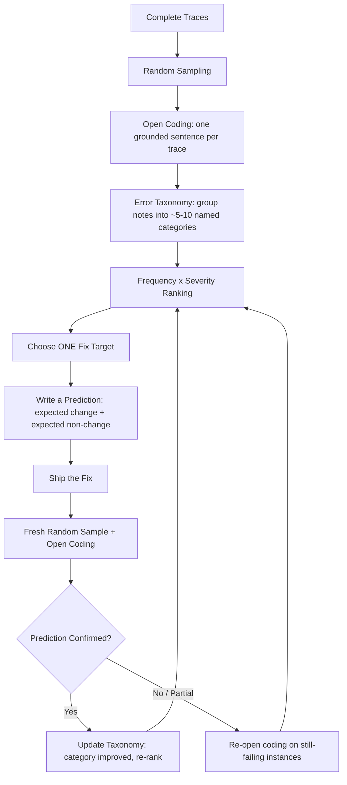
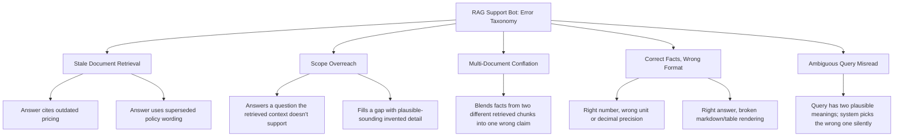
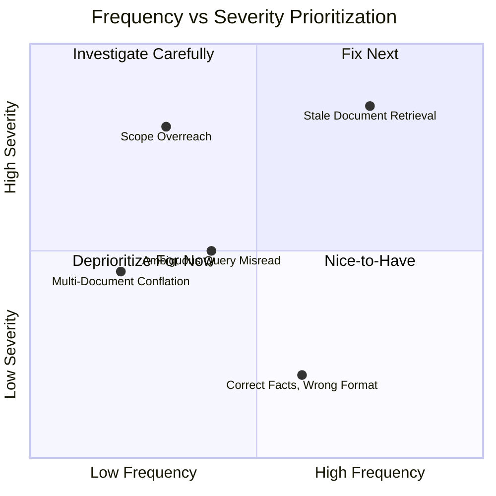
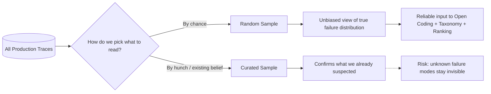
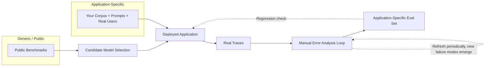

# Week 5 — Diagrams and Workflows

A collection of Mermaid diagrams summarizing the core mechanisms of Week 5, each with a short
caption. See the individual topic pages for the full explanations behind each diagram.

## 1. The Full Error-Analysis Loop

**Caption:** The entire week compressed into one loop. Each pass starts from complete traces,
narrows through sampling and open coding into a named taxonomy, ranks that taxonomy by
frequency × severity, commits to one fix target, predicts its effect in writing, ships it, and
re-measures with the same methodology — feeding the result back into the next iteration of the
taxonomy and ranking, rather than treating any single pass as final.

## 2. Example Error Taxonomy Tree

**Caption:** A worked example of how open-coding notes (the leaf-level, italicized-style
observations) get grouped bottom-up into five named parent categories. Real taxonomies vary by
application, but this shape — a handful of named parents, each with several concrete grounded
observations underneath — is typical.

## 3. Frequency vs. Severity Prioritization Matrix

**Caption:** Categories in the top-right quadrant (frequent and severe) are the strongest
candidates for the next fix target. Top-left (rare but severe) may still warrant a lightweight
guardrail even if it isn't the primary fix target. Bottom-left (rare and mild) is safe to
deliberately set aside for now.

## 4. Sampling: Random vs. Curated

**Caption:** Random sampling is the only path that reliably feeds an unbiased frequency estimate
into the taxonomy and ranking steps. Curated sampling has a legitimate secondary use — deepening
understanding of an already-known category — but should never replace the first, unbiased pass.

## 5. Benchmarks vs. Application-Specific Evaluation

**Caption:** Benchmarks help pick a candidate model; only manual error analysis on real traces
can surface application-specific failure modes and produce a standing eval set that reflects
what actually breaks in your deployment.
