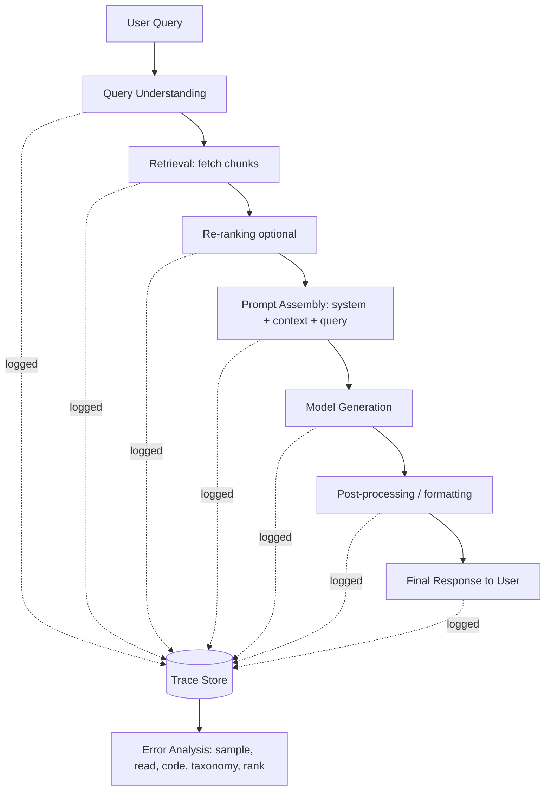

# Complete Traces

## 1. Introduction

A **trace** is a full, self-contained record of one single request handled by your AI
application — the question that came in, everything the system did to answer it (what it
retrieved, what tools it called, what intermediate steps it took), and the final answer it
produced. A **complete** trace contains enough detail that someone who was not present when the
request happened could open it later, read it end-to-end, and understand — or even replay —
exactly what the system saw and did.

This sounds obvious, but most teams do not have it by default. Application logs are usually
built for operations (uptime, latency, error codes), not for understanding *why* a specific
answer was good or bad. Error analysis — the whole subject of this week — is impossible without
complete traces, because you cannot honestly judge an answer without seeing what the system had
to work with when it produced that answer.

## 2. Why This Topic Exists

Imagine a RAG-based support bot gives a wrong answer. Without a trace, all you have is the wrong
answer itself — you're left guessing whether the model hallucinated, whether retrieval fetched
the wrong document, whether the document existed but was truncated, or whether the question was
simply ambiguous. Each of those has a completely different fix. Guessing wastes engineering time
and often leads to fixing the wrong layer of the system.

Complete traces exist to remove the guessing. They turn "the bot said something wrong" (an
opinion) into "given this exact query, the retriever returned these three chunks, none of which
contained the answer, and the model still fabricated one" (a diagnosis). Every technique later
in this week — sampling, open coding, taxonomy building, ranking — operates *on* traces. If the
traces are incomplete, every downstream step inherits that gap: you'll misclassify errors, rank
the wrong problems as most frequent, and fix the wrong thing.

## 3. Core Concept

### Beginner

Think of a trace as a "black box flight recorder" for one interaction with your app. Just like
investigators don't want a rough summary of a flight ("the plane took off, something happened,
it landed") but the full recorded data — altitude, speed, control inputs, cockpit audio — you
don't want a summary of what your AI app did. You want the actual inputs, the actual retrieved
documents, the actual model output, and the actual final response shown to the user.

A trace, at minimum, usually includes:

- The **raw user input** (question, message, or task).
- Any **retrieved context** (documents, chunks, search results, tool outputs) fed to the model.
- The **exact prompt** assembled and sent to the model (system prompt + retrieved context + user
  input, as actually sent — not a paraphrase of it).
- The **model's raw output** before any post-processing.
- The **final response** shown to the user, if different from the raw output.
- **Metadata**: timestamps, model/version used, retrieval parameters (e.g. top-k), latency, and
  any identifiers needed to look up related data later.

### Intermediate

"Complete" is a testable property, not a vague aspiration. A trace is complete if — and only
if — a person with no other context can answer these questions using only the trace:

1. What exactly did the user ask?
2. What exactly did the retrieval step return, and in what order/rank?
3. What exactly was sent to the model (the fully rendered prompt, not a template)?
4. What exactly did the model output, before any cleanup or formatting?
5. What was ultimately shown to the user?
6. Which model, prompt version, and retrieval configuration produced this, so the result is
   attributable and reproducible?

If any of these is missing, the trace has a **blind spot**, and any conclusion drawn from it is
provisional at best. A common and costly blind spot: logging only the final rendered answer and
the user's question, but not the retrieved chunks — which makes it impossible to tell a
retrieval failure from a generation failure. Another common blind spot: logging a *template* for
the prompt rather than the fully-substituted prompt actually sent, which hides prompt-assembly
bugs (truncation, wrong variable interpolation, stale context).

### Advanced

At scale, trace completeness has real engineering costs and trade-offs that must be actively
managed:

- **Replayability vs. storage cost.** Storing every retrieved chunk verbatim for every request
  can be expensive at high volume. Teams often compromise by storing chunk IDs/hashes plus a
  versioned pointer into the document store, so the exact content can be reconstructed as long as
  the underlying corpus version is also tracked.
- **Non-determinism.** If your system uses sampling temperature > 0, retrieval that depends on a
  frequently-changing index, or external tools with side effects (live web search, API calls with
  changing results), a trace can be complete about what *happened* without being fully
  *replayable* to reproduce the same output later. Distinguish "we can explain this trace" from
  "we can regenerate this exact output" — error analysis mainly needs the former.
- **Multi-step and agentic traces.** When the app is agentic (multiple tool calls, multi-turn
  reasoning, sub-queries), a single "trace" becomes a **tree or sequence of spans** — one span per
  step (a retrieval call, a tool call, a model call). Completeness now means every span is
  captured with its own inputs/outputs, not just the first and last step. This is exactly what
  distributed tracing frameworks (in the OpenTelemetry sense) exist for, adapted to LLM
  pipelines.
- **PII and redaction.** Complete traces often contain sensitive user data. Real systems need a
  policy for what gets stored, for how long, and how it's redacted or access-controlled for the
  humans doing error analysis — completeness and privacy compliance must be designed together,
  not treated as opposing goals to be resolved ad hoc.

## 4. Deep Explanation

A useful way to think about a trace is as the **evidence bundle** behind one output. Error
analysis is fundamentally an evidentiary process: you are trying to determine, for each failure,
which stage of the pipeline is responsible. A modern LLM application is a pipeline of stages —
typically: query understanding → retrieval → re-ranking → prompt assembly → generation →
post-processing/formatting → (optionally) tool use or verification. Each stage can independently
fail, and the same surface-level symptom ("wrong answer") can be produced by a failure at any
stage.

A complete trace effectively captures a *checkpoint* at each stage boundary. This lets you localize
the failure by inspecting the trace stage by stage, the same way a debugger lets you inspect
variables at each line rather than only seeing a program's final crash message. Without
stage-level visibility, you're stuck doing black-box guessing: re-running the same query
manually and hoping you reproduce the bug, which is slow, unreliable, and doesn't scale to
reading dozens of failures.

Completeness also matters for a second, less obvious reason: **trust in the analysis process
itself**. When a team disagrees about why something failed, a complete trace is the neutral
artifact everyone can look at together to settle the disagreement with evidence rather than
opinion. Incomplete traces invite speculation, and speculation is exactly what error analysis
exists to replace.

## 5. Step-by-Step Flow

1. **Instrument the pipeline** — add logging at each pipeline stage boundary (query, retrieval,
   prompt assembly, generation, post-processing, final response).
2. **Assign a trace ID** — generate one unique ID per user request that ties all of that
   request's stage logs together.
3. **Capture stage inputs/outputs verbatim** — log the actual content passed between stages, not
   summaries or truncated previews.
4. **Attach metadata** — model/version, prompt version, retrieval config (top-k, index version),
   timestamps, latency per stage.
5. **Persist and index** — store traces somewhere queryable (a trace store, a data warehouse
   table, or a dedicated LLM-observability tool) so they can later be sampled and read.
6. **Redact/secure sensitive fields** — apply your PII policy before traces are broadly
   accessible to the humans who will read them.
7. **Validate completeness** — periodically pull a trace and check it answers all six
   completeness questions from Section 3 (Intermediate). If it doesn't, fix the instrumentation
   before doing any error analysis on top of it.

## 6. Architecture Explanation

Every stage writes into the same trace store keyed by trace ID; error analysis later reads from
that store rather than from live traffic, so it can happen asynchronously and repeatedly.

## 7. Visual Analogy

A complete trace is like an airplane's flight-data recorder plus cockpit voice recorder combined
into one file, timestamped and synchronized. If there's an incident, investigators don't ask the
pilot to recall from memory what happened — they pull the recorder and see the actual altitude,
speed, and control inputs at every second leading up to the event. An incomplete trace is like
having only the pilot's after-the-fact summary: useful, but unreliable, incomplete, and
impossible to independently verify.

## 8. Real Industry Example

Production RAG and agent systems commonly adopt **LLM observability platforms** (patterns
popularized by tools like LangSmith, Langfuse, Arize Phoenix, and Weights & Biases Weave) whose
core feature is exactly this: capturing a structured, replayable trace per request, with nested
spans for retrieval calls, tool calls, and model calls, searchable and filterable later. Support
and search teams at companies running RAG-based assistants routinely report that the single
highest-leverage engineering investment before doing serious quality work was not a smarter
model — it was building a trace store good enough that a human could sit down and actually
understand any given failure in under a minute, rather than reverse-engineering it from
scratch each time.

## 9. Common Misconceptions

- **"Our application logs already give us this."** Standard ops/APM logs usually capture
  latency, status codes, and maybe the final response — not the retrieved context or the exact
  prompt sent, which are exactly the fields error analysis needs most.
- **"We can just re-run the query later to see what happened."** Retrieval indexes change,
  documents get updated or deleted, and models get upgraded — re-running later frequently
  produces a *different* result than what the user actually experienced. The trace has to capture
  the moment, not a promise to reproduce it later.
- **"More logging is always better."** Logging everything, unfiltered and unredacted, creates
  storage costs, latency overhead, and privacy risk. Completeness means capturing the fields that
  answer the six diagnostic questions — not maximal logging of everything technically available.
- **"Traces are only useful for debugging outages."** Their main value in this course's context
  is not incident response — it's the deliberate, offline discipline of error analysis, reading
  traces that succeeded *and* failed to understand the system's real behavior distribution.

## 10. Best Practices

- Log the fully-rendered prompt actually sent to the model, not the template used to build it.
- Give every request one trace ID and propagate it through every stage, including nested tool
  calls in agentic pipelines.
- Store retrieval results with enough detail to know exactly which chunks (and in what order)
  were retrieved and which were actually used in the final prompt (retrieval can return more
  than gets used).
- Capture metadata (model version, prompt version, retrieval config) so a trace remains
  interpretable months later, after the pipeline itself has changed.
- Build a redaction/access-control policy for sensitive fields early, rather than retrofitting it
  after traces are already in wide use.
- Periodically audit a handful of traces against the "six questions" test in Section 3 to catch
  instrumentation drift before it silently degrades your error analysis.

## 11. Summary

A trace is the complete record of one request through your AI pipeline — input, retrieved
context, assembled prompt, raw model output, and final response, plus enough metadata to
interpret it later. Completeness is a concrete, testable property: a trace is complete if it lets
someone localize a failure to a specific pipeline stage without guessing. Every later step in
error analysis — sampling, open coding, taxonomy, ranking — is only as trustworthy as the traces
it's built on, which is why trace completeness is the foundational topic of the week.

## 12. Key Takeaways

- A trace is the full record of one request: input, retrieved context, exact prompt sent, raw
  model output, final response, and metadata.
- "Complete" means a reader can localize a failure to a pipeline stage without guessing — that's
  a testable bar, not a vague ideal.
- Standard operational logs are usually not complete traces; they capture latency and errors, not
  retrieved context or the exact prompt.
- In agentic/multi-step systems, a trace becomes a tree of spans — every tool call and sub-step
  needs its own captured input/output.
- Completeness and privacy are not opposing goals — redaction and access control should be
  designed alongside instrumentation, not bolted on afterward.
- All later error-analysis techniques (sampling, open coding, taxonomy, ranking) inherit any
  blind spots present in the underlying traces.
