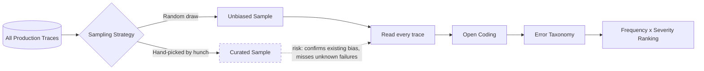

# Random vs. Curated Sampling

## 1. Introduction

Once you have complete traces (Topic 1), the next question is: *which* traces do you actually
sit down and read? You cannot read every request your app has ever handled — there could be
thousands or millions. You have to pick a subset. **Sampling** is the discipline of choosing that
subset deliberately, and the single most important decision in that discipline is **random
sampling versus curated sampling**: pulling traces by chance from the whole population, versus
hand-picking traces you already suspect are interesting.

Curated sampling feels efficient and is almost always the wrong choice for the *first* pass of
error analysis, for reasons this topic explains in detail.

## 2. Why This Topic Exists

Every engineer has an intuition about where their system is weak: "users probably struggle with
multi-turn follow-ups," "our retrieval probably misses long documents," "people probably ask
about edge-case pricing." These intuitions are often partly right — and that's exactly the
problem. If you sample by pulling examples that match your intuition, you will find exactly the
problems you already expected, confirm your existing beliefs, and remain completely blind to the
failure modes you didn't think to look for.

This is **selection bias**, and it is the single most common way error analysis gets quietly
sabotaged before it even starts. The whole value of reading real traces by hand — as opposed to
running an automated eval suite — is the chance to discover problems you never guessed were
there. Curated sampling throws that value away by only ever looking where the flashlight already
points.

## 3. Core Concept

### Beginner

- **Random sampling**: pick traces by chance — for example, taking every 50th request from the
  last week, or using a random number generator over all request IDs — so every trace had an
  equal (or known) probability of being selected, regardless of whether it looks "interesting."
- **Curated sampling**: hand-pick traces based on some judgment — the angriest user messages,
  the longest responses, the ones a teammate flagged, the ones that support a hypothesis you
  already have.

For the *first* round of error analysis, use random sampling. It's the only way to see your
app's true failure distribution rather than a distribution filtered through your own
assumptions.

### Intermediate

Random sampling gives you an **unbiased estimate** of how often each type of problem actually
occurs across real usage. If you read 30 randomly sampled traces and 9 of them show a retrieval
problem, that's meaningful evidence that roughly 30% of real traffic hits some form of retrieval
issue — a number you can act on. If you instead hand-picked 30 traces because they looked odd in
your dashboard, and 9 show a retrieval problem, you have learned almost nothing about the true
rate — you've only confirmed that retrieval problems exist *somewhere*, which you probably
already suspected.

A useful middle ground, used *after* an initial random pass, is **stratified sampling**: split
the traffic into meaningful buckets (e.g. by user type, by query length, by whether retrieval
returned zero results) and sample randomly *within* each bucket. This isn't cherry-picking — it's
making sure rare-but-important segments (like "zero-result queries," which may be a small
percentage of total volume but disproportionately painful) aren't drowned out and invisible in a
single unstratified random sample.

Sample size matters too: reading 5 traces tells you almost nothing reliable; reading 100 traces
line-by-line is prohibitively slow for a first pass. In practice, most teams doing this kind of
manual read find that somewhere in the range of a few dozen traces — read carefully, one at a
time — is enough to start seeing the same few problems recur, which is the signal that you're
approaching **saturation** (new traces mostly reconfirm categories you've already seen, rather
than introducing genuinely new ones).

### Advanced

Random sampling is not free of its own biases — it only removes *your* selection bias, not
biases baked into what traffic exists in the first place:

- **Traffic-mix bias.** If 90% of your traffic is an easy, common query type, a pure random
  sample will be dominated by that type, and rarer-but-harder query types may not appear at all
  in a modest sample. This is exactly why stratified sampling by query type or by known-difficult
  segments is often layered on top of randomness rather than treated as a substitute for it.
- **Survivorship in what gets logged.** If your logging pipeline silently drops requests that
  time out or error before completion, "random" sampling over what *was* logged is not actually
  random over everything that happened — it systematically excludes the worst failures. This
  connects back to Topic 1: sampling is only as unbiased as the trace store it draws from.
- **Temporal bias.** A random sample drawn entirely from one day, one release version, or one
  time zone's usage pattern is a snapshot, not a population estimate. Serious error analysis
  programs re-sample periodically (weekly/monthly) precisely because the failure distribution
  shifts as the app, its users, and its underlying models change over time.
- **When curated sampling *is* appropriate.** After an initial random pass has identified a
  named category of failure, it's legitimate — and useful — to curate a *second, targeted* sample
  specifically containing more examples of that category, in order to study it in depth (e.g.
  "pull 20 more traces where retrieval returned zero chunks, so we can characterize that failure
  mode precisely"). The rule isn't "never curate" — it's "never let curation replace the initial,
  unbiased view of the whole problem space."

## 4. Deep Explanation

The deeper reason random sampling matters is statistical, not stylistic. Any claim you make later
— "retrieval failures are our biggest problem" — is a claim about a population (all real
requests) based on a sample (the traces you read). That inference is only valid if the sample was
drawn in a way that doesn't systematically favor or exclude particular outcomes. Curated sampling
violates this at the source: by definition, it selects traces *because of* some property related
to the very thing you're trying to measure (interestingness, apparent failure, following a hunch),
which is precisely the definition of a biased sample in statistics.

This matters practically because error analysis feeds directly into prioritization (Topic 5:
Frequency × Severity). If your sample overrepresents one kind of failure because you went looking
for it, your frequency estimate for that category will be inflated, and you'll rank it above
problems that are actually more common but that you didn't think to seek out. The entire value
chain — sample → read → categorize → rank → choose a fix target — is only trustworthy if the very
first link, sampling, is unbiased.

## 5. Step-by-Step Flow

1. **Define the population** — decide the full set of traces this sample should represent (e.g.
   "all production requests from the last 14 days").
2. **Ensure the trace store is complete** — confirm errored/timed-out requests are captured too,
   not just clean successes (see Topic 1).
3. **Draw a random sample** — use a random selection method (e.g. random IDs, systematic sampling
   like every Nth request) over the full population, with no manual filtering by "looks
   interesting."
4. **Pick a workable sample size** — enough traces to plausibly reach saturation (recurring
   categories, few new surprises) without making the read-through infeasible.
5. **Optionally stratify** — if you know a segment is rare but important (e.g. zero-result
   queries), sample it separately and randomly within that segment, and analyze it alongside the
   main sample rather than instead of it.
6. **Read every trace in the sample** — no skipping the boring-looking ones; boring-looking
   traces sometimes hide the most common (and thus most important) problems.
7. **Only after this first unbiased pass**, curate a second, targeted sample to dig deeper into
   a specific category you've already identified.

## 6. Architecture Explanation

The dashed path shows curated sampling feeding straight into the same downstream pipeline, but
carrying an unacknowledged bias into every step after it — the ranking in step H becomes
unreliable if step B took the curated branch for the *first* pass.

## 7. Visual Analogy

Random sampling is like a health inspector who visits restaurants by picking addresses out of a
hat — sometimes the fancy place with the spotless kitchen, sometimes the tiny stall nobody
mentioned. Curated sampling is like only inspecting restaurants that already received a
complaint. The complaint-based approach *will* find real problems, but it will never tell the
inspector how the city's restaurants are doing on average, and it will completely miss the
restaurant with a serious problem that nobody has complained about yet — often because the
affected customers didn't know who to complain to, or didn't bother.

## 8. Real Industry Example

Search-quality teams at large tech companies have long practiced this discipline as **random
query sampling for human relevance judgment**: instead of only reviewing queries flagged by
support tickets or query logs marked "no results," teams periodically pull a truly random sample
of live search queries and have raters judge result quality against a rubric. This is precisely
why search-quality metrics reported externally (aggregate relevance scores) are considered
credible — they are built on population-representative sampling, not on a curated set of
easy-to-explain examples. Modern LLM-application teams doing error analysis on RAG systems have
adopted the same principle: an initial "read N random traces" pass is treated as a prerequisite
before any targeted deep-dive investigation.

## 9. Common Misconceptions

- **"I already know where the problems are, so I'll just look there."** That's exactly the bias
  this topic warns against — known problems get fixed regardless; the value of manual reading is
  finding *unknown* problems, which requires looking broadly first.
- **"A bigger curated set is more thorough than a small random set."** Size doesn't fix selection
  bias. A thousand hand-picked traces are still not representative of the whole traffic
  distribution if they were chosen because they looked interesting.
- **"Random sampling means no judgment is involved."** Judgment is still needed to define the
  population correctly, choose a sensible sample size, and decide when to stratify — randomness
  applies to *which* traces are drawn, not to whether the process is designed thoughtfully.
- **"Once we've done one random sample, we're done forever."** Failure distributions shift as
  the app, users, and underlying models change; a random sample is a snapshot that needs
  periodic refreshing, not a one-time artifact.

## 10. Best Practices

- Always do an initial, purely random read-through before any hypothesis-driven or curated
  investigation.
- Verify the trace store you're sampling from actually includes failures, timeouts, and edge
  cases — not only clean, successfully-logged happy paths.
- Use stratified random sampling (random *within* meaningful segments) when you know a segment is
  rare but important, rather than abandoning randomness altogether.
- Track when you reach saturation (new traces mostly reconfirm existing categories) as a signal
  that your sample size for this pass is sufficient.
- Re-sample periodically — a quarterly or per-release random read-through keeps your error
  taxonomy current as the app and its usage evolve.
- Reserve curated sampling for *deepening* understanding of an already-identified category, never
  for *discovering* the category list in the first place.

## 11. Summary

Random sampling means drawing traces to read by chance, giving every real request an equal shot
at being examined; curated sampling means hand-picking traces based on a hunch or existing
belief. The first pass of error analysis must be random, because curated sampling systematically
confirms what you already suspect and hides the failure modes you never thought to look for.
Stratification (random sampling within meaningful segments) is a legitimate refinement; curation
based on judgment is legitimate only as a *second*, targeted step after an unbiased first pass
has already mapped the territory.

## 12. Key Takeaways

- Random sampling gives every trace an equal (or known) chance of being read, producing an
  unbiased view of real failure rates.
- Curated sampling (hand-picking "interesting" traces) confirms existing intuitions and hides
  unknown failure modes — the opposite of what manual error analysis is for.
- Stratified random sampling (random within meaningful segments) protects against rare-but-
  important segments being invisible in a small unstratified sample.
- Sample size should aim for saturation — the point where new traces mostly reconfirm categories
  you've already seen.
- Curated, targeted sampling is legitimate only *after* an initial random pass, to deepen
  understanding of an already-identified problem.
- Bias in sampling propagates downstream into taxonomy building and frequency × severity
  ranking, corrupting prioritization even if every later step is done carefully.
