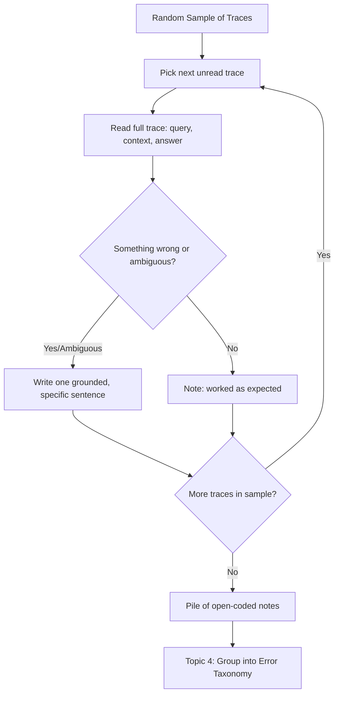

# Open Coding

## 1. Introduction

**Open coding** is the practice of reading one trace at a time and writing a single honest
sentence describing what went wrong in it — *before* you decide what category that problem
belongs to. The name and the method come from **qualitative research methodology**, specifically
from **grounded theory** (Glaser and Strauss, 1967), a technique sociologists and researchers use
to find patterns in interviews, field notes, or observations without forcing the data into
categories decided in advance.

In error analysis, open coding is the step that sits between "reading a random sample of traces"
(Topic 2) and "building an error taxonomy" (Topic 4). It's the one part of this whole process
that genuinely cannot be automated, because it requires a human to actually understand, in
context, what the system did wrong for this specific user and this specific request.

## 2. Why This Topic Exists

The natural temptation, the moment you spot a bad trace, is to immediately slot it into a
category: "that's a retrieval problem," "that's a hallucination," "that's a formatting issue."
This feels efficient, but it is exactly backwards, and it quietly destroys the value of manual
reading. Pre-existing categories act like a mold: whatever you pour into them gets shaped to fit,
whether or not it actually fits. If your categories were "retrieval," "hallucination," and
"formatting" going in, you will find that every trace fits neatly into one of those three
buckets — not because those are truly the app's only problems, but because those were the only
shapes available.

Open coding delays categorization on purpose. You write down, in your own words, specifically
what happened in *this* trace — "the retriever fetched the refund policy from 2022 instead of
the current one," not "retrieval problem" — and only after you've done this for many traces do
you step back and look for the natural groupings that emerge from your own notes. This is the
mechanism by which manual error analysis surfaces problems nobody predicted in advance; skipping
straight to categorization is the most common way teams accidentally throw that discovery power
away.

## 3. Core Concept

### Beginner

For each trace in your sample:

1. Read the whole trace — the question, what was retrieved, and the answer.
2. Decide: did this go well, or did something go wrong?
3. If something went wrong, write **one plain-language sentence** describing exactly what
   happened — as if explaining it to a coworker who hasn't seen the trace. Be specific: name what
   the system did, not a category label.

Example of the wrong way: "Hallucination." Example of the right way: "The user asked for the
return window on international orders; the answer confidently stated 30 days, but none of the
three retrieved chunks mentioned international orders at all — the model appears to have filled
the gap with the domestic policy's number."

### Intermediate

Good open-coding notes share a few properties:

- **Specific, not categorical.** The note names the concrete thing that happened (which document
  was missing, what the user actually asked, what the model actually said) rather than jumping to
  a label.
- **Grounded in the trace, not speculation about the model's internals.** "The model hallucinated
  because it doesn't understand refund policy" is speculation; "the retrieved context contained
  no mention of the number the model produced" is grounded observation. The difference matters
  because grounded notes are falsifiable — someone else can check them against the same trace —
  while speculation about "why the model did X" often isn't.
- **One sentence, not an essay.** Open coding is meant to be fast enough to get through a
  meaningful sample size. A single, precise sentence per trace is the target; if you find
  yourself writing a paragraph, you're probably already trying to explain *why* rather than
  observe *what*.
- **Honest about ambiguity.** Sometimes it's genuinely unclear whether something is wrong (a
  reasonable-but-not-ideal answer, a technically-correct-but-unhelpful one). Write that
  ambiguity down too, rather than forcing a clean-cut verdict the trace doesn't support.

This is analogous to **open coding in grounded theory**, where a researcher reads interview
transcripts line by line and attaches short descriptive labels ("codes") to segments of text
without deciding beforehand what the final themes will be. Only in a later step (axial
coding — the analogue of Topic 4's taxonomy-building) do related codes get grouped into broader
categories. Borrowing this two-step discipline into error analysis is exactly what prevents
premature categorization.

### Advanced

At scale, a few refinements make open coding more rigorous:

- **Multiple coders and agreement checks.** When more than one person open-codes the same
  sample, comparing notes surfaces disagreements about what even counts as an error — a valuable
  signal in itself. Qualitative research uses formal **inter-rater reliability** measures (like
  Cohen's kappa) for this; error-analysis teams rarely need that much formality, but a quick
  cross-check ("did we independently notice the same failures?") catches blind spots one reader
  alone would miss.
- **Coding the trace, not the outcome.** It's tempting to code based on user reaction (a
  thumbs-down, a frustrated follow-up) rather than reading the trace itself — but user reaction is
  a noisy proxy. A user might thumbs-down a correct answer they simply didn't like, or accept a
  wrong one without complaint. Open coding requires actually reading what the system did, not
  outsourcing judgment to user signals.
- **Coding for what went right, too.** Reading only failures biases your model of the system
  toward negativity and can miss near-misses (things that technically worked but were fragile).
  Some teams open-code a subset of successful traces as well, to understand what "working
  correctly" actually looks like in the same level of detail.
- **Time-boxing.** Open coding is manual and can expand to fill available time. Applying a
  rough per-trace time budget (e.g. two to three minutes) keeps the exercise moving toward
  saturation across the whole sample rather than perfecting the analysis of a handful of traces.

## 4. Deep Explanation

The underlying reason open coding works is that categorization and observation are different
cognitive tasks, and doing them at the same time degrades both. Observation asks "what happened
here, concretely?" Categorization asks "which bucket does this belong to, given the buckets I
already have?" When you do both simultaneously, the second task actively interferes with the
first: as soon as a candidate bucket ("looks like hallucination") comes to mind, attention shifts
from noticing the specific details of *this* trace to confirming or rejecting that bucket, and
subtler or unexpected details get skipped.

This is the same failure mode behind confirmation bias in general: a hypothesis, once formed,
changes what evidence you notice. Open coding is a deliberate procedural defense against it —
by writing a grounded, specific sentence before any category exists, you force yourself to
actually look at the evidence on its own terms. The taxonomy that emerges afterward (Topic 4) is
built *from* these notes, bottom-up, rather than imposed on them top-down — which is exactly why
it tends to surface categories nobody had in mind before starting.

## 5. Step-by-Step Flow

1. **Open one trace** from your random sample (Topic 2).
2. **Read it fully** — question, retrieved context, and answer — resisting the urge to skim to
   the final answer alone.
3. **Judge whether something went wrong**, including partial or ambiguous problems, not only
   clear-cut failures.
4. **Write one specific, grounded sentence** describing what happened, naming concrete details
   (what was retrieved, what was asked, what was said) rather than a category label.
5. **Avoid inventing categories mid-stream** — resist the urge to tag the note with a bucket name
   at this stage.
6. **Move to the next trace** and repeat, keeping a steady pace (a rough time budget per trace
   helps).
7. **After the full sample is coded**, lay all the notes out together — this is the raw material
   for building the error taxonomy in Topic 4.

## 6. Architecture Explanation

## 7. Visual Analogy

Open coding is like a field naturalist cataloguing a new island. A bad naturalist walks in with a
checklist from a different island ("mammal, bird, reptile") and forces every new creature into
one of those three boxes, missing anything that doesn't fit. A good naturalist writes a specific
field note for every creature they see — size, color, behavior, habitat — and only after
observing many specimens do they start noticing that a dozen of these notes describe what is
clearly one new species. The species names (categories) emerge from the notes; they aren't
decided before the fieldwork starts.

## 8. Real Industry Example

Error analysis practices popularized in modern LLM-evaluation writing (notably by practitioners
like Hamel Husain and Shreya Shankar, who have written extensively on "LLM-as-judge" pitfalls and
manual trace review) explicitly recommend this qualitative-research-derived workflow for teams
building RAG and agent products: read a random batch of traces, write an open, ungrouped note per
failure, and only then cluster the notes into named failure modes. Teams that skip straight to
predefined categories (often borrowed wholesale from a generic taxonomy they found online, like
"faithfulness," "relevance," "toxicity") commonly report the taxonomy feels disconnected from
what's actually breaking in their specific application — a direct symptom of skipping the open
coding step.

## 9. Common Misconceptions

- **"Open coding is just writing bug reports."** A bug report often already implies a fix or a
  root cause. An open-coding note only states what was observed in the trace — it deliberately
  avoids diagnosing the underlying cause or prescribing a solution at this stage.
- **"It's faster to categorize as you go."** It feels faster in the moment, but it silently
  narrows what you notice to whatever categories are already in your head, defeating the purpose
  of manual review — the errors you'd most want to discover are exactly the ones without a
  ready-made category.
- **"One person's open coding is as good as several people's."** A single reader's notes reflect
  that person's blind spots as much as the actual traces; a second reader's independent pass, even
  on a subset, is a cheap and effective way to catch what one person alone would miss.
- **"Open coding only applies to failures."** Coding some clearly successful traces too helps
  calibrate what "working" looks like and catches fragile near-misses that a failures-only lens
  would never surface.

## 10. Best Practices

- Write the note before naming a category — resist any urge to label it "X problem" while you're
  still reading.
- Keep each note to one sentence, grounded in specific, checkable details from the trace itself.
- Separate observation ("what happened") from diagnosis ("why it happened") — the latter belongs
  to later analysis, not the open-coding pass.
- Time-box each trace so the exercise covers the whole sample rather than over-analyzing a few.
- Where possible, have a second person independently code a subset of the same traces, and
  compare notes to catch individual blind spots.
- Code a few clearly-successful traces too, not only failures, to calibrate your baseline for
  "working as intended."

## 11. Summary

Open coding is the manual, human-only step of reading each sampled trace and writing one honest,
specific, grounded sentence about what happened — before deciding what category it belongs to.
Borrowed from grounded theory in qualitative research, it exists to prevent premature
categorization from hiding problems that don't fit categories you already had in mind. The raw
pile of open-coded notes produced here is the direct input to building an error taxonomy (Topic
4); skipping this step and categorizing immediately is the most common way teams accidentally
blind themselves to their app's real, undiscovered failure modes.

## 12. Key Takeaways

- Open coding means writing one specific, grounded sentence per trace describing what went wrong
  — before assigning any category.
- The method comes from grounded theory in qualitative research, where labels emerge from data
  rather than being imposed on it in advance.
- Categorizing too early acts like a mold, forcing every observation into pre-existing buckets
  and hiding failure modes you didn't already expect.
- Good notes are specific and grounded (checkable against the trace), not speculative about the
  model's internal reasoning.
- A second reader independently coding a subset of the same traces is a cheap way to catch
  individual blind spots.
- The output of open coding — the full pile of ungrouped notes — is the direct raw material for
  building an error taxonomy in the next step.
