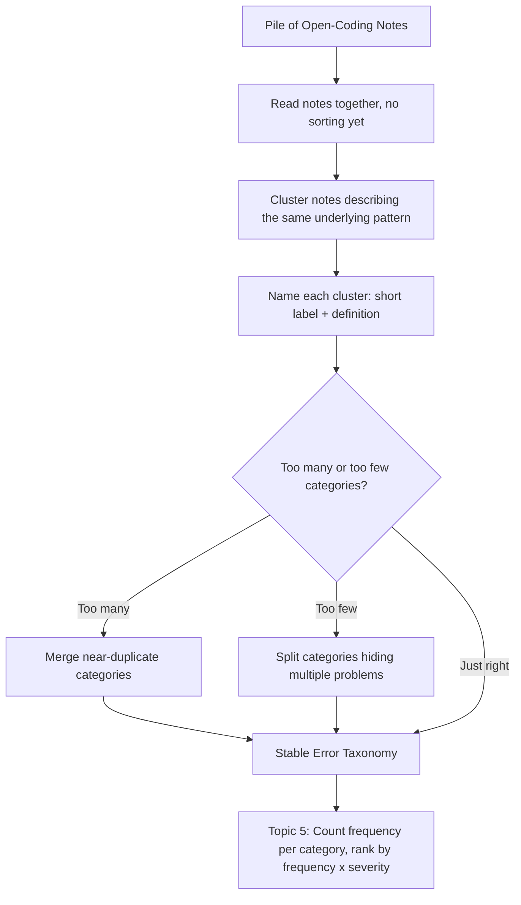

# Error Taxonomy

## 1. Introduction

An **error taxonomy** is a small, named set of problem categories that groups together similar
open-coding notes (Topic 3) from across your sample. Where an open-coding note describes one
specific trace ("the retriever fetched the 2022 refund policy instead of the current one"), a
taxonomy entry names a *recurring pattern* across many traces ("Stale Document Retrieval — the
retriever returns an outdated version of a document that has since been superseded").

Building a taxonomy is the step where a pile of individually-observed problems turns into
something a whole team can share, discuss, count, and prioritize. In qualitative research, this
step is called **axial coding**: taking the open codes produced in the first pass and finding the
relationships and groupings among them, turning scattered observations into a coherent set of
themes.

## 2. Why This Topic Exists

Open coding deliberately produces many small, ungrouped, trace-specific notes — that's the point,
it prevents premature categorization. But dozens of individual sentences aren't directly
actionable: you can't rank "the retriever fetched the 2022 refund policy" against "the model
misread a date format" in any meaningful way, because they're descriptions of single incidents,
not named problems with a measurable frequency. A taxonomy exists to bridge that gap — it turns
"here are forty separate observations" into "here are five recurring problems, and here's roughly
how often each occurs."

A good taxonomy also creates shared vocabulary. Once a team agrees that "Stale Document
Retrieval" is a named category, everyone — engineers, product managers, support — can use that
term consistently, tag new incidents against it, and track whether it's getting better or worse
over time. Without a taxonomy, every discussion of "what's wrong with the app" starts from
scratch.

## 3. Core Concept

### Beginner

After open coding a sample of traces, you have a pile of individual notes. Building a taxonomy
means:

1. **Spread out all the notes** (physically or in a shared document/spreadsheet).
2. **Look for notes that describe the same underlying pattern**, even if the surface details
   differ — e.g. "answer cited the wrong year's pricing" and "answer used last year's return
   window" might both be instances of the same underlying pattern (retrieving outdated versions
   of time-sensitive documents).
3. **Give each recurring pattern a short, memorable name** — a category label like "Stale
   Document Retrieval," "Ambiguous Query Misread," or "Correct Facts, Wrong Format."
4. **Write a one- or two-sentence definition** for each category so it's usable by someone who
   wasn't part of the original reading session.

### Intermediate

A useful error taxonomy has a few structural properties worth aiming for, even though real
taxonomies rarely hit all of them perfectly:

- **A handful of categories, not dozens.** Somewhere around five to ten named categories is
  typical for a first pass. Too few categories (two or three) tend to be so broad they're not
  actionable ("generation quality"); too many (twenty-plus) tend to just be a renamed list of the
  original open codes, which defeats the purpose of grouping.
- **Grounded in the notes, not imported wholesale.** It's tempting to reach for a generic,
  published taxonomy (e.g. "faithfulness / relevance / coherence / toxicity" from academic NLP
  evaluation literature) and sort your notes into it. Resist this — those categories were designed
  for a different purpose (benchmarking language models in general) and often don't match the
  specific ways *your* app, with *your* retrieval corpus and *your* users, actually fails (see
  Topic 7). The categories should emerge from what you actually observed.
- **Mutually distinguishable, not necessarily perfectly exclusive.** In practice, a single trace
  can sometimes plausibly belong to more than one category (a stale document *and* a formatting
  issue in the same answer). That's fine — tag it with both if needed — but each category should
  still describe a genuinely distinct *kind* of problem, not a near-duplicate of another category.
- **Actionable at the right altitude.** A good category name points toward roughly what part of
  the system or process would need to change — "Stale Document Retrieval" hints at re-indexing or
  document freshness, "Ambiguous Query Misread" hints at query clarification or disambiguation
  logic. A category like "bad answers" is too high-altitude to act on.

### Advanced

Taxonomy-building at scale involves choices that materially affect what the taxonomy is useful
for:

- **Iterative refinement, not a single pass.** The first attempt at grouping open codes is rarely
  the final taxonomy. As you code more traces (or as a second reader's notes are merged in),
  categories often need to be split (one category turns out to hide two distinct problems) or
  merged (two categories turn out to be the same problem described differently). Treat the
  taxonomy as a living artifact through at least a couple of rounds of the whole sample.
- **Severity-relevant sub-distinctions.** Sometimes a single named category benefits from a
  sub-split by severity or user impact — e.g. "Stale Document Retrieval (cosmetic — outdated
  formatting note)" versus "Stale Document Retrieval (harmful — outdated legal/financial figure)."
  This anticipates the frequency × severity ranking in Topic 5 and keeps the taxonomy from hiding
  a wide severity range inside one label.
- **Versioning the taxonomy.** As the app changes (new features, new document sources, model
  upgrades), the taxonomy should be revisited rather than treated as permanent. Keeping a
  lightweight changelog (when a category was added, split, merged, or retired) helps teams
  understand whether a metric like "20% of traces show Stale Document Retrieval" is comparable
  across time or reflects a redefinition.
- **Taxonomy as a coding scheme for future automation.** Once a taxonomy is stable and validated
  by manual reading, some teams build lightweight automated classifiers (heuristics or an
  LLM-based classifier) to *tag* new traces against the existing categories at scale, so ongoing
  monitoring doesn't require manually reading every single trace forever. This automation should
  only be introduced after the taxonomy itself was built by careful manual open coding — automating
  the categorization of open codes you haven't validated by hand risks quietly automating the
  wrong taxonomy.

## 4. Deep Explanation

The reason taxonomy-building must follow open coding, and not precede it or replace it, is that
categories created *before* looking at real data tend to reflect what the taxonomy's author
already believed about the system, not what the system actually does. Taxonomy-building done
correctly is a **bottom-up clustering process performed by a human**: you look at all the
ground-level, specific notes together and let the natural groupings surface, rather than deciding
the groups first and sorting notes into them.

This is conceptually similar to unsupervised clustering in machine learning (grouping data points
by similarity without predefined labels) — except the "similarity function" here is human
judgment about what makes two failures the "same kind of problem," which is exactly the kind of
contextual judgment that's hard to specify as a formula but easy for a person immersed in the
domain to recognize. The output — a small number of named, well-defined clusters — becomes the
shared vocabulary that all later prioritization and fix-planning work is expressed in.

A taxonomy that skips this bottom-up step and instead imports categories from elsewhere
(academic papers, another company's blog post, a generic "RAG evaluation checklist") tends to
produce a mismatch: real traces get force-fit into categories that don't quite describe what
happened, engineers argue about which bucket an incident "really" belongs to, and — most
importantly — some genuine, common failure mode in your specific app has no category at all
because it wasn't on the list you imported.

## 5. Step-by-Step Flow

1. **Gather all open-coding notes** from the sample (Topic 3), including notes from more than one
   reader if applicable.
2. **Read through the whole pile once** without sorting, just to get a feel for the range of
   problems present.
3. **Cluster similar notes together** — group notes that describe the same underlying kind of
   problem, even when the specific trace details differ.
4. **Name each cluster** with a short, memorable, specific label and a one- to two-sentence
   definition.
5. **Check cluster count** — if you have far more than ten categories, look for near-duplicates
   to merge; if you have only two or three, check whether a category is hiding multiple distinct
   problems that should be split.
6. **Re-pass the notes against the finished category list** to confirm every note fits somewhere
   reasonably well, and note any that genuinely don't fit (candidates for a new category, or an
   acceptable "miscellaneous" bucket if they're rare and varied).
7. **Write down category definitions** in a shared place so the taxonomy is usable by people who
   weren't in the room when it was built.
8. **Carry the taxonomy into Topic 5** — count how many sampled traces fall into each category
   (frequency) as the direct next step.

## 6. Architecture Explanation

## 7. Visual Analogy

Building an error taxonomy is like a librarian who has just received a huge, unsorted pile of
returned books and needs to reshelve them. The librarian doesn't invent the categories from a
textbook of library science before ever seeing the books — they lay the books out, notice that a
good number are about gardening, another cluster is about 20th-century history, and so on, and
*then* label the shelves accordingly. The shelf labels emerge from the actual books in hand, which
is exactly why the resulting library is easy for the next person to navigate — it reflects what's
really in the collection, not what a generic library "should" contain.

## 8. Real Industry Example

Content-moderation and trust-and-safety teams at large platforms build error taxonomies in
exactly this bottom-up way: rather than moderating solely against a generic external policy
document, they periodically review a random sample of flagged and unflagged content, write
specific notes about edge cases the existing policy doesn't clearly cover, and update their
internal taxonomy of violation types to reflect patterns they're actually seeing. LLM-application
teams doing RAG error analysis follow the same pattern at a smaller scale: a taxonomy like
"Stale Document Retrieval," "Multi-Document Conflation" (blending facts from two different
retrieved documents into one incorrect answer), "Numeric Precision Loss" (correct fact, wrong
number of decimal places or unit), and "Scope Overreach" (answering a question the retrieved
context doesn't actually support) is far more useful for that specific team than a generic
"faithfulness/relevance" split, precisely because it was built from their own traces.

## 9. Common Misconceptions

- **"We should use a standard, published error taxonomy so we're comparable to other teams."**
  Published taxonomies are useful for benchmarking language models in general (see Topic 7), but
  your app's real failure modes are shaped by your retrieval corpus, your users, and your UI —
  categories built from your own traces will always be more actionable than an imported list.
- **"More categories means more precision."** Beyond roughly ten categories, additional granularity
  usually just fragments a real pattern into near-duplicate labels, making frequency counts
  (Topic 5) noisier and harder to act on, not more precise.
- **"The taxonomy is done once it's written down."** A taxonomy built from one sample is a
  first draft; it should be revisited as more traces are read and as the app evolves, with
  categories split, merged, or retired as needed.
- **"Every trace must fit exactly one category."** Some traces genuinely span two categories, and
  a small "doesn't fit cleanly" bucket for rare, varied leftovers is normal and healthy — forcing
  a false single fit distorts the frequency counts more than acknowledging overlap does.

## 10. Best Practices

- Build the taxonomy from your own open-coding notes, not from a generic external checklist.
- Aim for roughly five to ten categories on a first pass; treat sharply more or fewer as a signal
  to merge or split.
- Give every category a short name and a concrete one- to two-sentence definition, written so
  someone outside the original reading session can apply it consistently.
- Revisit and version the taxonomy as new samples are read and as the application changes —
  don't treat it as a one-time artifact.
- Where a category clearly spans a wide severity range, consider sub-splitting it so severity
  information isn't hidden inside one broad label.
- Only automate tagging against the taxonomy after it has been validated by careful manual open
  coding — don't skip straight to an automated classifier built on an unvalidated category list.

## 11. Summary

An error taxonomy is a small, named, well-defined set of recurring problem categories, built
bottom-up by clustering the specific, grounded notes produced during open coding. It exists to
turn many individual trace-level observations into a shared, countable, actionable vocabulary the
whole team can use. A good taxonomy is grounded in your own traces rather than imported from a
generic list, sits at roughly five to ten categories, and is revisited over time as more data is
read and the application evolves. It is the direct input to ranking problems by frequency ×
severity in the next topic.

## 12. Key Takeaways

- An error taxonomy groups many specific open-coding notes into a small number of named,
  recurring problem categories.
- Building it is a bottom-up clustering process — categories emerge from real notes rather than
  being decided in advance or imported from elsewhere.
- Aim for roughly five to ten categories; too few is unactionable, too many just renames the
  original notes without adding insight.
- Categories should be grounded in your specific app's traces — generic academic or industry
  taxonomies rarely match your actual failure modes (see Topic 7).
- A taxonomy is a living artifact — expect to split, merge, and rename categories as more traces
  are read and the app changes over time.
- The finished taxonomy is the direct input to counting frequency and ranking by frequency ×
  severity in the next step of the process.
