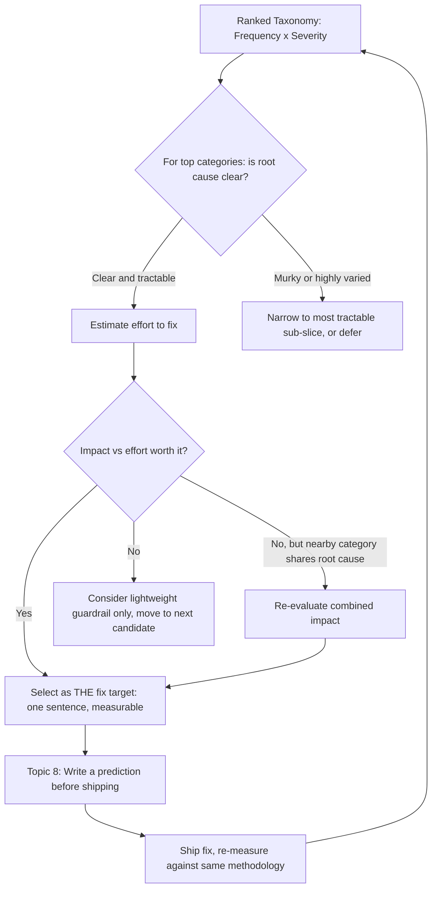

# Choosing the Fix Target

## 1. Introduction

**Choosing the fix target** is the deliberate act of selecting exactly one error-taxonomy
category (Topic 4), ranked highly by frequency × severity (Topic 5), to focus engineering effort
on next — instead of trying to improve everything at once. It's the point where error analysis
stops being an analytical exercise and turns into a concrete decision: "we are going to work on
*this* problem next, and we are explicitly choosing not to work on these other ones right now."

This sounds simple, but it's a genuine discipline. The natural instinct once you have a ranked
list of five or six real, well-documented problems is to try to chip away at several of them
simultaneously. That instinct is usually a mistake, for reasons this topic explains.

## 2. Why This Topic Exists

Spreading effort across multiple problems at once feels efficient but usually isn't, for a
specific reason: most fixes for RAG and LLM-application failures are not independent, isolated
patches — they touch shared infrastructure (the retriever, the prompt template, the
post-processing layer) and shared evaluation surface (the same eval set, the same sampled
traces). Working on three categories simultaneously makes it hard to tell, once things change,
*which* change caused *which* effect — did the metric move because of the retrieval fix, the
prompt fix, or some interaction between them? Diffuse effort produces diffuse, hard-to-attribute
results.

Choosing a single fix target also forces the kind of clear thinking that produces good fixes:
when you have to justify why *this* category, and not the others, deserves attention right now,
you're forced to actually reckon with the frequency × severity ranking, the feasibility of a fix,
and what "better" would concretely look like — rather than working on whatever is most familiar
or most recently complained about.

## 3. Core Concept

### Beginner

After ranking your error taxonomy by frequency × severity, pick the single highest-priority
category as your next fix target — the thing your team commits to actually working on. Resist
the urge to also "quickly fix" two or three other categories at the same time; that dilutes
focus and makes it hard to tell later which change actually helped.

A fix target should be specific enough to act on: not "improve answer quality" but "reduce Stale
Document Retrieval — cases where the retriever returns an outdated version of a document that has
since been superseded."

### Intermediate

Choosing a fix target well involves weighing more than the raw frequency × severity score alone:

- **Tractability.** Is the root cause reasonably well understood from the traces you've already
  read? A category where open coding revealed a clear, consistent mechanism (e.g. "the index isn't
  being refreshed when documents are updated") is more immediately actionable than one where the
  underlying cause still seems murky or highly varied across instances — a broad category can hide
  a wide variety of causes, and picking it as a fix target might really mean picking a *sub-slice*
  of it first: the most tractable, well-understood instances within that category.
- **Blast radius of the fix.** Some fixes are narrow and low-risk (adjusting a re-ranking
  threshold); others touch shared, high-traffic infrastructure (changing the retrieval pipeline
  wholesale) and carry more risk of unintended side effects on categories you weren't targeting.
  This doesn't disqualify a high-priority target, but it should factor into how the fix is scoped
  and tested.
- **Measurability.** You should be able to tell, after the fix ships, whether it actually worked
  — ideally against the same sampled-trace methodology used to find the problem (see Topic 8:
  writing a prediction first). A fix target where "success" can't be defined or measured is a
  weak choice regardless of how high it ranks.
- **One target, clearly scoped.** The commitment should be narrow enough to state in one sentence
  and be checked off cleanly: "reduce Stale Document Retrieval by re-indexing on document update"
  is a fix target; "improve retrieval quality" is not — it's a direction, not a target.

### Advanced

At a more mature level, choosing a fix target is itself a small decision-making process worth
making explicit and repeatable:

- **Effort-vs-impact framing.** Combine the frequency × severity score (impact) with a rough
  estimate of engineering effort to produce something like an impact/effort ranking, similar to
  standard product-prioritization frameworks (e.g. RICE or a simple 2x2 impact/effort matrix).
  The highest frequency × severity category isn't automatically the best fix target if it also
  requires a multi-month infrastructure rebuild and a much smaller category nearby can be
  meaningfully improved in a fraction of the time.
- **Interacting failure modes.** Sometimes two categories share a root cause (e.g. both "Stale
  Document Retrieval" and "Multi-Document Conflation" trace back to the same weak re-ranking
  step). Recognizing this lets a single, well-chosen fix target meaningfully move more than one
  taxonomy category at once — which is a legitimate reason to prefer it over a marginally
  higher-ranked but isolated category.
- **Guardrails vs. root-cause fixes for rare-but-severe problems.** A rare, high-severity category
  (e.g. a dangerous factual error occurring in 1% of traces) may not be the best candidate for a
  deep root-cause fix immediately, if the root cause is unclear or diffuse — but it may still
  warrant an immediate cheap guardrail (e.g. a targeted safety check or refusal rule) even while a
  different, more tractable category becomes the primary fix target. Choosing a fix target doesn't
  mean ignoring every other category completely; it means being explicit about what does and
  doesn't get deep investment right now.
- **Revisiting the choice on a cadence.** A fix target should have a defined check-in point (after
  a fix ships and is measured) at which the team explicitly returns to the ranked taxonomy and
  chooses the next target, rather than drifting indefinitely on the same category or defaulting
  back to ad hoc, unranked firefighting.

## 4. Deep Explanation

The underlying discipline here is closely related to a general principle in engineering
prioritization: **limiting work-in-progress concentrates both effort and attributability**. When
a team works on one clearly scoped problem at a time, any change in downstream quality metrics can
be reasonably attributed to that one change. When several fixes ship together, the team loses the
ability to learn *which* change mattered — which directly undermines the next round of error
analysis, because you can no longer cleanly tell whether last round's fix actually worked (see
Topic 8) or whether an unrelated simultaneous change is responsible for any observed improvement.

Choosing a fix target is therefore not just a prioritization step — it's what makes the entire
error-analysis loop **learnable over time**. Each cycle (sample → read → code → group → rank →
choose → fix → re-measure) only produces a reliable lesson about what worked if the "choose" step
picks a single, well-scoped target rather than a bundle of simultaneous changes.

## 5. Step-by-Step Flow

1. **Start from the frequency × severity ranking** (Topic 5).
2. **Check tractability** — for each of the top few categories, ask whether open coding revealed
   a clear, consistent mechanism or a murky, highly varied one.
3. **Estimate rough effort** for addressing the top candidates, even informally (small/medium/
   large).
4. **Weigh impact against effort** to shortlist one or two realistic candidates, rather than
   mechanically picking whatever ranked highest on frequency × severity alone.
5. **Check for shared root causes** across nearby categories — a fix that improves two categories
   at once is a stronger candidate than an isolated one of similar rank.
6. **Select exactly one fix target** and state it as a single, specific, measurable sentence.
7. **Decide whether any other category needs an immediate lightweight guardrail** (not a full fix)
   in parallel, especially for rare-but-severe issues that can't yet be root-caused.
8. **Set a check-in point** — when the fix ships, return to Topic 8 (writing a prediction first)
   before measuring whether it worked, and then return to this ranked list to choose the next
   target.

## 6. Architecture Explanation

## 7. Visual Analogy

Choosing a fix target is like a surgeon deciding which single procedure to perform in today's
operation, even though the patient's full chart shows several issues worth addressing eventually.
A surgeon doesn't attempt to fix five unrelated problems in one operation just because all five
are documented — doing so multiplies risk and makes it impossible to know, if something goes
wrong, which intervention caused it. Instead, they pick the one intervention that offers the best
combination of urgency and feasibility today, execute it well, observe the outcome, and then
plan the next procedure based on how the patient responds.

## 8. Real Industry Example

Product teams practicing structured prioritization frameworks like **RICE** (Reach, Impact,
Confidence, Effort) formalize exactly this trade-off: reach and impact map closely onto
frequency and severity, confidence maps onto how well the root cause and expected effect are
understood (tractability), and effort is weighed explicitly rather than assumed away. Data and ML
teams running iterative model-improvement cycles (a common pattern at companies operating
production ML and LLM systems) frequently adopt a strict "one metric-moving change per iteration"
discipline for exactly the attribution reason described above — shipping bundled changes makes
post-hoc analysis of what worked unreliable, which compounds over many iterations into a team
that can't confidently explain why its system has improved (or hasn't) over the past year.

## 9. Common Misconceptions

- **"We should fix the top three categories at once to move faster."** This usually moves slower
  in practice, because it becomes unclear which change is responsible for any measured
  improvement, undermining the next round of error analysis.
- **"The highest frequency × severity score should always be the fix target."** Score is a strong
  input, but tractability, effort, and measurability matter too — a slightly lower-ranked but
  well-understood, cheaply-fixable category can be a better choice than a top-ranked but murky
  one.
- **"Choosing one fix target means ignoring everything else."** Rare-but-severe categories can
  still receive a lightweight guardrail in parallel, even while a different category is the
  primary, deeply-invested fix target.
- **"Once we've picked a target, the choice is permanent."** The fix target should be revisited at
  a defined check-in point once the current fix is shipped and measured — the process is a
  repeating loop, not a one-time decision.

## 10. Best Practices

- Select exactly one primary fix target per cycle, stated as a specific, measurable sentence.
- Weigh tractability and rough effort alongside the frequency × severity score, not the score
  alone.
- Look for shared root causes across nearby-ranked categories before finalizing the choice — a
  fix that helps two categories at once is a stronger pick.
- Use lightweight guardrails, not full fixes, for rare-but-severe categories whose root cause
  isn't yet well understood.
- Define upfront how you'll know the fix worked (see Topic 8) before starting work on it, not
  after.
- Set an explicit check-in point to return to the ranked taxonomy and choose the next target,
  rather than drifting on the same one indefinitely.

## 11. Summary

Choosing the fix target means deliberately committing to exactly one, clearly-scoped
error-taxonomy category to work on next, informed by the frequency × severity ranking but also by
tractability, effort, measurability, and any shared root causes with nearby categories. Focusing
on a single target rather than several at once preserves the ability to attribute any measured
improvement to a specific change, which is what makes each cycle of the error-analysis loop a
genuine, learnable step rather than an untraceable bundle of simultaneous changes.

## 12. Key Takeaways

- A fix target is a single, specific, measurable commitment — not a general direction and not a
  bundle of several categories worked on simultaneously.
- Frequency × severity ranking is a strong input to the choice, but tractability, rough effort,
  and measurability matter too.
- Working on one target at a time preserves attribution — the ability to tell which change caused
  which effect once you re-measure.
- Rare-but-severe categories can get a lightweight guardrail in parallel even while a different
  category is the primary, deeply-invested fix target.
- Categories that share a root cause are worth recognizing — a single fix can sometimes improve
  more than one taxonomy entry at once.
- The choice should be revisited at a defined check-in point after each fix ships, keeping the
  whole error-analysis loop iterative rather than a one-time exercise.
