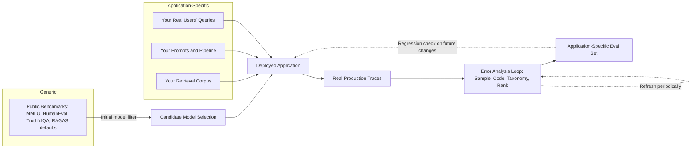

# Benchmarks vs. Your App

## 1. Introduction

A **benchmark** is a standardized test set — like MMLU, HumanEval, TruthfulQA, or a RAG-specific
suite like RAGAS's default metrics — used to measure and compare general model capability across
many different tasks and teams. Your **app's own error taxonomy**, built through the process
covered in Topics 1–6, measures something different: how *your* specific system, with *your*
retrieval corpus, *your* prompts, and *your* real users, actually fails in production. This topic
is about understanding why these two things are not substitutes for each other, and why strong
benchmark performance can coexist with a real, unaddressed, application-specific failure mode.

## 2. Why This Topic Exists

It's tempting to treat "our model scores well on public benchmarks" as evidence that the
application built on top of that model is working well. This temptation exists because
benchmarks are convenient: they're already built, already scored, and produce a comparable
number. But a benchmark score answers a narrow question — "how good is this underlying model at
these specific, pre-defined tasks?" — while the question that matters for your users is much
narrower and much more specific: "how good is *this exact deployed system*, with *this exact
retrieval corpus and these exact prompts*, at answering *the kinds of questions our real users
actually ask*?"

Those two questions can diverge sharply. A frontier model can score near the top of every public
leaderboard and still confidently misuse your company's specific, internally-worded refund
policy, because no public benchmark ever tested the model against your refund policy document in
the first place. Error analysis on your own traces exists precisely to answer the question
benchmarks structurally cannot: what does failure look like *in your specific application*?

## 3. Core Concept

### Beginner

- A **benchmark** tests a model (or a whole class of systems) against a fixed, pre-written set of
  questions and correct answers, usually built by researchers who have never seen your app,
  your data, or your users.
- Your **error taxonomy** (Topic 4) is built from real traces of real users interacting with your
  actual application, including your actual retrieval corpus and actual prompt templates.

A model can be excellent on a benchmark and still fail constantly on your app if your app's real
questions, documents, or user phrasing differ from what the benchmark tested — and they almost
always do, at least somewhat.

### Intermediate

Several structural reasons explain why benchmark performance and application performance
diverge:

- **Distribution mismatch.** Benchmarks are built from a fixed, general-purpose question
  distribution (trivia, exam questions, coding problems). Your app's real user queries follow a
  completely different distribution — shaped by your product's UI, your users' vocabulary, and
  what your product is actually for. A model tuned or selected for benchmark performance has no
  guarantee of matching your specific distribution well.
- **Corpus mismatch.** In a RAG system, most of the actual "knowledge" the app needs to get right
  comes from *your* retrieval corpus (your documentation, your policies, your product catalog),
  not from the model's pretraining data. No general benchmark tests whether your retriever finds
  the right chunk in your specific corpus, or whether your specific prompt template correctly
  incorporates it — these are almost entirely application-specific concerns.
- **Failure modes benchmarks don't cover.** Many of the most damaging real failures in production
  RAG apps — stale documents, multi-document conflation, scope overreach, formatting regressions
  introduced by a UI change — are properties of the whole pipeline (retrieval + prompt assembly +
  generation + rendering), not of the underlying model in isolation. Public benchmarks that test
  only the model (holding retrieval and prompt fixed, or absent entirely) simply cannot surface
  these failure modes.
- **Benchmark contamination and gaming.** Public benchmarks are widely known and their questions
  sometimes leak into training data; strong scores can partly reflect memorization rather than
  the generalizable capability the benchmark intended to measure, a well-documented concern in
  ongoing model evaluation research.

### Advanced

A more precise way to frame the relationship: benchmarks measure **capability** (roughly, "how
good is this model at tasks broadly like these"), while error analysis on your own traces measures
**deployment fitness** (how well does this whole system, as actually configured and actually
used, serve real requests). These are related but distinct properties, and neither substitutes
for the other:

- **Capability is necessary but not sufficient.** A model with weak general capability will
  likely also perform poorly in your app — benchmarks are useful as an initial filter when
  choosing among candidate models, and as a signal when a new model release might be worth
  evaluating for a swap. But clearing that bar says nothing about how the model performs against
  your specific corpus and prompts.
- **Application-specific evals as the missing middle layer.** Mature teams build a third
  category, between generic public benchmarks and one-off manual error analysis: a standing,
  versioned **application-specific eval set**, built directly from real traces and taxonomy
  categories discovered through the manual process in Topics 1–6, that can be run automatically
  on every change to catch regressions in the specific failure modes you've already identified.
  This eval set is a *product* of error analysis, not a replacement for it — it still needs
  periodic refreshing via new rounds of manual reading, because new failure modes emerge as the
  app and its usage evolve, and yesterday's eval set won't catch tomorrow's newly-emerged problem.
- **Benchmarks as a lagging, generic signal; error analysis as a leading, specific one.**
  Benchmark improvements (a new model release) are a reasonable trigger to *re-run* error analysis
  and see whether previously identified failure categories have improved — but they should never be
  treated as proof that those categories improved without actually checking against your own
  traces.

## 4. Deep Explanation

The deeper issue is one of **construct validity**: does the thing being measured (a benchmark
score) actually correspond to the thing you care about (your app working well for your users)?
Benchmarks were designed to measure something specific and general — broad model capability
across common task types — and they do that reasonably well *for that purpose*. But your
application is not "a common task type" in the benchmark's sense; it's a specific deployed
system with a specific document corpus, specific prompt engineering choices, a specific
UI/rendering layer, and a specific population of real users asking real questions in their own
words. Every one of those application-specific elements is a place where new failure modes can be
introduced that no general benchmark was ever designed to catch, because the benchmark's authors
had no way to anticipate your exact deployment.

This is why error analysis on your own traces is not merely a nice supplement to benchmarking —
it's the only method structurally capable of measuring deployment fitness at all. Benchmarks
answer "is the engine good," while error analysis on your app's real traces answers "does the car,
built around this engine, with these tires, on these roads, actually get people where they're
going" — and only the second question is the one your users actually experience.

## 5. Step-by-Step Flow

1. **Use public benchmarks for what they're good at** — an initial filter when comparing
   candidate models, and a signal for when a new release might be worth re-evaluating.
2. **Never treat a strong benchmark score as evidence your application works well** — it says
   nothing about your specific corpus, prompts, or users.
3. **Run the full error-analysis loop (Topics 1–6) on your own traces** to discover
   application-specific failure modes benchmarks cannot see.
4. **Build a standing, application-specific eval set** from the categories your error taxonomy
   surfaces, to catch regressions automatically between manual reading sessions.
5. **Refresh that eval set periodically** by returning to manual error analysis — new failure
   modes emerge as the app, corpus, and user base evolve, and an eval set built once will go
   stale.
6. **When a new model release scores well on public benchmarks**, treat that as a reason to
   re-run your own error analysis or application-specific evals against it — not as a substitute
   for doing so.

## 6. Architecture Explanation

## 7. Visual Analogy

A public benchmark is like a standardized road test used to license any driver in the country —
useful for confirming someone has the general skill to operate a vehicle safely. But it says
nothing about whether that specific driver, in that specific truck, knows this specific delivery
route, this specific loading dock's tight turn, or this specific client's unusual unloading
procedure. A great score on the general road test doesn't prevent a truck from getting stuck at a
loading dock it's never seen before — only actually driving that specific route, and learning
from what goes wrong on it, does that.

## 8. Real Industry Example

Teams building RAG products routinely observe a real-world version of this gap: switching to a
newer, higher-benchmark-scoring model sometimes measurably *worsens* certain application-specific
failure modes (e.g. a model tuned to be more verbose scores better on some general instruction-
following benchmarks but performs worse on a support bot's need for terse, formatted answers), a
phenomenon only caught because the team had a standing, application-specific eval set built from
their own error taxonomy, rather than trusting the public benchmark delta alone. This is part of
why practitioners writing about production LLM evaluation (again, a recurring theme in Hamel
Husain's and Shreya Shankar's public writing on the subject) consistently emphasize building your
own evals from your own traces as a first-class, ongoing practice — not a one-time bootstrap step
that can be replaced by watching public leaderboards.

## 9. Common Misconceptions

- **"If the model tops the leaderboard, our app will be fine."** Leaderboard rankings measure
  general capability on tasks the benchmark's authors chose — not your corpus, your prompts, or
  your users' actual questions.
- **"We don't need our own evals if we pick a good enough model."** Model quality is necessary but
  not sufficient — most production RAG failures live in retrieval, prompt assembly, and the
  interaction between the model and your specific corpus, none of which a general benchmark
  touches.
- **"RAGAS (or any RAG-specific benchmark suite) is basically our error taxonomy."** RAG-specific
  benchmark suites offer useful generic metrics (like faithfulness or context relevance) computed
  automatically, but the specific *categories* your app actually suffers from — named and
  quantified through your own manual reading — are almost always more specific and more actionable
  than a generic metric name.
- **"Once we build an application-specific eval set, we don't need to keep doing manual error
  analysis."** An eval set built from one round of error analysis will catch regressions in
  already-known categories, but it can't catch newly-emerging failure modes — periodic manual
  reading (returning to Topics 2–4) remains necessary to keep the eval set current.

## 10. Best Practices

- Use public benchmarks to narrow down candidate models, not to certify your finished
  application.
- Build and maintain a standing, application-specific eval set derived from your own error
  taxonomy, and run it on every meaningful change to the pipeline.
- Re-run manual error analysis periodically, independent of model changes, to catch newly emerging
  failure modes the current eval set doesn't yet cover.
- When adopting a new model version because it scores better on public benchmarks, verify the
  change against your own application-specific evals and traces before rolling it out broadly.
- Keep your application-specific eval set versioned and dated, since what it tests should evolve
  alongside your corpus, prompts, and user base.

## 11. Summary

Public benchmarks measure general model capability on a fixed, generic task distribution; your
own error taxonomy, built through manual reading of real traces, measures how your specific
deployed system actually performs for your specific users, corpus, and prompts. The two are
related but not interchangeable — strong benchmark scores are a useful filter when choosing a
model, but they cannot substitute for the deployment-fitness signal that only comes from reading
your own application's real failures. Mature teams use benchmarks for model selection and build a
standing, application-specific eval set — grown out of their own error taxonomy — to catch
regressions between the periodic manual error-analysis cycles that keep discovering what
benchmarks structurally cannot see.

## 12. Key Takeaways

- Benchmarks measure general model capability on a fixed, generic task distribution built by
  people who have never seen your app.
- Your error taxonomy measures deployment fitness — how your specific system, corpus, prompts,
  and users actually interact in production.
- A model can score well on public benchmarks and still fail constantly in your app because of
  corpus mismatch, distribution mismatch, or pipeline-level failure modes benchmarks don't test.
- Application-specific eval sets, built from your own error taxonomy, are the right middle layer
  between generic benchmarks and one-off manual reading — but they still need periodic refreshing.
- A new model's benchmark improvement should trigger re-running your own error analysis, not
  replace it.
- Neither benchmarks nor a static application-specific eval set eliminates the need for ongoing
  manual reading of real traces, since new failure modes keep emerging as the app evolves.
