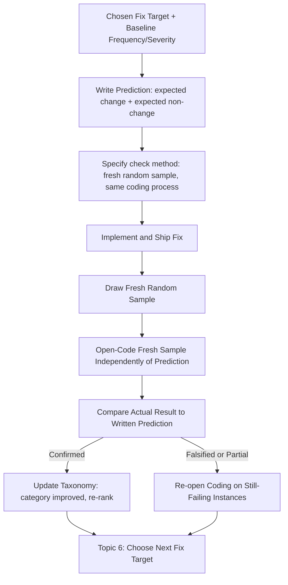

# Writing a Prediction First

## 1. Introduction

**Writing a prediction first** means stating, in writing, before you ship a fix, exactly what you
expect to change — which metric or frequency should move, by roughly how much, and what should
stay the same — and only afterward comparing that written prediction against what actually
happened. It's the final step of the error-analysis loop begun in Topic 1: after choosing a fix
target (Topic 6) and before implementing it, you commit to a falsifiable expectation, so that once
the fix ships, you can honestly evaluate whether it worked rather than retroactively deciding
that whatever happened counts as success.

## 2. Why This Topic Exists

Without a prior written prediction, it is remarkably easy — and remarkably common — to
unconsciously reinterpret whatever happened after a fix ships as evidence that the fix worked.
If the target metric improved a little, that's framed as success. If it didn't move, the framing
shifts to "well, it probably prevented things from getting worse" or "the real benefit will show
up later." If a different, unrelated metric improved, that gets folded into the story too. This
pattern has a name in research methodology — **post-hoc rationalization** — and it is one of the
most reliable ways teams convince themselves that a change worked when it didn't, or miss that a
change worked in some other way than intended.

Writing a prediction first is a direct, structural defense against this. A prediction written
down *before* the outcome is known cannot be quietly adjusted after the fact to match whatever
occurred. This is the same logic behind pre-registration in scientific research: stating your
hypothesis and how you'll test it before collecting the outcome data, specifically to prevent
the analysis from being shaped by knowledge of the result.

## 3. Core Concept

### Beginner

Before shipping a fix for your chosen fix target, write down:

1. **What you expect to change** — which error-taxonomy category's frequency should drop, and
   roughly by how much (e.g. "Stale Document Retrieval should drop from ~30% of sampled traces to
   under 10%").
2. **What you expect to stay the same** — which other categories should be unaffected, so you'll
   notice if the fix has unintended side effects elsewhere.
3. **How you'll check** — the same sampling and reading methodology you used to find the problem
   in the first place (a fresh random sample, read and open-coded the same way).

Then, after the fix ships, actually do the check and compare the real result to what you wrote
down — honestly, including if the prediction turns out to be wrong.

### Intermediate

A well-formed prediction has a few properties that make it genuinely useful rather than a
box-ticking exercise:

- **Falsifiable, not vague.** "This should help" is not a prediction — it can't be wrong, so it
  can't teach you anything. "Stale Document Retrieval should drop below 10% of a fresh random
  sample" can be wrong, and being wrong is exactly what makes it informative.
- **Quantified where possible, directional where not.** Not every prediction needs a precise
  number — sometimes "should drop noticeably, from being the top-ranked category to no longer
  being in the top three" is honest and specific enough — but it should always be specific enough
  that a reasonable person could look at the after-the-fact data and agree on whether the
  prediction held.
- **Scoped to the same methodology used to find the problem.** If the original taxonomy and
  frequency estimate came from reading a random sample of traces (Topics 2–4), the check after
  shipping should use the same kind of methodology — a *fresh* random sample, read and coded the
  same way — not a different, possibly biased, method (like just skimming a few examples that
  happen to look better).
- **Includes a null/side-effect expectation.** Predicting what should *not* change is as
  important as predicting what should. A fix can "work" on its target category while quietly
  making a different category worse — a prediction that only covers the target metric would miss
  this entirely.

### Advanced

At a more rigorous level, writing a prediction first connects to several established ideas worth
being explicit about:

- **Pre-registration, adapted from science.** In scientific research, pre-registering a
  hypothesis and analysis plan before seeing outcome data is used specifically to prevent
  p-hacking and post-hoc storytelling. Applying the same discipline to a product fix — writing the
  expected effect before deploying — brings the same protection against unconsciously moving the
  goalposts to an engineering context.
- **Distinguishing measurement noise from real effect.** A frequency estimated from a modest
  random sample carries real statistical uncertainty (see Topic 5's discussion of confidence
  intervals). A prediction should account for this: "should drop from 30% to under 10%" is a much
  more confident, checkable claim than "should drop from 30% to 27%," which could easily be noise
  given typical sample sizes. Predicting a change too small to distinguish from sampling noise
  isn't a meaningful test.
- **A wrong prediction is a valuable outcome, not a failure to hide.** If the post-fix sample
  shows the category didn't improve as predicted, that's a genuine, useful finding — it means the
  root-cause understanding from open coding was incomplete, and it should trigger a fresh round of
  reading (back to Topic 3) on the still-failing category rather than a reflexive decision to
  quietly declare victory anyway. Teams that treat a falsified prediction as a process failure,
  rather than as information, will unconsciously start writing vaguer predictions over time to
  avoid ever being "wrong" — which defeats the entire point.
- **Closing the loop back into the taxonomy.** The result of checking a prediction — confirmed,
  partially confirmed, or falsified — should feed back into an updated error taxonomy and
  frequency × severity ranking (Topics 4–5), making the whole process a genuine iterative loop
  rather than a single pass.

## 4. Deep Explanation

The core reason this step matters is a well-documented feature of human cognition: outcome
knowledge changes judgment. Once you know how something turned out, it becomes very difficult to
faithfully reconstruct what you would have predicted beforehand — this is sometimes called
**hindsight bias**, and it operates even in people who are trying hard to be objective. Writing a
prediction before the outcome is known isn't a formality; it's the only reliable way to get an
honest "before" state to compare against, because after the outcome is known, the "before" state
becomes contaminated by knowledge of what actually happened.

This matters enormously in error analysis specifically because the whole discipline exists to
build an accurate, evolving picture of what's actually wrong with your application. If every fix
is retroactively declared a success regardless of what the data shows, that accurate picture
quietly degrades: the team's belief about which categories are "handled" drifts away from
reality, categories that didn't actually improve stop getting attention, and the next round of
random sampling (Topic 2) is likely to rediscover the same problem, now confusingly labeled as
something the team already believed it fixed.

## 5. Step-by-Step Flow

1. **Start from the chosen fix target** (Topic 6) and its baseline frequency and severity from
   the current taxonomy (Topics 4–5).
2. **Write the predicted effect on the target category** — a specific, falsifiable statement of
   expected frequency change.
3. **Write the predicted non-effect on other categories** — which categories should stay roughly
   the same, so unintended side effects can be noticed.
4. **Specify the check methodology in advance** — commit to a fresh random sample, read and coded
   the same way as the original analysis.
5. **Implement and ship the fix.**
6. **Draw the fresh random sample and read it**, using open coding (Topic 3) exactly as before,
   without looking at the written prediction while reading, to avoid biasing the reading itself.
7. **Compare the fresh results to the written prediction** — honestly note whether it was
   confirmed, partially confirmed, or falsified.
8. **Update the error taxonomy and frequency × severity ranking** with the new data, and use the
   comparison result — especially if falsified — to decide the next round's reading focus or fix
   target (back to Topic 6).

## 6. Architecture Explanation

## 7. Visual Analogy

Writing a prediction first is like a scientist filing a sealed prediction with a third party
before running an experiment, rather than describing what they "expected all along" after seeing
the result. Anyone can sound right in hindsight — the useful test of understanding is whether you
can commit to a specific, checkable claim *before* you know the answer, and then be willing to be
proven wrong by the data you collect afterward. A gambler who only ever "remembers" the bets they
would have won isn't actually good at predicting outcomes; a written prediction, made in advance,
is what turns a fix from a hopeful guess into an honest test.

## 8. Real Industry Example

Data science and ML teams practicing rigorous **A/B testing** apply a closely related discipline:
a hypothesis and success metric are specified before an experiment launches, precisely to prevent
"metric shopping" after the fact (scanning dozens of metrics until one happens to show a positive
result, then reporting only that one). Teams doing manual error analysis on LLM applications
increasingly borrow this same discipline at a smaller, faster scale — writing a short, specific
prediction ("Scope Overreach frequency should fall from 12% to under 5% in the next random
sample") before shipping a targeted prompt or retrieval change, then treating the next scheduled
error-analysis reading session as the pre-committed check, rather than an open-ended vibe check
of "does this feel better."

## 9. Common Misconceptions

- **"We'll know if it worked just by seeing if users complain less."** User complaint volume is a
  noisy, delayed, and biased proxy (see Topic 3's point on not coding from user reaction alone) —
  a written prediction checked against a fresh, structured random sample is a much more reliable
  signal.
- **"Writing a prediction is just extra paperwork."** The value isn't the document itself — it's
  the discipline it forces: a specific, falsifiable claim made before outcome knowledge can bias
  the reviewer's judgment.
- **"If the prediction was wrong, the fix was a waste."** A falsified prediction is valuable
  information — it means the understanding of the root cause was incomplete, and it should
  trigger more open coding on the remaining failures, not be treated as an embarrassment to bury.
- **"We can write the prediction loosely and interpret it favorably later."** A prediction vague
  enough to always look "roughly right" in hindsight provides no real protection against
  post-hoc rationalization — specificity is what makes the exercise meaningful.

## 10. Best Practices

- Write the prediction before implementation begins, not after the fix is already built and
  tested informally.
- Make the prediction specific and falsifiable — a number or a clear directional claim that could
  turn out to be wrong.
- Predict what should *not* change alongside what should, to catch unintended side effects on
  other categories.
- Use the same sampling and open-coding methodology for the check as was used to find the problem
  originally, drawing a fresh sample rather than reusing the same traces.
- Read the fresh sample without first re-reading the written prediction, to avoid letting it bias
  the reading itself.
- Treat a falsified prediction as a trigger for further investigation, not a failure to explain
  away — and feed every result, confirmed or not, back into the taxonomy and ranking for the next
  cycle.

## 11. Summary

Writing a prediction first means committing, in writing and before shipping a fix, to a specific
and falsifiable expectation of what will and won't change — then honestly checking that
prediction against a fresh, randomly sampled, independently read batch of traces afterward. It
exists to prevent post-hoc rationalization and hindsight bias, the natural human tendency to
reinterpret any outcome as evidence of success once the outcome is already known. This step closes
the loop begun with complete traces in Topic 1: sample, read, open-code, build a taxonomy, rank by
frequency × severity, choose a fix target, predict its effect, and honestly check — turning error
analysis from a one-time audit into a genuinely learnable, repeating discipline.

## 12. Key Takeaways

- A prediction is written before a fix ships, stating a specific, falsifiable expectation of what
  will change and what won't.
- This defends against post-hoc rationalization and hindsight bias — the tendency to reinterpret
  any outcome as success once it's already known.
- Predictions should be checked using the same sampling and open-coding methodology used to find
  the original problem, on a fresh random sample.
- Predicting what should stay the same is as important as predicting what should improve, to catch
  unintended side effects.
- A falsified prediction is valuable information, not a failure — it should trigger renewed
  reading on the still-failing instances, not a reflexive claim of success.
- This step closes the full error-analysis loop, turning a one-time read-through into an ongoing,
  genuinely self-correcting process.
