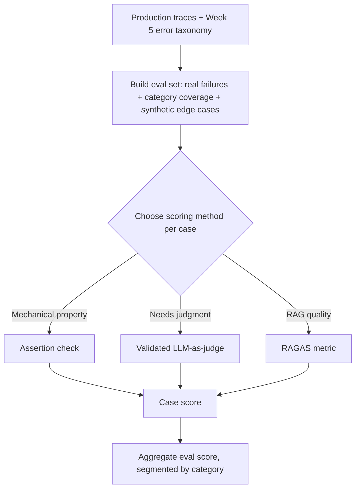
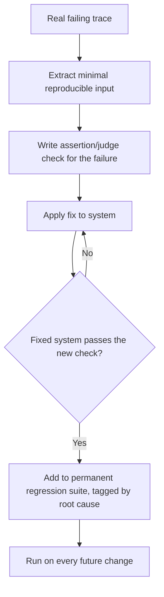
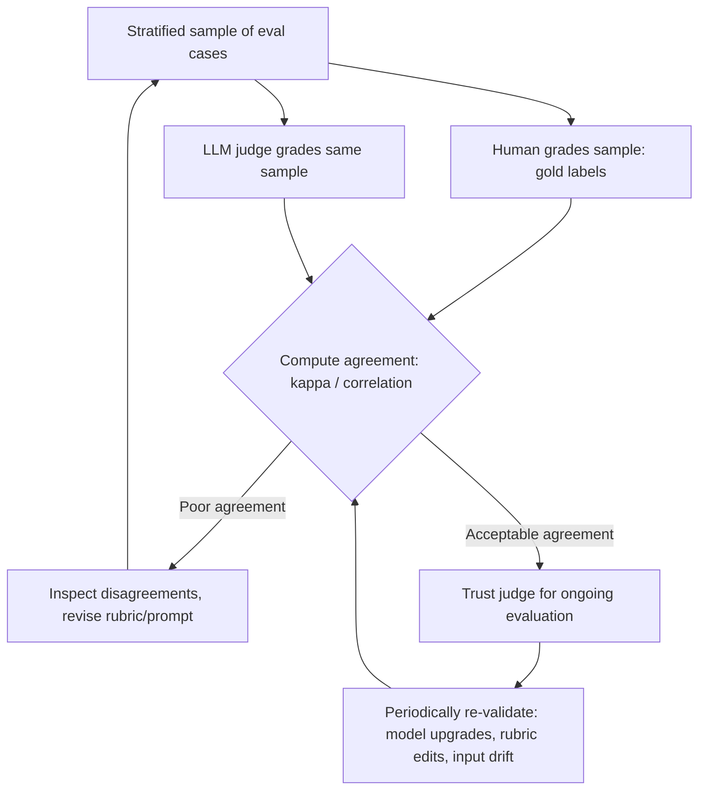
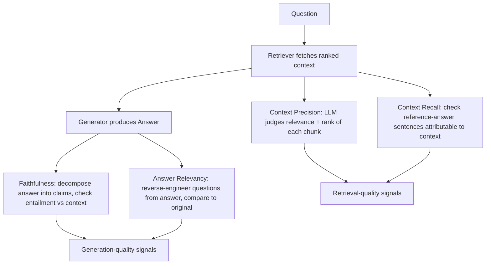
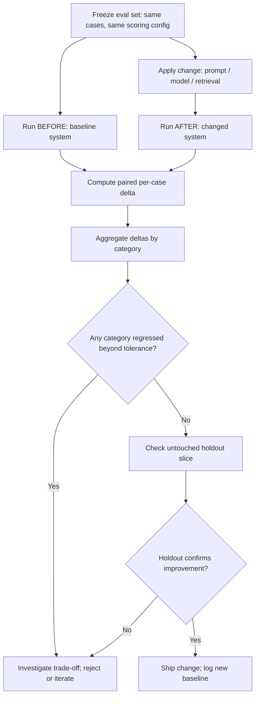

# Week 6 — Diagrams and Workflows

Five Mermaid diagrams covering the full eval lifecycle this week builds, each with a short
caption explaining what it shows and where it fits.

## 1. The Full Eval Pipeline

*Caption: How an eval set gets built and scored, from raw production traces down to a
reported score — the backbone every other diagram this week plugs into.*

## 2. Regression Test Creation Flow

*Caption: How a single documented bug becomes a permanent, non-negotiable test case that
protects against silent regressions forever after.*

## 3. LLM-As-Judge Validation Loop

*Caption: The calibration loop that earns an LLM judge the right to be trusted — never a
one-shot pass, always revisited when the judge, rubric, or input distribution changes.*

## 4. RAGAS Metric Computation Flow

*Caption: How the four core RAGAS metrics are computed from the same underlying RAG
pipeline output — two focused on generation, two focused on retrieval.*

## 5. Before/After Regression Testing Flow

*Caption: The controlled-comparison discipline that turns "I think this helped" into a
trustworthy, per-category verdict — the payoff of every other diagram above.*

