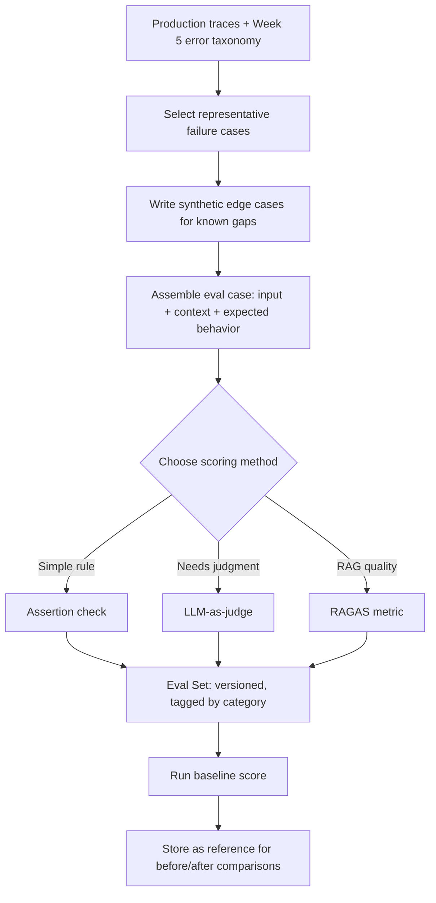

# Eval Sets

## 1. Introduction

An **eval set** is a curated collection of test cases — real or realistic inputs to your AI
application, paired with a defined way to score the output — that lets you measure quality
automatically instead of by gut feeling. Where Week 5 gave you a taxonomy of *what kinds of
things go wrong*, an eval set is the concrete artifact that turns that taxonomy into something
a script can run in thirty seconds and hand you back a number.

Think of it as the test suite for your prompt, your retrieval pipeline, or your whole agent —
except instead of asserting `2 + 2 == 4`, each case asserts something fuzzier, like "the
answer must cite a source" or "the answer must not recommend a discontinued product."

## 2. Why This Topic Exists

Without an eval set, every change to a prompt, model, or retrieval setting is evaluated by
someone re-reading a handful of outputs and deciding "yeah, looks better." That approach has
three fatal problems:

- **It doesn't scale.** You can eyeball five outputs; you cannot eyeball five hundred, and a
  handful of manually-checked examples will not catch every regression.
- **It isn't repeatable.** Different people (or the same person on different days) judge the
  same output differently. There's no fixed yardstick.
- **It can't detect regressions.** A change that fixes the exact failure you were staring at
  can silently break three other things you weren't looking at. Without a standing set of
  cases covering all known failure modes, you won't notice until a user does.

An eval set solves this by being a fixed, versioned, repeatable measuring instrument. Once it
exists, "did this change help?" becomes an experiment with a number attached, not a debate.

## 3. Core Concept

### Beginner

An eval set is like a quiz bank for your AI app: a list of questions (inputs) with a way to
check whether the answer is good (scoring). Instead of manually asking your chatbot the same
ten questions every time you tweak something, you run the quiz automatically and get a score.

### Intermediate

Every eval case has four parts:

1. **Input** — the exact prompt/query/conversation state the system will receive.
2. **Context** (optional but common in RAG) — the retrieved documents or tool outputs the
   system had access to, so you can score groundedness independently of retrieval luck.
3. **Expected behavior or reference** — not always a single "correct answer" string; often a
   rule ("must include a citation"), a reference answer to compare against, or a rubric.
4. **Scoring method** — a rule-based assertion, an LLM judge, a RAGAS metric, or a human
   label — whichever is cheapest and reliable enough for that case (see **Assertion Checks**
   and **LLM-As-Judge**).

Eval sets are built from three sources, roughly in priority order: real failures pulled from
production traces (see **Regression Tests From Failures**), the error taxonomy categories from
Week 5 (make sure every category has at least a few cases), and synthetic edge cases you write
by hand for scenarios you know matter but haven't hit yet (empty retrieval, adversarial input,
ambiguous questions).

### Advanced

At scale, eval-set design has its own failure modes:

- **Coverage vs. size trade-off.** A set needs enough cases per category for the score to be
  statistically meaningful, but every case costs money and time to run (especially with an
  LLM judge). Stratify by error category rather than sampling purely at random, so rare-but-
  severe categories aren't drowned out by common-but-minor ones.
- **Goodhart's Law.** "When a measure becomes a target, it ceases to be a good measure." If
  you optimize a prompt directly against your eval set repeatedly, you risk overfitting to
  that specific set of cases rather than genuinely improving quality. Keep a **holdout** slice
  of the eval set that you don't look at while iterating, and only check it before shipping.
- **Living document, not a one-time artifact.** New failure modes surface constantly. An eval
  set that hasn't grown in three months is a sign nobody is looking at production traffic.
- **Versioning.** Treat the eval set like code: version it, diff it, and know exactly which
  version produced which score, so "we improved from 0.80 to 0.85" is a comparison you can
  actually trust.

## 4. Deep Explanation

An eval case is best thought of as a contract: given this exact input (and, for RAG, this
exact retrieved context), here is how we will decide whether the output is acceptable. The
discipline is in making that contract as concrete and automatable as possible.

Not every case needs the same scoring method. A case checking "does the response include a
disclaimer for medical questions" is a simple keyword/regex assertion — free and instant. A
case checking "is this response as helpful as our best human-written answer" needs an LLM
judge, because "helpfulness" isn't something a regex can detect. Good eval-set design mixes
scoring methods deliberately: cheap rule-based checks catch mechanical failures, LLM judges
and RAGAS metrics catch semantic ones (see **Assertion Checks**, **LLM-As-Judge**, and the
RAGAS topics).

Crucially, an eval set is not a generic benchmark. Public benchmarks (MMLU, HellaSwag, etc.)
measure a model's general capability; an eval set measures *your specific application's*
behavior on *your specific* failure modes, retrieval setup, and user population. A model that
tops a public leaderboard can still fail badly on your eval set if your domain, tone
requirements, or retrieval quality differ from what the benchmark tests.

## 5. Step-by-Step Flow

1. **Mine real traces.** Pull inputs (and failures) from production logs or the traces you
   reviewed in Week 5's open coding pass.
2. **Tag by category.** Attach each case to an error-taxonomy category so you can see coverage
   gaps.
3. **Write the scoring method per case.** Decide: rule-based assertion, LLM judge, or RAGAS
   metric. Default to the cheapest method that can reliably tell right from wrong.
4. **Add synthetic edge cases.** Fill gaps for scenarios you know matter (empty results,
   adversarial input, ambiguous queries) that haven't shown up in traces yet.
5. **Run a baseline.** Execute the current system against the full eval set and record the
   score per category — this is your reference point for every future comparison.
6. **Version and store.** Commit the eval set (and the baseline score) to version control or
   an eval-tracking tool so future runs are directly comparable.

## 6. Architecture Explanation

## 7. Visual Analogy

An eval set is a teacher's answer key built from last year's exam mistakes. The teacher
doesn't invent random new questions every year from nothing — they look at where students
actually got confused, turn those into standing quiz questions with a clear grading rubric,
and reuse that same quiz to check whether this year's teaching method is actually better than
last year's, question by question, not just as one blurry overall impression.

## 8. Real Industry Example

Teams building production RAG and agent systems maintain internal eval sets the same way they
maintain unit test suites — OpenAI's `evals` framework, Anthropic's internal eval harnesses,
and commercial platforms like LangSmith and Braintrust all center on the same idea: a
versioned dataset of cases plus a scoring function, run automatically on every meaningful
change (new prompt, new model version, new retriever), with results tracked over time so
regressions are caught before a release rather than after a customer complaint.

## 9. Common Misconceptions

- **"An eval set is the same as a benchmark."** Public benchmarks measure general capability;
  your eval set measures your application's behavior on your failure modes. They serve
  different purposes and neither replaces the other.
- **"Bigger is always better."** A 2,000-case eval set that's 90% duplicates of the same easy
  scenario is worse than a 200-case set stratified across every known failure category.
- **"Build it once and you're done."** Eval sets need to grow every time you discover a new
  failure mode, or they slowly stop reflecting reality.
- **"Random sampling from logs is enough."** Random sampling under-represents rare, severe
  failures — deliberately stratify by category (see Week 5's frequency × severity work).

## 10. Best Practices

- Tie every eval case to a named failure mode or category — a case with no "why does this
  exist" is hard to maintain and easy to accidentally delete.
- Keep a holdout slice you don't optimize against directly, to catch overfitting to the eval
  set itself.
- Version the eval set and its baseline scores together so historical comparisons stay valid.
- Review and expand the eval set on a regular cadence, driven by fresh production traces.
- Default to the cheapest reliable scoring method per case; don't reach for an LLM judge when
  a regex would do.

## 11. Summary

An eval set turns "does this feel better?" into a repeatable measurement. It's built from real
failures (Week 5's output), tagged by category for coverage, scored with the cheapest method
that reliably works, versioned like code, and re-run every time something changes. It is the
foundation every other topic this week builds on: regression tests are eval cases derived from
specific bugs, assertion checks and LLM judges are scoring methods used inside eval cases, and
before/after deltas are simply two eval-set runs compared.

## 12. Key Takeaways

- An eval case = input (+ context) + expected behavior/reference + scoring method.
- Build eval sets from real production failures first, error-taxonomy coverage second,
  synthetic edge cases third.
- Mix scoring methods deliberately — rules where possible, LLM judges where necessary.
- Keep a holdout slice to guard against overfitting the eval set (Goodhart's Law).
- Treat eval sets as living, versioned artifacts, not one-time documents.
- An eval set measures *your app*, not general model capability — it is not a benchmark.
