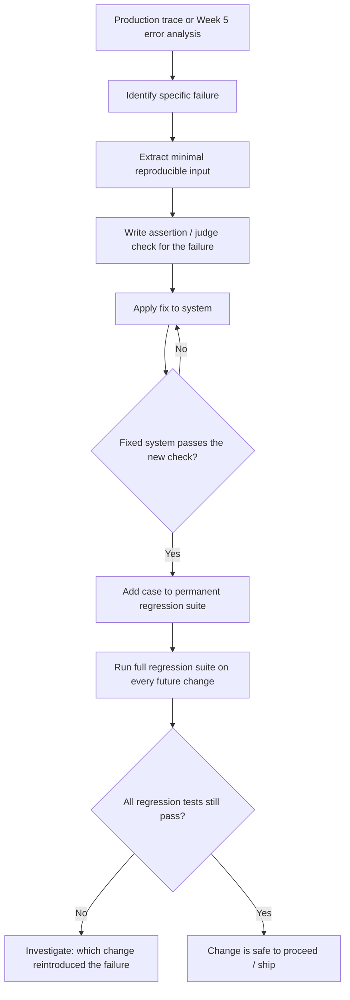

# Regression Tests From Failures

## 1. Introduction

A regression test from a failure is exactly what it sounds like: you take a real bug you found
— a specific trace where the system did the wrong thing — and turn it into a permanent,
automated test case that stays in your eval set forever. From that point on, every future
change is checked against it, and if the fix ever silently breaks, you find out from a failing
test instead of from a user.

This is the single most direct link between Week 5 (finding and naming failures) and Week 6
(building the machine that catches them): every well-documented failure from your error
analysis is a regression test waiting to be written.

## 2. Why This Topic Exists

Fixing a bug once is easy. Keeping it fixed is the hard part. Prompts get rewritten, models get
upgraded, retrieval settings get tuned — any of these can reintroduce a failure mode you
already solved, and without a standing test for it, nobody notices until it resurfaces in
production, often weeks or months later when the context of the original fix has been
forgotten. Regression tests convert institutional memory ("oh yeah, we had that issue with
dates once") into an executable check that runs automatically on every change.

## 3. Core Concept

### Beginner

Every time you find and fix a bug, you add a small test that checks that specific bug doesn't
come back. It's the same idea as a doctor keeping a record of what made you sick before, so
next time you show symptoms, they check that first.

### Intermediate

The process has four steps: (1) find a real failing trace, (2) extract the minimal input that
reproduces it — strip away anything irrelevant to the failure so the test is focused, (3)
write an assertion or judge check that would have caught the original bug, and (4) confirm the
*current* (fixed) system passes that check before adding it permanently to the regression
suite. Step 4 matters — a regression test you add while the bug is still present just
documents a known failure; it doesn't protect anything yet.

### Advanced

At scale, a regression suite needs its own maintenance discipline:

- **Determinism.** LLM outputs vary run-to-run. A regression test built on a strict string
  match will flake. Prefer assertions on properties (contains X, doesn't contain Y, valid
  JSON) or an LLM judge run at low/zero temperature, and consider running flaky judge checks
  multiple times and taking a majority vote.
- **Suite bloat.** Every regression test adds to runtime and cost. Prioritize adding tests for
  high-severity, high-frequency failures (Week 5's frequency × severity ranking) rather than
  every minor one-off oddity.
- **Tagging by root cause.** Group regression tests by the underlying failure category so that
  when a category's tests start failing together, you immediately know which subsystem broke
  (e.g., retrieval vs. generation vs. formatting).
- **Retiring tests.** If a feature is deprecated or a failure mode becomes structurally
  impossible (e.g., you removed the code path that caused it), retire the test rather than
  let dead tests accumulate.

## 4. Deep Explanation

The core discipline is turning something *observed and specific* ("on 2024-03-01 a user asked
about refund policy and the bot invented a 90-day window that doesn't exist") into something
*general and checkable* ("for any question about refund policy, the answer must not state a
specific day count unless that number appears in the retrieved policy document"). The second
version is what actually protects you — it generalizes slightly beyond the exact original
input so that closely related failures are also caught, without becoming so broad that it
stops being about the original bug.

This is also where regression tests differ from the rest of the eval set: while general eval
cases are chosen for *coverage* of failure categories, regression tests are chosen because
*this exact thing already happened*. They are non-negotiable — every regression test is a
promise to a past incident that it will not repeat silently.

## 5. Step-by-Step Flow

1. **Start from a documented failure** — a trace tagged during Week 5's error analysis, or a
   bug report from production.
2. **Extract a minimal reproduction** — trim the input down to what's essential to trigger the
   failure.
3. **Write the check** — an assertion, judge prompt, or RAGAS metric threshold that would have
   flagged the original bad output.
4. **Apply the actual fix** to the system (prompt, retrieval, code).
5. **Verify the fixed system passes** the new check — if it doesn't, the fix isn't done yet.
6. **Add the case to the permanent regression suite**, tagged with its failure category and a
   link back to the original trace/incident for context.
7. **Run the full regression suite on every future change**, before any prompt/model/pipeline
   modification ships.

## 6. Architecture Explanation

## 7. Visual Analogy

Think of it like a vaccine. Your immune system encounters a real threat once (the bug), and
instead of just treating the immediate symptom and forgetting about it, you keep a permanent
record of that threat's signature (the test case) so that if anything resembling it shows up
again — even smuggled in by an unrelated change — your system recognizes it instantly and
raises an alarm, rather than getting sick all over again.

## 8. Real Industry Example

Traditional software engineering has done this for decades: a bug fix without a regression
test is considered incomplete in most professional engineering practices. AI teams building
production LLM applications are converging on the same discipline — every incident review or
production postmortem is expected to produce not just a fix but one or more new cases added to
the standing eval/regression suite, exactly the way a software postmortem produces a new unit
test.

## 9. Common Misconceptions

- **"Fixing the bug is the whole job."** Fixing it without adding a regression test means the
  next unrelated change can silently undo the fix.
- **"Any failing trace can be pasted in as-is."** Traces are often noisy; a good regression
  test extracts the minimal, focused input, not the entire multi-turn conversation verbatim.
- **"Regression tests replace the broader eval set."** They're a subset — non-negotiable,
  incident-driven cases layered on top of the general eval set's category coverage.
- **"LLM output is too random for regression tests to work."** Assert on properties and
  behaviors, not exact strings, and this stops being a problem.

## 10. Best Practices

- Add a regression test as part of closing out any bug fix — treat it as required, not
  optional.
- Prefer property-based assertions (contains/doesn't contain, valid schema, refused
  correctly) over exact string matches to avoid flakiness.
- Tag every regression test with its root-cause category and a link to the original incident.
- Prioritize writing tests for high-severity, high-frequency failures first.
- Periodically prune regression tests for failure modes that are now structurally impossible.

## 11. Summary

Regression tests from failures are the mechanism that makes a bug fix permanent rather than
temporary. Each one starts as a real, documented failure, gets trimmed to a minimal
reproducible case, gets an automatable check written for it, and only joins the permanent
suite once the fix is verified to pass it. Run continuously, this suite is what stops old
problems from quietly coming back every time you touch the prompt, model, or pipeline.

## 12. Key Takeaways

- Every fixed bug should produce a permanent test case, not just a one-time fix.
- Extract the minimal reproducible input — don't paste in noisy, full traces as-is.
- Verify the fix actually passes the new check before adding it to the suite.
- Prefer property/behavior assertions over exact-string matches to avoid flakiness.
- Tag tests by root cause and prioritize high-severity, high-frequency failures.
- Regression tests are a non-negotiable subset of the broader eval set, driven by real
  incidents rather than category coverage.
