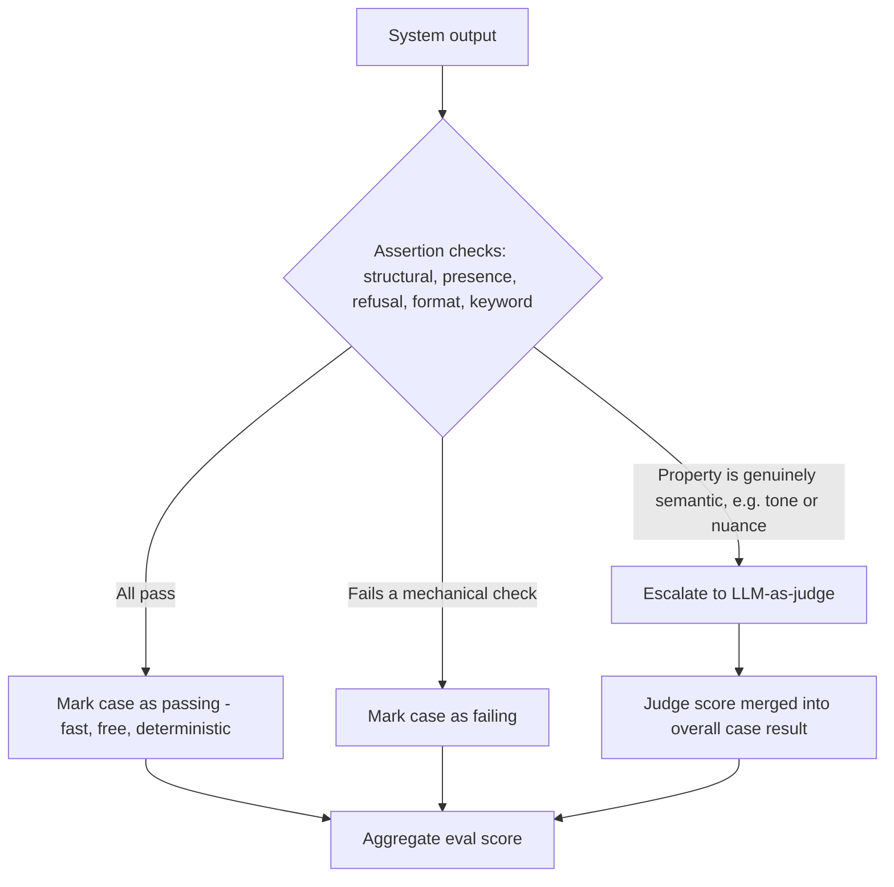

# Assertion Checks

## 1. Introduction

An assertion check is a deterministic, rule-based test applied to an AI system's output: plain
code that checks a concrete property and returns true or false. Is a source link present? Did
the response refuse when it should have? Is the output valid JSON matching a schema? Does the
answer avoid a banned word? None of these require an AI model to answer — they're a handful of
lines of ordinary code, and that's exactly their appeal.

## 2. Why This Topic Exists

Assertion checks exist because they are free, instant, and perfectly consistent — the same
input always produces the same verdict, with zero API cost and zero risk of the checker itself
being wrong in a subtle, hard-to-detect way. Before reaching for an expensive, slower, and
occasionally unreliable LLM judge, the first question should always be: *can a simple rule
catch this?* A large fraction of real-world failures — missing citations, malformed output,
banned content, wrong refusals — are perfectly catchable by rules, and it would be wasteful
(in both money and judge-reliability risk) to route them through an LLM call instead.

## 3. Core Concept

### Beginner

An assertion check is like a spellchecker: it looks for one specific, well-defined thing (a
misspelled word, a missing citation, a banned phrase) and flags it — no judgment or nuance
required, just a clear yes/no rule.

### Intermediate

Common categories of assertion checks in LLM applications:

| Check type | Example |
|---|---|
| Structural | Output parses as valid JSON matching the expected schema |
| Presence/absence | Response includes a source citation; does not include a competitor's name |
| Refusal correctness | Response refuses when the input is a known unsafe/out-of-scope request |
| Format/length | Response is under N tokens; follows the required bullet-list format |
| Keyword/regex | Response contains a required disclaimer string; doesn't contain profanity |
| Numeric/factual pattern | A returned date, number, or ID matches a pattern or a ground-truth value |

### Advanced

Assertion checks form the first, cheapest layer of a broader evaluation hierarchy, roughly
ordered by cost and speed:

1. **Rule-based assertions** — free, instant, deterministic.
2. **Embedding/similarity-based checks** — cheap, fast, useful for "is this semantically close
   to a reference answer" without needing exact wording.
3. **LLM-as-judge** — slower, has a real dollar cost per call, and is only as reliable as its
   own validation (see **Judge Validation**) — reserved for properties a rule genuinely cannot
   capture, like tone, helpfulness, or nuanced correctness.

A mature eval suite runs assertions first as a fast filter, and only escalates to an LLM judge
for cases assertions can't fully resolve. This keeps the bulk of the suite cheap to run on
every single change, while reserving judge calls for the smaller set of genuinely subjective
checks.

## 4. Deep Explanation

The core skill in writing good assertion checks is recognizing which properties of a "good
answer" are actually mechanical rather than semantic. "Contains a citation" is mechanical — you
can check for a URL pattern or a reference marker. "Is a *good* citation, relevant to the
claim it supports" is semantic — that needs a judge or a retrieval-quality metric (see the
RAGAS topics). The skill is decomposing a fuzzy requirement ("the answer should be trustworthy
and well-sourced") into the mechanical sub-parts you can assert directly (citation present,
citation format valid, citation count above zero) and the genuinely fuzzy remainder that needs
a smarter check.

Assertions are also the natural home for safety and compliance checks — refusal correctness,
banned-content checks, PII leakage detection — because these need to be airtight and
auditable, not subject to an LLM judge's own imperfect judgment.

## 5. Step-by-Step Flow

1. **Identify a concrete, checkable property** from a failure mode or requirement (e.g., "must
   cite a source").
2. **Decide if it's truly mechanical.** If judging it requires understanding meaning or
   nuance, it belongs with LLM-as-judge instead.
3. **Write the rule** — a regex, schema validator, keyword list, or simple function.
4. **Run it against known good and known bad examples** to confirm it doesn't have false
   positives/negatives on cases you already understand.
5. **Add it to the eval set** as the scoring method for the relevant case(s).
6. **Run it on every change**, since it's cheap enough to run continuously with no cost
   concern.

## 6. Architecture Explanation

## 7. Visual Analogy

An assertion check is a metal detector at airport security: it doesn't understand what a
person is planning to do, it just reliably beeps for one specific, well-defined thing (metal).
It's fast, cheap, and never has an off day — but it can't tell you whether someone's carry-on
bag looks *suspicious* in a broader sense. For that, you need a trained human (or, in our
world, an LLM judge) actually looking at it.

## 8. Real Industry Example

Production LLM applications commonly run a battery of assertion checks as the very first gate
in their eval pipeline — validating JSON schema conformance for structured-output features
(see **Structured Output / JSON Schema** and **Pydantic** from Week 2), verifying that
regulated industries' required disclaimers are present, and confirming that refusal behavior
triggers correctly for known unsafe categories — before any output is ever passed to a more
expensive LLM judge or shown to a human reviewer.

## 9. Common Misconceptions

- **"Rule-based checks are too simplistic to matter."** A large share of real production
  failures — malformed JSON, missing disclaimers, wrong refusals — are entirely catchable by
  simple rules, and catching them for free is a huge win before ever paying for a judge call.
- **"You should assert on exact output text."** LLM outputs vary in wording; assert on
  properties (presence, structure, pattern) rather than exact strings, or the checks will be
  brittle and constantly "fail" on harmless rewording.
- **"Assertions can fully replace LLM judges."** They can't — assertions have no way to
  evaluate meaning, tone, helpfulness, or subtle correctness. They're the first filter, not
  the whole system.

## 10. Best Practices

- Always try a rule-based check first; escalate to an LLM judge only when a rule genuinely
  cannot capture the property.
- Assert on properties and patterns, not exact output strings.
- Validate your assertions against known good/bad examples before trusting them at scale.
- Use assertions as the airtight layer for safety, compliance, and refusal-correctness checks.
- Keep assertion checks in the fast path so they run on every single change with no cost
  concern.

## 11. Summary

Assertion checks are deterministic, code-based rules that verify mechanical properties of an
output — format, presence, refusal correctness, banned content — for free and instantly. They
are the cheapest, most reliable layer of an eval suite and should be the default choice
whenever a property can be captured by a rule. Anything left over — tone, helpfulness, nuanced
correctness — is exactly what LLM-as-judge exists to handle.

## 12. Key Takeaways

- Assertion checks are free, instant, deterministic rule-based tests on output properties.
- Common types: structural/schema, presence/absence, refusal correctness, format/length,
  keyword/regex.
- Always reach for a rule-based check before an LLM judge — it's cheaper and more reliable
  for anything genuinely mechanical.
- Assert on properties and patterns, not exact strings, to avoid brittle false failures.
- Assertions form the fast, free first layer of a cost-ordered evaluation hierarchy that ends
  with LLM-as-judge for genuinely subjective properties.
